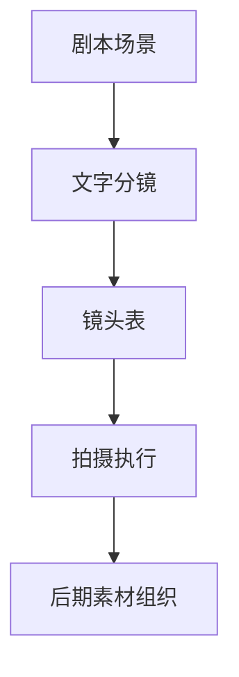
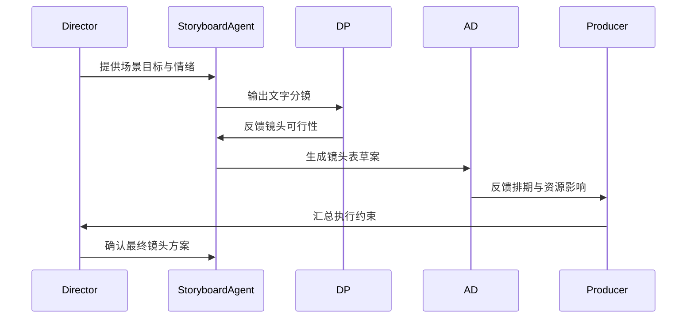
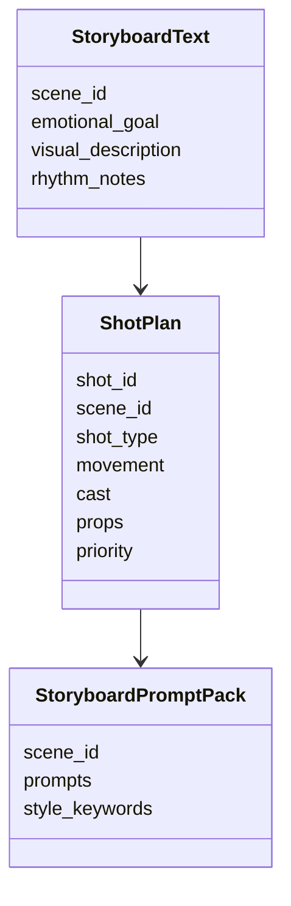

# 33. 文字分镜与镜头表

这一篇聚焦：

**为什么文字分镜与镜头表，是导演创作语言进入生产系统的关键桥梁。**

---

## 1. 文字分镜与镜头表的区别

- 文字分镜更偏导演意图与镜头叙述
- 镜头表更偏执行清单与拍摄组织

两者不是二选一，而是前后衔接关系。

---

## 2. 一张关系图

---

## 3. 文字分镜在真实项目中的作用

文字分镜通常回答：

- 这一场戏怎么拍
- 情绪如何推进
- 视角如何切换
- 角色关系如何被镜头表达
- 节奏如何变化

它更接近导演语言。

---

## 4. 镜头表在真实项目中的作用

镜头表通常回答：

- 拍哪些镜头
- 每个镜头的景别、机位、运动方式
- 哪些演员在场
- 哪些道具、灯光、特效需要准备
- 哪些镜头优先拍

它更接近执行语言。

---

## 5. 一张时序图

---

## 6. 国内外差异

海外成熟流程中，文字分镜、shot list、previs 往往衔接更紧密，复杂镜头会更早进入技术预演。

国内项目中，常见情况是：

- 文字分镜更依赖导演个人表达
- 镜头表可能在更靠近拍摄时才稳定
- 复杂镜头的技术拆解有时滞后

这意味着平台要支持“早规划”和“晚收敛”两种模式。

---

## 7. 与 DeerFlow 的落地映射

可以设计：

- storyboard subagent
- cinematography subagent
- `ShotPlan` 对象
- `StoryboardPromptPack` artifacts
- 镜头复杂度与优先级字段

---

## 8. 一张类图

---

## 9. 第一版实现建议

第一版建议先支持：

- 场景级文字分镜生成
- 镜头表草案生成
- 镜头复杂度标记
- 分镜提示词包输出
- 导演确认点标记

---

## 10. 这一篇最重要的结论

### 结论一
文字分镜与镜头表，是导演语言进入生产系统的关键桥梁。

### 结论二
国内外差异的关键，在于镜头规划前置程度与技术预演深度。

### 结论三
在导演智能体平台中，分镜模块应当同时服务创作表达与执行组织。

---

<!-- movie-visuals:start -->
## 补充图示：换一种视角看本篇

下面这张 流程图 把“文字分镜与镜头表”再压缩成一个可快速扫读的结构视图，便于先抓关键关系，再回到正文细节。

<!-- movie-visuals:end -->

<!-- movie-doc-nav:start -->
## 文档导航

- 总入口：[README.md](./README.md)
- 阅读地图：[00-reading-map.md](./00-reading-map.md)
- 所在分组：25-36 前期制作
- 上一篇：[32. 摄影、灯光、视效前期协同](./32-cinematography-lighting-vfx-preproduction.md)
- 下一篇：[34. 静态分镜图与氛围图](./34-static-storyboards-and-moodboards.md)

### 同组文档
- [25. 剧本开发与锁稿](./25-script-development-and-lock.md)
- [26. 剧本拆解与 breakdown sheet](./26-script-breakdown-and-breakdown-sheet.md)
- [27. 预算体系与 line producer 视角](./27-budgeting-and-line-producer-view.md)
- [28. 排期体系与 1st AD 视角](./28-scheduling-and-first-ad-view.md)
- [29. 选角流程与演员管理](./29-casting-and-actor-management.md)
- [30. 场地勘景与场地锁定](./30-location-scouting-and-lock.md)
- [31. 美术、服装、道具协同](./31-art-costume-props-collaboration.md)
- [32. 摄影、灯光、视效前期协同](./32-cinematography-lighting-vfx-preproduction.md)
- 33. 文字分镜与镜头表（当前）
- [34. 静态分镜图与氛围图](./34-static-storyboards-and-moodboards.md)
- [35. 风格参考分析与风格统一](./35-style-reference-analysis-and-unification.md)
- [36. 对白设计与润色](./36-dialogue-design-and-polish.md)
<!-- movie-doc-nav:end -->
