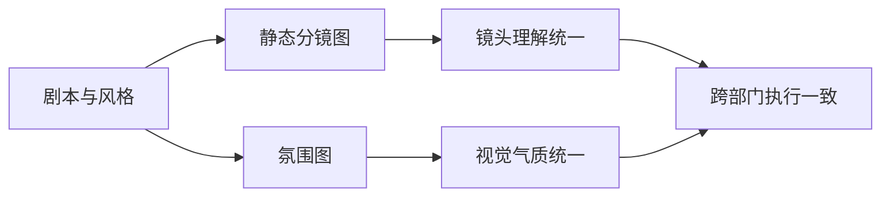
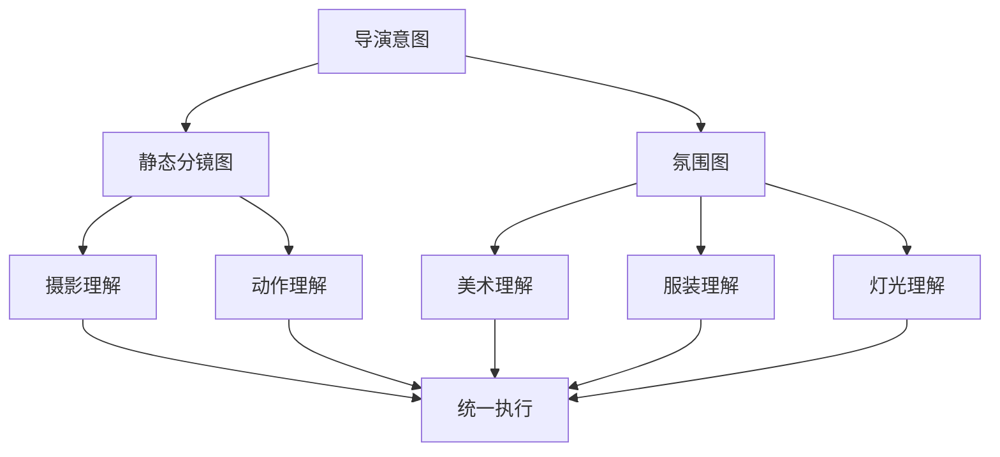
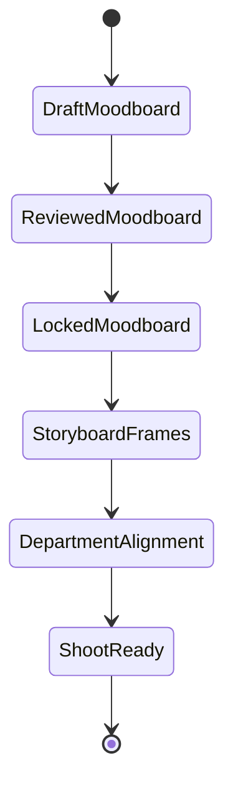
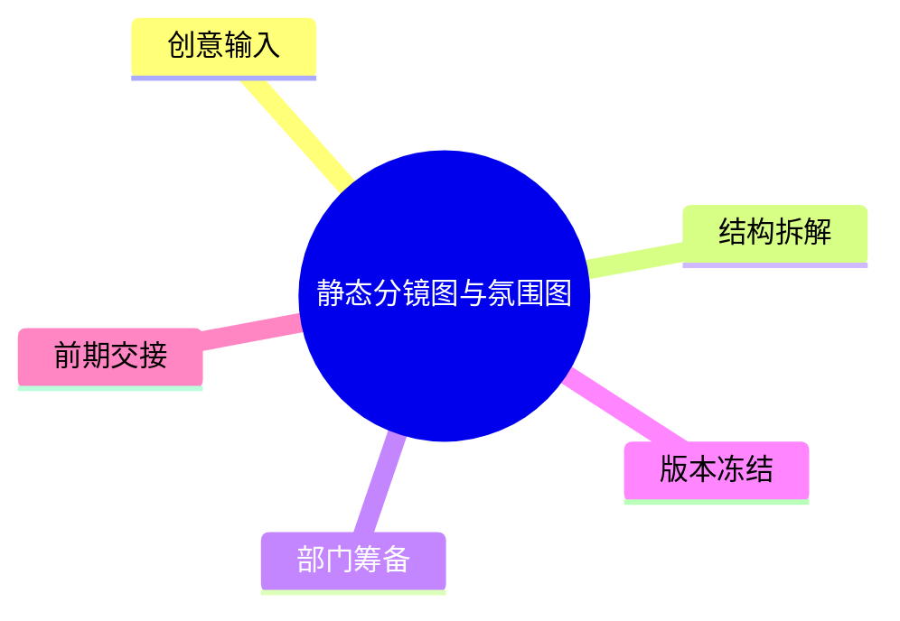

# 34. 静态分镜图与氛围图

这一篇聚焦：

**为什么静态分镜图与氛围图，不只是“好看”，而是跨部门统一视觉理解的关键媒介。**

---

## 1. 静态分镜图与氛围图分别解决什么问题

- 静态分镜图：解决镜头构图、动作关系、空间关系
- 氛围图：解决色调、材质、情绪、世界观质感

两者结合，才能让导演意图被不同部门共同理解。

---

## 2. 一张双轨图

---

## 3. 为什么它们在真实项目里重要

因为不同部门对文字的理解可能不同，但对图像的理解更容易对齐。

例如：

- 摄影看构图与光线
- 美术看空间与材质
- 服装看色彩与角色状态
- 灯光看氛围与层次
- VFX 看后期合成空间

---

## 4. 一张泳道图

---

## 5. 国内外差异

海外成熟流程中，moodboard、lookbook、storyboard 往往更早进入部门协同；复杂项目会形成完整视觉开发包。

国内项目中，常见情况是：

- 导演与摄影先形成视觉方向
- 其他部门在后续逐步跟进
- 图像资料有时分散在不同工具和群聊中

这意味着平台需要把图像资料结构化，而不是散落在文件夹里。

---

## 6. 与 DeerFlow 的落地映射

可以设计：

- style-research subagent
- storyboard subagent
- `StyleBoard` / `MoodBoard` / `StoryboardFrame` 对象
- 图像引用与版本记录
- 视觉审核 artifacts

---

## 7. 一张状态图

---

## 8. 第一版实现建议

第一版建议先支持：

- 场景级氛围关键词
- 静态分镜图提示词包
- 风格参考图集索引
- 视觉统一性检查
- 图像版本记录

---

## 9. 为什么这一步很适合 AI 辅助

因为 AI 很适合：

- 快速生成多版视觉方向
- 快速生成分镜草图提示词
- 快速做风格聚类与参考整理

但最终的视觉判断仍应由导演与核心部门负责人确认。

---

## 10. 这一篇最重要的结论

### 结论一
静态分镜图与氛围图，是跨部门统一视觉理解的关键媒介。

### 结论二
国内外差异的关键，在于视觉开发资料是否被系统化管理。

### 结论三
导演智能体平台应当把图像资料纳入对象、版本和审核体系。

---

<!-- movie-visuals:start -->
## 补充图示：换一种视角看本篇

下面这张 心智图 把“静态分镜图与氛围图”再压缩成一个可快速扫读的结构视图，便于先抓关键关系，再回到正文细节。

<!-- movie-visuals:end -->

<!-- movie-doc-nav:start -->
## 文档导航

- 总入口：[README.md](./README.md)
- 阅读地图：[00-reading-map.md](./00-reading-map.md)
- 所在分组：25-36 前期制作
- 上一篇：[33. 文字分镜与镜头表](./33-text-storyboard-and-shot-list.md)
- 下一篇：[35. 风格参考分析与风格统一](./35-style-reference-analysis-and-unification.md)

### 同组文档
- [25. 剧本开发与锁稿](./25-script-development-and-lock.md)
- [26. 剧本拆解与 breakdown sheet](./26-script-breakdown-and-breakdown-sheet.md)
- [27. 预算体系与 line producer 视角](./27-budgeting-and-line-producer-view.md)
- [28. 排期体系与 1st AD 视角](./28-scheduling-and-first-ad-view.md)
- [29. 选角流程与演员管理](./29-casting-and-actor-management.md)
- [30. 场地勘景与场地锁定](./30-location-scouting-and-lock.md)
- [31. 美术、服装、道具协同](./31-art-costume-props-collaboration.md)
- [32. 摄影、灯光、视效前期协同](./32-cinematography-lighting-vfx-preproduction.md)
- [33. 文字分镜与镜头表](./33-text-storyboard-and-shot-list.md)
- 34. 静态分镜图与氛围图（当前）
- [35. 风格参考分析与风格统一](./35-style-reference-analysis-and-unification.md)
- [36. 对白设计与润色](./36-dialogue-design-and-polish.md)
<!-- movie-doc-nav:end -->
