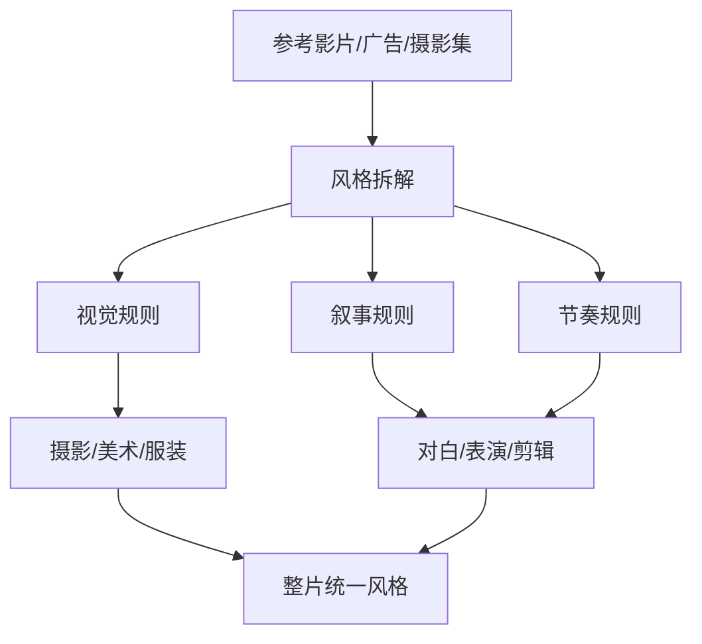
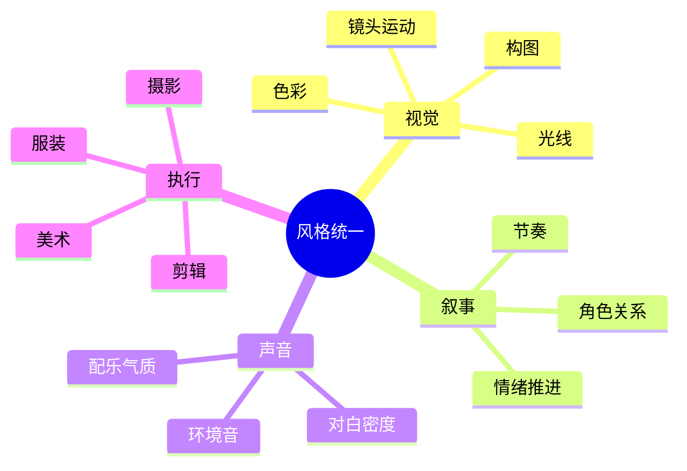
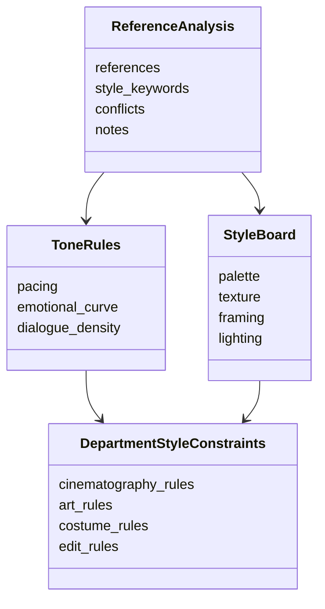

# 35. 风格参考分析与风格统一

这一篇聚焦：

**为什么风格参考不是“找几张图”，而是建立整部作品的视觉与叙事规则。**

---

## 1. 风格参考真正解决什么问题

风格参考不是为了模仿，而是为了统一：

- 视觉语言
- 摄影语言
- 美术语言
- 表演气质
- 剪辑节奏
- 声音气质

如果没有统一规则，项目很容易出现“局部都不错，但整体不像一部片”的问题。

---

## 2. 一张风格统一图

---

## 3. 海外与国内的差异

海外成熟项目中，风格参考通常会更早进入：

- lookbook
- director treatment
- visual bible
- tone reel

国内项目中，风格参考也很常见，但常见问题是：

- 参考资料分散
- 风格词汇不统一
- 部门理解不一致
- 参考与执行之间缺少结构化桥梁

这意味着平台需要把“参考”转成“规则”。

---

## 4. 一张思维导图

---

## 5. 导演智能体如何承接风格统一

可以拆成：

- style-research：拆解参考素材
- cinematography：提炼镜头语言
- art-direction：提炼视觉材质与空间规则
- dialogue-polish：提炼对白气质
- editor / post：提炼节奏规则

---

## 6. 与 DeerFlow 的落地映射

可以设计：

- `StyleBoard`
- `ReferenceAnalysis`
- `ToneRules`
- `DepartmentStyleConstraints`
- 风格审核 artifacts

---

## 7. 一张类图

---

## 8. 第一版实现建议

第一版建议先支持：

- 风格关键词提取
- 参考素材拆解
- 风格冲突提示
- 部门级风格约束摘要
- 风格统一性检查

---

## 9. 为什么这一步对大规模制作尤其重要

项目越大，部门越多，风格漂移风险越高。

所以风格统一不是锦上添花，而是大规模制作的基础控制能力。

---

## 10. 这一篇最重要的结论

### 结论一
风格参考的真正价值，是把参考素材转成可执行的统一规则。

### 结论二
国内外差异的关键，在于风格资料是否被系统化、规则化、跨部门共享。

### 结论三
导演智能体平台应当把风格统一能力沉淀为对象、规则和审核流程。

---

---

<!-- movie-doc-nav:start -->
## 文档导航

- 总入口：[README.md](./README.md)
- 阅读地图：[00-reading-map.md](./00-reading-map.md)
- 所在分组：25-36 前期制作
- 上一篇：[34. 静态分镜图与氛围图](./34-static-storyboards-and-moodboards.md)
- 下一篇：[36. 对白设计与润色](./36-dialogue-design-and-polish.md)

### 同组文档
- [25. 剧本开发与锁稿](./25-script-development-and-lock.md)
- [26. 剧本拆解与 breakdown sheet](./26-script-breakdown-and-breakdown-sheet.md)
- [27. 预算体系与 line producer 视角](./27-budgeting-and-line-producer-view.md)
- [28. 排期体系与 1st AD 视角](./28-scheduling-and-first-ad-view.md)
- [29. 选角流程与演员管理](./29-casting-and-actor-management.md)
- [30. 场地勘景与场地锁定](./30-location-scouting-and-lock.md)
- [31. 美术、服装、道具协同](./31-art-costume-props-collaboration.md)
- [32. 摄影、灯光、视效前期协同](./32-cinematography-lighting-vfx-preproduction.md)
- [33. 文字分镜与镜头表](./33-text-storyboard-and-shot-list.md)
- [34. 静态分镜图与氛围图](./34-static-storyboards-and-moodboards.md)
- 35. 风格参考分析与风格统一（当前）
- [36. 对白设计与润色](./36-dialogue-design-and-polish.md)
<!-- movie-doc-nav:end -->
