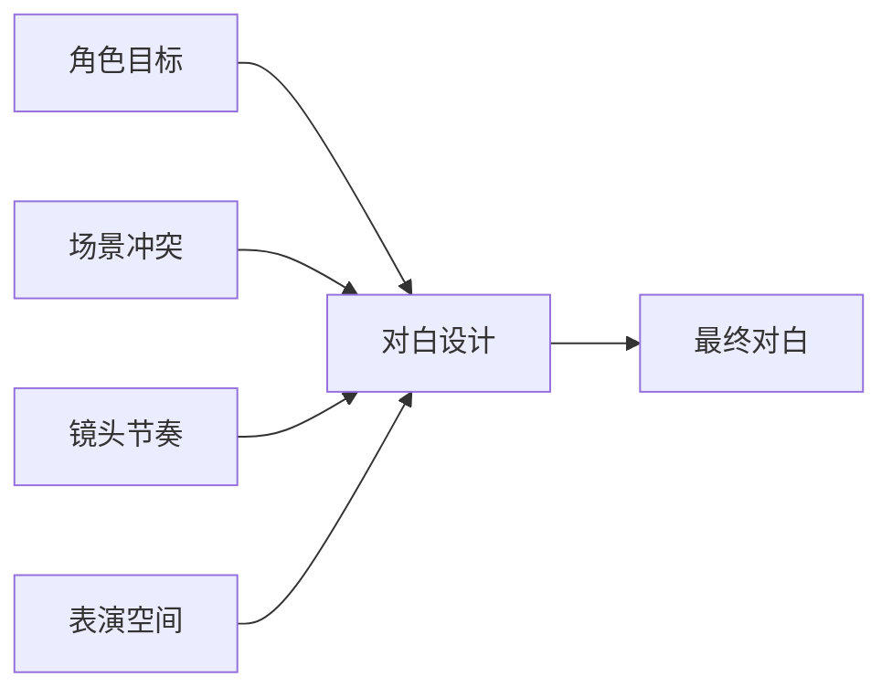
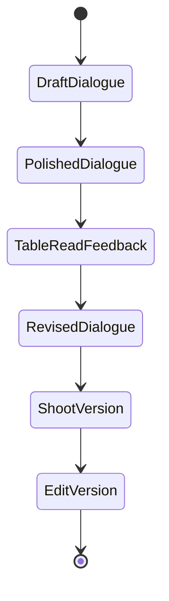

# 36. 对白设计与润色

这一篇聚焦：

**为什么电影对白不是“写得像人说话”就够了，而是要服务角色、节奏、表演和镜头。**

---

## 1. 对白在电影中的作用

对白不仅传递信息，还承担：

- 角色塑造
- 情绪推进
- 节奏控制
- 冲突建立
- 信息隐藏与释放

所以对白设计不是文学润色，而是视听叙事的一部分。

---

## 2. 一张对白作用图



---

## 3. 国内外差异

海外成熟工业体系中，对白开发通常会更早进入 table read、script polish、character voice consistency 等流程。

国内项目中，常见情况是：

- 导演与编剧在拍摄前后仍持续调整对白
- 演员现场会参与对白自然化
- 某些类型片更强调信息效率，某些作者片更强调留白与气质

这意味着平台要支持：

- 版本化对白
- 角色口吻一致性
- 场景级对白目标
- 现场调整记录

---

## 4. 一张时序图

```mermaid
sequenceDiagram
    participant Writer
    participant Director
    participant DialogueAgent
    participant Actor
    participant Editor

    Writer->>DialogueAgent: 提供场景对白草稿
    Director->>DialogueAgent: 提供情绪与节奏目标
    DialogueAgent->>Actor: 输出角色口吻版本
    Actor->>Director: 反馈表演自然度
    Director->>DialogueAgent: 调整对白密度与节奏
    DialogueAgent->>Editor: 输出对白版本记录
```

---

## 5. 导演智能体如何承接对白设计

可以拆成：

- dialogue-polish subagent
- script-analyst subagent
- character voice consistency checker
- scene tension analyzer

---

## 6. 与 DeerFlow 的落地映射

可以设计：

- `DialogueDraft`
- `DialogueVariant`
- `CharacterVoiceProfile`
- `SceneDialogueGoal`
- 对白版本 artifacts

---

## 7. 一张状态图



---

## 8. 第一版实现建议

第一版建议先支持：

- 场景级对白润色
- 角色口吻一致性检查
- 多版本对白输出
- 对白密度与节奏建议
- 待导演确认点标记

---

## 9. 为什么对白模块适合 AI 辅助

因为 AI 很适合：

- 快速生成多版表达
- 检查角色口吻一致性
- 检查信息重复与节奏拖沓

但最终是否成立，仍然依赖导演、编剧、演员的共同判断。

---

## 10. 这一篇最重要的结论

### 结论一
电影对白必须服务角色、节奏、表演和镜头，而不是只追求自然。

### 结论二
国内外差异的关键，在于对白开发是否被纳入系统化版本流程。

### 结论三
导演智能体平台应当把对白设计建模成对象、版本和反馈闭环。