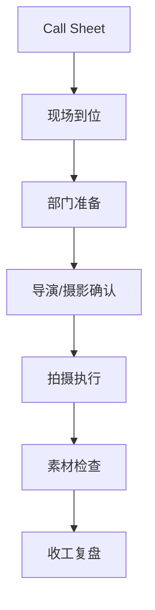
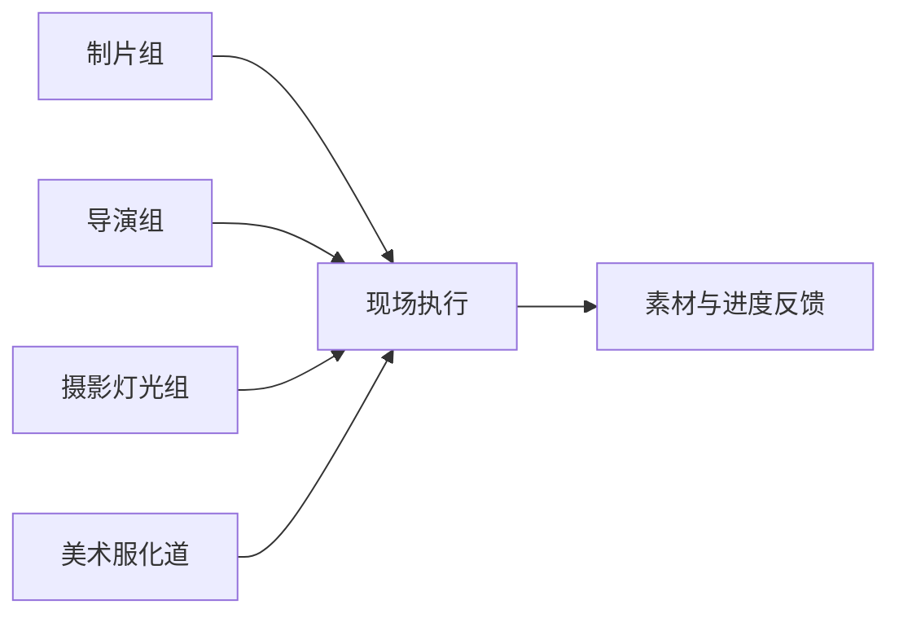
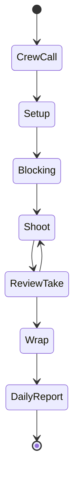

# 37. principal photography 现场组织

这一篇聚焦：

**为什么拍摄现场不是“导演喊开始”，而是一个高成本、高并发、高约束的执行系统。**

---

## 1. 现场组织的本质

进入 principal photography 后，项目进入成本最敏感阶段。

现场组织的核心目标是：

- 保证拍摄按计划推进
- 保证素材质量
- 保证安全与秩序
- 保证跨部门协同
- 保证问题快速升级与决策

---

## 2. 一张现场组织图

---

## 3. 海外成熟流程的特点

海外成熟工业体系通常更强调：

- call sheet 严格执行
- union / department boundary 清晰
- 安全与工时规则明确
- 现场问题升级路径清晰

这意味着现场组织更像一个标准化执行系统。

---

## 4. 国内常见差异

国内项目中，常见情况是：

- 现场灵活调整更多
- 导演与制片的即时协调更频繁
- 某些项目依赖核心团队经验维持秩序
- 当系统化工具不足时，信息同步成本更高

但大型项目和工业化项目中，现场组织也在快速标准化。

---

## 5. 一张泳道图

---

## 6. 与 DeerFlow 的落地映射

可以设计：

- assistant-director subagent
- daily-operations subagent
- `CallSheet` / `DailyShootStatus` 对象
- 现场问题升级 artifacts
- dailies review artifacts

---

## 7. 一张状态机图

---

## 8. 第一版实现建议

第一版不需要做完整片场系统，但建议支持：

- 每日拍摄目标摘要
- 现场风险摘要
- 部门准备检查清单
- 收工复盘摘要
- 问题升级记录

---

## 9. 为什么这一步对平台化很关键

因为只有进入现场组织层，导演智能体平台才真正从“前期策划工具”升级为“制作操作系统”。

---

## 10. 这一篇最重要的结论

### 结论一
拍摄现场是一个高成本、高并发、高约束的执行系统。

### 结论二
国内外差异的关键，在于现场标准化程度与信息同步机制。

### 结论三
导演智能体平台必须逐步进入现场组织层，才能真正支撑大规模制作。

---

<!-- movie-visuals:start -->
## 补充图示：换一种视角看本篇

下面这张 甘特图 把“principal photography 现场组织”再压缩成一个可快速扫读的结构视图，便于先抓关键关系，再回到正文细节。

<!-- movie-visuals:end -->

<!-- movie-doc-nav:start -->
## 文档导航

- 总入口：[README.md](./README.md)
- 阅读地图：[00-reading-map.md](./00-reading-map.md)
- 所在分组：37-51 拍摄执行、后期与发行
- 上一篇：[36. 对白设计与润色](./36-dialogue-design-and-polish.md)
- 下一篇：[38. call sheet 与每日拍摄计划](./38-call-sheet-and-daily-plan.md)

### 同组文档
- 37. principal photography 现场组织（当前）
- [38. call sheet 与每日拍摄计划](./38-call-sheet-and-daily-plan.md)
- [39. 助理导演调度系统](./39-assistant-director-dispatch-system.md)
- [40. 进度控制与成本控制](./40-progress-and-cost-control.md)
- [41. 现场问题升级与决策机制](./41-on-set-escalation-and-decision-making.md)
- [42. 演员表演指导与导演反馈](./42-performance-direction-and-feedback.md)
- [43. 摄影、灯光、录音、视效现场协同](./43-on-set-collaboration-camera-light-sound-vfx.md)
- [44. dailies、出片与审核](./44-dailies-output-and-review.md)
- [45. 剪辑流程与版本推进](./45-editing-workflow-and-versioning.md)
- [46. 配音、配乐、音效协同](./46-adr-music-sound-collaboration.md)
- [47. 调色流程与视觉统一](./47-color-grading-and-visual-consistency.md)
- [48. VFX 后期协同与交付](./48-vfx-post-collaboration-and-delivery.md)
- [49. 审核流、版本管理与发布包](./49-review-flow-versioning-and-release-package.md)
- [50. 宣发素材与发行协同](./50-marketing-assets-and-distribution-collaboration.md)
- [51. 项目复盘与知识沉淀](./51-project-retrospective-and-knowledge-capture.md)
<!-- movie-doc-nav:end -->
