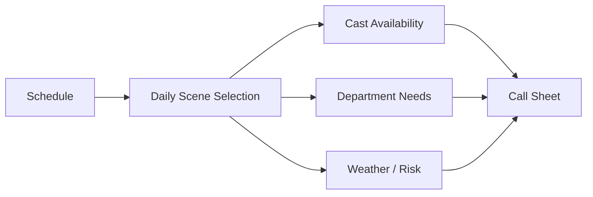
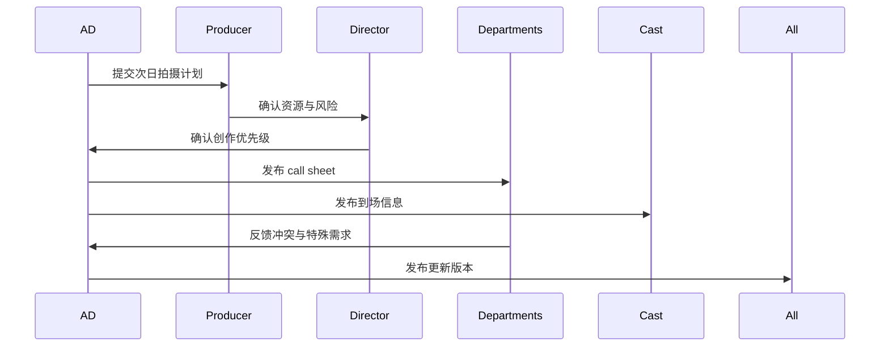
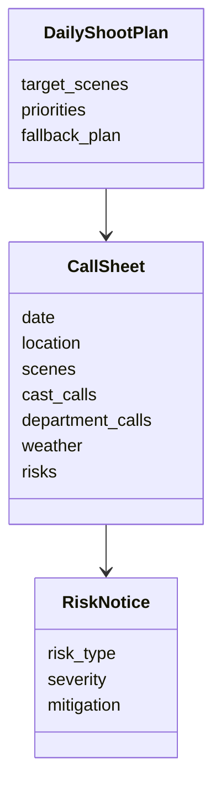

# 38. call sheet 与每日拍摄计划

这一篇聚焦：

**为什么 call sheet 不是通知单，而是拍摄日的操作系统入口。**

---

## 1. call sheet 真正承载什么

call sheet 通常承载：

- 当日拍摄场景
- 到场时间
- 演员与部门安排
- 场地信息
- 特殊需求
- 天气与风险提示
- 联系方式与应急信息

它不是简单通知，而是把排期转成当日执行命令。

---

## 2. 一张 call sheet 生成链路图

---

## 3. 海外成熟流程的特点

行业资料普遍强调，call sheet 会包含部门 call time、场景编号、演员到场时间、预计收工时间、特殊部门需求、用餐窗口、紧急联系人、天气与 contingency plan 等信息。[来源：First Draft Film Works, Film Scheduling Guide](https://firstdraftfilmworks.com/blog/the-complete-guide-to-film-scheduling-master-movie-magic-scheduling/)

这说明 call sheet 本质上是“每日执行控制面板”。

---

## 4. 国内常见差异

国内项目中，call sheet 也存在，但常见问题是：

- 信息分散在多个群与表格
- 临时变更同步成本高
- 版本控制不稳定
- 现场口头补充较多

这意味着平台需要支持：

- call sheet 版本化
- 变更广播
- 风险提示
- 部门差异化视图

---

## 5. 一张时序图

---

## 6. 与 DeerFlow 的落地映射

可以设计：

- assistant-director subagent
- `CallSheet` 对象
- `DailyShootPlan` 对象
- 风险广播 artifacts
- 版本更新记录

---

## 7. 一张类图

---

## 8. 第一版实现建议

第一版建议先支持：

- 次日拍摄摘要
- call sheet 草案生成
- 风险提示生成
- 版本更新记录
- fallback plan 摘要

---

## 9. 为什么 call sheet 是平台化关键节点

因为它是“计划 -> 执行”的最后一跳。

如果平台不能稳定生成和管理 call sheet，就很难真正进入现场执行层。

---

## 10. 这一篇最重要的结论

### 结论一
call sheet 是拍摄日的操作系统入口，而不是普通通知单。

### 结论二
国内外差异的关键，在于 call sheet 的标准化程度与版本控制能力。

### 结论三
导演智能体平台应当把 call sheet 作为核心执行对象来管理。