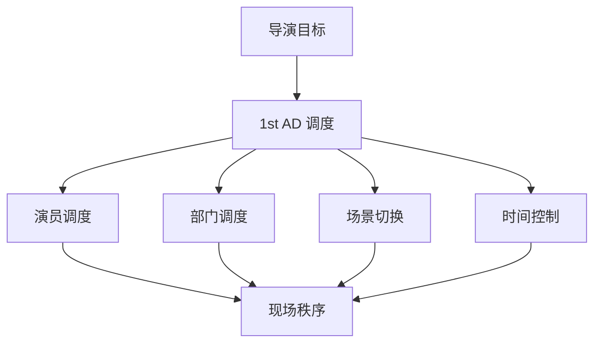
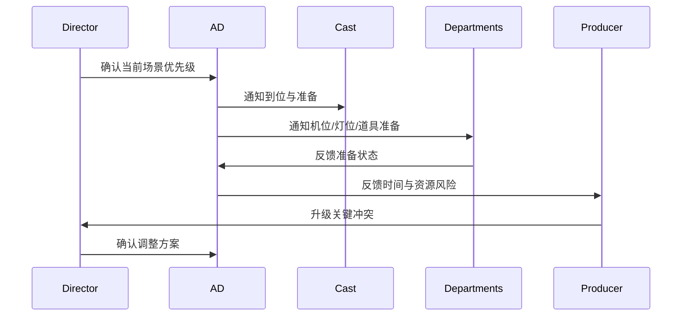
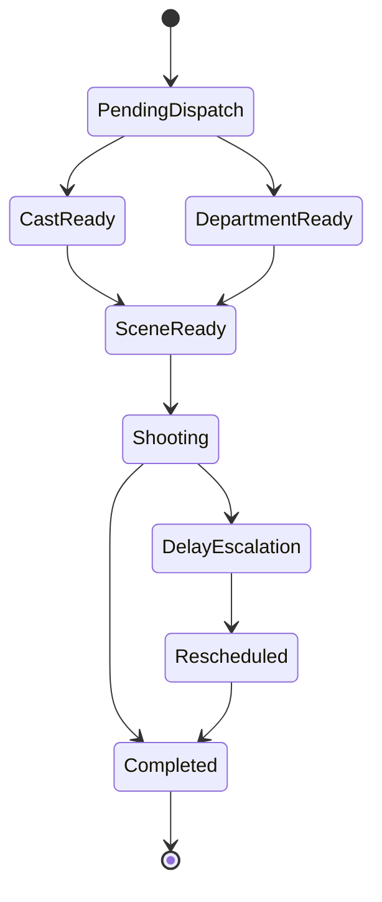

# 39. 助理导演调度系统

这一篇聚焦：

**为什么助理导演系统是把导演意图转成现场秩序的关键中枢。**

---

## 1. 助理导演系统的本质

助理导演系统不是“辅助导演创作”，而是：

- 维护现场秩序
- 推进拍摄节奏
- 协调演员与部门到位
- 处理时间冲突
- 升级现场问题

它本质上是执行调度系统。

---

## 2. 一张调度图

---

## 3. 海外成熟流程的特点

海外成熟工业体系中，1st AD 的职责边界通常更清晰，现场秩序、工时、安全、节奏推进都更制度化。

这意味着助理导演系统更容易被标准化建模。

---

## 4. 国内常见差异

国内项目中，助理导演系统也很关键，但常见情况是：

- 现场协调更依赖核心人员经验
- 导演、执行制片、现场副导演之间即时沟通更多
- 某些项目的调度信息分散在群聊、表格、口头通知中

这意味着平台需要支持“结构化调度 + 即时变更”。

---

## 5. 一张时序图

---

## 6. 与 DeerFlow 的落地映射

可以设计：

- assistant-director subagent
- dispatch coordinator subagent
- `DispatchTask` / `DepartmentReadiness` / `EscalationEvent` 对象
- 现场调度 artifacts

---

## 7. 一张状态图

---

## 8. 第一版实现建议

第一版建议先支持：

- 调度任务清单
- 部门准备状态
- 延误风险提示
- 升级事件记录
- 调整建议摘要

---

## 9. 为什么助理导演系统是平台化关键能力

因为它是把“计划”变成“秩序”的关键层。

没有调度系统，平台就无法真正进入现场执行。

---

## 10. 这一篇最重要的结论

### 结论一
助理导演系统是把导演意图转成现场秩序的关键中枢。

### 结论二
国内外差异的关键，在于调度是否被标准化、结构化、可追踪。

### 结论三
在导演智能体平台中，assistant-director 应当是中期制作阶段的核心角色。