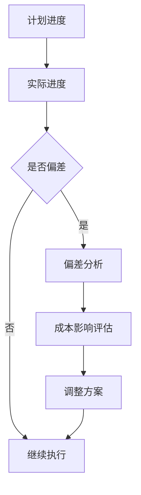
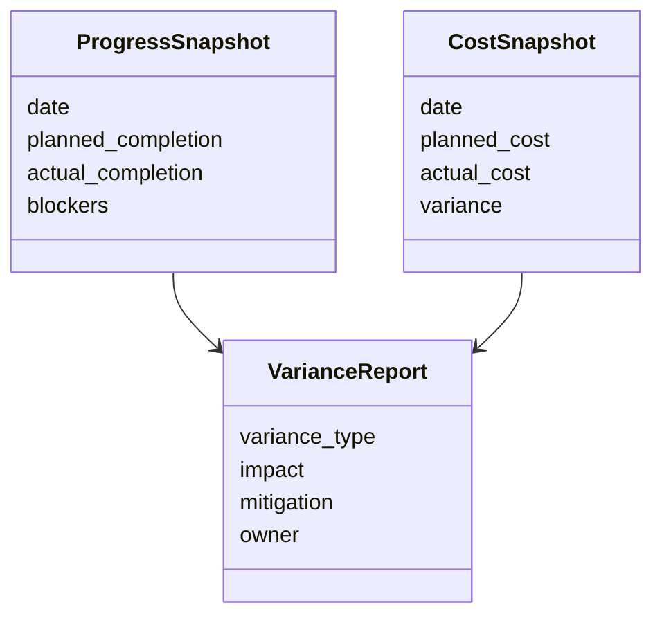
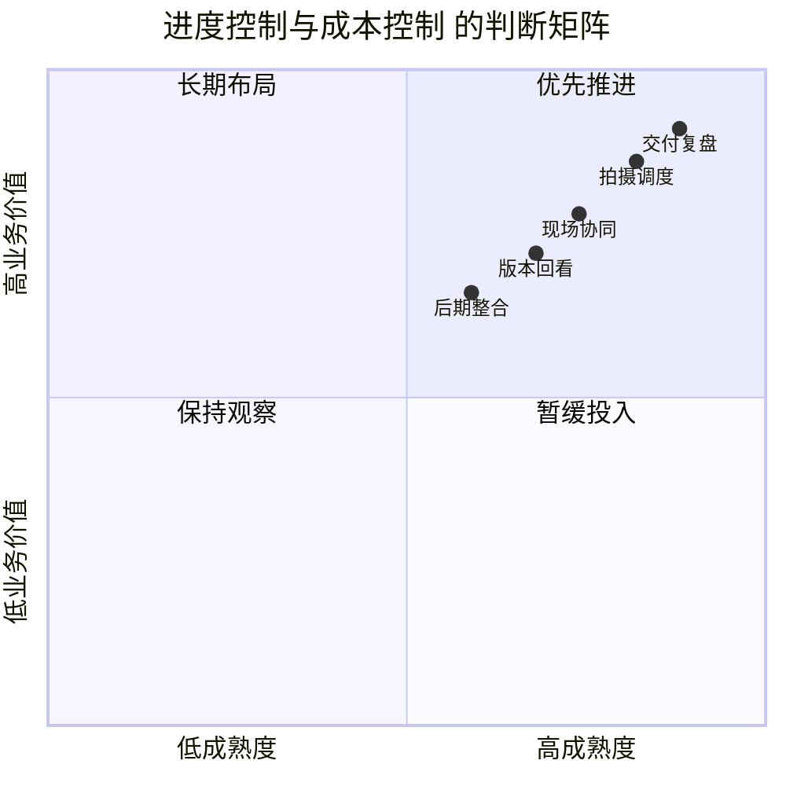

# 40. 进度控制与成本控制

这一篇聚焦：

**为什么进度控制与成本控制不是两个系统，而是一套联动的生产控制系统。**

---

## 1. 为什么进度与成本必须联动

电影项目里，时间几乎总是直接转化为成本。

每增加一天拍摄，通常都会增加：

- 人工
- 设备
- 场地
- 交通
- 后勤
- 保险与管理成本

所以进度偏差如果不被及时识别，就会迅速变成成本失控。

---

## 2. 一张联动图

---

## 3. 海外成熟流程的特点

海外成熟工业体系通常更强调：

- 预算与排期同步编制
- 每日进度复盘
- 关键路径监控
- contingency 使用规则
- 工时与安全规则

这意味着进度与成本控制更容易形成闭环。

---

## 4. 国内常见差异

国内项目中，常见情况是：

- 进度与成本数据分散
- 现场调整频繁
- 风险预警滞后
- 依赖经验判断而非系统指标

但系统化制片实践正在推动这一点改善，尤其在中大型项目中更明显。

---

## 5. 一张甘特式逻辑图

---

## 6. 与 DeerFlow 的落地映射

可以设计：

- budget-controller subagent
- assistant-director subagent
- producer subagent
- `ProgressSnapshot` / `CostSnapshot` / `VarianceReport` 对象
- 风险预警 artifacts

---

## 7. 一张类图

---

## 8. 国内外差异对平台设计的启示

如果平台要适配国内外项目，必须支持：

- 标准化日报 / 周报
- 快速偏差分析
- 预算与排期联动
- 适合压缩工期项目的快速预警模式

---

## 9. 第一版实现建议

第一版建议先支持：

- 进度偏差摘要
- 成本偏差摘要
- 高风险场景标记
- 调整建议
- 风险升级记录

---

## 10. 这一篇最重要的结论

### 结论一
进度控制与成本控制本质上是一套联动的生产控制系统。

### 结论二
国内外差异的关键，在于偏差是否被结构化记录、分析和升级。

### 结论三
导演智能体平台必须具备进度-成本联动分析能力，才能真正支撑大规模制作。

---

<!-- movie-visuals:start -->
## 补充图示：换一种视角看本篇

下面这张 象限图 把“进度控制与成本控制”再压缩成一个可快速扫读的结构视图，便于先抓关键关系，再回到正文细节。

<!-- movie-visuals:end -->

<!-- movie-doc-nav:start -->
## 文档导航

- 总入口：[README.md](./README.md)
- 阅读地图：[00-reading-map.md](./00-reading-map.md)
- 所在分组：37-51 拍摄执行、后期与发行
- 上一篇：[39. 助理导演调度系统](./39-assistant-director-dispatch-system.md)
- 下一篇：[41. 现场问题升级与决策机制](./41-on-set-escalation-and-decision-making.md)

### 同组文档
- [37. principal photography 现场组织](./37-principal-photography-operations.md)
- [38. call sheet 与每日拍摄计划](./38-call-sheet-and-daily-plan.md)
- [39. 助理导演调度系统](./39-assistant-director-dispatch-system.md)
- 40. 进度控制与成本控制（当前）
- [41. 现场问题升级与决策机制](./41-on-set-escalation-and-decision-making.md)
- [42. 演员表演指导与导演反馈](./42-performance-direction-and-feedback.md)
- [43. 摄影、灯光、录音、视效现场协同](./43-on-set-collaboration-camera-light-sound-vfx.md)
- [44. dailies、出片与审核](./44-dailies-output-and-review.md)
- [45. 剪辑流程与版本推进](./45-editing-workflow-and-versioning.md)
- [46. 配音、配乐、音效协同](./46-adr-music-sound-collaboration.md)
- [47. 调色流程与视觉统一](./47-color-grading-and-visual-consistency.md)
- [48. VFX 后期协同与交付](./48-vfx-post-collaboration-and-delivery.md)
- [49. 审核流、版本管理与发布包](./49-review-flow-versioning-and-release-package.md)
- [50. 宣发素材与发行协同](./50-marketing-assets-and-distribution-collaboration.md)
- [51. 项目复盘与知识沉淀](./51-project-retrospective-and-knowledge-capture.md)
<!-- movie-doc-nav:end -->
