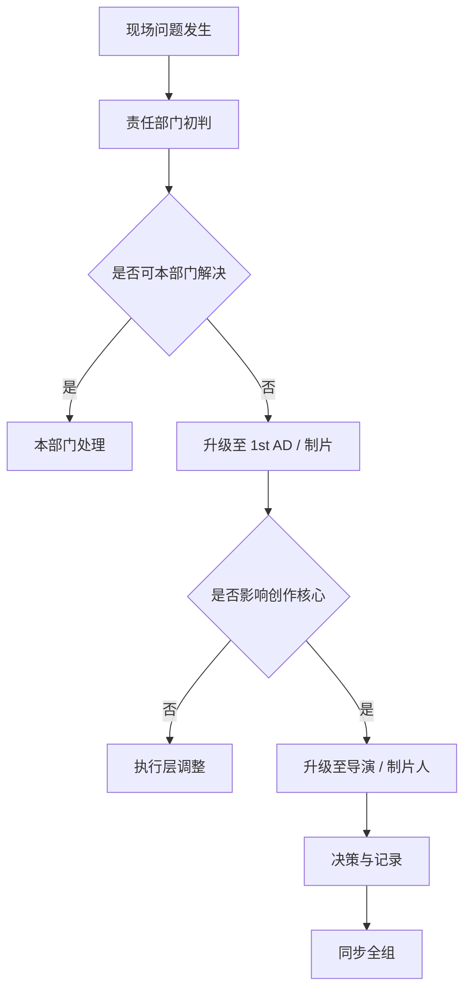
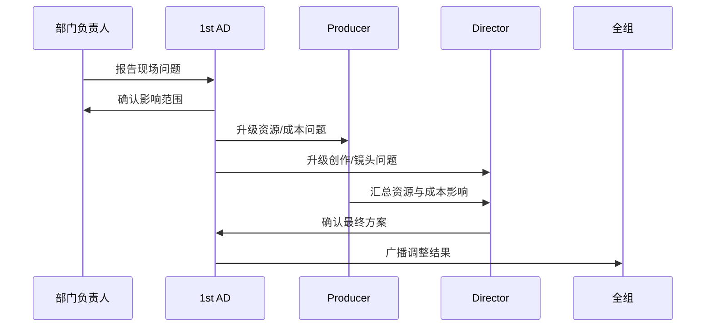
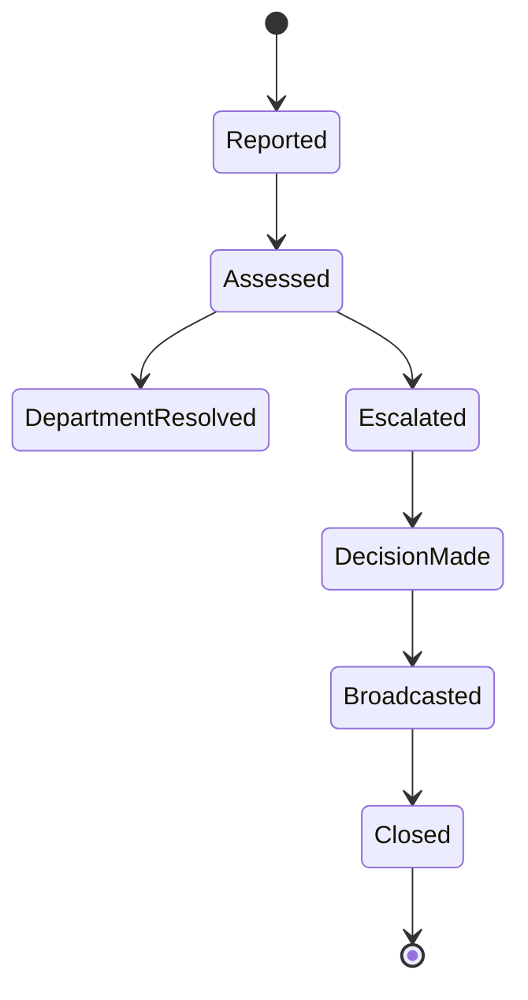

# 41. 现场问题升级与决策机制

这一篇聚焦：

**为什么片场问题不是“谁嗓门大谁决定”，而是必须有清晰的升级路径、责任边界和决策闭环。**

---

## 1. 现场问题为什么必须升级管理

片场问题通常具有三个特点：

- 发生快
- 影响范围大
- 决策成本高

例如：

- 演员迟到
- 场地临时不可用
- 天气突变
- 设备故障
- 安全风险
- 镜头方案无法执行

如果没有升级机制，问题会从局部延误迅速演变成：

- 排期失控
- 成本失控
- 部门冲突
- 创作质量下降

---

## 2. 一张升级路径图

---

## 3. 海外成熟流程的特点

海外成熟工业体系通常更强调：

- 现场职责边界清晰
- 安全问题优先级最高
- 1st AD 负责秩序与升级
- 导演负责创作判断
- 制片负责资源与成本判断

这意味着问题升级路径更制度化。

---

## 4. 国内常见差异

国内项目中，常见情况是：

- 现场即时协调更多
- 导演、执行制片、现场副导演之间的口头决策更频繁
- 某些问题依赖核心人员经验快速拍板
- 当系统化工具不足时，问题记录与追踪容易缺失

这意味着平台必须支持“快速升级 + 结构化留痕”。

---

## 5. 一张时序图

---

## 6. 与 DeerFlow 的落地映射

可以设计：

- escalation-coordinator subagent
- assistant-director subagent
- producer subagent
- `EscalationEvent` / `DecisionRecord` / `ImpactAssessment` 对象
- 现场问题广播 artifacts

---

## 7. 一张状态图

---

## 8. 第一版实现建议

第一版建议先支持：

- 问题分类
- 影响范围摘要
- 升级路径建议
- 决策记录
- 广播与留痕

---

## 9. 为什么这一步对大规模制作尤其重要

项目越大，部门越多，问题升级越不能依赖个人记忆和口头传达。

所以升级机制本质上是大规模制作的“稳定器”。

---

## 10. 这一篇最重要的结论

### 结论一
现场问题升级机制，是片场稳定运行的关键控制层。

### 结论二
国内外差异的关键，在于升级路径是否制度化、可追踪、可复盘。

### 结论三
导演智能体平台应当把问题升级建模成对象、状态和广播流程。