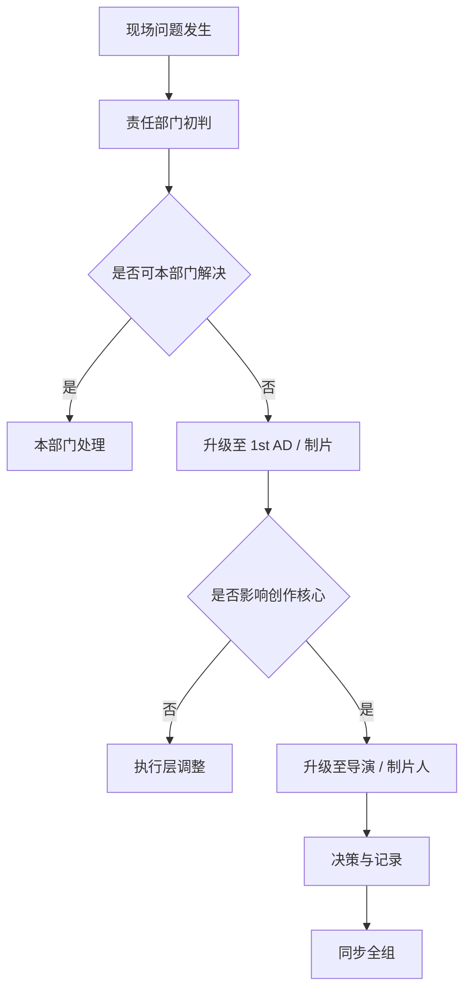
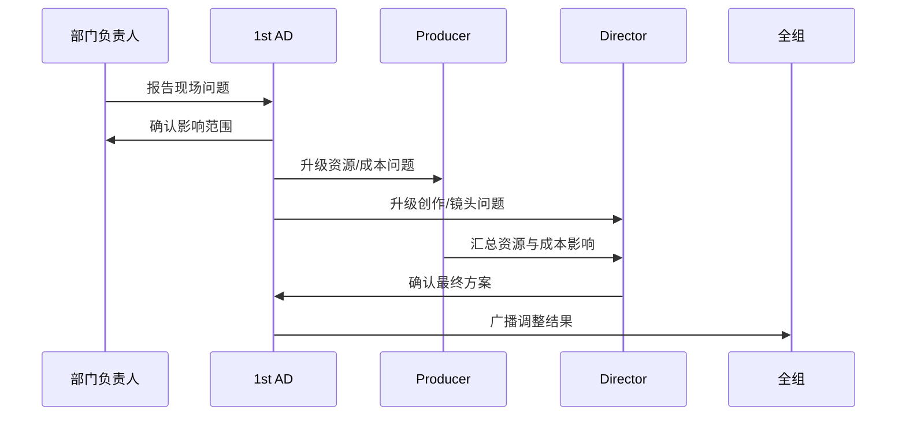
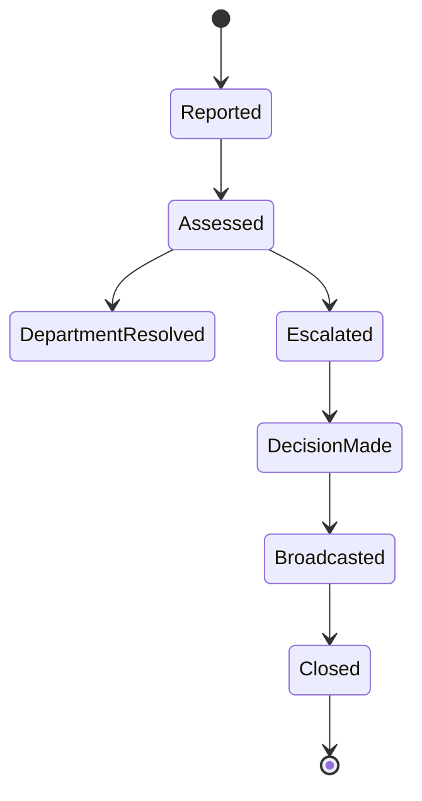
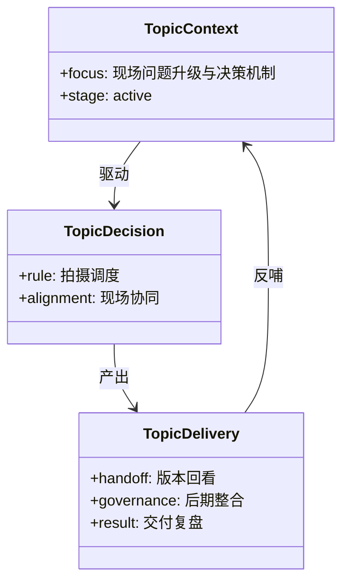

# 41. 现场问题升级与决策机制

这一篇聚焦：

**为什么片场问题不是“谁嗓门大谁决定”，而是必须有清晰的升级路径、责任边界和决策闭环。**

---

## 1. 现场问题为什么必须升级管理

片场问题通常具有三个特点：

- 发生快
- 影响范围大
- 决策成本高

例如：

- 演员迟到
- 场地临时不可用
- 天气突变
- 设备故障
- 安全风险
- 镜头方案无法执行

如果没有升级机制，问题会从局部延误迅速演变成：

- 排期失控
- 成本失控
- 部门冲突
- 创作质量下降

---

## 2. 一张升级路径图

---

## 3. 海外成熟流程的特点

海外成熟工业体系通常更强调：

- 现场职责边界清晰
- 安全问题优先级最高
- 1st AD 负责秩序与升级
- 导演负责创作判断
- 制片负责资源与成本判断

这意味着问题升级路径更制度化。

---

## 4. 国内常见差异

国内项目中，常见情况是：

- 现场即时协调更多
- 导演、执行制片、现场副导演之间的口头决策更频繁
- 某些问题依赖核心人员经验快速拍板
- 当系统化工具不足时，问题记录与追踪容易缺失

这意味着平台必须支持“快速升级 + 结构化留痕”。

---

## 5. 一张时序图

---

## 6. 与 DeerFlow 的落地映射

可以设计：

- escalation-coordinator subagent
- assistant-director subagent
- producer subagent
- `EscalationEvent` / `DecisionRecord` / `ImpactAssessment` 对象
- 现场问题广播 artifacts

---

## 7. 一张状态图

---

## 8. 第一版实现建议

第一版建议先支持：

- 问题分类
- 影响范围摘要
- 升级路径建议
- 决策记录
- 广播与留痕

---

## 9. 为什么这一步对大规模制作尤其重要

项目越大，部门越多，问题升级越不能依赖个人记忆和口头传达。

所以升级机制本质上是大规模制作的“稳定器”。

---

## 10. 这一篇最重要的结论

### 结论一
现场问题升级机制，是片场稳定运行的关键控制层。

### 结论二
国内外差异的关键，在于升级路径是否制度化、可追踪、可复盘。

### 结论三
导演智能体平台应当把问题升级建模成对象、状态和广播流程。

---

<!-- movie-visuals:start -->
## 补充图示：换一种视角看本篇

下面这张 类图 把“现场问题升级与决策机制”再压缩成一个可快速扫读的结构视图，便于先抓关键关系，再回到正文细节。

<!-- movie-visuals:end -->

<!-- movie-doc-nav:start -->
## 文档导航

- 总入口：[README.md](./README.md)
- 阅读地图：[00-reading-map.md](./00-reading-map.md)
- 所在分组：37-51 拍摄执行、后期与发行
- 上一篇：[40. 进度控制与成本控制](./40-progress-and-cost-control.md)
- 下一篇：[42. 演员表演指导与导演反馈](./42-performance-direction-and-feedback.md)

### 同组文档
- [37. principal photography 现场组织](./37-principal-photography-operations.md)
- [38. call sheet 与每日拍摄计划](./38-call-sheet-and-daily-plan.md)
- [39. 助理导演调度系统](./39-assistant-director-dispatch-system.md)
- [40. 进度控制与成本控制](./40-progress-and-cost-control.md)
- 41. 现场问题升级与决策机制（当前）
- [42. 演员表演指导与导演反馈](./42-performance-direction-and-feedback.md)
- [43. 摄影、灯光、录音、视效现场协同](./43-on-set-collaboration-camera-light-sound-vfx.md)
- [44. dailies、出片与审核](./44-dailies-output-and-review.md)
- [45. 剪辑流程与版本推进](./45-editing-workflow-and-versioning.md)
- [46. 配音、配乐、音效协同](./46-adr-music-sound-collaboration.md)
- [47. 调色流程与视觉统一](./47-color-grading-and-visual-consistency.md)
- [48. VFX 后期协同与交付](./48-vfx-post-collaboration-and-delivery.md)
- [49. 审核流、版本管理与发布包](./49-review-flow-versioning-and-release-package.md)
- [50. 宣发素材与发行协同](./50-marketing-assets-and-distribution-collaboration.md)
- [51. 项目复盘与知识沉淀](./51-project-retrospective-and-knowledge-capture.md)
<!-- movie-doc-nav:end -->
