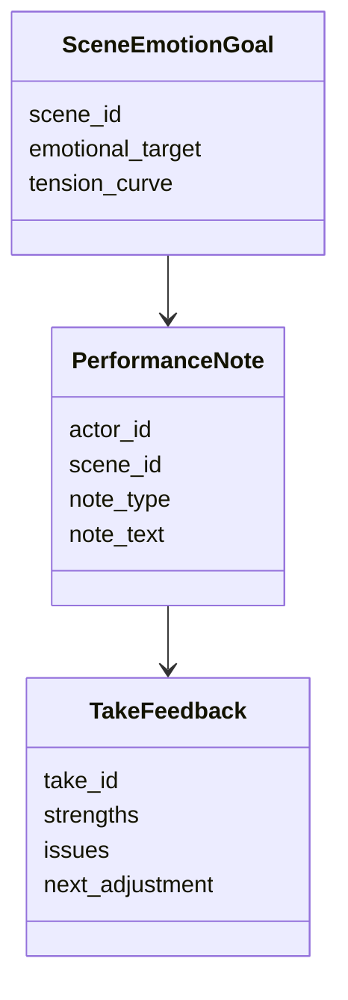
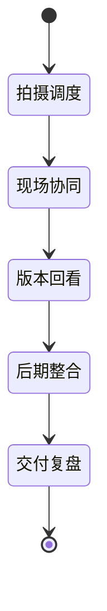

# 42. 演员表演指导与导演反馈

这一篇聚焦：

**为什么导演对演员的反馈，不只是“再来一条”，而是角色、情绪、镜头与节奏的综合控制。**

---

## 1. 表演指导的本质

导演对表演的指导通常同时作用于：

- 角色目标
- 情绪强度
- 节奏推进
- 与镜头的关系
- 与对手戏演员的关系

所以表演指导不是单点修正，而是场景叙事控制。

---

## 2. 一张反馈闭环图


---

## 3. 海外成熟流程的特点

海外成熟流程中，table read、角色分析、blocking rehearsal、performance notes 往往更系统化。

这意味着导演反馈更容易围绕：

- 角色弧线
- 场景目标
- 节奏控制
- 镜头适配

形成稳定语言。

---

## 4. 国内常见差异

国内项目中，常见情况是：

- 导演与演员现场磨合更多
- 某些项目更依赖演员经验与导演即时判断
- 反馈语言可能更口语化、更依赖默契
- 结构化记录较少

这意味着平台要支持“自然语言反馈”向“结构化表演目标”的转化。

---

## 5. 一张时序图

```mermaid
sequenceDiagram
    participant Director
    participant Actor
    participant ScriptSupervisor
    participant Editor

    Director->>Actor: 提供表演目标与情绪方向
    Actor->>Director: 执行表演版本
    Director->>ScriptSupervisor: 记录关键反馈点
    Director->>Actor: 调整节奏/强度/潜台词
    ScriptSupervisor->>Editor: 同步 take 差异与备注
```

---

## 6. 与 DeerFlow 的落地映射

可以设计：

- performance-coach subagent
- dialogue-polish subagent
- `PerformanceNote` / `TakeFeedback` / `SceneEmotionGoal` 对象
- 表演反馈 artifacts

---

## 7. 一张类图



---

## 8. 第一版实现建议

第一版建议先支持：

- 场景情绪目标摘要
- 表演反馈结构化记录
- take 差异摘要
- 对白与表演联动建议
- 待导演确认点

---

## 9. 为什么这一步适合 AI 辅助但不适合完全自动化

因为 AI 可以帮助：

- 记录反馈
- 对比不同 take
- 提炼角色口吻与情绪目标

但真正的表演判断仍然高度依赖导演、演员与现场氛围。

---

## 10. 这一篇最重要的结论

### 结论一
表演指导本质上是角色、情绪、镜头与节奏的综合控制。

### 结论二
国内外差异的关键，在于反馈是否被系统化记录并与角色目标关联。

### 结论三
导演智能体平台应当把表演反馈纳入对象、版本和场景目标体系。

---

<!-- movie-visuals:start -->
## 补充图示：换一种视角看本篇

下面这张 状态图 把“演员表演指导与导演反馈”再压缩成一个可快速扫读的结构视图，便于先抓关键关系，再回到正文细节。


<!-- movie-visuals:end -->

<!-- movie-doc-nav:start -->
## 文档导航

- 总入口：[README.md](./README.md)
- 阅读地图：[00-reading-map.md](./00-reading-map.md)
- 所在分组：37-51 拍摄执行、后期与发行
- 上一篇：[41. 现场问题升级与决策机制](./41-on-set-escalation-and-decision-making.md)
- 下一篇：[43. 摄影、灯光、录音、视效现场协同](./43-on-set-collaboration-camera-light-sound-vfx.md)

### 同组文档
- [37. principal photography 现场组织](./37-principal-photography-operations.md)
- [38. call sheet 与每日拍摄计划](./38-call-sheet-and-daily-plan.md)
- [39. 助理导演调度系统](./39-assistant-director-dispatch-system.md)
- [40. 进度控制与成本控制](./40-progress-and-cost-control.md)
- [41. 现场问题升级与决策机制](./41-on-set-escalation-and-decision-making.md)
- 42. 演员表演指导与导演反馈（当前）
- [43. 摄影、灯光、录音、视效现场协同](./43-on-set-collaboration-camera-light-sound-vfx.md)
- [44. dailies、出片与审核](./44-dailies-output-and-review.md)
- [45. 剪辑流程与版本推进](./45-editing-workflow-and-versioning.md)
- [46. 配音、配乐、音效协同](./46-adr-music-sound-collaboration.md)
- [47. 调色流程与视觉统一](./47-color-grading-and-visual-consistency.md)
- [48. VFX 后期协同与交付](./48-vfx-post-collaboration-and-delivery.md)
- [49. 审核流、版本管理与发布包](./49-review-flow-versioning-and-release-package.md)
- [50. 宣发素材与发行协同](./50-marketing-assets-and-distribution-collaboration.md)
- [51. 项目复盘与知识沉淀](./51-project-retrospective-and-knowledge-capture.md)
<!-- movie-doc-nav:end -->
