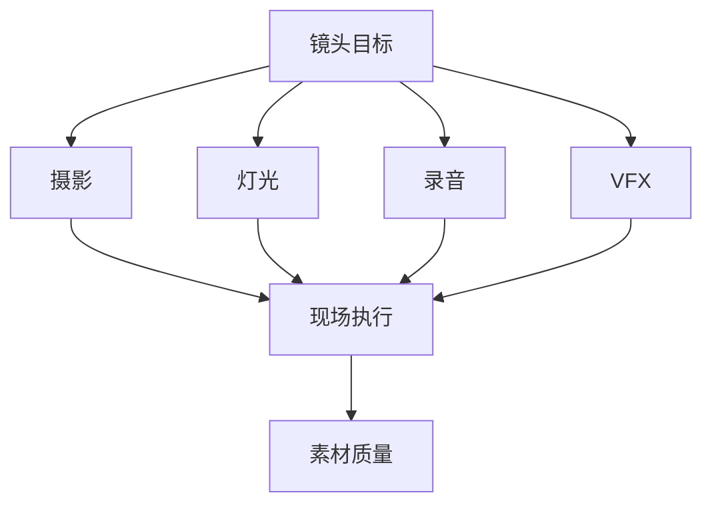
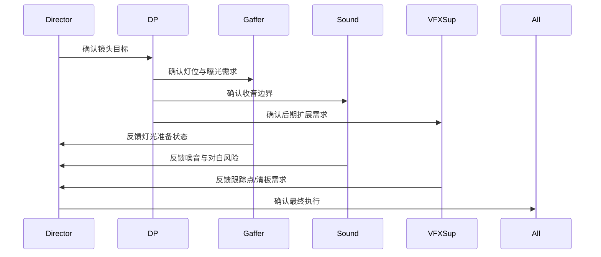
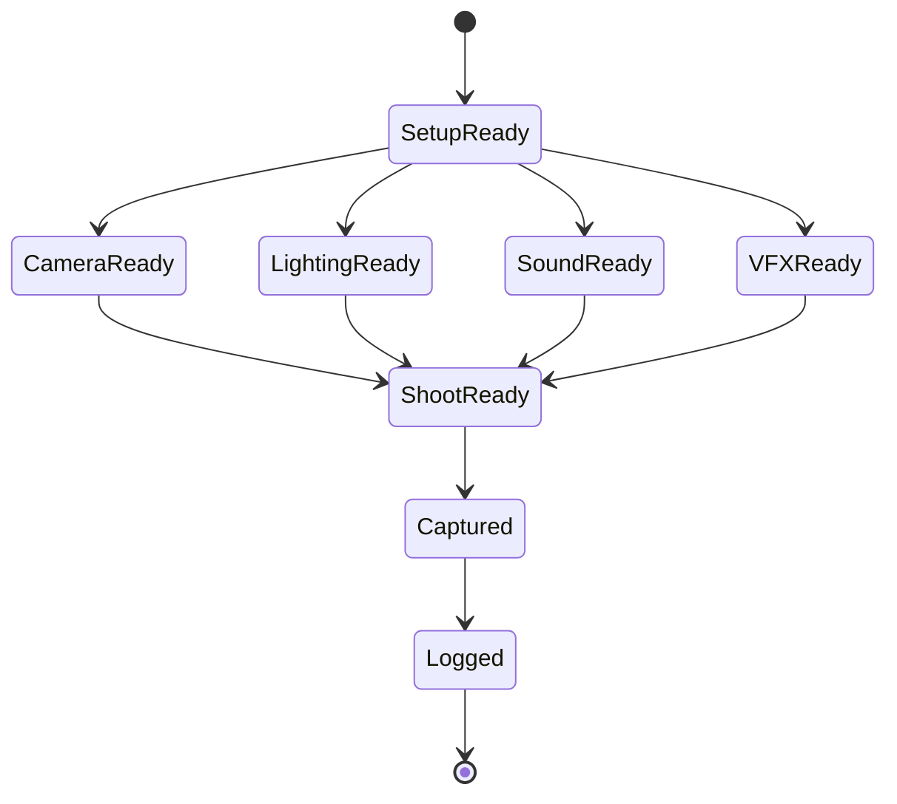
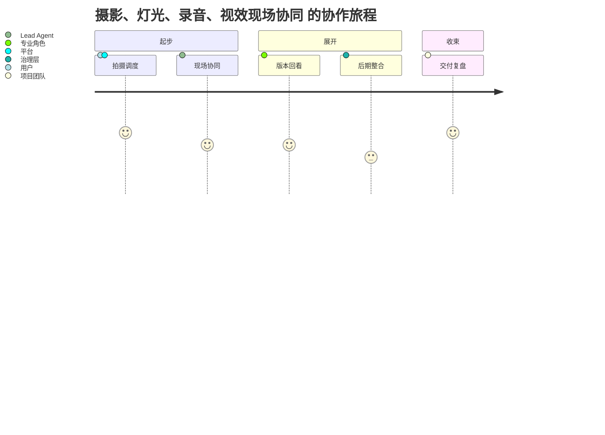

# 43. 摄影、灯光、录音、视效现场协同

这一篇聚焦：

**为什么现场协同不是部门并排工作，而是围绕同一镜头目标进行动态耦合。**

---

## 1. 现场协同的本质

在拍摄现场：

- 摄影决定画面捕捉方式
- 灯光决定可见性与氛围
- 录音决定对白与环境声质量
- 视效决定后期可扩展空间

它们不是平行关系，而是围绕镜头目标的耦合关系。

---

## 2. 一张协同图

---

## 3. 海外成熟流程的特点

海外成熟工业体系通常更强调：

- 部门边界清晰
- 现场准备流程标准化
- 声画与 VFX 交接标准明确
- 复杂镜头的现场记录更完整

这意味着协同更容易被流程化。

---

## 4. 国内常见差异

国内项目中，常见情况是：

- 现场即时调整更多
- 某些部门之间依赖经验型默契
- 录音与现场环境冲突更常见
- 视效现场记录有时不完整

这意味着平台需要支持“现场快速协同 + 结构化记录”。

---

## 5. 一张时序图

---

## 6. 与 DeerFlow 的落地映射

可以设计：

- cinematography subagent
- lighting subagent
- sound subagent
- vfx-onset subagent
- `OnSetTechNote` / `TakeTechStatus` / `VFXCaptureNote` 对象

---

## 7. 一张状态图

---

## 8. 第一版实现建议

第一版建议先支持：

- 镜头级技术准备摘要
- 收音风险提示
- VFX 现场记录摘要
- take 技术状态记录
- 部门冲突提示

---

## 9. 为什么这一步对后期质量影响巨大

因为很多后期问题，其实是在现场协同阶段就已经埋下了。

所以现场协同质量，直接决定后期返工成本。

---

## 10. 这一篇最重要的结论

### 结论一
现场协同本质上是围绕镜头目标的动态耦合，而不是部门并排工作。

### 结论二
国内外差异的关键，在于现场协同是否被标准化记录并可追溯。

### 结论三
导演智能体平台应当把现场技术协同纳入对象、状态和日志体系。

---

<!-- movie-visuals:start -->
## 补充图示：换一种视角看本篇

下面这张 旅程图 把“摄影、灯光、录音、视效现场协同”再压缩成一个可快速扫读的结构视图，便于先抓关键关系，再回到正文细节。

<!-- movie-visuals:end -->

<!-- movie-doc-nav:start -->
## 文档导航

- 总入口：[README.md](./README.md)
- 阅读地图：[00-reading-map.md](./00-reading-map.md)
- 所在分组：37-51 拍摄执行、后期与发行
- 上一篇：[42. 演员表演指导与导演反馈](./42-performance-direction-and-feedback.md)
- 下一篇：[44. dailies、出片与审核](./44-dailies-output-and-review.md)

### 同组文档
- [37. principal photography 现场组织](./37-principal-photography-operations.md)
- [38. call sheet 与每日拍摄计划](./38-call-sheet-and-daily-plan.md)
- [39. 助理导演调度系统](./39-assistant-director-dispatch-system.md)
- [40. 进度控制与成本控制](./40-progress-and-cost-control.md)
- [41. 现场问题升级与决策机制](./41-on-set-escalation-and-decision-making.md)
- [42. 演员表演指导与导演反馈](./42-performance-direction-and-feedback.md)
- 43. 摄影、灯光、录音、视效现场协同（当前）
- [44. dailies、出片与审核](./44-dailies-output-and-review.md)
- [45. 剪辑流程与版本推进](./45-editing-workflow-and-versioning.md)
- [46. 配音、配乐、音效协同](./46-adr-music-sound-collaboration.md)
- [47. 调色流程与视觉统一](./47-color-grading-and-visual-consistency.md)
- [48. VFX 后期协同与交付](./48-vfx-post-collaboration-and-delivery.md)
- [49. 审核流、版本管理与发布包](./49-review-flow-versioning-and-release-package.md)
- [50. 宣发素材与发行协同](./50-marketing-assets-and-distribution-collaboration.md)
- [51. 项目复盘与知识沉淀](./51-project-retrospective-and-knowledge-capture.md)
<!-- movie-doc-nav:end -->
