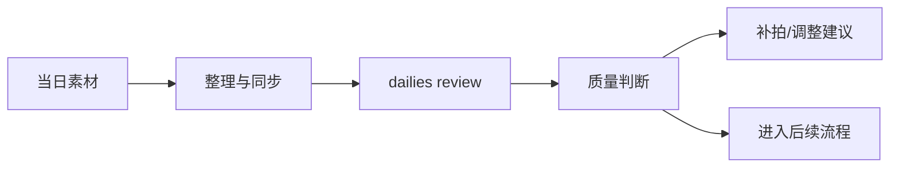
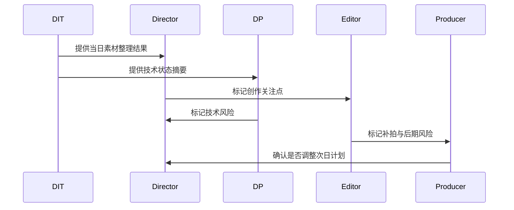
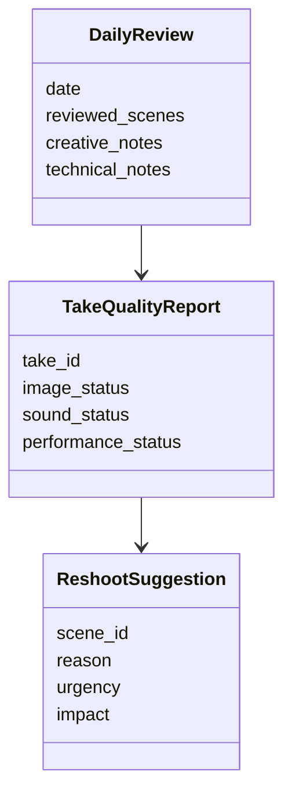
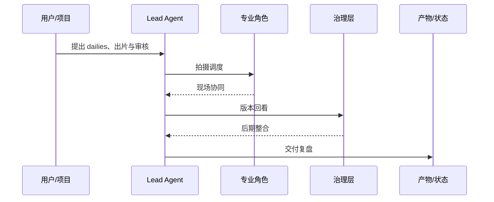

# 44. dailies、出片与审核

这一篇聚焦：

**为什么 dailies 不是简单回看素材，而是拍摄质量控制与后续决策的关键节点。**

---

## 1. dailies 真正解决什么问题

dailies 通常用于确认：

- 素材是否可用
- 表演是否成立
- 焦点、曝光、构图是否稳定
- 声音是否可用
- 是否需要补拍
- 是否存在后期风险

所以它不是“看一眼”，而是质量控制关口。

---

## 2. 一张 dailies 流程图

---

## 3. 海外成熟流程的特点

海外成熟工业体系通常更强调：

- dailies review 节奏固定
- 技术与创作双重审核
- 问题尽早暴露
- 与后期团队更早联动

这意味着 dailies 是拍摄与后期之间的重要桥梁。

---

## 4. 国内常见差异

国内项目中，常见情况是：

- 出片节奏受项目体量与流程成熟度影响较大
- 某些项目更依赖导演与摄影核心判断
- 技术审核与创作审核有时分离不清
- 当素材管理不系统时，问题追踪困难

这意味着平台需要支持“素材质量 + 决策建议”的双重输出。

---

## 5. 一张时序图

---

## 6. 与 DeerFlow 的落地映射

可以设计：

- dailies-review subagent
- editor subagent
- `DailyReview` / `TakeQualityReport` / `ReshootSuggestion` 对象
- dailies artifacts

---

## 7. 一张类图

---

## 8. 第一版实现建议

第一版建议先支持：

- 当日素材质量摘要
- 技术风险摘要
- 创作风险摘要
- 补拍建议
- 次日计划影响提示

---

## 9. 为什么 dailies 是平台化关键节点

因为它是“拍摄完成”与“是否真的可用”之间的判断层。

没有这一层，平台就无法形成质量闭环。

---

## 10. 这一篇最重要的结论

### 结论一
dailies 是拍摄质量控制与后续决策的关键节点，而不是简单回看素材。

### 结论二
国内外差异的关键，在于 dailies 是否形成固定节奏、双重审核和问题追踪机制。

### 结论三
导演智能体平台应当把 dailies 建模成质量对象、风险对象和补拍建议对象。

---

<!-- movie-visuals:start -->
## 补充图示：换一种视角看本篇

下面这张 时序图 把“dailies、出片与审核”再压缩成一个可快速扫读的结构视图，便于先抓关键关系，再回到正文细节。

<!-- movie-visuals:end -->

<!-- movie-doc-nav:start -->
## 文档导航

- 总入口：[README.md](./README.md)
- 阅读地图：[00-reading-map.md](./00-reading-map.md)
- 所在分组：37-51 拍摄执行、后期与发行
- 上一篇：[43. 摄影、灯光、录音、视效现场协同](./43-on-set-collaboration-camera-light-sound-vfx.md)
- 下一篇：[45. 剪辑流程与版本推进](./45-editing-workflow-and-versioning.md)

### 同组文档
- [37. principal photography 现场组织](./37-principal-photography-operations.md)
- [38. call sheet 与每日拍摄计划](./38-call-sheet-and-daily-plan.md)
- [39. 助理导演调度系统](./39-assistant-director-dispatch-system.md)
- [40. 进度控制与成本控制](./40-progress-and-cost-control.md)
- [41. 现场问题升级与决策机制](./41-on-set-escalation-and-decision-making.md)
- [42. 演员表演指导与导演反馈](./42-performance-direction-and-feedback.md)
- [43. 摄影、灯光、录音、视效现场协同](./43-on-set-collaboration-camera-light-sound-vfx.md)
- 44. dailies、出片与审核（当前）
- [45. 剪辑流程与版本推进](./45-editing-workflow-and-versioning.md)
- [46. 配音、配乐、音效协同](./46-adr-music-sound-collaboration.md)
- [47. 调色流程与视觉统一](./47-color-grading-and-visual-consistency.md)
- [48. VFX 后期协同与交付](./48-vfx-post-collaboration-and-delivery.md)
- [49. 审核流、版本管理与发布包](./49-review-flow-versioning-and-release-package.md)
- [50. 宣发素材与发行协同](./50-marketing-assets-and-distribution-collaboration.md)
- [51. 项目复盘与知识沉淀](./51-project-retrospective-and-knowledge-capture.md)
<!-- movie-doc-nav:end -->
