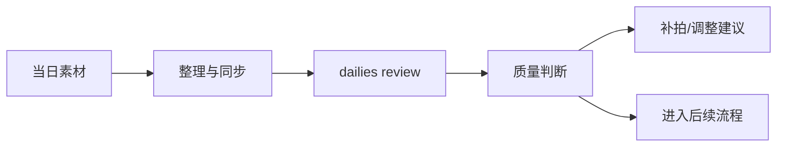
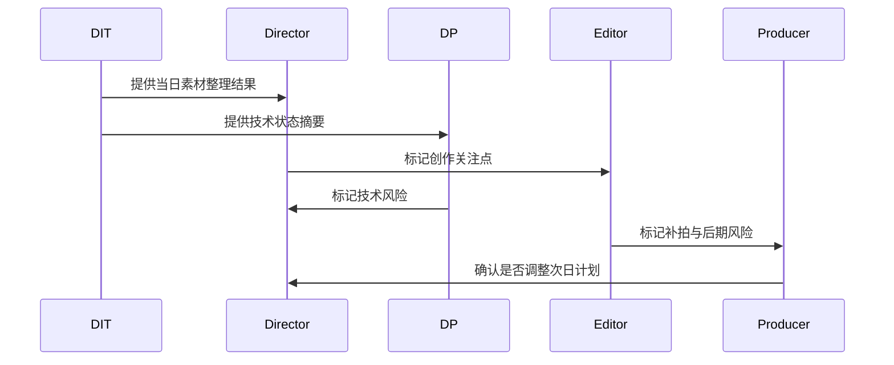
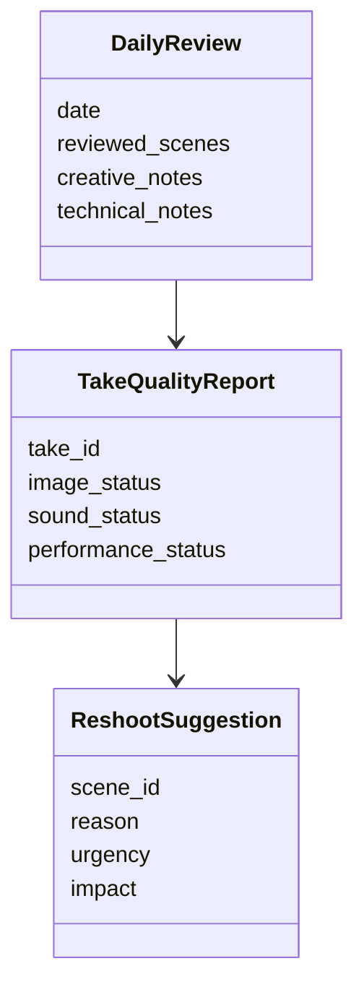

# 44. dailies、出片与审核

这一篇聚焦：

**为什么 dailies 不是简单回看素材，而是拍摄质量控制与后续决策的关键节点。**

---

## 1. dailies 真正解决什么问题

dailies 通常用于确认：

- 素材是否可用
- 表演是否成立
- 焦点、曝光、构图是否稳定
- 声音是否可用
- 是否需要补拍
- 是否存在后期风险

所以它不是“看一眼”，而是质量控制关口。

---

## 2. 一张 dailies 流程图

---

## 3. 海外成熟流程的特点

海外成熟工业体系通常更强调：

- dailies review 节奏固定
- 技术与创作双重审核
- 问题尽早暴露
- 与后期团队更早联动

这意味着 dailies 是拍摄与后期之间的重要桥梁。

---

## 4. 国内常见差异

国内项目中，常见情况是：

- 出片节奏受项目体量与流程成熟度影响较大
- 某些项目更依赖导演与摄影核心判断
- 技术审核与创作审核有时分离不清
- 当素材管理不系统时，问题追踪困难

这意味着平台需要支持“素材质量 + 决策建议”的双重输出。

---

## 5. 一张时序图

---

## 6. 与 DeerFlow 的落地映射

可以设计：

- dailies-review subagent
- editor subagent
- `DailyReview` / `TakeQualityReport` / `ReshootSuggestion` 对象
- dailies artifacts

---

## 7. 一张类图

---

## 8. 第一版实现建议

第一版建议先支持：

- 当日素材质量摘要
- 技术风险摘要
- 创作风险摘要
- 补拍建议
- 次日计划影响提示

---

## 9. 为什么 dailies 是平台化关键节点

因为它是“拍摄完成”与“是否真的可用”之间的判断层。

没有这一层，平台就无法形成质量闭环。

---

## 10. 这一篇最重要的结论

### 结论一
dailies 是拍摄质量控制与后续决策的关键节点，而不是简单回看素材。

### 结论二
国内外差异的关键，在于 dailies 是否形成固定节奏、双重审核和问题追踪机制。

### 结论三
导演智能体平台应当把 dailies 建模成质量对象、风险对象和补拍建议对象。