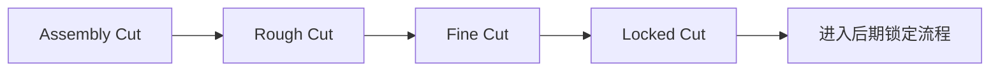
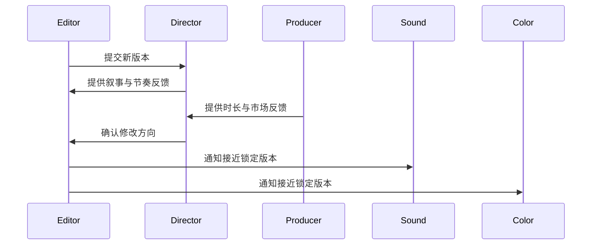
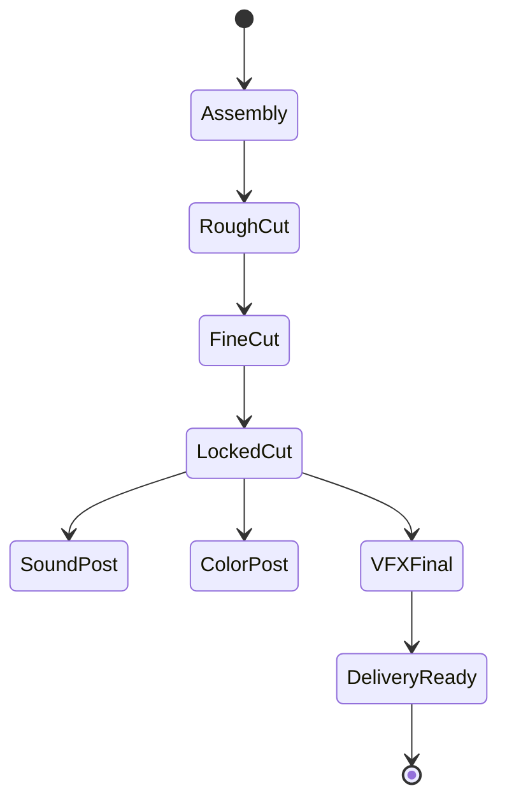

# 45. 剪辑流程与版本推进

这一篇聚焦：

**为什么剪辑不是把素材拼起来，而是通过版本推进不断重构叙事。**

---

## 1. 剪辑流程的本质

剪辑通常不是一次完成，而是经历：

- assembly cut
- rough cut
- fine cut
- locked cut

每一版都在回答不同问题：

- 素材是否完整
- 叙事是否成立
- 节奏是否成立
- 情绪是否成立
- 是否可以进入后续声音、调色、VFX 锁定流程

---

## 2. 一张版本推进图

---

## 3. 海外成熟流程的特点

海外成熟工业体系通常更强调：

- 版本命名规范
- review notes 结构化
- 与声音、调色、VFX 的锁定边界清晰
- 版本回退与比较机制稳定

这意味着剪辑流程更容易被系统化管理。

---

## 4. 国内常见差异

国内项目中，常见情况是：

- 剪辑与导演反馈往返更频繁
- 某些项目在送审前仍有较多结构调整
- 版本记录可能分散在文件夹、聊天记录、口头沟通中

这意味着平台必须支持“版本对象 + 审核意见 + 锁定状态”。

---

## 5. 一张时序图

---

## 6. 与 DeerFlow 的落地映射

可以设计：

- editor subagent
- post-supervisor subagent
- `EditVersion` / `ReviewNote` / `LockStatus` 对象
- 版本比较 artifacts

---

## 7. 一张状态图

---

## 8. 第一版实现建议

第一版建议先支持：

- 剪辑版本记录
- review notes 结构化记录
- 锁定状态标记
- 版本差异摘要
- 后续部门依赖提示

---

## 9. 为什么版本推进是后期核心能力

因为后期不是单次产出，而是多轮判断与收敛。

版本推进能力，决定了后期是否可控。

---

## 10. 这一篇最重要的结论

### 结论一
剪辑流程本质上是通过版本推进不断重构叙事。

### 结论二
国内外差异的关键，在于版本管理、review notes 和锁定边界是否清晰。

### 结论三
导演智能体平台应当把剪辑流程建模成版本对象、审核对象和锁定状态机。