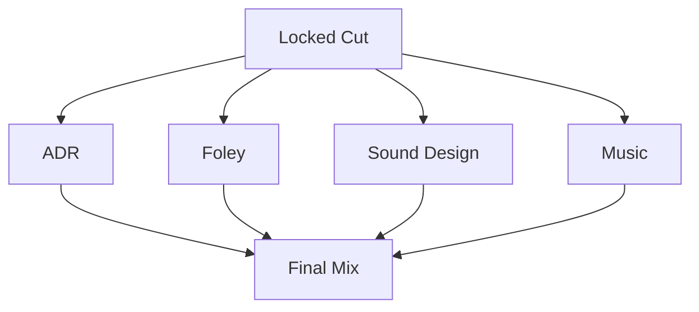
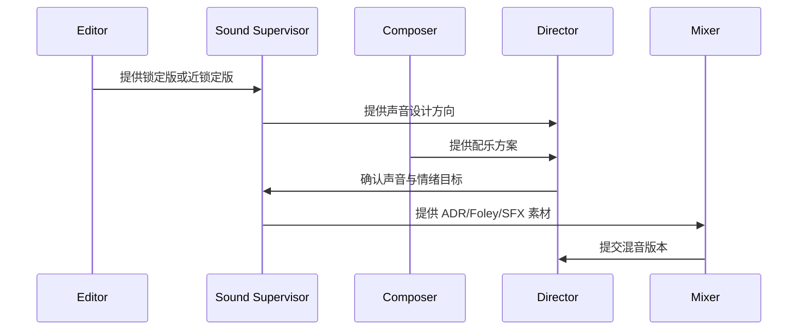
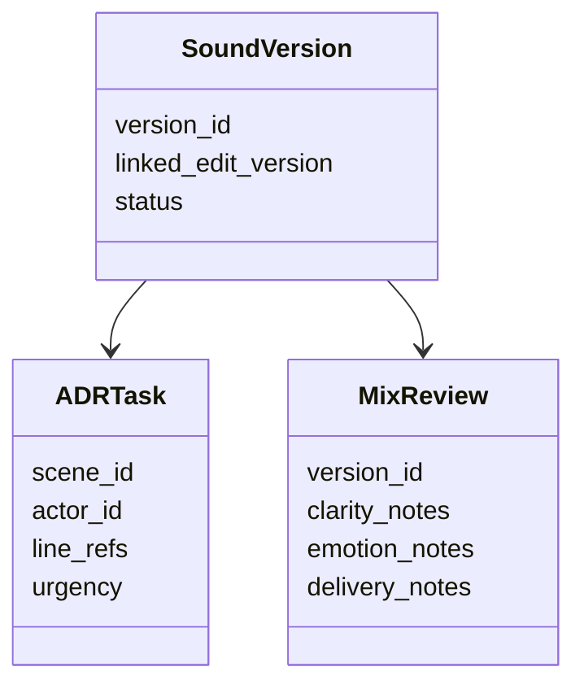

# 46. 配音、配乐、音效协同

这一篇聚焦：

**为什么声音后期不是补充层，而是重新塑造叙事与情绪的重要系统。**

---

## 1. 声音后期真正解决什么问题

声音后期通常包括：

- ADR / 配音
- Foley
- sound design
- ambience
- music
- final mix

它们共同决定：

- 情绪强度
- 空间感
- 节奏感
- 信息清晰度
- 观众沉浸感

---

## 2. 一张声音协同图

---

## 3. 海外成熟流程的特点

海外成熟工业体系通常更强调：

- locked cut 后再大规模进入声音后期
- stem 管理清晰
- 声音 review 节奏固定
- 与发行格式联动明确

这意味着声音后期更容易形成标准化交付链。

---

## 4. 国内常见差异

国内项目中，常见情况是：

- 某些项目在剪辑仍变动时就开始声音工作
- ADR 与对白修订可能交织进行
- 声音版本与画面版本同步难度较高

这意味着平台需要支持“声音版本与画面版本联动”。

---

## 5. 一张时序图

---

## 6. 与 DeerFlow 的落地映射

可以设计：

- sound-supervisor subagent
- music-planning subagent
- `SoundVersion` / `ADRTask` / `MixReview` 对象
- 声音版本 artifacts

---

## 7. 一张类图

---

## 8. 第一版实现建议

第一版建议先支持：

- ADR 任务清单
- 声音风险摘要
- 配乐方向摘要
- 混音 review notes
- 声画版本关联

---

## 9. 为什么声音后期对平台化很关键

因为声音后期天然涉及多版本、多部门、多轮 review。

这正是智能体平台最适合承接的复杂协同场景之一。

---

## 10. 这一篇最重要的结论

### 结论一
声音后期不是补充层，而是重新塑造叙事与情绪的重要系统。

### 结论二
国内外差异的关键，在于声音版本是否与画面版本形成稳定联动。

### 结论三
导演智能体平台应当把声音后期建模成版本对象、任务对象和 review 流程。

---

---

<!-- movie-doc-nav:start -->
## 文档导航

- 总入口：[README.md](./README.md)
- 阅读地图：[00-reading-map.md](./00-reading-map.md)
- 所在分组：37-51 拍摄执行、后期与发行
- 上一篇：[45. 剪辑流程与版本推进](./45-editing-workflow-and-versioning.md)
- 下一篇：[47. 调色流程与视觉统一](./47-color-grading-and-visual-consistency.md)

### 同组文档
- [37. principal photography 现场组织](./37-principal-photography-operations.md)
- [38. call sheet 与每日拍摄计划](./38-call-sheet-and-daily-plan.md)
- [39. 助理导演调度系统](./39-assistant-director-dispatch-system.md)
- [40. 进度控制与成本控制](./40-progress-and-cost-control.md)
- [41. 现场问题升级与决策机制](./41-on-set-escalation-and-decision-making.md)
- [42. 演员表演指导与导演反馈](./42-performance-direction-and-feedback.md)
- [43. 摄影、灯光、录音、视效现场协同](./43-on-set-collaboration-camera-light-sound-vfx.md)
- [44. dailies、出片与审核](./44-dailies-output-and-review.md)
- [45. 剪辑流程与版本推进](./45-editing-workflow-and-versioning.md)
- 46. 配音、配乐、音效协同（当前）
- [47. 调色流程与视觉统一](./47-color-grading-and-visual-consistency.md)
- [48. VFX 后期协同与交付](./48-vfx-post-collaboration-and-delivery.md)
- [49. 审核流、版本管理与发布包](./49-review-flow-versioning-and-release-package.md)
- [50. 宣发素材与发行协同](./50-marketing-assets-and-distribution-collaboration.md)
- [51. 项目复盘与知识沉淀](./51-project-retrospective-and-knowledge-capture.md)
<!-- movie-doc-nav:end -->
