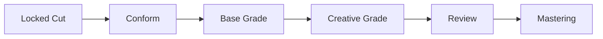
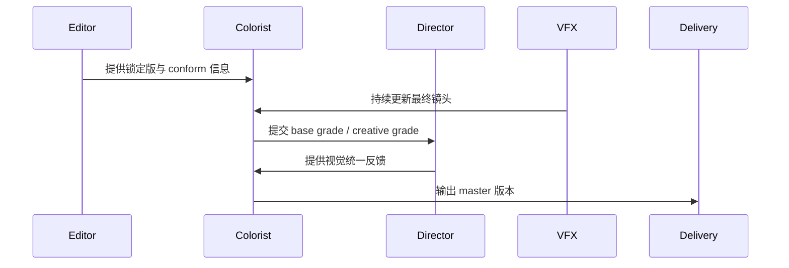
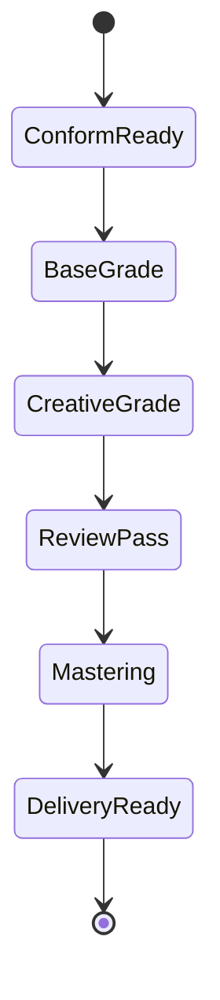

# 47. 调色流程与视觉统一

这一篇聚焦：

**为什么调色不是最后美化，而是把整部影片的视觉语言真正统一起来。**

---

## 1. 调色真正解决什么问题

调色通常解决：

- 镜头间一致性
- 场景间情绪差异
- 角色视觉状态
- 时间与空间感
- 最终放映格式适配

所以调色不是“加滤镜”，而是视觉叙事控制。

---

## 2. 一张调色流程图

---

## 3. 海外成熟流程的特点

大型海外项目中，调色往往与 VFX 更新、立体版本、HDR / SDR 多版本母版联动。例如《Avatar: Fire and Ash》需要扩展 theatrical mastering pipeline，并处理多种离散 theatrical masters，这说明调色已经深度嵌入复杂交付链路。[来源：Cinematography World, Avatar: Fire and Ash graded with DaVinci Resolve Studio](https://www.cinematography.world/avatar-fire-and-ash-graded-with-davinci-resolve-studio/)

---

## 4. 国内常见差异

国内项目中，常见情况是：

- 调色与送审、发行时间窗口耦合更紧
- 某些项目在后期末端才集中处理视觉统一
- 多版本母版管理能力参差不齐

这意味着平台需要支持“调色版本 + 审核版本 + 交付版本”的联动。

---

## 5. 一张时序图

---

## 6. 与 DeerFlow 的落地映射

可以设计：

- color-supervisor subagent
- post-supervisor subagent
- `ColorVersion` / `LookRule` / `MasterPackage` 对象
- 调色 review artifacts

---

## 7. 一张状态图

---

## 8. 第一版实现建议

第一版建议先支持：

- 调色 review notes
- 视觉统一性检查
- 多版本母版记录
- VFX 更新影响提示
- 交付版本摘要

---

## 9. 为什么调色模块对大规模制作重要

因为项目越大，镜头来源越复杂，视觉漂移风险越高。

调色流程本质上是最后一道视觉统一控制层。

---

## 10. 这一篇最重要的结论

### 结论一
调色不是最后美化，而是整部影片视觉语言的统一控制层。

### 结论二
国内外差异的关键，在于多版本母版、VFX 更新与交付链路是否被系统化管理。

### 结论三
导演智能体平台应当把调色流程建模成版本、规则和交付状态。