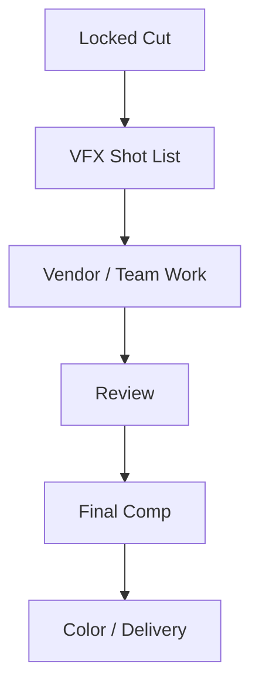
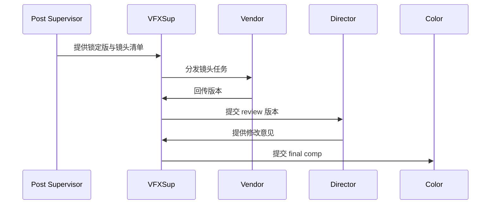
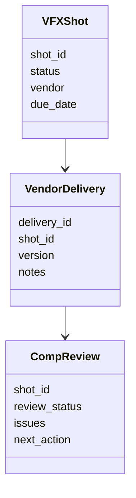

# 48. VFX 后期协同与交付

这一篇聚焦：

**为什么 VFX 后期不是单独做特效，而是一个跨镜头、跨版本、跨交付的协同系统。**

---

## 1. VFX 后期真正解决什么问题

VFX 后期通常涉及：

- 镜头跟踪
- 合成
- set extension
- crowd / environment work
- cleanup
- stereo / HDR / 多版本适配

所以它不是“做几个特效镜头”，而是深度嵌入后期版本链路。

---

## 2. 一张 VFX 协同图

---

## 3. 海外成熟流程的特点

大型海外项目中，VFX shot 数量可能极高，且与调色、立体版本、HDR 母版联动紧密。相关案例显示，复杂项目会通过脚本化工具与多轮 review 来跟上 VFX 更新节奏与多版本交付需求。[来源：Cinematography World, Avatar: Fire and Ash graded with DaVinci Resolve Studio](https://www.cinematography.world/avatar-fire-and-ash-graded-with-davinci-resolve-studio/)

---

## 4. 国内常见差异

国内项目中，常见情况是：

- VFX 供应商协同链更分散
- 版本回传与 review 节奏不稳定
- 送审与发行时间窗口会压缩 VFX 收尾时间

这意味着平台需要支持“镜头级状态 + 供应商协同 + 交付追踪”。

---

## 5. 一张时序图

---

## 6. 与 DeerFlow 的落地映射

可以设计：

- vfx-supervisor subagent
- vendor-coordinator subagent
- `VFXShot` / `VendorDelivery` / `CompReview` 对象
- VFX 版本 artifacts

---

## 7. 一张类图

---

## 8. 第一版实现建议

第一版建议先支持：

- VFX 镜头清单
- 镜头状态追踪
- review notes 结构化记录
- 供应商回传记录
- 交付风险提示

---

## 9. 为什么 VFX 模块是平台化试金石

因为它天然包含：

- 多团队协同
- 多版本推进
- 高返工风险
- 高交付复杂度

如果平台能把 VFX 管好，说明它已经具备较强的工业化能力。

---

## 10. 这一篇最重要的结论

### 结论一
VFX 后期本质上是跨镜头、跨版本、跨交付的协同系统。

### 结论二
国内外差异的关键，在于镜头级状态、供应商协同和交付链路是否被系统化管理。

### 结论三
导演智能体平台应当把 VFX 后期建模成镜头对象、版本对象和供应商协同流程。