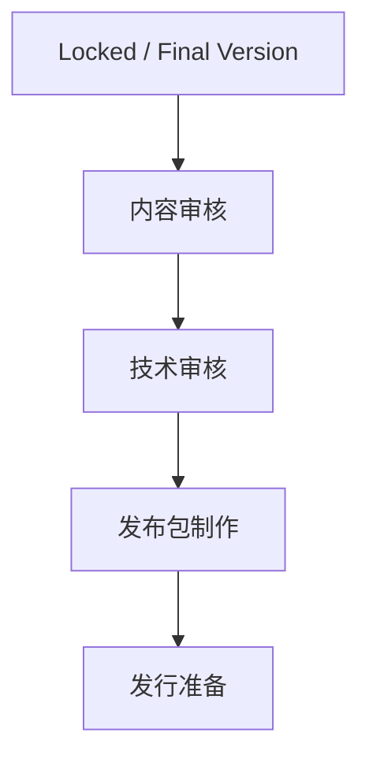
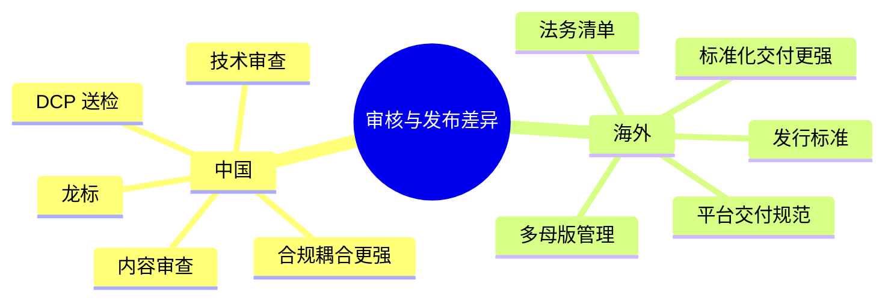
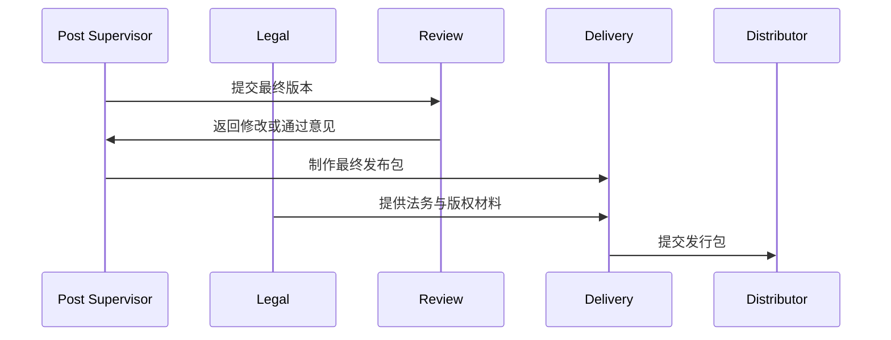
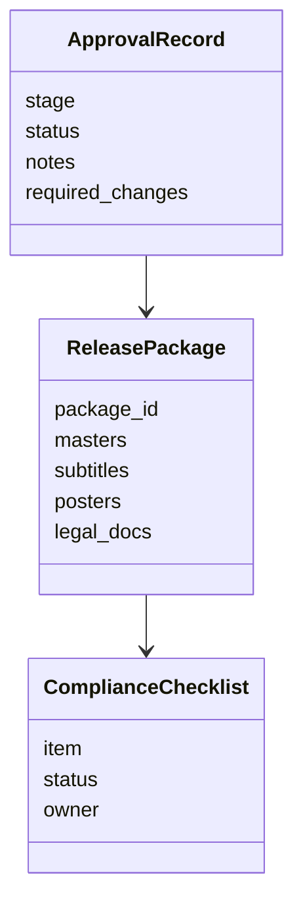

# 49. 审核流、版本管理与发布包

这一篇聚焦：

**为什么电影项目的最后阶段，不是“导出一个文件”，而是审核、版本、技术交付与合规的综合系统。**

---

## 1. 审核流真正解决什么问题

审核流通常解决：

- 内容是否通过
- 技术是否达标
- 版本是否一致
- 交付包是否完整
- 是否满足发行与放映要求

所以审核流不是附属流程，而是影片能否真正进入市场的最后控制层。

---

## 2. 一张审核流总图

---

## 3. 中国流程的现实特点

中国电影项目在发行前，通常需要经历较明确的送审与公映许可流程。公开资料显示，影片在通过内容审查后，需要申领公映许可证片头（龙标）；之后还需提交最终放映母版等材料进行技术审查，DCP 母版是关键交付物之一。[来源：国家电影局《电影片送审须知》](https://www.chinafilm.gov.cn/bsfw/bsxz/201910/t20191008_23978.html)；[来源：历信科技《电影送审完整流程指南》](https://www.dcpmk.com/news/film-submission-guide)

这意味着中国项目的后期与发行之间，审核流和技术交付耦合更紧。

---

## 4. 海外成熟流程的特点

海外成熟工业体系中，虽然不一定存在与“龙标”完全对应的统一流程，但通常会更强调：

- 发行版本规范
- 多格式母版管理
- 法务与版权清单
- 平台 / 院线交付标准

这意味着海外流程更偏“交付标准化”，中国流程更偏“审核 + 交付双重耦合”。

---

## 5. 一张国内外差异图

---

## 6. 一张时序图

---

## 7. 与 DeerFlow 的落地映射

可以设计：

- review-coordinator subagent
- delivery-manager subagent
- `ApprovalRecord` / `ReleasePackage` / `ComplianceChecklist` 对象
- 审核与交付 artifacts

---

## 8. 一张类图

---

## 9. 第一版实现建议

第一版建议先支持：

- 审核状态记录
- 修改意见记录
- 发布包清单
- 合规检查清单
- 交付完成状态

---

## 10. 这一篇最重要的结论

### 结论一
审核流、版本管理与发布包，本质上是影片进入市场前的最后控制系统。

### 结论二
国内外差异的关键，在于中国更强调审核与交付耦合，海外更强调标准化交付与多版本管理。

### 结论三
导演智能体平台应当把审核、合规、发布包建模成对象、状态和清单流程。