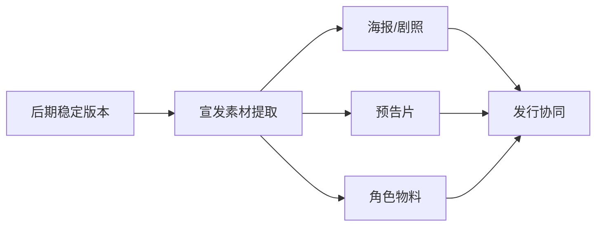
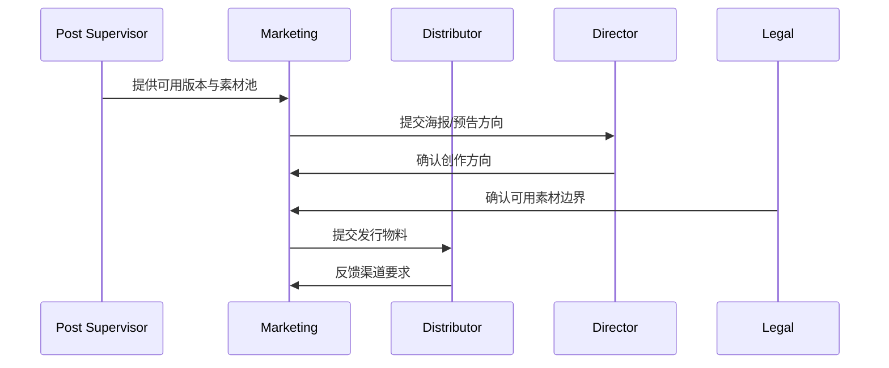
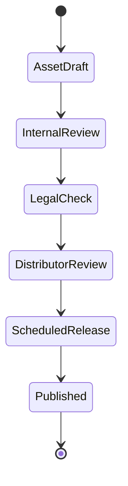

# 50. 宣发素材与发行协同

这一篇聚焦：

**为什么宣发不是电影做完之后才开始，而是从后期末端就要与版本、素材、发行节奏联动。**

---

## 1. 宣发素材真正依赖什么

宣发素材通常依赖：

- 稳定版本画面
- 海报与剧照
- trailer / teaser
- 角色物料
- 发行节奏
- 平台与院线要求

所以宣发不是独立部门的末端工作，而是与后期版本推进强耦合。

---

## 2. 一张协同图

---

## 3. 海外成熟流程的特点

海外成熟工业体系通常更强调：

- marketing deliverables 清单化
- trailer / poster / social assets 的版本管理
- 与发行窗口、平台规范联动

这意味着宣发素材更容易被纳入交付系统。

---

## 4. 国内常见差异

国内项目中，常见情况是：

- 宣发节奏与送审、定档、平台窗口耦合更紧
- 某些物料会在版本尚未完全稳定时提前制作
- 物料修改频率较高

这意味着平台需要支持“素材版本 + 发行节点 + 审核状态”的联动。

---

## 5. 一张时序图

---

## 6. 与 DeerFlow 的落地映射

可以设计：

- marketing-coordinator subagent
- distribution-coordinator subagent
- `MarketingAsset` / `TrailerVersion` / `ReleaseWindow` 对象
- 宣发物料 artifacts

---

## 7. 一张状态图

---

## 8. 第一版实现建议

第一版建议先支持：

- 宣发素材清单
- trailer / poster 版本记录
- 发行窗口记录
- 渠道要求摘要
- 素材可用性检查

---

## 9. 为什么宣发协同是平台化最后一公里

因为它把“影片完成”真正转化为“市场进入”。

如果平台不能管理宣发与发行协同，就无法覆盖电影项目的完整生命周期。

---

## 10. 这一篇最重要的结论

### 结论一
宣发素材与发行协同，本质上是后期版本、市场节奏与渠道要求的联动系统。

### 结论二
国内外差异的关键，在于宣发是否与审核、定档、渠道交付形成稳定联动。

### 结论三
导演智能体平台应当把宣发与发行建模成素材对象、版本对象和发布状态机。

---

---

<!-- movie-doc-nav:start -->
## 文档导航

- 总入口：[README.md](./README.md)
- 阅读地图：[00-reading-map.md](./00-reading-map.md)
- 所在分组：37-51 拍摄执行、后期与发行
- 上一篇：[49. 审核流、版本管理与发布包](./49-review-flow-versioning-and-release-package.md)
- 下一篇：[51. 项目复盘与知识沉淀](./51-project-retrospective-and-knowledge-capture.md)

### 同组文档
- [37. principal photography 现场组织](./37-principal-photography-operations.md)
- [38. call sheet 与每日拍摄计划](./38-call-sheet-and-daily-plan.md)
- [39. 助理导演调度系统](./39-assistant-director-dispatch-system.md)
- [40. 进度控制与成本控制](./40-progress-and-cost-control.md)
- [41. 现场问题升级与决策机制](./41-on-set-escalation-and-decision-making.md)
- [42. 演员表演指导与导演反馈](./42-performance-direction-and-feedback.md)
- [43. 摄影、灯光、录音、视效现场协同](./43-on-set-collaboration-camera-light-sound-vfx.md)
- [44. dailies、出片与审核](./44-dailies-output-and-review.md)
- [45. 剪辑流程与版本推进](./45-editing-workflow-and-versioning.md)
- [46. 配音、配乐、音效协同](./46-adr-music-sound-collaboration.md)
- [47. 调色流程与视觉统一](./47-color-grading-and-visual-consistency.md)
- [48. VFX 后期协同与交付](./48-vfx-post-collaboration-and-delivery.md)
- [49. 审核流、版本管理与发布包](./49-review-flow-versioning-and-release-package.md)
- 50. 宣发素材与发行协同（当前）
- [51. 项目复盘与知识沉淀](./51-project-retrospective-and-knowledge-capture.md)
<!-- movie-doc-nav:end -->
