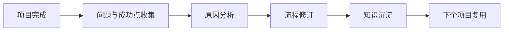
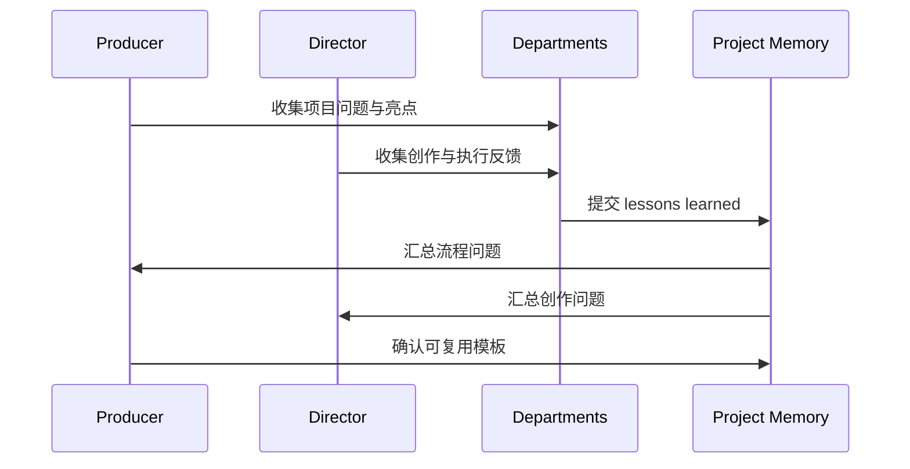
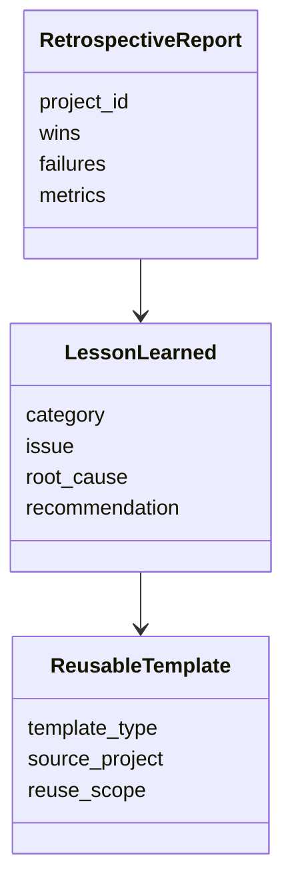
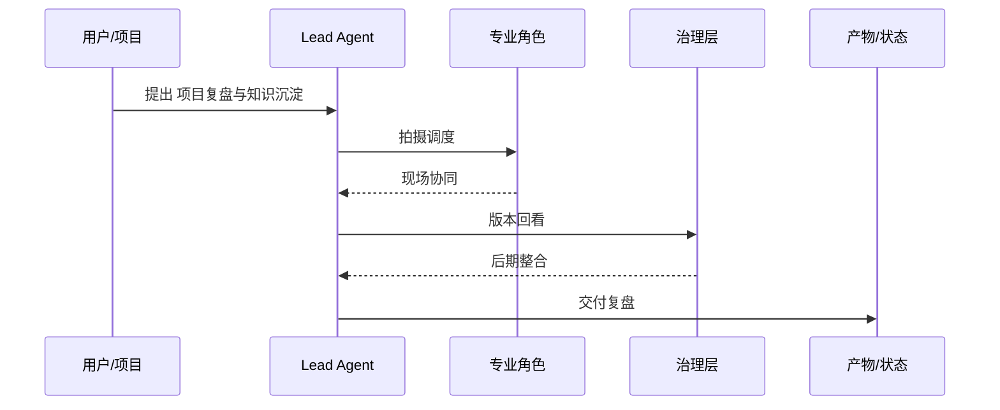

# 51. 项目复盘与知识沉淀

这一篇聚焦：

**为什么电影项目结束后最容易被忽略的，不是素材，而是经验。**

---

## 1. 复盘真正要解决什么问题

项目复盘不是简单总结“哪里做得好、哪里做得差”，而是要回答：

- 哪些决策有效
- 哪些问题反复出现
- 哪些流程造成返工
- 哪些资源配置最浪费
- 哪些经验可以复用到下一部片

行业复盘方法普遍强调：post-mortem 的关键不是列清单，而是分析为什么会发生，并把经验转成可复用流程。[来源：CG Wire, How To Perform a Post-mortem of Your Finished Production](https://blog.cg-wire.com/how-to-perform-a-post-mortem-of-your-finished-production/)

---

## 2. 一张复盘闭环图

---

## 3. 海外成熟流程的特点

海外成熟工业体系通常更强调：

- 项目 post-mortem
- 部门级 lessons learned
- 版本与流程数据留存
- 可复用模板沉淀

这意味着复盘不是情绪表达，而是流程资产化。

---

## 4. 国内常见差异

国内项目中，常见情况是：

- 项目结束后团队快速解散
- 经验停留在核心成员脑中
- 复盘更多是口头交流
- 文档化与知识库沉淀不足

这意味着平台必须把“经验”从人脑中抽出来，变成结构化资产。

---

## 5. 一张时序图

---

## 6. 与 DeerFlow 的落地映射

可以设计：

- retrospective subagent
- knowledge-curator subagent
- `LessonLearned` / `RetrospectiveReport` / `ReusableTemplate` 对象
- 项目记忆 artifacts

---

## 7. 一张类图

---

## 8. 第一版实现建议

第一版建议先支持：

- 项目复盘摘要
- 问题分类
- 根因分析摘要
- 可复用模板清单
- 项目记忆归档

---

## 9. 为什么这一步对平台化最关键

因为没有知识沉淀，平台每个项目都要重新学一遍。

而真正的平台化，必须建立在“项目越做越聪明”的基础上。

---

## 10. 这一篇最重要的结论

### 结论一
项目复盘的核心不是总结，而是把经验转成可复用流程资产。

### 结论二
国内外差异的关键，在于复盘是否被制度化、文档化、知识库化。

### 结论三
导演智能体平台应当把复盘与知识沉淀建模成对象、模板和项目记忆系统。

---

<!-- movie-visuals:start -->
## 补充图示：换一种视角看本篇

下面这张 时序图 把“项目复盘与知识沉淀”再压缩成一个可快速扫读的结构视图，便于先抓关键关系，再回到正文细节。

<!-- movie-visuals:end -->

<!-- movie-doc-nav:start -->
## 文档导航

- 总入口：[README.md](./README.md)
- 阅读地图：[00-reading-map.md](./00-reading-map.md)
- 所在分组：37-51 拍摄执行、后期与发行
- 上一篇：[50. 宣发素材与发行协同](./50-marketing-assets-and-distribution-collaboration.md)
- 下一篇：[52. 导演主智能体设计](./52-director-lead-agent-design.md)

### 同组文档
- [37. principal photography 现场组织](./37-principal-photography-operations.md)
- [38. call sheet 与每日拍摄计划](./38-call-sheet-and-daily-plan.md)
- [39. 助理导演调度系统](./39-assistant-director-dispatch-system.md)
- [40. 进度控制与成本控制](./40-progress-and-cost-control.md)
- [41. 现场问题升级与决策机制](./41-on-set-escalation-and-decision-making.md)
- [42. 演员表演指导与导演反馈](./42-performance-direction-and-feedback.md)
- [43. 摄影、灯光、录音、视效现场协同](./43-on-set-collaboration-camera-light-sound-vfx.md)
- [44. dailies、出片与审核](./44-dailies-output-and-review.md)
- [45. 剪辑流程与版本推进](./45-editing-workflow-and-versioning.md)
- [46. 配音、配乐、音效协同](./46-adr-music-sound-collaboration.md)
- [47. 调色流程与视觉统一](./47-color-grading-and-visual-consistency.md)
- [48. VFX 后期协同与交付](./48-vfx-post-collaboration-and-delivery.md)
- [49. 审核流、版本管理与发布包](./49-review-flow-versioning-and-release-package.md)
- [50. 宣发素材与发行协同](./50-marketing-assets-and-distribution-collaboration.md)
- 51. 项目复盘与知识沉淀（当前）
<!-- movie-doc-nav:end -->
