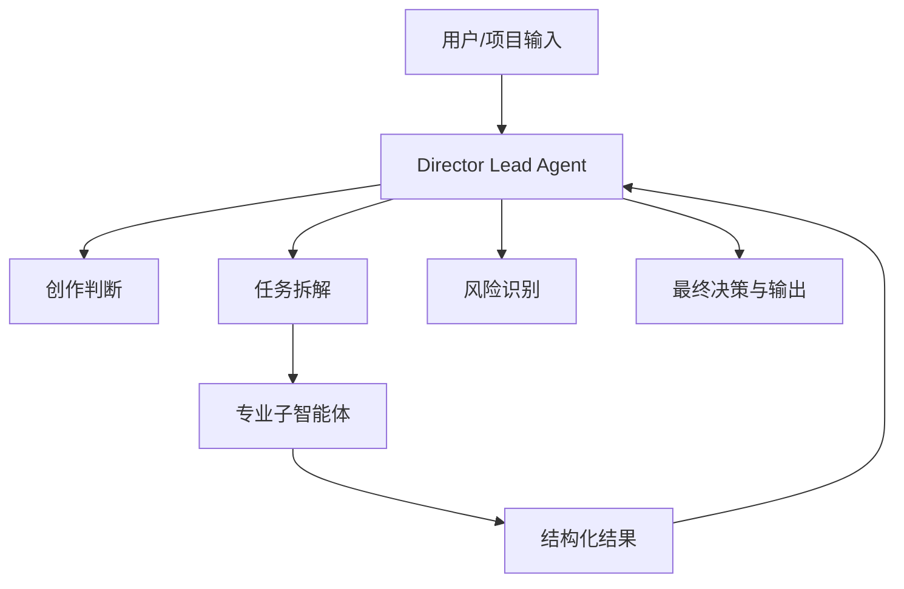
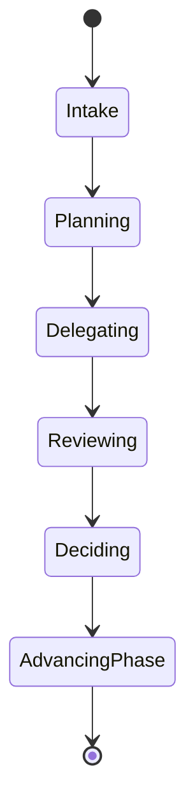
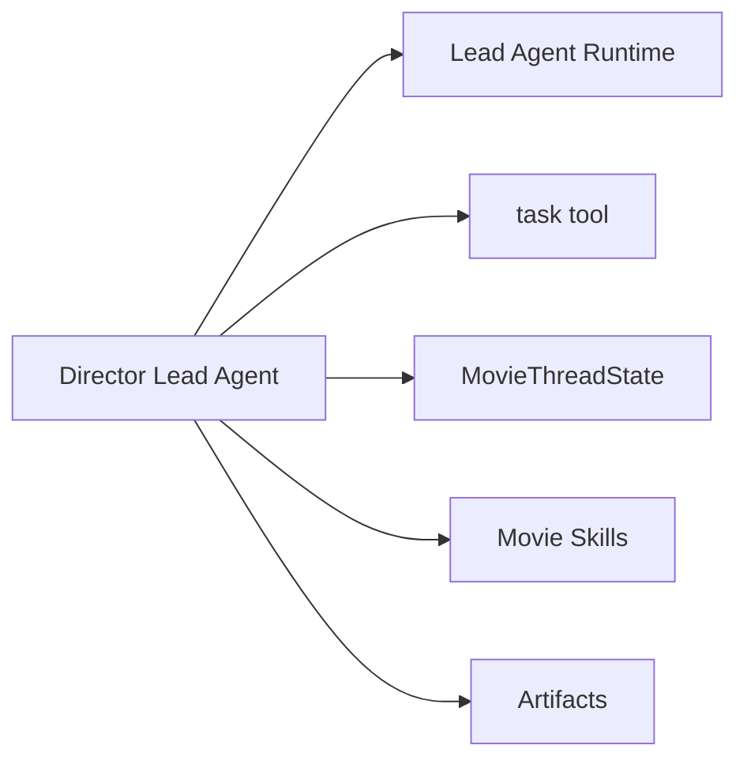

# 52. 导演主智能体设计

这一篇聚焦：

**导演主智能体为什么不是“最会生成内容的模型”，而是整个电影项目的总控中枢。**

---

## 1. 导演主智能体的核心职责

导演主智能体至少要承担：

- 理解项目目标
- 统一创作方向
- 拆解阶段任务
- 委派给专业子智能体
- 汇总结果并做最终判断
- 管理风险、变更与阶段推进

它不是单一创作器，而是总控层。

---

## 2. 一张主智能体总控图

---

## 3. 海外与国内差异对主智能体设计的启示

海外成熟工业流程更强调：

- 职责边界清晰
- 文档驱动协作
- review 与 lock 边界清晰

国内项目更常见：

- 即时协调更多
- 经验型判断更多
- 压缩式推进更常见

所以导演主智能体必须同时支持：

- 标准化流程模式
- 压缩式快速决策模式

---

## 4. 一张状态图

---

## 5. 与 DeerFlow 的落地映射

当前 DeerFlow 中，导演主智能体最自然的落点就是：

- Lead Agent
- 自定义 agent 配置
- `task` 工具委派
- `ThreadState` / `MovieThreadState`
- skills / memory / artifacts

---

## 6. 一张源码映射图

---

## 7. 主智能体的输入输出契约

### 输入
- 项目目标
- 剧本或需求
- 当前阶段状态
- 历史决策与记忆

### 输出
- 阶段目标
- 子任务委派
- 风险摘要
- 决策结果
- 结构化产物

---

## 8. 第一版实现建议

第一版建议先支持：

- 项目目标理解
- 前期任务拆解
- 子智能体委派
- 结果汇总
- 风险与下一步建议

---

## 9. 为什么导演主智能体必须是“总控”而不是“万能”

因为电影制作不是一个人做完所有事，而是一个总控系统协调多个专业系统。

主智能体越像“万能执行器”，越容易失去可扩展性。

---

## 10. 这一篇最重要的结论

### 结论一
导演主智能体的本质是电影项目的总控中枢，而不是单一生成器。

### 结论二
国内外差异要求它同时支持标准化流程与压缩式快速决策。

### 结论三
在 DeerFlow 中，Lead Agent + task + state + skills 的组合天然适合承接导演主智能体。

---

---

<!-- movie-doc-nav:start -->
## 文档导航

- 总入口：[README.md](./README.md)
- 阅读地图：[00-reading-map.md](./00-reading-map.md)
- 所在分组：52-60 智能体角色设计
- 上一篇：[51. 项目复盘与知识沉淀](./51-project-retrospective-and-knowledge-capture.md)
- 下一篇：[53. 制片子智能体设计](./53-producer-subagent-design.md)

### 同组文档
- 52. 导演主智能体设计（当前）
- [53. 制片子智能体设计](./53-producer-subagent-design.md)
- [54. 剧本分析子智能体设计](./54-script-analyst-subagent-design.md)
- [55. 分镜子智能体设计](./55-storyboard-subagent-design.md)
- [56. 预算子智能体设计](./56-budget-subagent-design.md)
- [57. 排期子智能体设计](./57-scheduling-subagent-design.md)
- [58. 选角子智能体设计](./58-casting-subagent-design.md)
- [59. 场地子智能体设计](./59-location-subagent-design.md)
- [60. 摄影语言子智能体设计](./60-cinematography-language-subagent-design.md)
<!-- movie-doc-nav:end -->
