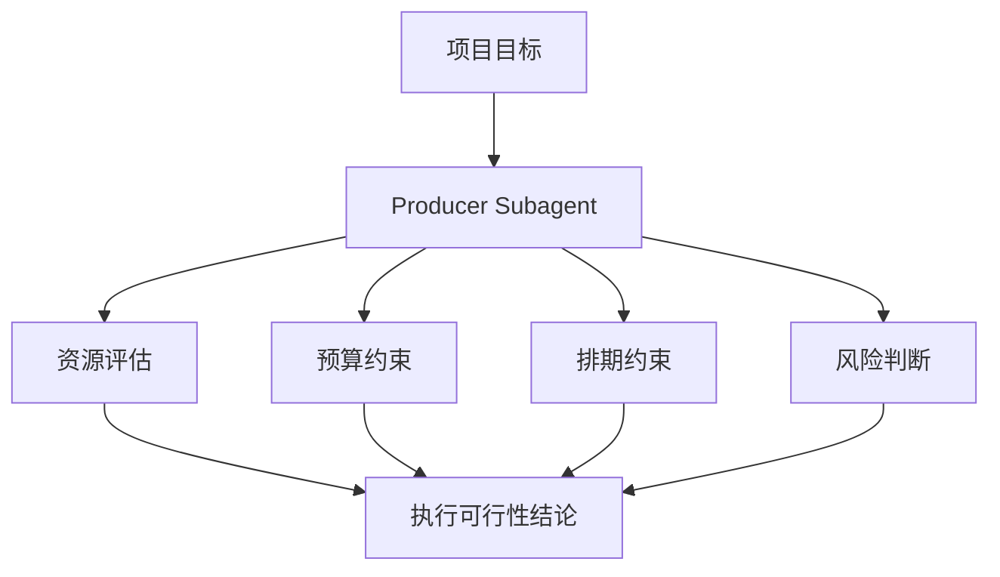
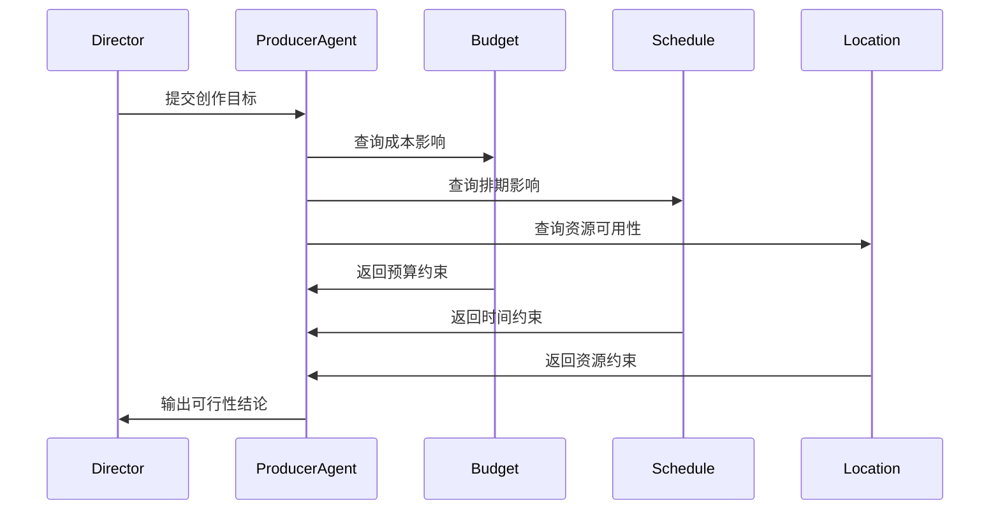
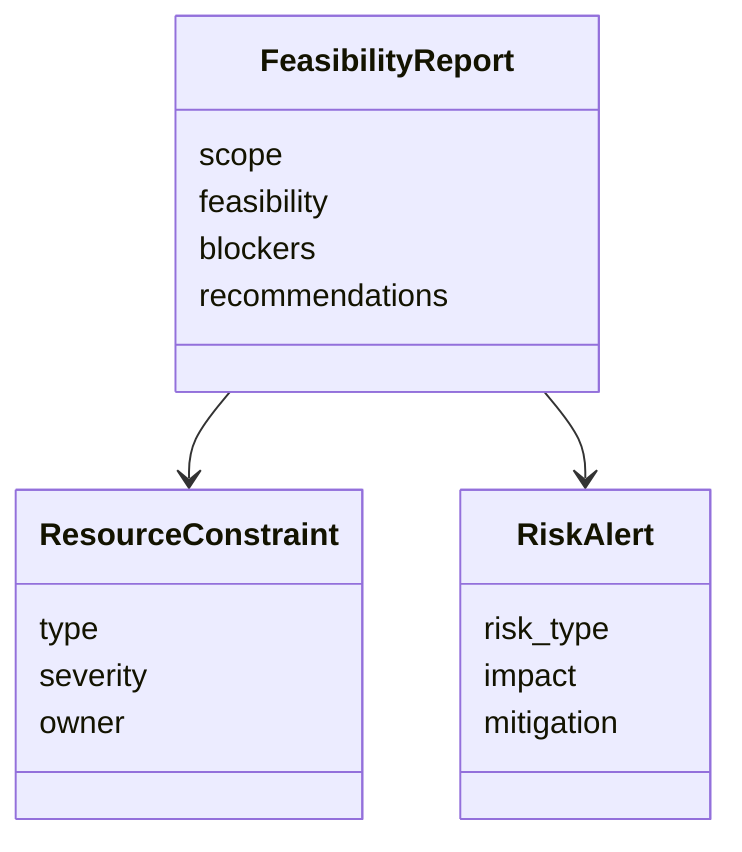
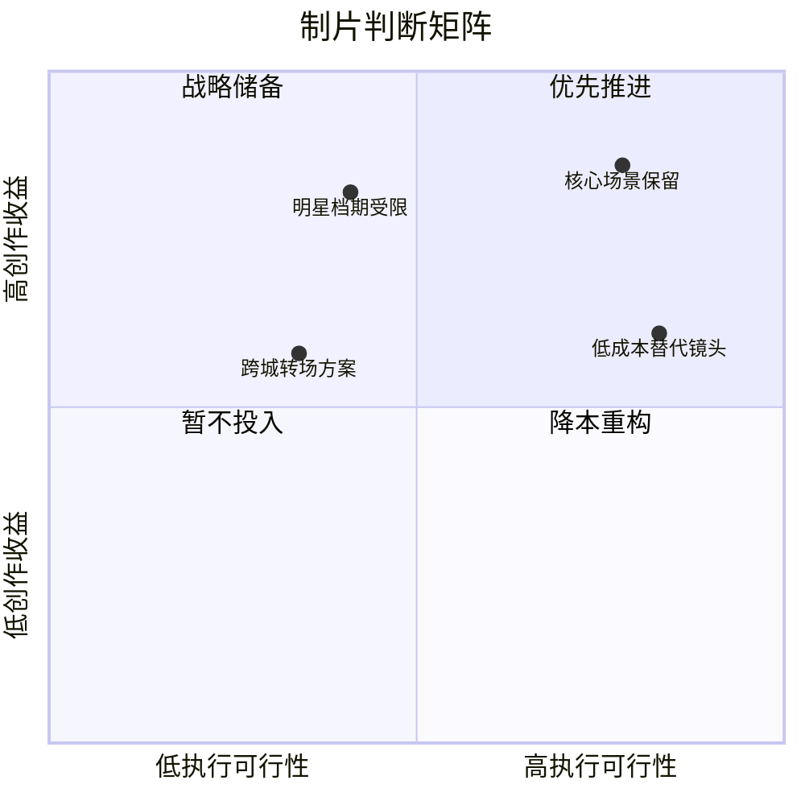
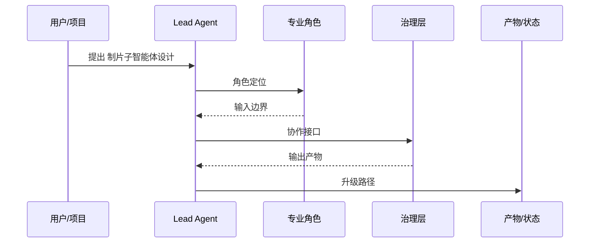

# 53. 制片子智能体设计

这一篇聚焦：

**为什么制片子智能体不是“预算助手”，而是资源、风险、执行可行性的核心判断层。**

---

## 1. 制片子智能体的核心职责

制片子智能体至少要承担：

- 资源可行性评估
- 预算与排期联动判断
- 场地、演员、设备等资源协调
- 风险识别与升级建议
- 阶段推进中的执行约束判断

---

## 2. 一张职责图

---

## 3. 海外与国内差异

海外成熟工业体系中，producer / line producer / production manager 的职责边界更清晰。

国内项目中，制片往往需要承担更多即时协调与压缩式推进任务。

所以制片子智能体必须支持：

- 标准化资源评估
- 快速应急协调
- 风险升级

---

## 4. 一张时序图

---

## 5. 与 DeerFlow 的落地映射

可以设计：

- producer subagent
- `FeasibilityReport` / `ResourceConstraint` / `RiskAlert` 对象
- 资源协调 artifacts

---

## 6. 一张类图

---

## 7. 第一版实现建议

第一版建议先支持：

- 可行性摘要
- 预算/排期/资源约束摘要
- 风险升级建议
- 替代方案建议
- 执行优先级建议

---

## 8. 为什么制片子智能体是平台落地关键

因为很多创作方案不是“不能想”，而是“能不能执行”。

制片子智能体就是把创作目标翻译成执行现实的关键层。

如果把制片判断放到可行性矩阵里看，会更容易理解它为什么是“创作目标”和“执行约束”之间的调和器：

---

## 9. 这一篇最重要的结论

### 结论一
制片子智能体的本质是资源、风险与执行可行性的判断层。

### 结论二
国内外差异要求它同时支持标准化评估与压缩式应急协调。

### 结论三
在导演智能体平台中，producer subagent 应当是最核心的专业角色之一。

---

<!-- movie-visuals:start -->
## 补充图示：换一种视角看本篇

下面这张 时序图 把“制片子智能体设计”再压缩成一个可快速扫读的结构视图，便于先抓关键关系，再回到正文细节。

<!-- movie-visuals:end -->

<!-- movie-doc-nav:start -->
## 文档导航

- 总入口：[README.md](./README.md)
- 阅读地图：[00-reading-map.md](./00-reading-map.md)
- 所在分组：52-60 智能体角色设计
- 上一篇：[52. 导演主智能体设计](./52-director-lead-agent-design.md)
- 下一篇：[54. 剧本分析子智能体设计](./54-script-analyst-subagent-design.md)

### 同组文档
- [52. 导演主智能体设计](./52-director-lead-agent-design.md)
- 53. 制片子智能体设计（当前）
- [54. 剧本分析子智能体设计](./54-script-analyst-subagent-design.md)
- [55. 分镜子智能体设计](./55-storyboard-subagent-design.md)
- [56. 预算子智能体设计](./56-budget-subagent-design.md)
- [57. 排期子智能体设计](./57-scheduling-subagent-design.md)
- [58. 选角子智能体设计](./58-casting-subagent-design.md)
- [59. 场地子智能体设计](./59-location-subagent-design.md)
- [60. 摄影语言子智能体设计](./60-cinematography-language-subagent-design.md)
<!-- movie-doc-nav:end -->
