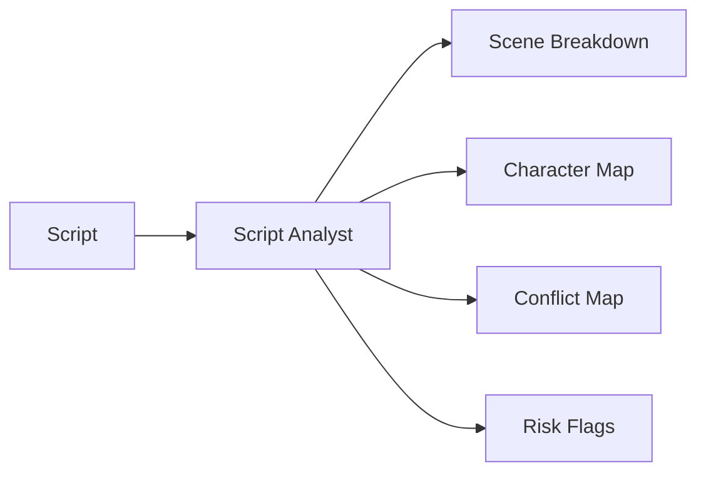
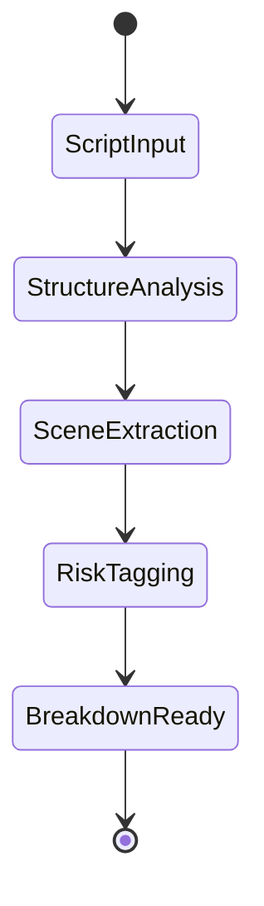
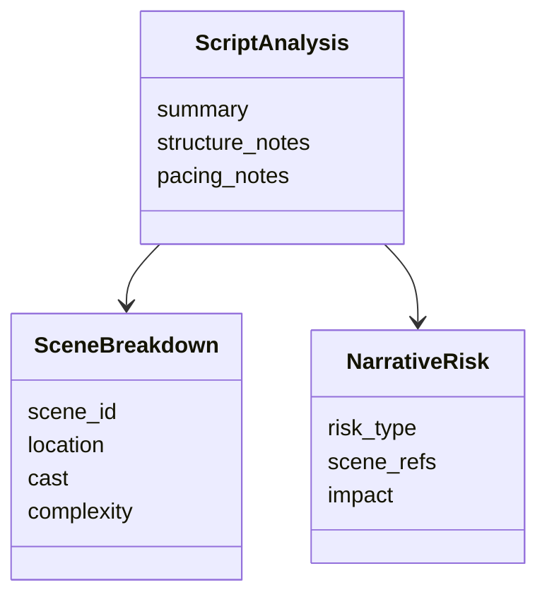
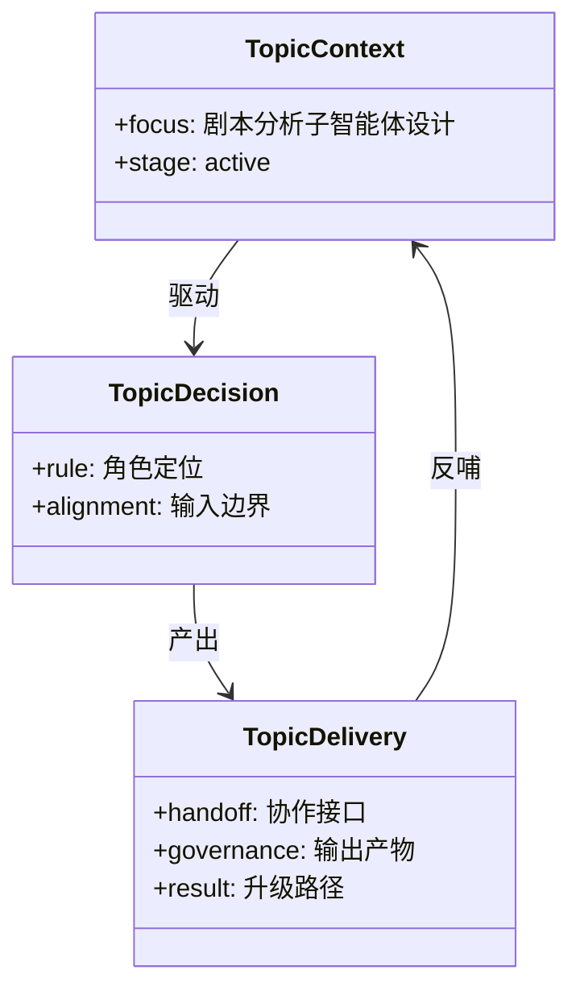

# 54. 剧本分析子智能体设计

这一篇聚焦：

**为什么剧本分析子智能体不是“总结剧情”，而是把叙事文本转成生产结构与风险结构。**

---

## 1. 剧本分析子智能体的核心职责

它至少要承担：

- 剧本结构拆解
- 场景与角色提取
- 冲突与节奏识别
- 高成本 / 高复杂度场景识别
- breakdown 上游输入生成

---

## 2. 一张职责图

---

## 3. 海外与国内差异

海外成熟流程中，script breakdown 更早进入预算、排期、选角与场地流程。

国内项目中，剧本分析有时更依赖导演、编剧、制片的经验协同。

所以剧本分析子智能体必须支持：

- 标准化 breakdown
- 风险标记
- 与导演语言兼容的解释输出

---

## 4. 一张状态图

---

## 5. 与 DeerFlow 的落地映射

可以设计：

- script-analyst subagent
- `ScriptAnalysis` / `SceneBreakdown` / `NarrativeRisk` 对象
- 剧本分析 artifacts

---

## 6. 一张类图

---

## 7. 第一版实现建议

第一版建议先支持：

- 剧本摘要
- 场景列表
- 角色列表
- 高复杂度场景标记
- 风险摘要

---

## 8. 为什么它是第一批必须落地的子智能体

因为几乎所有前期流程都依赖剧本分析结果。

没有它，预算、排期、分镜、选角、勘景都缺少稳定输入。

---

## 9. 这一篇最重要的结论

### 结论一
剧本分析子智能体的本质，是把叙事文本转成生产结构与风险结构。

### 结论二
国内外差异的关键，在于 breakdown 是否被标准化并前置进入生产流程。

### 结论三
在导演智能体平台中，script-analyst 应当是第一批优先落地的核心子智能体。

---

<!-- movie-visuals:start -->
## 补充图示：换一种视角看本篇

下面这张 类图 把“剧本分析子智能体设计”再压缩成一个可快速扫读的结构视图，便于先抓关键关系，再回到正文细节。

<!-- movie-visuals:end -->

<!-- movie-doc-nav:start -->
## 文档导航

- 总入口：[README.md](./README.md)
- 阅读地图：[00-reading-map.md](./00-reading-map.md)
- 所在分组：52-60 智能体角色设计
- 上一篇：[53. 制片子智能体设计](./53-producer-subagent-design.md)
- 下一篇：[55. 分镜子智能体设计](./55-storyboard-subagent-design.md)

### 同组文档
- [52. 导演主智能体设计](./52-director-lead-agent-design.md)
- [53. 制片子智能体设计](./53-producer-subagent-design.md)
- 54. 剧本分析子智能体设计（当前）
- [55. 分镜子智能体设计](./55-storyboard-subagent-design.md)
- [56. 预算子智能体设计](./56-budget-subagent-design.md)
- [57. 排期子智能体设计](./57-scheduling-subagent-design.md)
- [58. 选角子智能体设计](./58-casting-subagent-design.md)
- [59. 场地子智能体设计](./59-location-subagent-design.md)
- [60. 摄影语言子智能体设计](./60-cinematography-language-subagent-design.md)
<!-- movie-doc-nav:end -->
