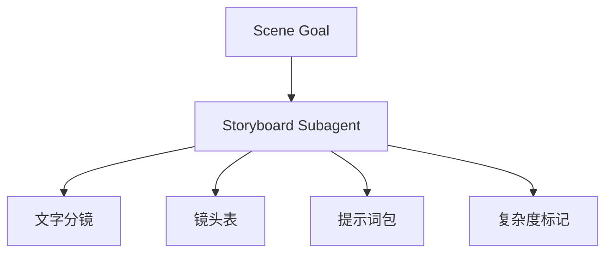
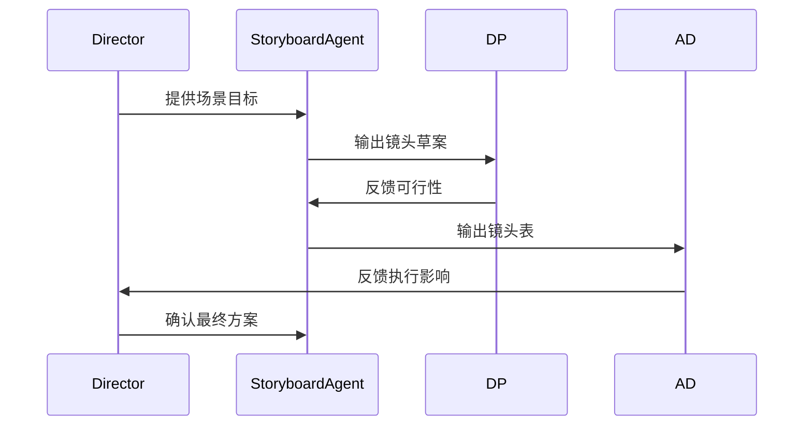
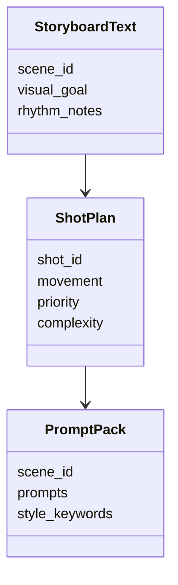

# 55. 分镜子智能体设计

这一篇聚焦：

**为什么分镜子智能体不是“画图工具”，而是把导演意图转成镜头组织与执行结构的关键角色。**

---

## 1. 分镜子智能体的核心职责

它至少要承担：

- 场景级文字分镜生成
- 镜头表草案生成
- 分镜提示词包生成
- 镜头复杂度标记
- 导演确认点标记

---

## 2. 一张职责图

---

## 3. 海外与国内差异

海外成熟流程中，storyboard、shot list、previs 的衔接更紧密。

国内项目中，分镜更常与导演个人表达、摄影沟通、现场调整交织在一起。

所以分镜子智能体必须支持：

- 创作表达模式
- 执行组织模式
- 压缩式快速出稿模式

---

## 4. 一张时序图

---

## 5. 与 DeerFlow 的落地映射

可以设计：

- storyboard subagent
- `StoryboardText` / `ShotPlan` / `PromptPack` 对象
- 分镜 artifacts

---

## 6. 一张类图

---

## 7. 第一版实现建议

第一版建议先支持：

- 场景级文字分镜
- 镜头表草案
- 分镜提示词包
- 镜头复杂度标记
- 导演确认点

---

## 8. 为什么它是导演智能体平台的关键桥梁

因为它把导演语言从抽象创意，转成可执行镜头结构。

这一步是创作与执行之间最关键的桥梁之一。

---

## 9. 这一篇最重要的结论

### 结论一
分镜子智能体的本质，是把导演意图转成镜头组织与执行结构。

### 结论二
国内外差异的关键，在于分镜是否前置进入技术预演与执行组织。

### 结论三
在导演智能体平台中，storyboard subagent 应当同时服务创作表达与执行组织。