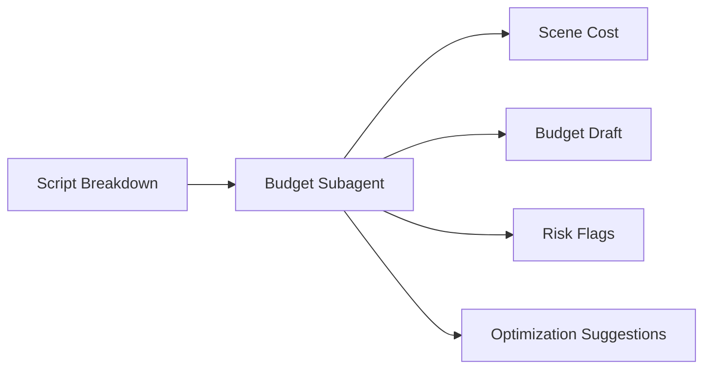
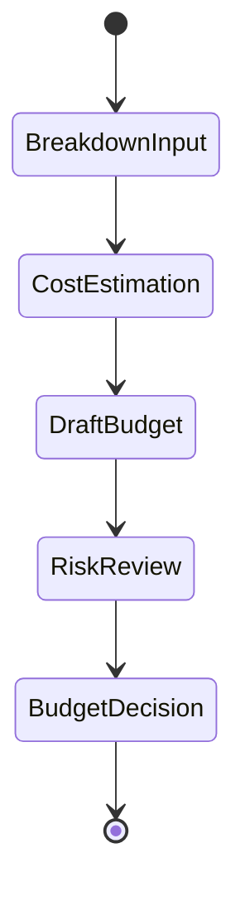
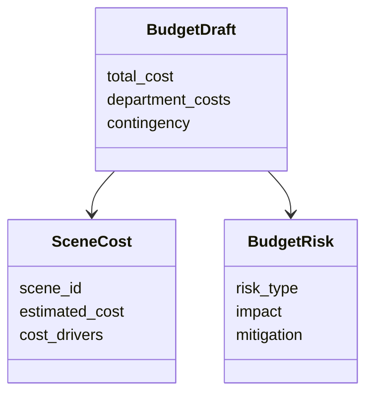

# 56. 预算子智能体设计

这一篇聚焦：

**为什么预算子智能体不是“算钱工具”，而是把创作目标转成成本边界与资源结构的关键角色。**

---

## 1. 预算子智能体的核心职责

它至少要承担：

- 场景级成本估算
- 总预算草案生成
- 高成本场景识别
- 预算与排期联动分析
- 成本优化建议

---

## 2. 一张职责图

---

## 3. 海外与国内差异

行业实践普遍强调，预算与排期必须一起编制，拍摄天数变化会直接改变成本结构。[来源：Saturation, Film Budget 101](https://saturation.io/blog/film-budget-101-the-key-to-successful-film-production)

海外成熟流程中，这种联动更制度化；国内项目中，预算调整往往更频繁、更受压缩工期与资源窗口影响。

---

## 4. 一张状态图

---

## 5. 与 DeerFlow 的落地映射

可以设计：

- budget-controller subagent
- `SceneCost` / `BudgetDraft` / `BudgetRisk` 对象
- 预算 artifacts

---

## 6. 一张类图

---

## 7. 第一版实现建议

第一版建议先支持：

- 场景级成本估算
- 总预算草案
- 高成本场景标记
- 风险摘要
- 优化建议

---

## 8. 为什么预算子智能体必须尽早落地

因为预算不是后置约束，而是从前期开始就决定项目边界。

越晚建立预算能力，返工成本越高。

---

## 9. 这一篇最重要的结论

### 结论一
预算子智能体的本质，是把创作目标转成成本边界与资源结构。

### 结论二
国内外差异的关键，在于预算与排期联动是否被制度化。

### 结论三
在导演智能体平台中，budget subagent 应当是第一批核心专业角色之一。

---

---

<!-- movie-doc-nav:start -->
## 文档导航

- 总入口：[README.md](./README.md)
- 阅读地图：[00-reading-map.md](./00-reading-map.md)
- 所在分组：52-60 智能体角色设计
- 上一篇：[55. 分镜子智能体设计](./55-storyboard-subagent-design.md)
- 下一篇：[57. 排期子智能体设计](./57-scheduling-subagent-design.md)

### 同组文档
- [52. 导演主智能体设计](./52-director-lead-agent-design.md)
- [53. 制片子智能体设计](./53-producer-subagent-design.md)
- [54. 剧本分析子智能体设计](./54-script-analyst-subagent-design.md)
- [55. 分镜子智能体设计](./55-storyboard-subagent-design.md)
- 56. 预算子智能体设计（当前）
- [57. 排期子智能体设计](./57-scheduling-subagent-design.md)
- [58. 选角子智能体设计](./58-casting-subagent-design.md)
- [59. 场地子智能体设计](./59-location-subagent-design.md)
- [60. 摄影语言子智能体设计](./60-cinematography-language-subagent-design.md)
<!-- movie-doc-nav:end -->
