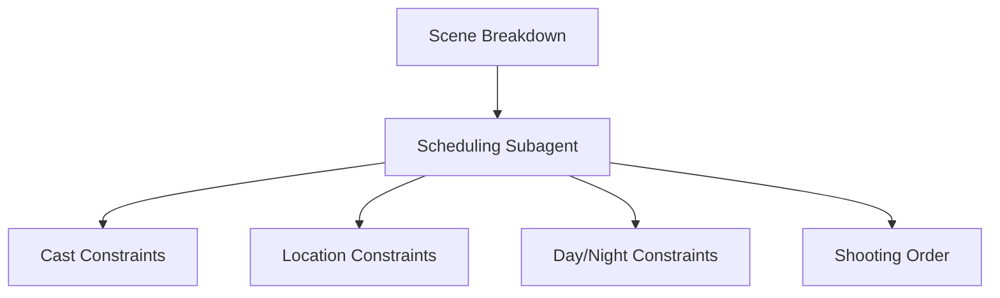
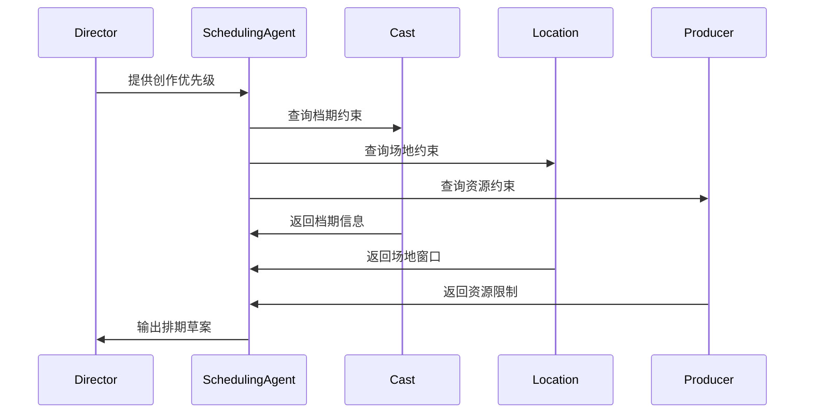
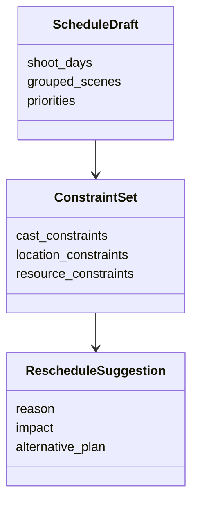

# 57. 排期子智能体设计

这一篇聚焦：

**为什么排期子智能体不是“排日历”，而是把创作目标转成执行顺序与约束优化的关键角色。**

---

## 1. 排期子智能体的核心职责

它至少要承担：

- 场景分组
- 演员档期约束处理
- 场地约束处理
- 日夜与资源约束处理
- 拍摄顺序优化

---

## 2. 一张职责图

---

## 3. 海外与国内差异

海外成熟流程中，stripboard、DOOD、schedule revision 更标准化。

国内项目中，排期更容易受到：

- 压缩工期
- 场地窗口
- 演员档期波动
- 临时调整

影响。

所以排期子智能体必须支持：

- 标准化排期
- 快速重排
- 风险预警

---

## 4. 一张时序图

---

## 5. 与 DeerFlow 的落地映射

可以设计：

- scheduling subagent
- `ScheduleDraft` / `ConstraintSet` / `RescheduleSuggestion` 对象
- 排期 artifacts

---

## 6. 一张类图

---

## 7. 第一版实现建议

第一版建议先支持：

- 场景分组
- 约束摘要
- 初步拍摄顺序建议
- 重排建议
- 风险提示

---

## 8. 为什么排期子智能体是执行层核心

因为它把创作目标真正转成“先拍什么、后拍什么、谁什么时候到场”。

没有排期能力，平台无法进入真实执行层。

---

## 9. 这一篇最重要的结论

### 结论一
排期子智能体的本质，是把创作目标转成执行顺序与约束优化。

### 结论二
国内外差异的关键，在于排期是否标准化、可重排、可预警。

### 结论三
在导演智能体平台中，scheduling subagent 应当是中期执行层的核心角色。