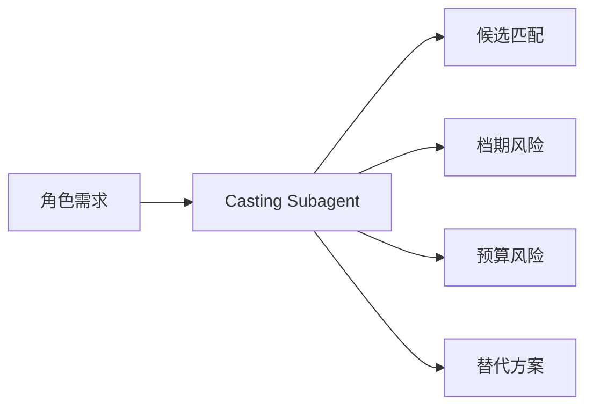
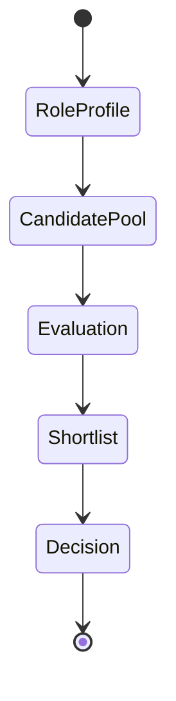
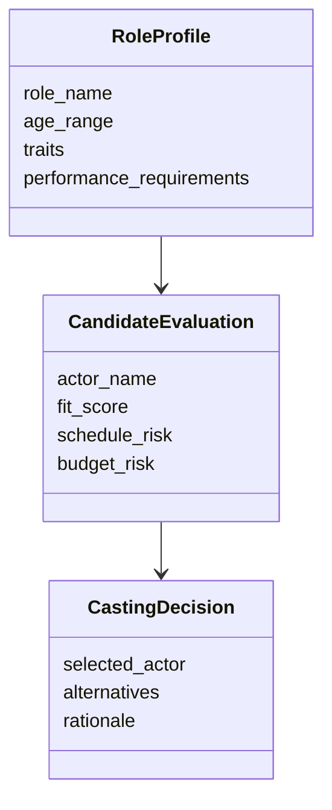

# 58. 选角子智能体设计

这一篇聚焦：

**为什么选角子智能体不是“推荐演员名单”，而是把角色需求转成候选比较、风险判断与决策支持的关键角色。**

---

## 1. 选角子智能体的核心职责

它至少要承担：

- 角色画像生成
- 候选演员匹配
- 档期与预算风险识别
- 替代方案建议
- 决策依据结构化记录

---

## 2. 一张职责图

---

## 3. 海外与国内差异

海外成熟流程中，casting director、试镜流程、档期矩阵更标准化。

国内项目中，选角更容易受到：

- 市场因素
- 档期波动
- 资方偏好
- 宣发策略

影响。

所以选角子智能体必须支持：

- 创作适配
- 市场适配
- 执行适配

---

## 4. 一张状态图

---

## 5. 与 DeerFlow 的落地映射

可以设计：

- casting subagent
- `RoleProfile` / `CandidateEvaluation` / `CastingDecision` 对象
- 选角 artifacts

---

## 6. 一张类图

---

## 7. 第一版实现建议

第一版建议先支持：

- 角色画像
- 候选比较
- 档期风险摘要
- 成本风险摘要
- 替代方案建议

---

## 8. 为什么选角子智能体不能只做“推荐”

因为选角不是搜索问题，而是多目标平衡问题。

平台必须把决策依据结构化，才能真正帮助导演与制片判断。

---

## 9. 这一篇最重要的结论

### 结论一
选角子智能体的本质，是把角色需求转成候选比较、风险判断与决策支持。

### 结论二
国内外差异的关键，在于选角是否被标准化、矩阵化、可追踪。

### 结论三
在导演智能体平台中，casting subagent 应当服务创作、市场与执行三重目标。