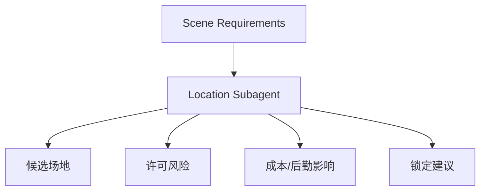
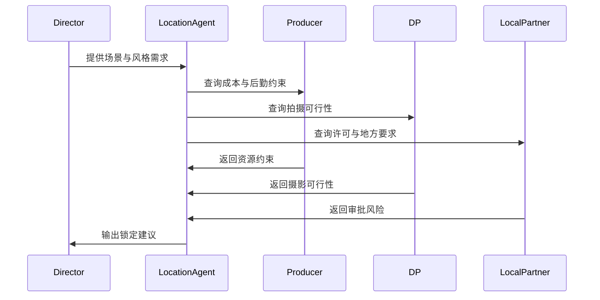
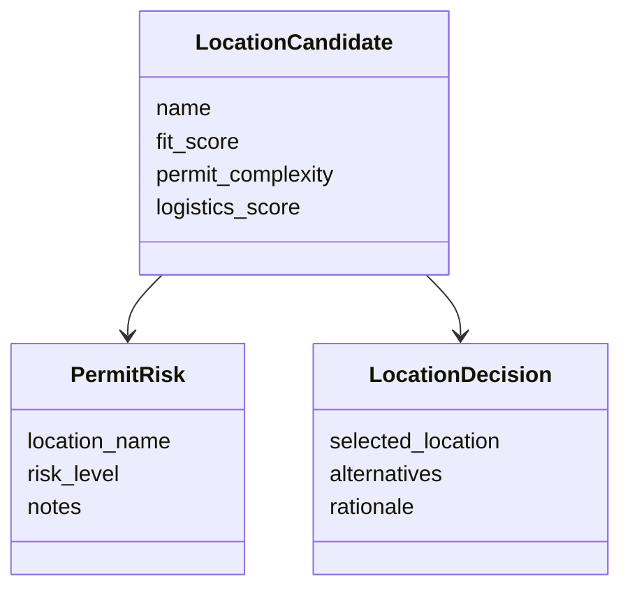
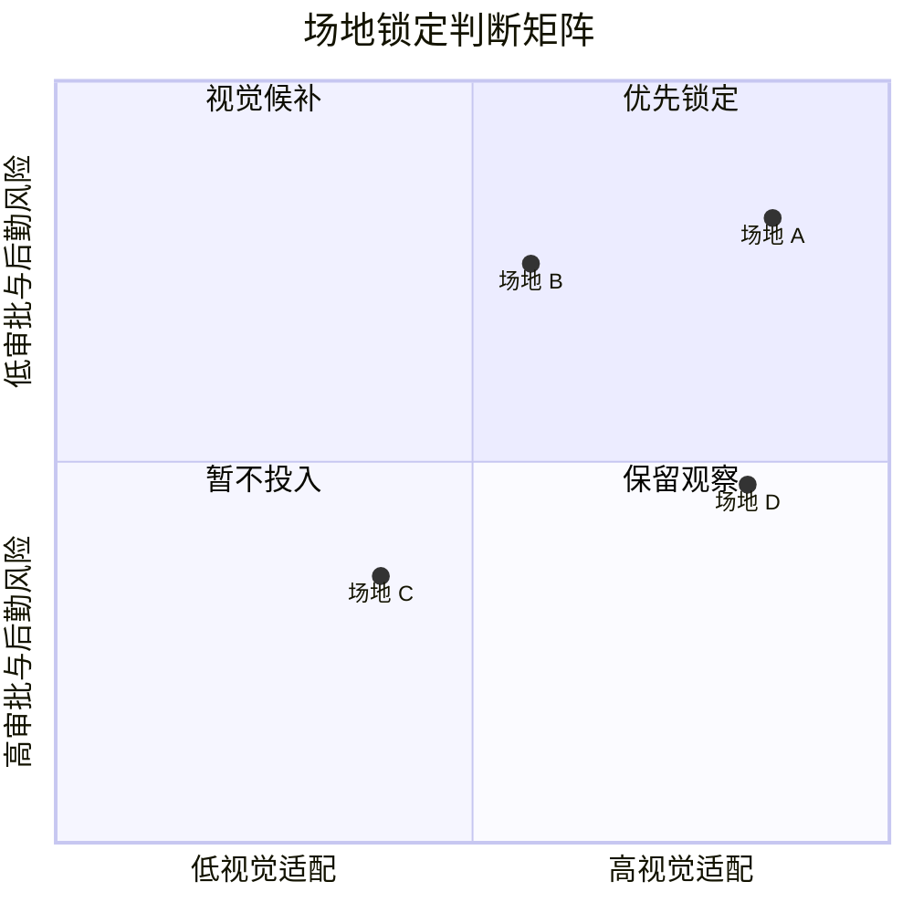
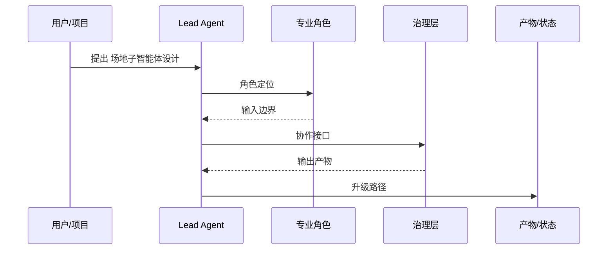

# 59. 场地子智能体设计

这一篇聚焦：

**为什么场地子智能体不是“找地方”，而是把场景需求转成许可、成本、后勤与视觉适配判断的关键角色。**

---

## 1. 场地子智能体的核心职责

它至少要承担：

- 场景需求结构化
- 候选场地匹配
- 许可与时间窗口风险识别
- 成本与后勤影响分析
- 场地锁定建议

---

## 2. 一张职责图

---

## 3. 海外与国内差异

公开资料显示，在中国拍摄时，许可要求会因城市、地点类型、项目属性而变化，公共空间、无人机、敏感地点等往往涉及更复杂审批链，且审批时间不一定符合西方团队预期。[来源：CN Fixer, Film Production Process China](https://cnfixer.com/china/film-production-process-china.html)

这意味着中国项目中的场地子智能体必须更重视：

- 审批链
- 地方协调
- 时间窗口
- 许可不确定性

而海外成熟流程更偏标准化 location management。

---

## 4. 一张时序图

---

## 5. 与 DeerFlow 的落地映射

可以设计：

- location subagent
- `LocationCandidate` / `PermitRisk` / `LocationDecision` 对象
- 场地 artifacts

---

## 6. 一张类图

---

## 7. 第一版实现建议

第一版建议先支持：

- 场景需求摘要
- 候选场地匹配
- 许可风险摘要
- 后勤影响摘要
- 锁定建议

---

## 8. 为什么场地子智能体对中国项目尤其重要

因为中国项目中的场地问题，往往不仅是视觉问题，更是审批、协调、时间窗口问题。

这使它成为非常现实、非常高价值的试点模块。

如果把场地判断放进锁定矩阵里看，会更容易看出为什么视觉适配和审批可行性必须一起考虑：

---

## 9. 这一篇最重要的结论

### 结论一
场地子智能体的本质，是把场景需求转成许可、成本、后勤与视觉适配判断。

### 结论二
国内外差异的关键，在于中国项目更强调审批链、地方协调与时间窗口不确定性。

### 结论三
在导演智能体平台中，location subagent 是最适合真实试点落地的专业角色之一。

---

<!-- movie-visuals:start -->
## 补充图示：换一种视角看本篇

下面这张 时序图 把“场地子智能体设计”再压缩成一个可快速扫读的结构视图，便于先抓关键关系，再回到正文细节。

<!-- movie-visuals:end -->

<!-- movie-doc-nav:start -->
## 文档导航

- 总入口：[README.md](./README.md)
- 阅读地图：[00-reading-map.md](./00-reading-map.md)
- 所在分组：52-60 智能体角色设计
- 上一篇：[58. 选角子智能体设计](./58-casting-subagent-design.md)
- 下一篇：[60. 摄影语言子智能体设计](./60-cinematography-language-subagent-design.md)

### 同组文档
- [52. 导演主智能体设计](./52-director-lead-agent-design.md)
- [53. 制片子智能体设计](./53-producer-subagent-design.md)
- [54. 剧本分析子智能体设计](./54-script-analyst-subagent-design.md)
- [55. 分镜子智能体设计](./55-storyboard-subagent-design.md)
- [56. 预算子智能体设计](./56-budget-subagent-design.md)
- [57. 排期子智能体设计](./57-scheduling-subagent-design.md)
- [58. 选角子智能体设计](./58-casting-subagent-design.md)
- 59. 场地子智能体设计（当前）
- [60. 摄影语言子智能体设计](./60-cinematography-language-subagent-design.md)
<!-- movie-doc-nav:end -->
