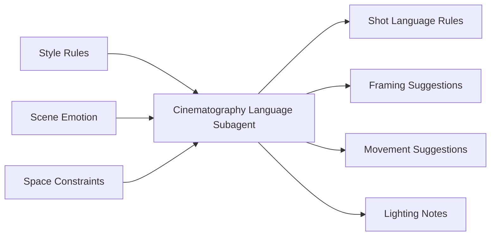
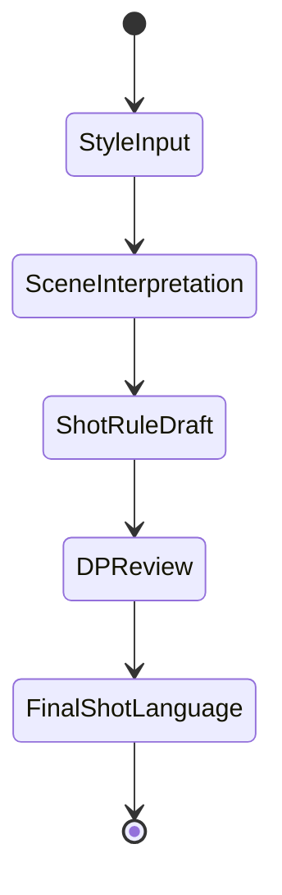
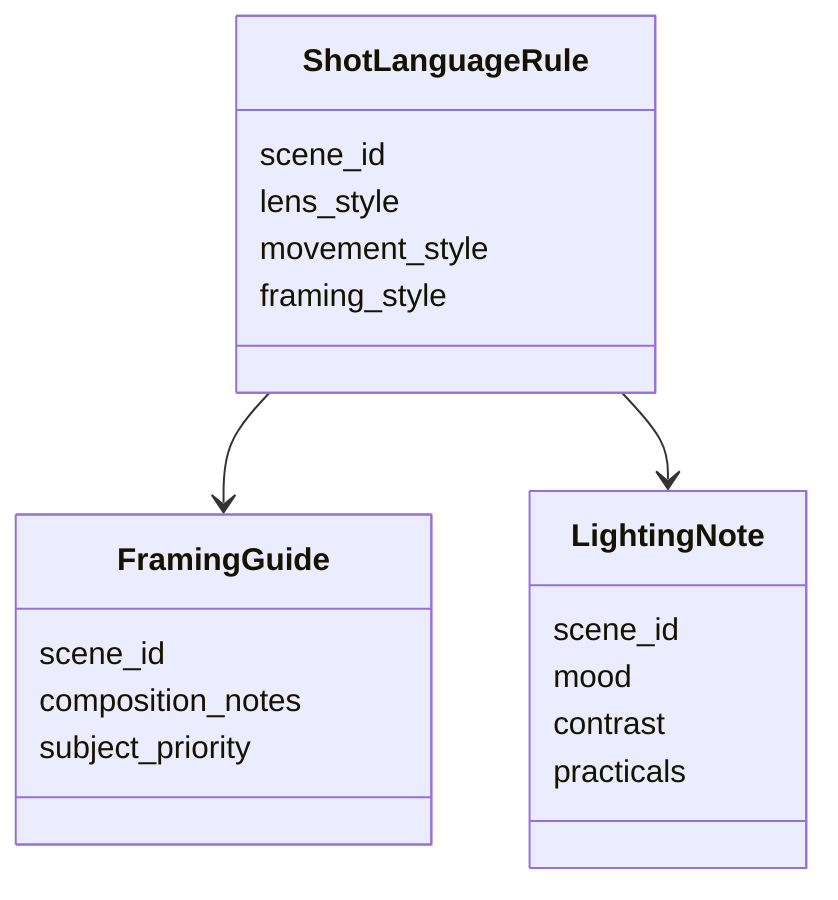

# 60. 摄影语言子智能体设计

这一篇聚焦：

**为什么摄影语言子智能体不是“推荐镜头”，而是把风格、情绪、空间与叙事转成镜头规则的关键角色。**

---

## 1. 摄影语言子智能体的核心职责

它至少要承担：

- 镜头语言规则提炼
- 景别、机位、运动建议
- 光线与构图建议
- 风格一致性检查
- 与分镜、灯光、VFX 的联动建议

---

## 2. 一张职责图

---

## 3. 海外与国内差异

海外成熟流程中，摄影语言更容易通过 lookbook、lens tests、previs、tech scout 被前置固化。

国内项目中，摄影语言常常在导演、摄影指导、现场条件之间动态调整。

所以摄影语言子智能体必须支持：

- 前置规则化
- 现场动态适配
- 风格一致性检查

---

## 4. 一张状态图

---

## 5. 与 DeerFlow 的落地映射

可以设计：

- cinematography-language subagent
- `ShotLanguageRule` / `FramingGuide` / `LightingNote` 对象
- 摄影语言 artifacts

---

## 6. 一张类图

---

## 7. 第一版实现建议

第一版建议先支持：

- 场景级镜头语言建议
- 构图建议
- 光线建议
- 风格一致性检查
- 与分镜联动建议

---

## 8. 为什么摄影语言子智能体是高价值角色

因为它直接连接：

- 导演风格
- 摄影执行
- 分镜组织
- 灯光与 VFX 协同

它是视觉系统中的关键桥梁。

---

## 9. 这一篇最重要的结论

### 结论一
摄影语言子智能体的本质，是把风格、情绪、空间与叙事转成镜头规则。

### 结论二
国内外差异的关键，在于摄影语言是否被前置规则化并可在现场动态适配。

### 结论三
在导演智能体平台中，cinematography-language subagent 是视觉系统的关键桥梁角色。

---

---

<!-- movie-doc-nav:start -->
## 文档导航

- 总入口：[README.md](./README.md)
- 阅读地图：[00-reading-map.md](./00-reading-map.md)
- 所在分组：52-60 智能体角色设计
- 上一篇：[59. 场地子智能体设计](./59-location-subagent-design.md)
- 下一篇：[61. 项目对象系统总览](./61-project-object-system-overview.md)

### 同组文档
- [52. 导演主智能体设计](./52-director-lead-agent-design.md)
- [53. 制片子智能体设计](./53-producer-subagent-design.md)
- [54. 剧本分析子智能体设计](./54-script-analyst-subagent-design.md)
- [55. 分镜子智能体设计](./55-storyboard-subagent-design.md)
- [56. 预算子智能体设计](./56-budget-subagent-design.md)
- [57. 排期子智能体设计](./57-scheduling-subagent-design.md)
- [58. 选角子智能体设计](./58-casting-subagent-design.md)
- [59. 场地子智能体设计](./59-location-subagent-design.md)
- 60. 摄影语言子智能体设计（当前）
<!-- movie-doc-nav:end -->
