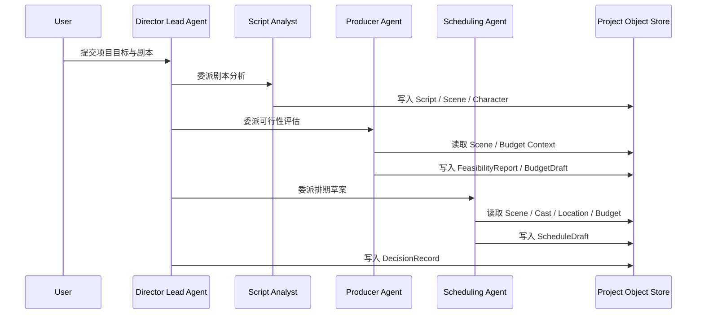
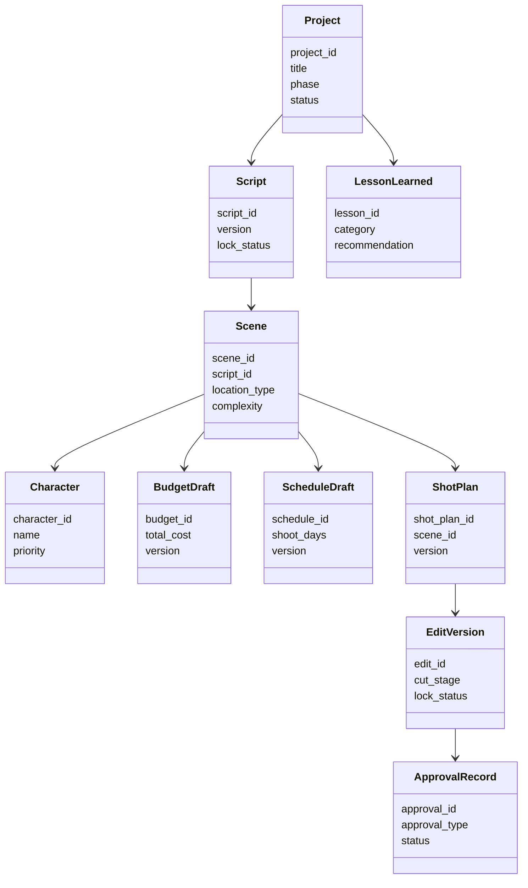
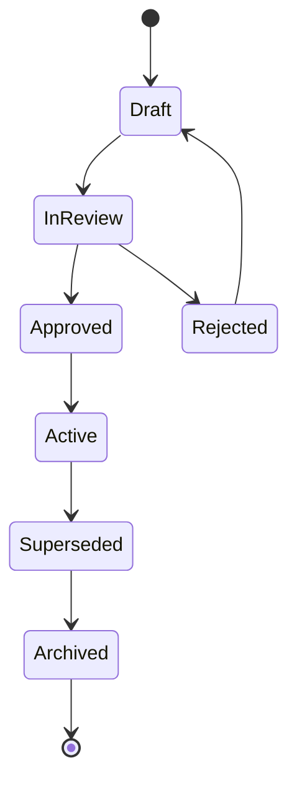
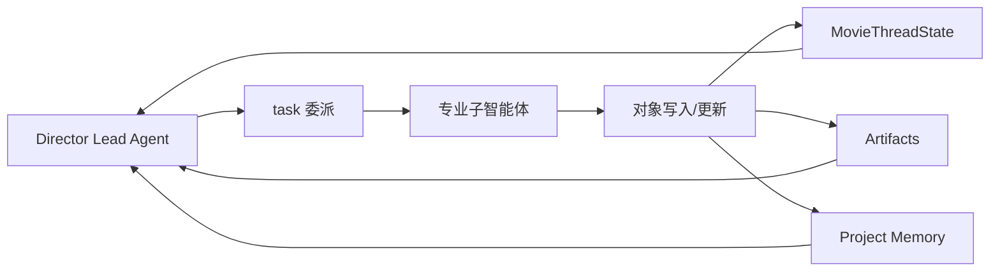

# 61. 项目对象系统总览

这一篇聚焦：

**为什么导演智能体平台真正能落地，不取决于“会不会生成内容”，而取决于有没有一套稳定、可追踪、可协同的项目对象系统。**

---

## 1. 为什么必须先定义“对象系统”

前面 01-60 已经把几个层面逐步铺开了：

- 传统电影工业在没有 AI 时如何运转
- DeerFlow 当前多智能体底座如何承接电影制作
- 导演主智能体与各专业子智能体如何分工
- 前期、中期、后期、发行、复盘如何形成闭环

但如果继续往真实平台落地推进，会立刻遇到一个更底层的问题：

**这些智能体到底围绕什么东西协作？**

答案不是 prompt，不是聊天记录，也不是零散文件，而是：

- 项目对象
- 阶段对象
- 生产对象
- 审批对象
- 版本对象
- 交付对象
- 记忆对象

也就是说，真正的平台不是“很多智能体一起说话”，而是“很多智能体围绕同一套对象系统协作”。

---

## 2. 如果没有对象系统，会发生什么

如果没有统一对象系统，平台很快会退化成下面这种状态：

- 导演智能体在说剧本版本 A
- 制片子智能体在按预算版本 B 评估
- 排期子智能体在使用旧的场景拆解
- 分镜子智能体输出了新镜头表，但没有进入正式版本
- 后期 review 使用的是另一套素材命名
- 宣发团队拿到的仍然是旧版海报与旧版片名信息

这时问题不是模型不够强，而是系统没有“同一个世界模型”。

所以对象系统的第一价值，不是存数据，而是建立：

- 单一事实来源
- 统一命名
- 统一状态
- 统一版本边界
- 统一审批边界

---

## 3. 一张总览图：电影导演智能体平台的对象层

```mermaid
flowchart TD
    A[Project] --> B[Script Domain]
    A --> C[Planning Domain]
    A --> D[Production Domain]
    A --> E[Post Domain]
    A --> F[Release Domain]
    A --> G[Knowledge Domain]

    B --> B1[Script]
    B --> B2[Scene]
    B --> B3[Character]
    B --> B4[DialogueUnit]

    C --> C1[Budget]
    C --> C2[Schedule]
    C --> C3[Location]
    C --> C4[CastingDecision]

    D --> D1[ShotPlan]
    D --> D2[CallSheet]
    D --> D3[Take]
    D --> D4[OnSetIssue]

    E --> E1[EditVersion]
    E --> E2[SoundVersion]
    E --> E3[VFXShot]
    E --> E4[ColorMaster]

    F --> F1[ApprovalRecord]
    F --> F2[ReleasePackage]
    F --> F3[MarketingAsset]

    G --> G1[LessonLearned]
    G --> G2[DecisionRecord]
    G --> G3[ProjectMemory]
```

---

## 4. 对象系统不是数据库表，而是“协作语言”

很多团队一谈对象系统，就会立刻想到：

- 建多少张表
- 字段怎么拆
- 用 SQL 还是 NoSQL
- 是否做事件流

这些当然重要，但在电影导演智能体平台里，更重要的是先回答：

**对象系统是不是所有角色共享的协作语言。**

例如：

- 导演说“这场戏情绪要更压抑”
- 摄影指导说“那镜头语言要更克制”
- 制片说“夜戏成本会抬高”
- 排期说“这会影响演员档期”
- 后期说“这会影响调色与声音设计”

这些话如果不能落到同一组对象上，系统就无法形成闭环。

所以对象系统至少要同时满足：

1. 创作可表达
2. 执行可约束
3. 审批可追踪
4. 版本可比较
5. 记忆可沉淀

---

## 5. 海外成熟流程给我们的启示

海外成熟电影工业越来越强调：

- single source of truth
- script-centered organization
- asset history traceability
- approved / current / archived 边界
- 跨部门围绕同一结构化对象协作

MovieLabs 关于《Black Panther: Wakanda Forever》的案例提到，ProductionPro 把剧本、breakdown、概念图、预演素材、部门协作都组织在同一套以剧本结构为骨架的系统里，并且明确 current 与 archived 的边界，这本质上就是对象系统思维。[来源：MovieLabs, Developing Black Panther: Wakanda Forever in the Cloud](https://movielabs.com/case_study/developing-black-panther-wakanda-forever-in-the-cloud/)

这说明：

- 对象系统不是附属层，而是生产中枢
- 剧本、场景、角色、镜头、资产、审批必须互相关联
- 版本归档必须是系统能力，而不是人工习惯

---

## 6. 国内项目的现实差异

国内项目在真实落地时，通常会更明显地受到这些因素影响：

- 项目推进节奏更压缩
- 口头协调比例更高
- 临时变更更频繁
- 审核与交付耦合更强
- 场地、档期、审批链的不确定性更高

这意味着中国语境下的对象系统，不能只做“理想化静态建模”，还必须支持：

- 高频变更
- 快速重排
- 审批状态切换
- 风险升级
- 版本冻结与回滚

换句话说，海外更强调“标准化协作”，国内更需要“标准化协作 + 高压变化承受能力”。

---

## 7. 一张时序图：对象如何在多智能体之间流动

这张图说明一个关键点：

**智能体之间真正传递的，不应该只是自然语言，而应该是结构化对象。**

自然语言适合解释、协商、总结；对象适合协作、追踪、审批、归档。

---

## 8. 对象系统至少要分成哪几层

为了避免后面越做越乱，建议从一开始就把对象系统分层。

### 第一层：根对象
用于定义项目的最上层边界。

典型对象：

- `Project`
- `ProjectPhase`
- `ProjectGoal`
- `ProjectConstraint`

这一层回答的是：

- 这是哪个项目
- 当前处于哪个阶段
- 当前目标是什么
- 当前硬约束是什么

### 第二层：创作对象
用于承接剧本、角色、场景、对白、风格等创作信息。

典型对象：

- `Script`
- `Scene`
- `Character`
- `DialogueUnit`
- `StyleReference`
- `StoryboardText`

这一层回答的是：

- 影片讲什么
- 每场戏发生什么
- 谁参与
- 情绪与风格是什么

### 第三层：生产对象
用于承接预算、排期、选角、场地、镜头、call sheet、take 等执行信息。

典型对象：

- `BudgetDraft`
- `ScheduleDraft`
- `CastingDecision`
- `LocationCandidate`
- `ShotPlan`
- `CallSheet`
- `Take`
- `OnSetIssue`

这一层回答的是：

- 怎么拍
- 什么时候拍
- 谁来拍
- 在哪里拍
- 出了什么问题

### 第四层：后期对象
用于承接剪辑、声音、调色、VFX、review、锁定状态。

典型对象：

- `EditVersion`
- `SoundVersion`
- `VFXShot`
- `ColorMaster`
- `ReviewNote`
- `LockStatus`

这一层回答的是：

- 后期做到哪一版
- 哪些镜头已通过
- 哪些问题待修
- 哪些内容已锁定

### 第五层：发行与合规对象
用于承接审核、发布包、宣发素材、交付状态。

典型对象：

- `ApprovalRecord`
- `ComplianceChecklist`
- `ReleasePackage`
- `MarketingAsset`
- `ReleaseWindow`

这一层回答的是：

- 是否通过审核
- 是否满足交付要求
- 哪些素材可对外发布
- 当前发行窗口是什么

### 第六层：知识与记忆对象
用于承接复盘、经验、决策、项目记忆。

典型对象：

- `LessonLearned`
- `DecisionRecord`
- `RetrospectiveReport`
- `ProjectMemory`
- `ReusableTemplate`

这一层回答的是：

- 为什么做这个决定
- 哪些经验可复用
- 下个项目能继承什么

---

## 9. 一张类图：对象层之间的依赖关系

这张图不是最终数据库设计，而是为了说明：

- 对象之间必须有明确依赖
- 上游变化会影响下游对象
- 版本与状态必须贯穿全链路

---

## 10. 对象系统最容易做错的五件事

### 错误一：只建文件，不建对象
很多系统最后只有：

- 一堆 Markdown
- 一堆 PDF
- 一堆 Excel
- 一堆图片

但没有对象关系。

结果就是：文件很多，系统很空。

### 错误二：只建对象，不建状态
如果对象没有状态，系统就不知道：

- 草稿还是已确认
- 待审核还是已通过
- 当前版还是归档版
- 可执行还是已失效

### 错误三：只建状态，不建版本
电影制作天然是多版本系统。

没有版本，所有修改都会互相覆盖；有版本但没有 current / approved / archived 边界，也一样会混乱。

### 错误四：只建业务对象，不建决策对象
很多平台只记录“结果”，不记录“为什么”。

但电影项目里，很多返工都来自：

- 不知道为什么改
- 不知道谁决定的
- 不知道改动影响了什么

所以 `DecisionRecord` 不是附属对象，而是核心对象。

### 错误五：只建当前项目，不建可复用对象
如果所有对象都只服务当前项目，平台就无法积累能力。

真正的平台化，必须允许：

- 模板复用
- 风格规则复用
- 预算结构复用
- 排期策略复用
- 复盘经验复用

---

## 11. 一张状态图：对象生命周期的通用模式

这个通用生命周期几乎可以复用到很多对象上，例如：

- 剧本版本
- 预算草案
- 排期草案
- 分镜草案
- 剪辑版本
- 宣发素材
- 发布包

这也是为什么后面 62-70 必须继续写状态机与对象契约。

---

## 12. DeerFlow 为什么适合承接对象系统

你前面已经反复抓住了一个关键判断：

> DeerFlow 的多智能体底座，天然适合承接这种“总控 + 委派 + 状态 + 产物”的电影制作系统。

这句话在对象系统层面尤其成立。

因为 DeerFlow 已经天然具备：

- Lead Agent 作为总控入口
- `task` 作为委派机制
- `ThreadState` 作为线程级状态容器
- artifacts 作为产物承载层
- memory middleware 作为长期记忆入口
- 自定义 agent 配置作为角色扩展入口

如果把电影制作平台映射进去，可以理解成：

- Lead Agent 负责围绕对象做决策
- Subagents 负责围绕对象做加工
- ThreadState / MovieThreadState 负责保存当前对象索引与状态摘要
- artifacts 负责保存对象导出的文档、图表、清单、版本包
- memory 负责保存跨阶段经验与项目记忆

---

## 13. 一张 DeerFlow 映射图

这张图说明：

- DeerFlow 不是只适合“问答”
- 它更适合“围绕对象持续推进工作流”
- 电影制作正是这种典型场景

---

## 14. 第一版对象系统应该怎么做，才不会过重

虽然对象系统很重要，但第一版不能一上来就做成超重型平台。

建议按三层推进：

### 第一阶段：最小对象骨架
先只做最关键对象：

- `Project`
- `Script`
- `Scene`
- `Character`
- `BudgetDraft`
- `ScheduleDraft`
- `ShotPlan`
- `DecisionRecord`

目标是先让前期流程跑起来。

### 第二阶段：执行与后期对象
再补：

- `CallSheet`
- `Take`
- `OnSetIssue`
- `EditVersion`
- `ReviewNote`
- `ApprovalRecord`

目标是让中期、后期、审核流跑起来。

### 第三阶段：知识与复用对象
最后补：

- `LessonLearned`
- `ProjectMemory`
- `ReusableTemplate`
- `ComplianceChecklist`
- `ReleasePackage`

目标是让平台具备长期积累能力。

---

## 15. 对象系统的设计原则

为了避免后面越做越乱，建议明确以下原则。

### 原则一：对象优先于文档
文档是对象的视图，不是对象本身。

### 原则二：状态优先于描述
系统必须知道对象当前处于什么状态，而不只是保存一段说明文字。

### 原则三：版本优先于覆盖
任何关键对象都不应该被静默覆盖。

### 原则四：决策优先于结果
不仅要记录结果，还要记录决策依据、责任人、影响范围。

### 原则五：复用优先于一次性
对象设计必须考虑模板化、跨项目复用、知识沉淀。

---

## 16. 这一篇与后续文档的关系

这一篇是 61-70 的总入口。

后面几篇会继续把这里的内容拆细：

- 62：`MovieThreadState` 设计
- 63：Script / Scene / Character 对象体系
- 64：Budget / Schedule / Resource 对象体系
- 65：ShotPlan / Storyboard / PromptPack 对象体系
- 66：Review / Approval / ReleasePackage 对象体系
- 67：工作流状态机设计
- 68：审批流与升级流设计
- 69：记忆与知识沉淀设计
- 70：产物、版本与归档体系设计

也就是说，61 负责回答：

**为什么必须先有对象系统，后面的一切智能体、工作流、审批流、版本流才有稳定地基。**

---

## 17. 这一篇最重要的结论

### 结论一
导演智能体平台真正的协作核心，不是 prompt，而是统一的项目对象系统。

### 结论二
国内外差异的关键，不只是流程不同，而是对象系统是否既能支持标准化协作，又能承受高频变更与审批耦合。

### 结论三
DeerFlow 的 Lead Agent、task、state、artifacts、memory 组合，天然适合承接这种“围绕对象持续推进工作流”的电影制作平台。

---

---

<!-- movie-doc-nav:start -->
## 文档导航

- 总入口：[README.md](./README.md)
- 阅读地图：[00-reading-map.md](./00-reading-map.md)
- 所在分组：61-70 对象、状态、审批与归档
- 上一篇：[60. 摄影语言子智能体设计](./60-cinematography-language-subagent-design.md)
- 下一篇：[62. MovieThreadState 设计](./62-movie-thread-state-design.md)

### 同组文档
- 61. 项目对象系统总览（当前）
- [62. MovieThreadState 设计](./62-movie-thread-state-design.md)
- [63. Script / Scene / Character 对象体系](./63-script-scene-character-object-system.md)
- [64. Budget / Schedule / Resource 对象体系](./64-budget-schedule-resource-object-system.md)
- [65. ShotPlan / Storyboard / PromptPack 对象体系](./65-shotplan-storyboard-promptpack-object-system.md)
- [66. Review / Approval / ReleasePackage 对象体系](./66-review-approval-release-package-object-system.md)
- [67. 工作流状态机设计](./67-workflow-state-machine-design.md)
- [68. 审批流与升级流设计](./68-approval-and-escalation-flow-design.md)
- [69. 记忆与知识沉淀设计](./69-memory-and-knowledge-capture-design.md)
- [70. 产物、版本与归档体系设计](./70-artifact-version-and-archive-system.md)
<!-- movie-doc-nav:end -->
