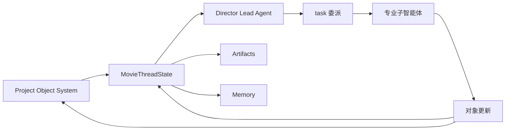
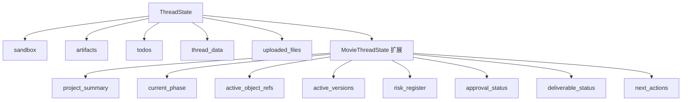
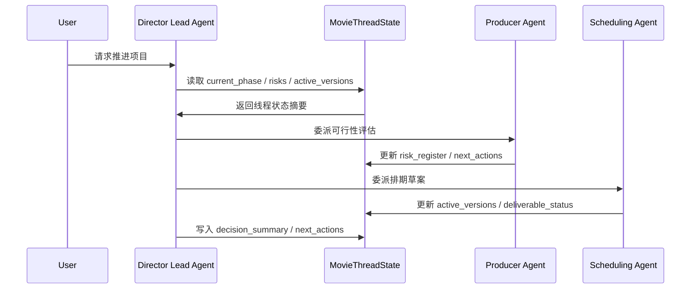
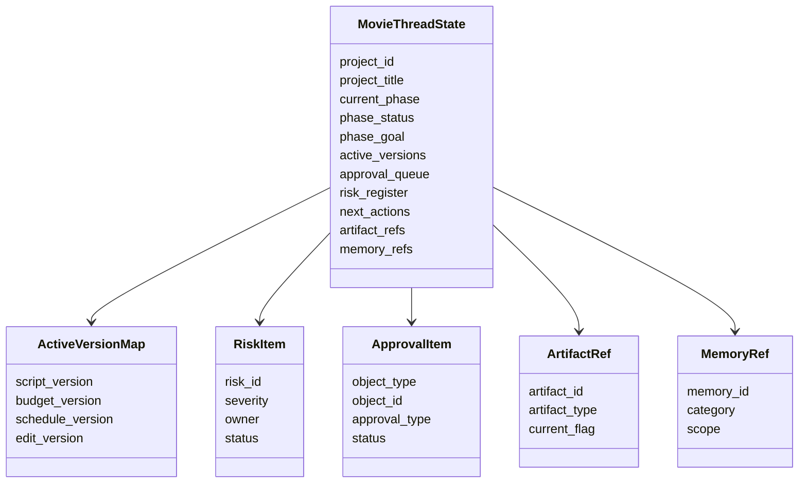
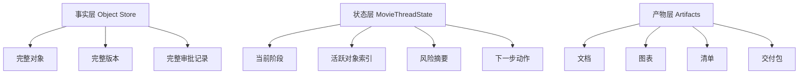
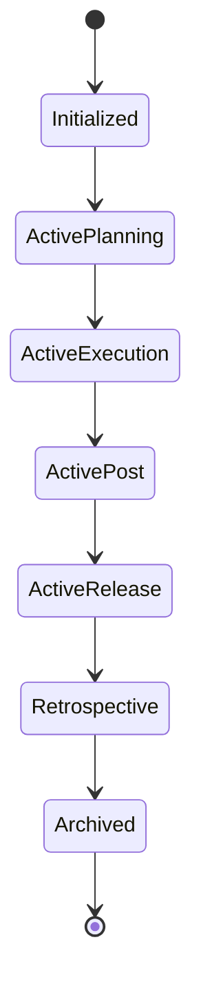
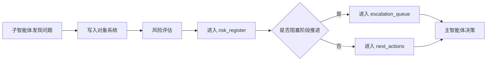
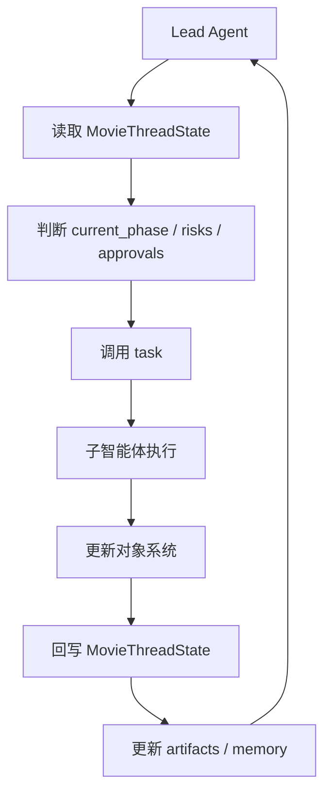

# 62. MovieThreadState 设计

这一篇聚焦：

**为什么导演智能体平台不能只保存“聊天上下文”，而必须有一个能承接项目状态、对象索引、阶段进度、风险摘要与产物引用的线程级状态容器。**

---

## 1. 为什么 62 要紧接在 61 后面

61 讲的是：

- 平台必须先有统一对象系统
- 多智能体协作必须围绕对象推进
- 电影制作不是 prompt 堆叠，而是对象、状态、版本、审批、记忆共同驱动的系统

但对象系统一旦成立，下一步就会立刻遇到另一个问题：

**这些对象在一次持续推进的多智能体工作流里，当前状态到底放在哪里？**

如果没有线程级状态容器，系统会很快退化成下面几种混乱状态：

- 对象存在，但当前阶段不知道
- 风险存在，但主智能体不知道哪些风险仍未关闭
- 版本存在，但当前“正在使用哪一版”不清楚
- 产物存在，但主智能体不知道哪些产物是当前有效产物
- 子智能体刚刚做过什么，主智能体没有稳定摘要
- 项目已经推进到后期，但线程里仍然按前期逻辑在工作

所以 61 解决的是“围绕什么协作”，62 解决的是“协作推进到哪一步，以及当前线程到底知道什么”。

---

## 2. 什么是 MovieThreadState

可以把 `MovieThreadState` 理解成：

**电影导演智能体平台在单个项目线程中的运行时控制面板。**

它不是数据库本身，也不是最终归档仓库，而是：

- 当前项目线程的状态快照
- 当前对象系统的索引入口
- 当前阶段推进的摘要层
- 当前风险、审批、版本、产物的控制层
- 主智能体做下一步决策时最重要的上下文容器

换句话说：

- 对象系统像“项目世界”
- `MovieThreadState` 像“当前驾驶舱”

---

## 3. 一张总览图：对象系统与线程状态的关系

这张图说明：

- 对象系统是底层事实层
- `MovieThreadState` 是线程级控制层
- 主智能体不是直接在海量对象上裸奔，而是通过线程状态读取“当前最重要的摘要”

---

## 4. 为什么不能只用聊天历史代替线程状态

很多原型系统一开始会偷懒，直接把聊天历史当状态。

这在简单问答里还能勉强工作，但在电影制作平台里会迅速失效。

原因很简单：

### 第一，聊天历史不等于结构化状态
聊天历史适合表达：

- 讨论
- 解释
- 协商
- 临时判断

但不适合稳定表达：

- 当前阶段
- 当前有效版本
- 当前风险列表
- 当前审批阻塞点
- 当前对象索引
- 当前产物引用

### 第二，聊天历史无法天然区分“当前有效信息”和“历史废弃信息”
电影项目天然是多版本系统。

如果只靠聊天历史，系统很难稳定回答：

- 当前剧本是哪一版
- 当前预算草案是哪一版
- 当前排期是否已批准
- 当前剪辑是否已锁定
- 当前宣发素材是否可对外发布

### 第三，聊天历史不适合跨子智能体协作
子智能体之间真正需要共享的，不是整段对话，而是：

- 结构化对象
- 当前状态摘要
- 风险与阻塞点
- 下一步待办

所以 `MovieThreadState` 的价值，就是把“对话世界”压缩成“可执行状态世界”。

---

## 5. DeerFlow 当前 ThreadState 给了我们什么启发

前面已经看过 DeerFlow 当前的线程状态设计，它已经具备一些非常关键的基础能力，例如：

- artifacts
- todos
- uploaded_files
- viewed_images
- sandbox
- thread_data
- title

这说明 DeerFlow 本来就不是只面向纯聊天，而是已经具备：

- 线程级状态承载
- 产物承载
- 工作区承载
- 任务承载

所以 `MovieThreadState` 不是推倒重来，而是：

**在 DeerFlow 现有 ThreadState 之上，增加电影制作所需的项目级状态字段与对象索引字段。**

---

## 6. 一张映射图：从 ThreadState 到 MovieThreadState

这张图说明：

- DeerFlow 已经有通用线程状态骨架
- 电影平台需要在这个骨架上增加行业化状态层

---

## 7. MovieThreadState 至少要回答哪些问题

一个合格的 `MovieThreadState`，至少要让主智能体在任何时刻都能快速回答下面这些问题：

### 项目层
- 当前是哪个项目
- 当前项目目标是什么
- 当前项目处于哪个阶段
- 当前项目是否存在硬约束变化

### 对象层
- 当前活跃的剧本版本是什么
- 当前活跃的预算版本是什么
- 当前活跃的排期版本是什么
- 当前关键对象有哪些

### 风险层
- 当前有哪些高优先级风险
- 哪些风险已关闭，哪些仍在升级
- 哪些风险会阻塞下一阶段推进

### 审批层
- 当前有哪些待审批事项
- 哪些对象已批准
- 哪些对象被驳回或待修改

### 产物层
- 当前有哪些关键产物
- 哪些产物是 current
- 哪些产物已归档

### 执行层
- 当前下一步最重要动作是什么
- 哪些子智能体最近刚执行过
- 哪些任务仍未完成

如果线程状态不能快速回答这些问题，主智能体就会越来越像“失忆的协调员”。

---

## 8. 一张时序图：主智能体如何依赖线程状态做决策

这张图说明：

- 主智能体不是每次都从零理解项目
- 它依赖线程状态快速进入“当前局面”

---

## 9. MovieThreadState 的字段应该怎么分层

为了避免后面字段越堆越乱，建议把 `MovieThreadState` 分成六层。

### 第一层：线程身份层
用于标识当前线程是谁。

建议字段：

- `project_id`
- `project_title`
- `thread_mode`
- `workspace_id`
- `owner_role`

这一层回答：

- 这是哪个项目线程
- 这是导演总控线程还是某个专项线程
- 当前工作区归属是什么

### 第二层：阶段控制层
用于表达当前项目推进到哪一步。

建议字段：

- `current_phase`
- `phase_goal`
- `phase_status`
- `phase_started_at`
- `phase_gate_status`

这一层回答：

- 当前是前期、中期、后期还是发行
- 当前阶段目标是什么
- 当前阶段是否可进入下一阶段

### 第三层：对象索引层
用于表达当前线程最关心哪些对象。

建议字段：

- `active_script_id`
- `active_scene_ids`
- `active_character_ids`
- `active_budget_id`
- `active_schedule_id`
- `active_shot_plan_ids`
- `active_review_ids`

这一层回答：

- 当前线程正在围绕哪些对象工作
- 主智能体下一步应该读取哪些对象

### 第四层：版本与审批层
用于表达当前有效版本与审批状态。

建议字段：

- `active_versions`
- `approval_queue`
- `approval_status_map`
- `locked_objects`
- `archived_versions`

这一层回答：

- 当前有效版本是什么
- 哪些对象已锁定
- 哪些对象待审批

### 第五层：风险与执行层
用于表达当前阻塞点与下一步动作。

建议字段：

- `risk_register`
- `open_issues`
- `escalation_queue`
- `next_actions`
- `recent_subagent_runs`

这一层回答：

- 当前最危险的问题是什么
- 哪些问题需要升级
- 下一步最该做什么

### 第六层：产物与记忆层
用于表达当前线程的关键产物与长期记忆入口。

建议字段：

- `artifact_refs`
- `deliverable_refs`
- `decision_summary`
- `memory_refs`
- `retrospective_refs`

这一层回答：

- 当前有哪些关键文档、图表、清单、版本包
- 当前有哪些决策需要长期保留
- 哪些经验已经进入项目记忆

---

## 10. 一张类图：MovieThreadState 的结构草图

这张图强调的是：

- `MovieThreadState` 不应该是一个无边界的大字典
- 它应该由若干稳定子结构组成

---

## 11. 为什么线程状态里必须有“对象索引”，而不是只放对象全文

这是一个很容易做错的点。

很多系统会想：

- 既然线程状态很重要，那就把所有对象都塞进去

这会很快导致两个问题：

### 问题一：状态膨胀
电影项目对象非常多：

- 场景几十到几百
- 镜头几百到上千
- take 数量更大
- review notes、审批记录、版本记录会持续增长

如果把对象全文都塞进线程状态，状态会迅速膨胀，主智能体每次读取都会越来越重。

### 问题二：状态与事实源冲突
对象全文应该以对象系统为准。

线程状态更适合保存：

- 当前活跃对象 ID
- 当前摘要
- 当前版本映射
- 当前风险摘要
- 当前审批摘要

也就是说：

- 对象系统保存“完整事实”
- `MovieThreadState` 保存“当前驾驶舱摘要”

---

## 12. 一张分层图：事实层、状态层、产物层

这张图非常关键，因为它定义了三个层次的边界：

- 事实层负责“真相”
- 状态层负责“当前控制面板”
- 产物层负责“可查看、可交付、可归档的输出”

---

## 13. MovieThreadState 的更新原则

线程状态不是静态配置，而是持续更新的运行时对象。

建议明确以下更新原则。

### 原则一：只有关键变化才更新摘要层
不是每个细节变化都要写入线程状态。

只有这些变化值得更新：

- 当前阶段变化
- 当前有效版本变化
- 高优先级风险变化
- 审批状态变化
- 下一步动作变化
- 关键产物变化

### 原则二：线程状态更新必须可追踪
每次关键更新都应该能回答：

- 谁更新的
- 为什么更新
- 更新影响了什么

### 原则三：线程状态更新必须服务主智能体决策
如果某个字段长期不被主智能体使用，就说明它可能不该放在线程状态里。

### 原则四：线程状态不能替代对象系统
线程状态是摘要层，不是事实层。

---

## 14. 一张状态图：MovieThreadState 的运行生命周期

这个生命周期不是项目对象生命周期，而是线程控制状态的生命周期。

它帮助主智能体快速判断：

- 当前线程主要在做什么
- 当前线程应该调用哪类子智能体
- 当前线程应该关注哪类对象

---

## 15. 为什么中国项目更需要强线程状态

在中国项目语境下，`MovieThreadState` 的价值会更高，原因在于：

- 临时变化更多
- 口头协调更多
- 审批与交付耦合更强
- 场地、档期、政策、窗口期的不确定性更高

这意味着如果没有强线程状态，主智能体会非常容易出现：

- 还在按旧阶段推进
- 还在引用旧版本
- 没意识到审批阻塞
- 没意识到风险已升级
- 没意识到当前最重要动作已经变化

所以在中国项目里，线程状态不是“锦上添花”，而是“防止系统失控的必要控制层”。

---

## 16. 一张风险流转图：风险如何进入线程状态

这张图说明：

- 风险不是只存在于对象系统里
- 风险必须被提升到线程状态，才能真正影响主智能体决策

---

## 17. 第一版 MovieThreadState 应该怎么做

为了避免一开始做得过重，建议第一版只做最关键字段。

### 第一版最小字段集

- `project_id`
- `project_title`
- `current_phase`
- `phase_goal`
- `active_versions`
- `active_object_refs`
- `risk_register`
- `approval_queue`
- `next_actions`
- `artifact_refs`
- `decision_summary`

这套字段已经足够支撑：

- 前期对象推进
- 中期风险控制
- 后期版本推进
- 审批流跟踪
- 主智能体下一步决策

### 第二版再补充

- `deliverable_refs`
- `memory_refs`
- `retrospective_refs`
- `recent_subagent_runs`
- `phase_gate_status`
- `locked_objects`

### 第三版再补充

- 更细粒度的对象索引
- 更细粒度的审批状态映射
- 更细粒度的跨项目模板引用

---

## 18. 与 DeerFlow 的代码落点

如果后面进入代码实现，`MovieThreadState` 最自然的落点会是：

- 基于当前 `ThreadState` 扩展
- 在 `thread_data` 或新的 movie state 字段中承接电影项目状态
- 由 Lead Agent 与 middleware 在关键节点更新
- 由 `task` 委派后的子智能体回写关键摘要

也就是说，代码层面最自然的方向不是另起炉灶，而是：

- 保留 DeerFlow 当前线程状态骨架
- 增加电影项目专用状态字段
- 建立对象系统与线程状态之间的同步规则

---

## 19. 一张代码映射图

这张图说明：

- `MovieThreadState` 是主智能体与子智能体之间的控制层桥梁
- 它不是被动存储，而是工作流推进的核心中间层

---

## 20. 这一篇与后续文档的关系

这一篇回答的是：

**如果 61 定义了“平台围绕什么对象协作”，那么 62 定义的就是“平台在当前线程里如何知道自己推进到了哪里”。**

后面几篇会继续把这里拆细：

- 63：Script / Scene / Character 对象体系
- 64：Budget / Schedule / Resource 对象体系
- 65：ShotPlan / Storyboard / PromptPack 对象体系
- 66：Review / Approval / ReleasePackage 对象体系
- 67：工作流状态机设计
- 68：审批流与升级流设计
- 69：记忆与知识沉淀设计
- 70：产物、版本与归档体系设计

---

## 21. 这一篇最重要的结论

### 结论一
`MovieThreadState` 的本质，不是聊天上下文缓存，而是电影项目线程的运行时控制面板。

### 结论二
国内外差异的关键，不只是流程复杂度不同，而是中国项目更需要线程状态去承受高频变更、审批耦合与执行不确定性。

### 结论三
在 DeerFlow 中，基于现有 `ThreadState` 扩展 `MovieThreadState`，是把电影导演智能体平台落到真实运行时控制层的最自然路径。

---

---

<!-- movie-doc-nav:start -->
## 文档导航

- 总入口：[README.md](./README.md)
- 阅读地图：[00-reading-map.md](./00-reading-map.md)
- 所在分组：61-70 对象、状态、审批与归档
- 上一篇：[61. 项目对象系统总览](./61-project-object-system-overview.md)
- 下一篇：[63. Script / Scene / Character 对象体系](./63-script-scene-character-object-system.md)

### 同组文档
- [61. 项目对象系统总览](./61-project-object-system-overview.md)
- 62. MovieThreadState 设计（当前）
- [63. Script / Scene / Character 对象体系](./63-script-scene-character-object-system.md)
- [64. Budget / Schedule / Resource 对象体系](./64-budget-schedule-resource-object-system.md)
- [65. ShotPlan / Storyboard / PromptPack 对象体系](./65-shotplan-storyboard-promptpack-object-system.md)
- [66. Review / Approval / ReleasePackage 对象体系](./66-review-approval-release-package-object-system.md)
- [67. 工作流状态机设计](./67-workflow-state-machine-design.md)
- [68. 审批流与升级流设计](./68-approval-and-escalation-flow-design.md)
- [69. 记忆与知识沉淀设计](./69-memory-and-knowledge-capture-design.md)
- [70. 产物、版本与归档体系设计](./70-artifact-version-and-archive-system.md)
<!-- movie-doc-nav:end -->
