# 63. Script / Scene / Character 对象体系

这一篇聚焦：

**为什么电影导演智能体平台里最先要做深的，不是“生成分镜”或“生成提示词”，而是把剧本、场景、角色这三类最基础的创作对象建成稳定、可追踪、可联动的对象体系。**

---

## 1. 为什么 63 必须先讲 Script / Scene / Character

如果把整个电影制作平台看成一棵树，那么：

- `Script` 是主干
- `Scene` 是分枝
- `Character` 是贯穿枝叶的核心生命线

前面 61 讲了对象系统总览，62 讲了 `MovieThreadState` 作为线程级控制面板。

接下来真正进入对象细化时，最自然的第一步就是：

- 先把创作层最基础的对象讲清楚
- 先把所有后续流程的上游输入讲清楚
- 先把“故事如何变成生产结构”讲清楚

因为后面几乎所有对象都依赖这三类对象：

- 预算依赖场景复杂度与角色规模
- 排期依赖场景、角色、场地与日夜属性
- 分镜依赖场景目标与角色动作
- 选角依赖角色画像
- 场地依赖场景需求
- 后期 review 依赖场景与角色目标
- 宣发也依赖角色与剧情结构

所以如果 `Script / Scene / Character` 没有建稳，后面所有对象都会漂。

---

## 2. 这三类对象分别解决什么问题

### `Script`
回答的是：

- 这个项目讲的是什么故事
- 当前剧本版本是什么
- 当前剧本是否锁定
- 当前剧本的结构、主题、节奏、风格是什么

### `Scene`
回答的是：

- 故事被拆成哪些可执行单元
- 每场戏发生什么
- 每场戏涉及哪些角色、场地、时间、动作、情绪
- 每场戏的复杂度、风险、执行成本大概如何

### `Character`
回答的是：

- 谁在推动故事
- 每个角色的目标、关系、弧线是什么
- 哪些角色是核心角色，哪些是功能角色
- 角色需求如何影响选角、表演、服化道、摄影与宣发

这三类对象合在一起，才构成电影制作平台最基础的“叙事骨架”。

---

## 3. 一张总览图：Script / Scene / Character 的关系

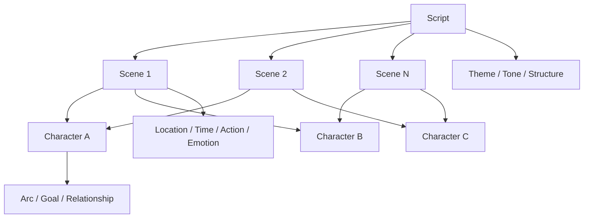

这张图说明：

- `Script` 是全局叙事容器
- `Scene` 是可执行叙事单元
- `Character` 是跨场景持续存在的叙事主体

---

## 4. 为什么不能只把剧本当成一份文档

这是很多系统最容易犯的第一个错误。

很多团队会把剧本理解成：

- 一个 PDF
- 一个 Final Draft 文件
- 一个 Markdown 文本
- 一个上传附件

这当然是剧本的文件形态，但不是剧本的对象形态。

如果只把剧本当文档，会立刻失去很多关键能力：

- 无法稳定提取场景
- 无法稳定提取角色
- 无法稳定比较版本差异
- 无法把剧本变化同步到预算、排期、分镜
- 无法把剧本结构变成多智能体共享的事实层

所以在平台里，`Script` 必须至少同时具备三种身份：

1. 文本对象
2. 结构对象
3. 版本对象

也就是说，剧本不是“一个文件”，而是：

- 有版本
- 有锁定状态
- 有结构拆解
- 有关联对象
- 有审批边界

---

## 5. 海外成熟流程的启示：为什么剧本必须成为 single source of truth 的骨架

MovieLabs 关于《Black Panther: Wakanda Forever》的案例里，一个非常关键的点是：

- 剧本被明确标记为 current
- 旧版本自动归档
- breakdown、概念图、预演素材、部门协作都围绕剧本结构组织

这说明在成熟工业体系里，剧本不是“创作部门自己的文件”，而是整个生产系统的骨架。[来源：MovieLabs, Developing Black Panther: Wakanda Forever in the Cloud](https://movielabs.com/case_study/developing-black-panther-wakanda-forever-in-the-cloud/)

这对我们有两个直接启发：

- `Script` 必须是对象系统中的一级对象
- `Scene` 与 `Character` 必须从剧本结构中稳定派生，而不是靠人工临时理解

---

## 6. 国内项目的现实差异

国内项目里，剧本对象体系会遇到更复杂的现实情况：

- 剧本修改频率更高
- 口头改戏、现场改戏更常见
- 导演、编剧、制片对“当前版本”的理解可能不一致
- 送审、合规、宣发口径可能要求不同版本边界

这意味着中国语境下的 `Script / Scene / Character` 体系，不能只支持“稳定版本管理”，还必须支持：

- 高频修订
- 临时变更标记
- 当前版 / 审批版 / 执行版 区分
- 角色与场景变化的影响分析

换句话说，海外更强调“结构化协作”，国内更需要“结构化协作 + 高频变化承受能力”。

---

## 7. 一张时序图：剧本变化如何影响下游对象

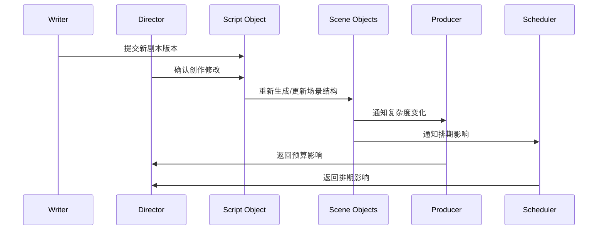

这张图说明：

- 剧本变化不是局部变化
- 它会沿着 `Scene` 结构向预算、排期、执行层扩散

---

## 8. `Script` 对象应该包含哪些核心字段

建议把 `Script` 对象分成五组字段。

### 第一组：身份字段
- `script_id`
- `project_id`
- `title`
- `language`
- `source_type`

### 第二组：版本字段
- `version`
- `version_label`
- `is_current`
- `is_locked`
- `derived_from_version`

### 第三组：结构字段
- `logline`
- `synopsis`
- `act_structure`
- `theme_notes`
- `tone_notes`

### 第四组：生产字段
- `scene_count`
- `character_count`
- `estimated_complexity`
- `production_flags`

### 第五组：治理字段
- `approval_status`
- `review_notes`
- `change_summary`
- `archived_at`

这意味着 `Script` 不是只保存文本，而是同时保存：

- 身份
- 版本
- 结构
- 生产影响
- 治理状态

---

## 9. `Scene` 对象为什么是最关键的执行桥梁

如果说 `Script` 是叙事总容器，那么 `Scene` 就是从叙事进入生产的第一道桥梁。

因为电影制作真正开始进入执行层时，几乎所有部门都不是直接围绕整部剧本工作，而是围绕：

- 某场戏
- 某组戏
- 某天要拍的戏
- 某场戏里的角色、场地、动作、情绪、风险

所以 `Scene` 是最关键的“叙事-生产转换器”。

它必须同时服务：

- 编剧与导演的叙事理解
- 制片与排期的执行理解
- 摄影与分镜的镜头理解
- 演员与表演指导的角色理解
- 后期与宣发的内容理解

---

## 10. 一张 Scene 分层图

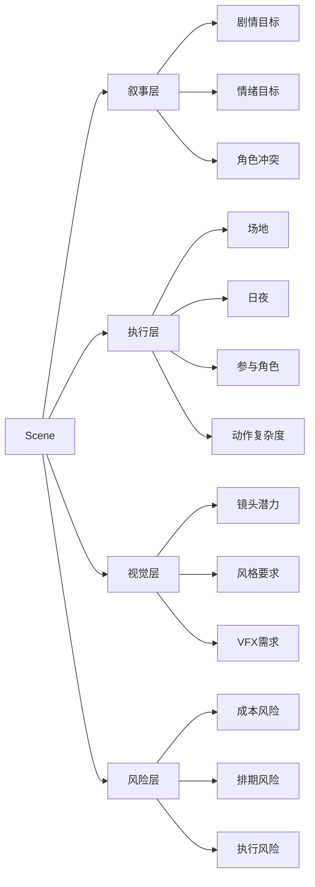

这张图说明：

- `Scene` 不是一句剧情摘要
- 它是一个多层对象

---

## 11. `Scene` 对象应该包含哪些核心字段

建议把 `Scene` 对象分成七组字段。

### 第一组：身份字段
- `scene_id`
- `script_id`
- `scene_number`
- `sequence_group`

### 第二组：基础拍摄字段
- `int_ext`
- `day_night`
- `location_type`
- `estimated_page_length`

### 第三组：叙事字段
- `story_purpose`
- `conflict_summary`
- `emotion_goal`
- `plot_dependencies`

### 第四组：角色字段
- `character_ids`
- `lead_character_ids`
- `dialogue_density`
- `performance_complexity`

### 第五组：执行字段
- `stunt_flag`
- `crowd_flag`
- `vfx_flag`
- `special_prop_flag`
- `weather_dependency`

### 第六组：评估字段
- `complexity_score`
- `budget_risk_level`
- `schedule_risk_level`
- `production_notes`

### 第七组：治理字段
- `scene_status`
- `approval_status`
- `revision_refs`
- `linked_artifacts`

---

## 12. 为什么 `Character` 不能只是一张人物卡

很多系统会把角色对象做得很浅，只保留：

- 名字
- 年龄
- 性别
- 简介

这远远不够。

在电影导演智能体平台里，`Character` 至少同时影响：

- 剧本分析
- 选角
- 表演指导
- 服化道
- 摄影语言
- 宣发定位
- 角色 continuity

所以 `Character` 不是静态人物卡，而是：

- 叙事对象
- 表演对象
- 选角对象
- 视觉对象
- 宣发对象

---

## 13. 一张 Character 影响图

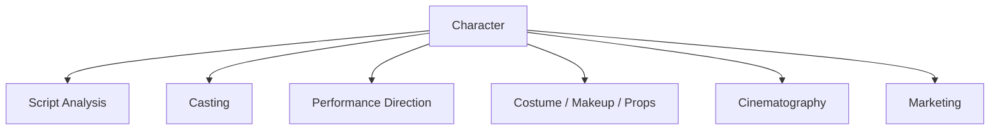

这张图说明：

- 角色对象不是编剧私有对象
- 它是跨部门共享对象

---

## 14. `Character` 对象应该包含哪些核心字段

建议把 `Character` 对象分成六组字段。

### 第一组：身份字段
- `character_id`
- `project_id`
- `name`
- `alias`
- `character_type`

### 第二组：叙事字段
- `role_function`
- `core_goal`
- `core_conflict`
- `arc_summary`
- `relationship_map`

### 第三组：表演字段
- `emotion_range`
- `dialogue_style`
- `physicality_notes`
- `performance_difficulty`

### 第四组：选角字段
- `casting_requirements`
- `age_range`
- `market_positioning`
- `schedule_sensitivity`

### 第五组：视觉字段
- `costume_notes`
- `makeup_notes`
- `props_notes`
- `visual_signature`

### 第六组：治理字段
- `priority_level`
- `approval_status`
- `continuity_notes`
- `linked_scene_ids`

---

## 15. 一张类图：Script / Scene / Character 的结构关系

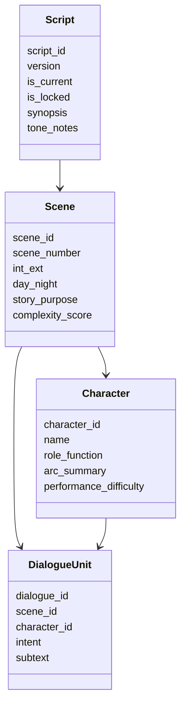

这张图说明：

- `Script` 派生 `Scene`
- `Scene` 连接 `Character`
- `DialogueUnit` 是角色与场景之间的重要细粒度桥梁

---

## 16. 为什么还要引入 `DialogueUnit`

虽然这一篇主讲 `Script / Scene / Character`，但必须提前提一下 `DialogueUnit`。

因为很多电影项目里，真正影响：

- 表演指导
- 对白润色
- 节奏控制
- 审核敏感点识别
- 宣发台词提炼

的，不是整场戏，而是更细粒度的对白单元。

所以后面如果平台继续做深，`DialogueUnit` 很可能会成为：

- 表演反馈对象
- 对白设计对象
- 审核辅助对象

这一层先不展开，但必须在对象关系里预留位置。

---

## 17. 一张状态图：Script 对象生命周期

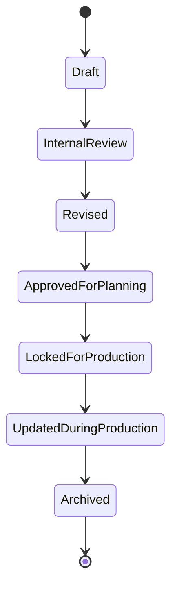

这张图说明：

- 剧本对象天然是多版本、多状态对象
- “锁稿”不是终点，而是进入执行边界的关键门槛

---

## 18. 一张状态图：Scene 对象生命周期

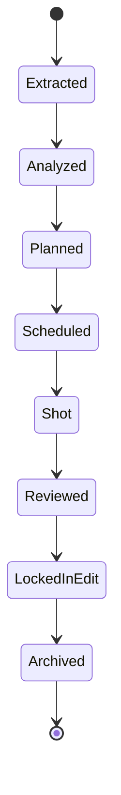

这张图说明：

- `Scene` 是贯穿前期、中期、后期的长生命周期对象
- 它不是前期拆完就结束

---

## 19. 一张状态图：Character 对象生命周期

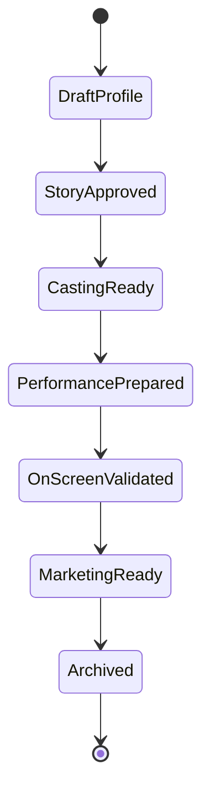

这张图说明：

- 角色对象会跨越创作、选角、表演、宣发多个阶段
- 它不是只在剧本阶段存在

---

## 20. 为什么这三类对象必须支持“影响分析”

这是平台化里非常关键的一点。

如果一个对象变化了，系统必须知道它会影响谁。

例如：

### 剧本变化可能影响
- 场景数量
- 角色出场
- 预算规模
- 排期长度
- 审核风险

### 场景变化可能影响
- 场地需求
- 演员档期
- 镜头设计
- VFX 需求
- 拍摄日安排

### 角色变化可能影响
- 选角策略
- 表演难度
- 服化道方案
- 宣发定位
- continuity 管理

如果没有影响分析，平台就只能“知道变了”，却不知道“变了之后该通知谁、该重算什么”。

---

## 21. 一张影响传播图

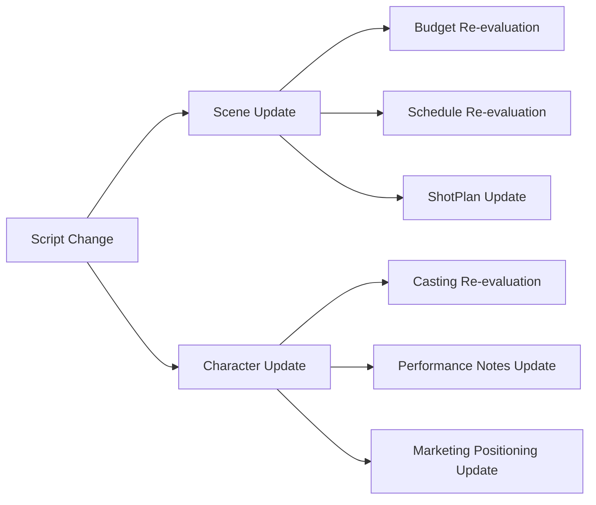

这张图说明：

- 创作对象变化必须能向执行对象传播
- 这正是多智能体平台比传统文档系统更有价值的地方

---

## 22. DeerFlow 里这三类对象最自然的承接方式

如果后面进入代码实现，这三类对象最自然的承接方式会是：

- `Script / Scene / Character` 作为电影项目对象系统中的一级核心对象
- `MovieThreadState` 保存当前活跃对象索引与版本摘要
- script-analyst subagent 负责从剧本文本生成结构化对象
- producer / scheduling / storyboard / casting 等子智能体围绕这些对象继续加工
- artifacts 保存剧本摘要、场景清单、角色表、差异报告等导出结果

也就是说：

- DeerFlow 的强项不是替代对象系统
- DeerFlow 的强项是围绕对象系统持续推进工作流

---

## 23. 一张 DeerFlow 映射图

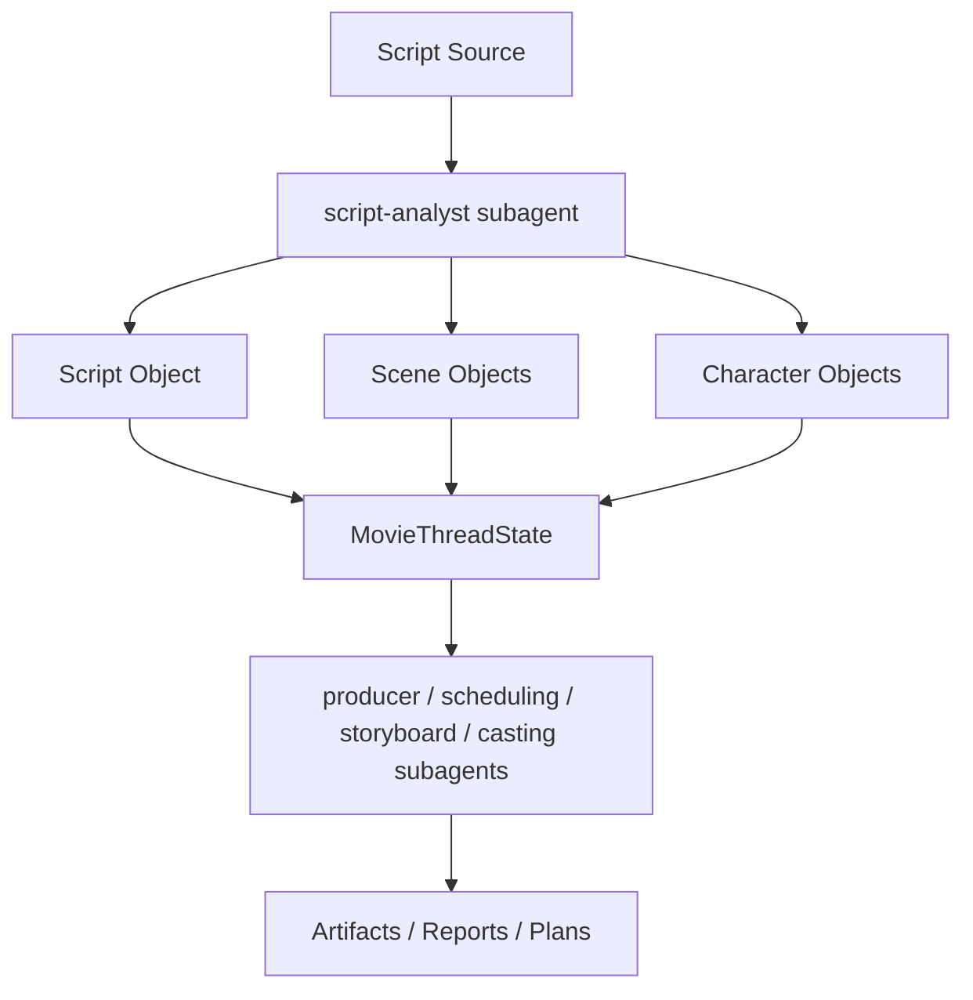

这张图说明：

- 这三类对象是后续多个子智能体的共同上游输入

---

## 24. 第一版实现应该做到什么程度

为了避免一开始做得过重，建议第一版先做到下面这个粒度。

### `Script`
先支持：

- 版本管理
- 锁定状态
- 剧情摘要
- 结构摘要
- 变更摘要

### `Scene`
先支持：

- 场景提取
- 场景编号
- 日夜 / 内外景 / 场地类型
- 角色列表
- 复杂度与风险标记

### `Character`
先支持：

- 角色画像
- 角色功能
- 角色弧线摘要
- 选角需求摘要
- 关联场景索引

### 暂时不要一开始就做太深的部分
例如：

- 极细粒度对白语义图谱
- 极细粒度角色心理状态机
- 极细粒度跨版本自动合并

这些可以后面再做。

---

## 25. 这一篇与后续文档的关系

这一篇回答的是：

**电影导演智能体平台里，最基础的创作对象到底应该怎么建，才能让后面的预算、排期、分镜、选角、后期、宣发都有稳定上游。**

后面几篇会继续把这里往下游推进：

- 64：Budget / Schedule / Resource 对象体系
- 65：ShotPlan / Storyboard / PromptPack 对象体系
- 66：Review / Approval / ReleasePackage 对象体系
- 67：工作流状态机设计
- 68：审批流与升级流设计
- 69：记忆与知识沉淀设计
- 70：产物、版本与归档体系设计

---

## 26. 这一篇最重要的结论

### 结论一
`Script / Scene / Character` 不是三个孤立对象，而是电影导演智能体平台最基础的叙事骨架。

### 结论二
国内外差异的关键，不只是剧本管理习惯不同，而是对象体系是否既能支持标准化结构化协作，又能承受高频修订与执行联动。

### 结论三
在 DeerFlow 中，把这三类对象作为一级核心对象，再由 `MovieThreadState` 管理当前活跃索引，是后续预算、排期、分镜、选角等子智能体稳定协作的前提。

---

<!-- movie-visuals:start -->
## 补充图示：换一种视角看本篇

下面这张 ER 图 把“Script / Scene / Character 对象体系”再压缩成一个可快速扫读的结构视图，便于先抓关键关系，再回到正文细节。

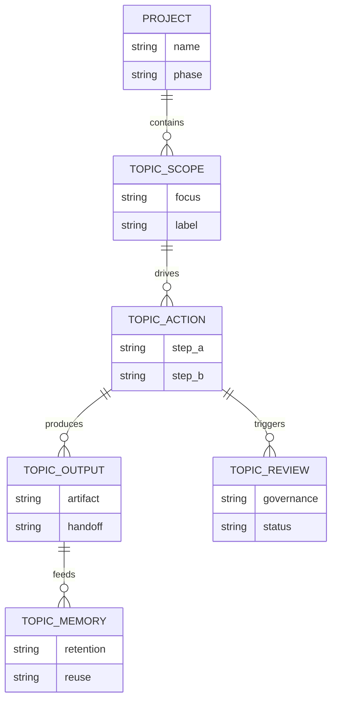
<!-- movie-visuals:end -->

<!-- movie-doc-nav:start -->
## 文档导航

- 总入口：[README.md](./README.md)
- 阅读地图：[00-reading-map.md](./00-reading-map.md)
- 所在分组：61-70 对象、状态、审批与归档
- 上一篇：[62. MovieThreadState 设计](./62-movie-thread-state-design.md)
- 下一篇：[64. Budget / Schedule / Resource 对象体系](./64-budget-schedule-resource-object-system.md)

### 同组文档
- [61. 项目对象系统总览](./61-project-object-system-overview.md)
- [62. MovieThreadState 设计](./62-movie-thread-state-design.md)
- 63. Script / Scene / Character 对象体系（当前）
- [64. Budget / Schedule / Resource 对象体系](./64-budget-schedule-resource-object-system.md)
- [65. ShotPlan / Storyboard / PromptPack 对象体系](./65-shotplan-storyboard-promptpack-object-system.md)
- [66. Review / Approval / ReleasePackage 对象体系](./66-review-approval-release-package-object-system.md)
- [67. 工作流状态机设计](./67-workflow-state-machine-design.md)
- [68. 审批流与升级流设计](./68-approval-and-escalation-flow-design.md)
- [69. 记忆与知识沉淀设计](./69-memory-and-knowledge-capture-design.md)
- [70. 产物、版本与归档体系设计](./70-artifact-version-and-archive-system.md)
<!-- movie-doc-nav:end -->
