# 64. Budget / Schedule / Resource 对象体系

这一篇聚焦：

**为什么电影导演智能体平台一旦从创作层进入真实执行层，最先必须稳定下来的，不是“生成更多内容”，而是预算、排期、资源这三类决定项目可执行性的核心对象。**

---

## 1. 为什么 64 要紧接在 63 后面

63 讲的是：

- `Script / Scene / Character` 是最基础的叙事骨架
- 所有后续对象都依赖这三类创作对象
- 电影制作平台必须先把故事结构化，后面才能进入执行层

但故事一旦被结构化，下一步就会立刻遇到一个更现实的问题：

**这个故事到底拍不拍得起、排不排得开、资源能不能凑齐？**

这就是 64 要解决的问题。

如果说 63 负责回答“拍什么”，那么 64 负责回答：

- 要花多少钱
- 要用多少天
- 要占用哪些资源
- 哪些地方会卡住
- 哪些创作目标必须调整

所以 64 是从创作对象体系进入执行对象体系的第一道门。

---

## 2. 为什么 Budget / Schedule / Resource 必须一起讲

很多团队会把这三件事拆开看：

- 预算是财务问题
- 排期是助理导演问题
- 资源是制片协调问题

但在真实电影制作里，这三者从来不是分开的。

因为：

- 预算变化会影响排期
- 排期变化会影响资源占用
- 资源变化会反过来影响预算
- 三者共同决定创作方案是否可执行

例如：

- 夜戏增加，预算会上升，排期会变紧，灯光与场地资源压力会变大
- 某演员档期缩短，排期必须重排，预算可能增加，场地窗口也要重谈
- 某场地审批延迟，排期会后移，设备与人员资源会冲突，预算会被拖高

所以在平台里，这三类对象必须被设计成一个联动系统，而不是三个孤立模块。

---

## 3. 一张总览图：Budget / Schedule / Resource 的联动关系

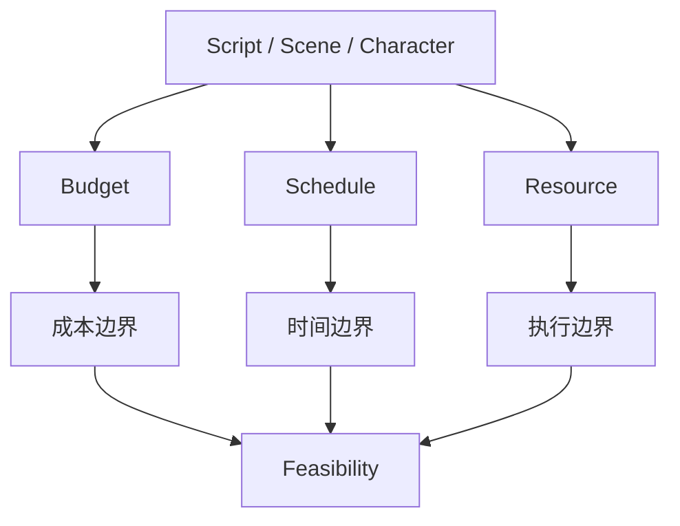

这张图说明：

- 创作对象进入执行层后，会同时投射成预算、排期、资源三类约束
- 三者共同决定项目可行性

---

## 4. 为什么预算对象不是“算钱表”

很多系统会把预算对象做得很浅，只保留：

- 总金额
- 部门金额
- 备注

这远远不够。

在电影导演智能体平台里，`Budget` 至少要同时承担：

- 成本边界表达
- 创作方案可行性表达
- 风险预警表达
- 变更影响表达
- 资源配置表达

也就是说，预算对象不是“财务报表”，而是：

- 创作与执行之间的成本翻译器
- 风险控制对象
- 决策支持对象

---

## 5. 海外成熟流程的启示：预算与排期必须联动

行业实践普遍强调，预算与排期必须一起编制，因为拍摄天数变化会直接改变成本结构，任何一天的增减都会影响人工、设备、场地与后勤成本。[来源：Saturation, Film Budget 101](https://saturation.io/blog/film-budget-101-the-key-to-successful-film-production)

这说明：

- `Budget` 不能脱离 `Schedule` 单独存在
- 预算对象必须能感知拍摄天数、场景复杂度、资源占用
- 预算对象必须支持“如果排期变化，会发生什么”的影响分析

---

## 6. 国内项目的现实差异

国内项目在预算、排期、资源联动上，通常会更明显地受到这些现实因素影响：

- 压缩工期更常见
- 口头协调与临时变更更多
- 场地窗口与审批不确定性更高
- 演员档期波动更频繁
- 审核、定档、宣发窗口会反向影响后期排期

这意味着中国语境下的执行对象体系，不能只支持“理想化计划”，还必须支持：

- 快速重排
- 预算重估
- 资源冲突检测
- 风险升级
- 阶段性冻结与回滚

换句话说，海外更强调“标准化计划”，国内更需要“标准化计划 + 高频变化承受能力”。

---

## 7. 一张时序图：创作变化如何传导到预算、排期、资源

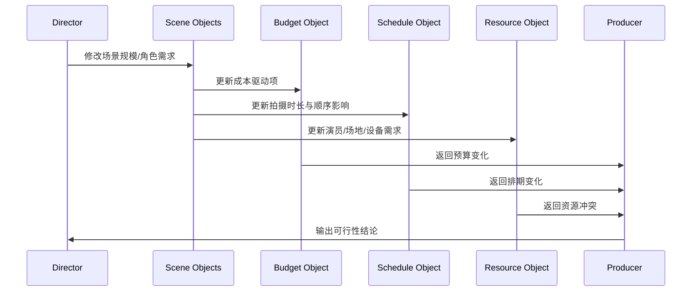

这张图说明：

- 创作变化一旦进入执行层，就必须被翻译成预算、排期、资源三类变化

---

## 8. `Budget` 对象应该包含哪些核心字段

建议把 `Budget` 对象分成六组字段。

### 第一组：身份字段
- `budget_id`
- `project_id`
- `version`
- `version_label`
- `currency`

### 第二组：总览字段
- `total_cost`
- `above_the_line_cost`
- `below_the_line_cost`
- `post_cost`
- `marketing_cost`
- `contingency`

### 第三组：结构字段
- `department_costs`
- `scene_cost_refs`
- `resource_cost_refs`
- `cost_drivers`

### 第四组：风险字段
- `budget_risk_level`
- `overrun_risk_items`
- `high_cost_scenes`
- `sensitivity_notes`

### 第五组：联动字段
- `linked_schedule_id`
- `linked_resource_plan_id`
- `assumption_notes`
- `change_impact_summary`

### 第六组：治理字段
- `approval_status`
- `is_current`
- `is_locked`
- `archived_at`

这意味着 `Budget` 不是一个静态金额对象，而是一个：

- 有版本
- 有风险
- 有联动关系
- 有审批边界

的执行核心对象。

---

## 9. 为什么 `Schedule` 对象不是“日历表”

很多系统会把排期理解成：

- 一个 Excel
- 一个 stripboard 导出文件
- 一个 call sheet 前置表

但在平台里，`Schedule` 必须是更强的对象。

因为它至少同时承担：

- 执行顺序表达
- 约束优化表达
- 风险传播表达
- 资源占用表达
- 变更重排表达

也就是说，排期对象不是“把日期填进去”，而是：

- 创作目标与执行现实之间的时间翻译器
- 多约束优化对象
- 风险控制对象

---

## 10. 一张 Schedule 分层图

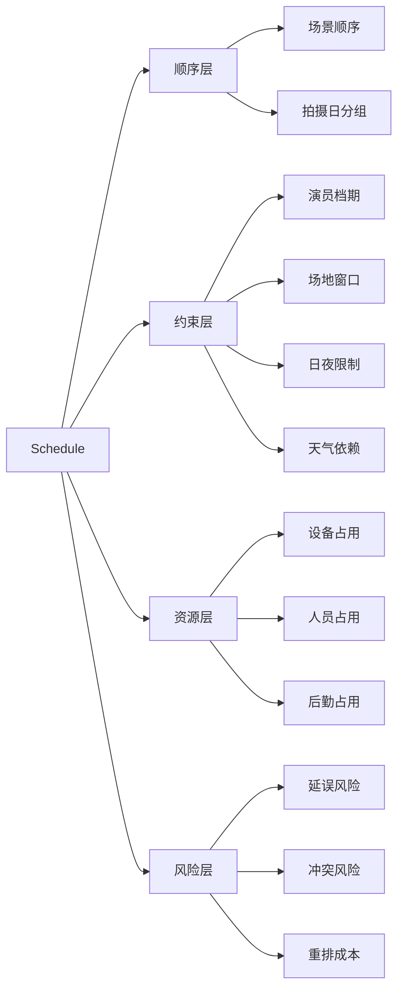

这张图说明：

- `Schedule` 不是单层对象
- 它必须同时表达顺序、约束、资源、风险

---

## 11. `Schedule` 对象应该包含哪些核心字段

建议把 `Schedule` 对象分成七组字段。

### 第一组：身份字段
- `schedule_id`
- `project_id`
- `version`
- `schedule_type`

### 第二组：总览字段
- `shoot_day_count`
- `prep_day_count`
- `post_day_count`
- `target_wrap_date`

### 第三组：顺序字段
- `scene_order_refs`
- `shoot_day_refs`
- `sequence_grouping`
- `priority_rules`

### 第四组：约束字段
- `cast_constraints`
- `location_constraints`
- `resource_constraints`
- `weather_constraints`
- `compliance_constraints`

### 第五组：评估字段
- `schedule_risk_level`
- `critical_path_items`
- `delay_sensitivity`
- `reschedule_cost_estimate`

### 第六组：联动字段
- `linked_budget_id`
- `linked_resource_plan_id`
- `change_impact_summary`
- `dependency_notes`

### 第七组：治理字段
- `approval_status`
- `is_current`
- `is_locked`
- `archived_at`

---

## 12. 为什么 `Resource` 对象不能只做“资源列表”

很多系统会把资源对象做成简单清单：

- 演员名单
- 场地名单
- 设备名单
- 车辆名单

这在管理层面有用，但在多智能体平台里远远不够。

因为资源对象真正要解决的是：

- 谁在什么时候可用
- 谁和谁冲突
- 哪些资源是关键瓶颈
- 哪些资源变化会引发预算与排期变化
- 哪些资源需要审批、预定、锁定

所以 `Resource` 不是“库存表”，而是：

- 可用性对象
- 冲突对象
- 占用对象
- 风险对象

---

## 13. 一张 Resource 分类图

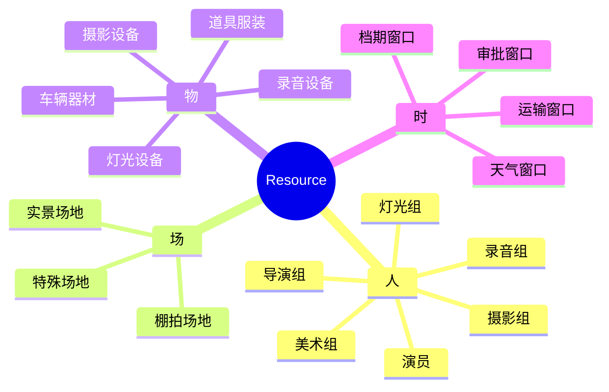

这张图说明：

- 资源对象不是单一类型对象
- 它天然是多维资源系统

---

## 14. `Resource` 对象应该包含哪些核心字段

建议把 `Resource` 对象分成六组字段。

### 第一组：身份字段
- `resource_id`
- `resource_type`
- `resource_name`
- `owner_org`

### 第二组：可用性字段
- `availability_windows`
- `blackout_dates`
- `booking_status`
- `lock_status`

### 第三组：成本字段
- `base_cost`
- `overtime_cost`
- `transport_cost`
- `cancellation_cost`

### 第四组：约束字段
- `location_dependency`
- `compliance_dependency`
- `crew_dependency`
- `setup_time_requirement`

### 第五组：风险字段
- `resource_risk_level`
- `conflict_refs`
- `replacement_difficulty`
- `failure_impact`

### 第六组：联动字段
- `linked_scene_ids`
- `linked_schedule_refs`
- `linked_budget_refs`
- `linked_artifacts`

---

## 15. 一张类图：Budget / Schedule / Resource 的结构关系

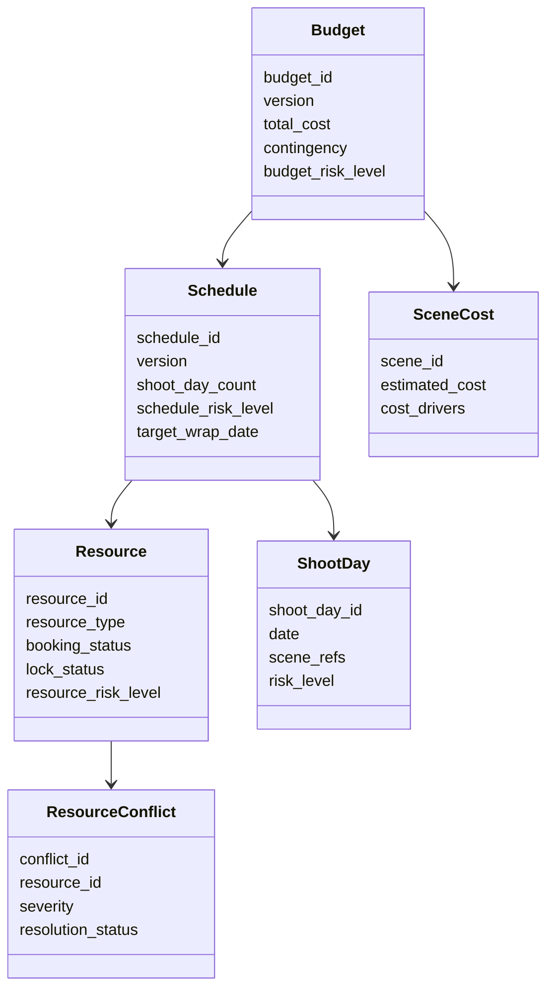

这张图说明：

- 预算、排期、资源不是平行无关对象
- 它们之间必须有明确依赖关系

---

## 16. 为什么这三类对象必须支持“重算”而不是只支持“查看”

这是平台化里非常关键的一点。

传统文档系统往往只能做到：

- 看预算表
- 看排期表
- 看资源表

但多智能体平台必须进一步做到：

- 剧本变化后自动触发预算重估
- 场景变化后自动触发排期重排建议
- 资源变化后自动触发冲突检测
- 审批变化后自动触发阶段推进判断

也就是说，这三类对象必须是：

- 可计算对象
- 可传播对象
- 可重算对象

而不是静态展示对象。

---

## 17. 一张影响传播图：预算、排期、资源如何互相影响

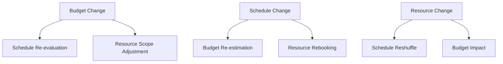

这张图说明：

- 三者之间不是单向依赖，而是双向甚至多向联动

---

## 18. 一张状态图：Budget 对象生命周期

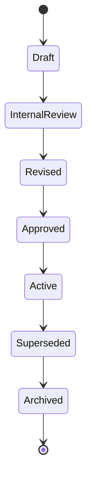

这张图说明：

- 预算对象天然是多版本、多审批边界对象

---

## 19. 一张状态图：Schedule 对象生命周期

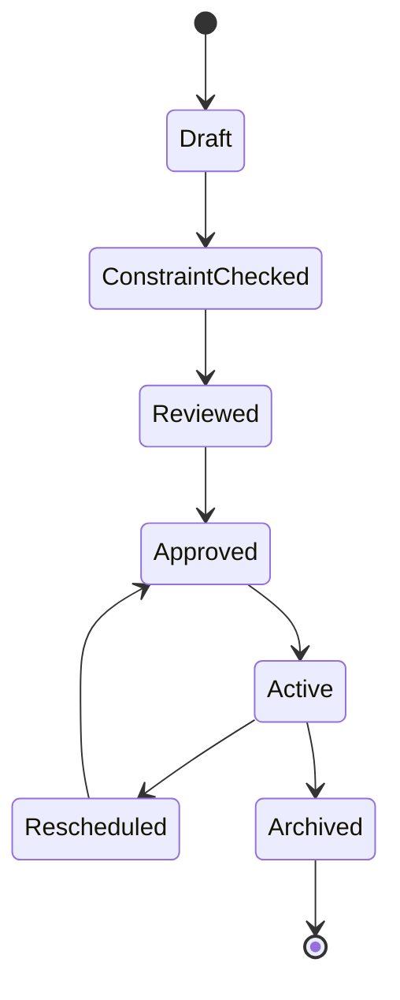

这张图说明：

- 排期对象必须天然支持重排
- “Rescheduled” 不是异常，而是常态能力

---

## 20. 一张状态图：Resource 对象生命周期

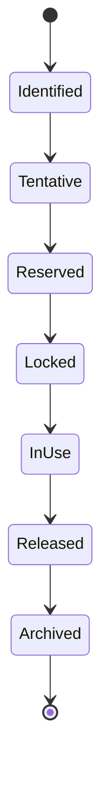

这张图说明：

- 资源对象必须表达从识别到锁定再到释放的全过程

---

## 21. 为什么中国项目更需要“资源冲突对象”

在中国项目里，很多执行问题并不是因为没有计划，而是因为：

- 计划在高压变化下失效
- 资源窗口突然变化
- 审批链导致场地或设备无法按时进入
- 演员档期与宣发、综艺、商业活动冲突
- 天气、交通、地方协调等因素放大资源不确定性

所以中国项目里，`ResourceConflict` 不应该只是日志，而应该是一级风险对象。

它至少要回答：

- 冲突发生在哪个资源上
- 冲突影响哪些场景与拍摄日
- 冲突是否阻塞阶段推进
- 是否存在替代资源
- 替代资源会带来多少预算与排期变化

---

## 22. 一张冲突处理时序图

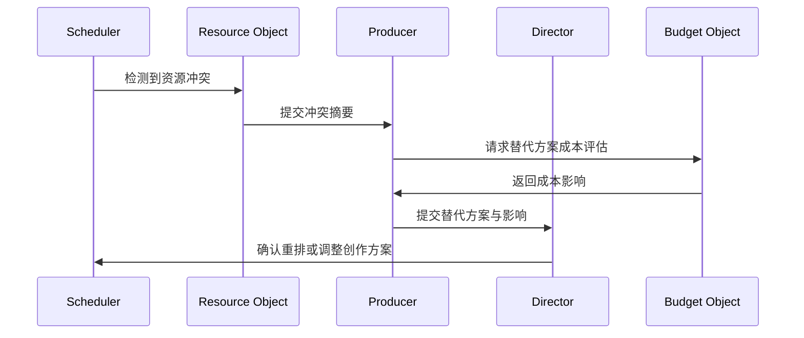

这张图说明：

- 资源冲突不是后勤小问题
- 它会直接进入导演与制片决策层

---

## 23. DeerFlow 里这三类对象最自然的承接方式

如果后面进入代码实现，这三类对象最自然的承接方式会是：

- `Budget / Schedule / Resource` 作为执行层一级核心对象
- producer subagent 负责可行性评估与预算联动
- scheduling subagent 负责排期草案与重排建议
- location / casting / resource-coordinator 类子智能体围绕资源对象继续加工
- `MovieThreadState` 保存当前活跃预算版本、排期版本、关键资源冲突摘要
- artifacts 保存预算草案、排期表、资源冲突报告、替代方案报告

也就是说：

- DeerFlow 的强项不是替代预算软件或排期软件
- DeerFlow 的强项是把这些对象放进统一多智能体工作流里持续推进

---

## 24. 一张 DeerFlow 映射图

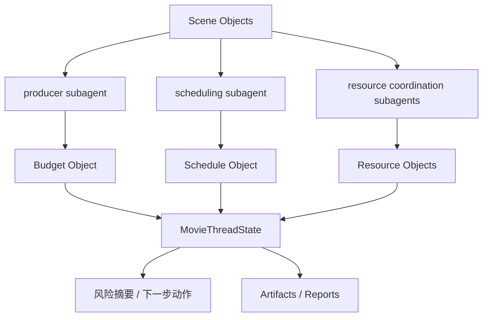

这张图说明：

- 这三类对象是执行层多智能体协作的核心输入与输出

---

## 25. 第一版实现应该做到什么程度

为了避免一开始做得过重，建议第一版先做到下面这个粒度。

### `Budget`
先支持：

- 总预算草案
- 部门预算拆分
- 高成本场景标记
- 风险摘要
- 与排期的基本联动

### `Schedule`
先支持：

- 场景顺序草案
- 拍摄日分组
- 演员 / 场地 / 日夜约束摘要
- 重排建议
- 风险提示

### `Resource`
先支持：

- 关键资源清单
- 可用性窗口
- 预定 / 锁定状态
- 冲突检测
- 替代方案摘要

### 暂时不要一开始就做太深的部分
例如：

- 极细粒度成本模拟
- 极细粒度资源优化算法
- 极细粒度跨项目资源池调度

这些可以后面再做。

---

## 26. 这一篇与后续文档的关系

这一篇回答的是：

**当电影导演智能体平台从创作层进入执行层时，预算、排期、资源这三类对象到底应该怎么建，才能让项目真正具备可执行性判断能力。**

后面几篇会继续把这里往下游推进：

- 65：ShotPlan / Storyboard / PromptPack 对象体系
- 66：Review / Approval / ReleasePackage 对象体系
- 67：工作流状态机设计
- 68：审批流与升级流设计
- 69：记忆与知识沉淀设计
- 70：产物、版本与归档体系设计

---

## 27. 这一篇最重要的结论

### 结论一
`Budget / Schedule / Resource` 不是三个孤立对象，而是电影导演智能体平台执行层的可行性核心系统。

### 结论二
国内外差异的关键，不只是执行习惯不同，而是对象体系是否既能支持标准化计划，又能承受高频变更、资源冲突与审批耦合。

### 结论三
在 DeerFlow 中，把这三类对象作为执行层一级核心对象，再由 `MovieThreadState` 管理当前活跃版本与冲突摘要，是让制片、排期、资源协调类子智能体稳定协作的前提。