# 65. ShotPlan / Storyboard / PromptPack 对象体系

这一篇聚焦：

**为什么电影导演智能体平台在确认“项目拍得起、排得开、资源能落地”之后，下一步必须把镜头计划、分镜表达与生成式提示包建成一套稳定、可追踪、可联动的视觉执行对象体系。**

---

## 1. 为什么 65 要紧接在 64 后面

64 解决的是：

- 这个项目是否可执行
- 预算、排期、资源能否支撑当前创作方案
- 哪些地方会在现实执行里成为卡点

但当可执行性初步成立以后，项目会立刻进入另一个更具体的问题：

**到底要怎么拍，才不会让“可执行”变成“可执行但拍不清楚、拍不统一、拍不出风格”。**

这时候系统真正需要的，不是再生成一轮抽象创意，而是把下面三件事稳定下来：

- 每场戏拆成哪些镜头与镜头组
- 每个镜头在视觉上如何表达
- 每个视觉输出如何被生成式工具、分镜人员、摄影团队、导演反馈稳定复用

所以 64 负责回答“能不能拍”，65 负责回答：

- 要拍哪些镜头
- 镜头之间如何组织
- 视觉意图如何被稳定表达
- 生成式工作流如何进入正式对象体系

也就是说，65 是从“执行可行性”进入“视觉执行控制层”的第一篇。

---

## 2. 为什么要把 ShotPlan / Storyboard / PromptPack 放在一起讲

从 20 号总计划的原始目录看，这里原本更接近：

- `ShotPlan`
- `Storyboard`
- `StyleBoard`

但在当前 61-64 这组文档已经形成的实际文脉里，更适合 DeerFlow 落地的命名是：

- `ShotPlan`
- `Storyboard`
- `PromptPack`

原因是：

- `ShotPlan` 负责把场景翻译成可拍摄的镜头结构
- `Storyboard` 负责把镜头结构翻译成可讨论、可审核、可传递的视觉视图
- `PromptPack` 负责把视觉视图进一步翻译成可复用、可约束、可版本化的生成式执行说明

换句话说，`PromptPack` 可以理解成：

**在生成式工作流进入电影制作平台之后，对原来 `StyleBoard` / 参考板 / 提示词草稿的执行化升级。**

如果只做其中一个，会出现下面的问题：

- 只有 `ShotPlan`，没有稳定视觉视图，镜头语言会靠口头理解漂移
- 只有 `Storyboard`，没有正式镜头对象，视觉图无法稳定回写执行计划
- 只有 `PromptPack`，没有镜头与分镜约束，生成式结果会变成散乱素材

所以这三类对象必须一起设计，它们共同构成：

- 视觉意图层
- 视觉表达层
- 视觉生成层

---

## 3. 一张总览图：从场景到视觉执行对象

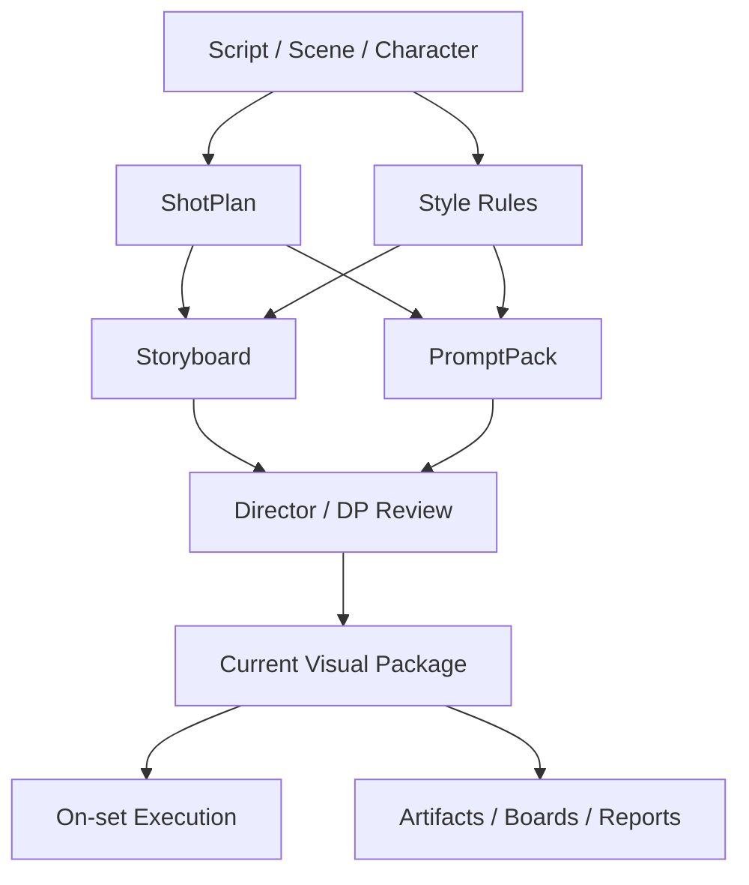

这张图说明：

- `Scene` 提供叙事与执行上游
- `ShotPlan` 先把“拍什么”结构化
- `Storyboard` 再把“怎么看起来”可视化
- `PromptPack` 把“如何用生成式工具产出参考结果”执行化
- 三者合起来形成当前可用的视觉执行包

---

## 4. 为什么 `ShotPlan` 不是“镜头表 Excel”

很多团队会把镜头计划理解成：

- 一个简单 shot list
- 若干镜头编号
- 景别、机位、备注几列

这在人工密集的小规模流程里还能勉强工作，但在导演智能体平台里远远不够。

原因是平台里的 `ShotPlan` 至少要同时承担：

- 叙事目标表达
- 机位与运动表达
- 调度与 blocking 表达
- 设备与执行约束表达
- 风险与替代方案表达
- 与 storyboard / prompt pack 的引用关系表达

也就是说，`ShotPlan` 不是“镜头清单”，而是：

- 镜头级执行对象
- 视觉设计对象
- 协同入口对象
- 变更传播对象

它必须能回答：

- 为什么要有这个镜头
- 这个镜头服务哪段情绪与叙事目标
- 这个镜头需要哪些前提条件
- 如果这个镜头改了，会影响哪些下游对象

---

## 5. 为什么 `Storyboard` 不能只是一组图片附件

这也是一个非常容易做浅的点。

很多系统把分镜理解成：

- 一页图片
- 若干草图
- 一个 PDF
- 一个上传附件

但在电影导演智能体平台里，`Storyboard` 的真正价值不是“有图”，而是“图和镜头对象之间是否有稳定关系”。

`Storyboard` 至少要承担：

- 镜头构图表达
- 角色站位与运动趋势表达
- 摄影机与主体关系表达
- 空间关系表达
- 视觉节奏表达
- review 注释承接
- 版本比较与归档

也就是说，分镜不应该是漂浮在镜头对象外面的图片堆，而应该是：

- 某个 `ShotPlan` 的视觉视图
- 可被审核与批注的对象
- 可被生成式工具与人工团队共同引用的中间层对象

---

## 6. 为什么 `PromptPack` 不能停留在 prompt 历史里

如果生成式图像、视频、预演工具要真正进入正式制作流程，平台就不能只保存：

- 一段 prompt 文本
- 几条聊天记录
- 某次临时试图的参数

因为这些东西都缺少正式生产系统真正需要的能力：

- 版本边界
- 引用边界
- 当前有效边界
- 审核边界
- 可复用边界

`PromptPack` 真正应该表达的是：

- 针对哪个镜头或镜头组
- 适用于哪类生成目标
- 使用哪些角色、服化道、场景、风格引用
- 哪些元素必须出现
- 哪些元素必须避免
- 哪些参数允许变化，哪些不能变化

所以 `PromptPack` 不是“提示词文本”，而是：

- 生成式执行对象
- 视觉约束对象
- 一致性控制对象
- 可复用模板对象

---

## 7. 这三类对象分别解决什么问题

### `ShotPlan`
回答的是：

- 这场戏拆成哪些镜头
- 每个镜头服务什么叙事功能
- 每个镜头的摄影策略是什么
- 每个镜头有什么执行依赖与风险

### `Storyboard`
回答的是：

- 这个镜头的主体、空间、构图、节奏如何被看见
- 导演、摄影、美术、灯光、视效如何对同一个画面达成共识
- 哪些画面已经评审通过，哪些还需要修改

### `PromptPack`
回答的是：

- 如果要用生成式工具辅助出图、做参考帧、做预演，该如何稳定地产出
- 如何在多轮试图中保持角色、空间、镜头语言的一致性
- 如何让 prompt 工作流从个人习惯变成正式生产能力

---

## 8. 海外成熟流程给我们的启示

在成熟电影流程里，导演与摄影、美术、视效在前期通常会逐步形成：

- shot list
- storyboard
- tech scout notes
- look references
- previs / animatic

它们的共同点不是“形式不同”，而是都在做同一件事：

**把抽象创作意图压缩成各部门可共享的视觉执行语言。**

而在今天引入生成式工具以后，这个共享语言又多了一层：

- 生成式提示与参考绑定
- 角色与道具一致性约束
- current / approved / archived 的出图边界

这说明 `PromptPack` 不是额外附属物，而是在新工作流里承担了原来部分 lookbook、参考板、试图参数的正式对象角色。

---

## 9. 国内项目里的现实差异

国内项目在这一层会更明显遇到下面这些问题：

- 前期压缩，镜头设计容易来不及系统化
- 分镜质量高度依赖个人经验，口头解释比例高
- 现场变更频繁，导致镜头计划与分镜很容易脱节
- 生成式出图往往分散在个人工具和聊天窗口里，不进入正式版本体系
- 导演、摄影、美术对“当前有效参考”理解不一致

这意味着中国语境下的这组对象体系，不能只支持“理想化前期流程”，还必须支持：

- 快速重组镜头
- 快速回写分镜变化
- 现场替代方案记录
- 高压变更下的 current 版本切换
- 生成式结果的正式纳管

换句话说，海外更强调“前置明确化”，国内更需要“前置明确化 + 高频变化承受能力”。

---

## 10. 一张时序图：场景变化如何传播到视觉执行对象

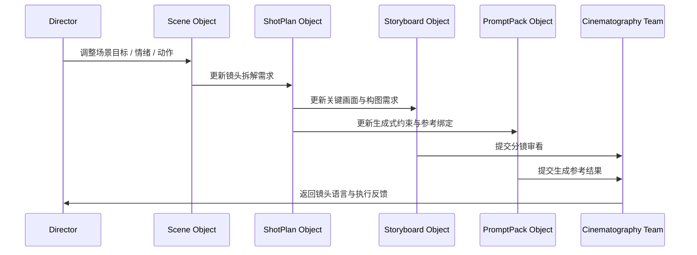

这张图说明：

- 创作变化不会直接停留在 `Scene`
- 它必须被翻译成镜头、画面、生成式约束三层变化

---

## 11. `ShotPlan` 对象至少要分成哪几层

建议把 `ShotPlan` 看成五层对象。

### 第一层：叙事层
回答这个镜头为什么存在。

建议字段：

- `story_purpose`
- `emotion_target`
- `beat_position`
- `narrative_priority`

### 第二层：摄影层
回答这个镜头怎么拍。

建议字段：

- `shot_size`
- `camera_angle`
- `lens_notes`
- `movement_type`
- `camera_axis_notes`

### 第三层：表演与调度层
回答主体如何移动、如何进入画面。

建议字段：

- `blocking_notes`
- `character_focus_ids`
- `performance_cue`
- `background_action_notes`

### 第四层：执行层
回答这个镜头要依赖什么现实条件。

建议字段：

- `equipment_requirements`
- `lighting_dependency`
- `vfx_dependency`
- `special_prop_dependency`
- `location_constraint`

### 第五层：治理层
回答这个镜头当前处于什么状态。

建议字段：

- `version`
- `approval_status`
- `is_current`
- `change_summary`
- `linked_storyboard_ids`
- `linked_prompt_pack_ids`

---

## 12. 一张 `ShotPlan` 分层图

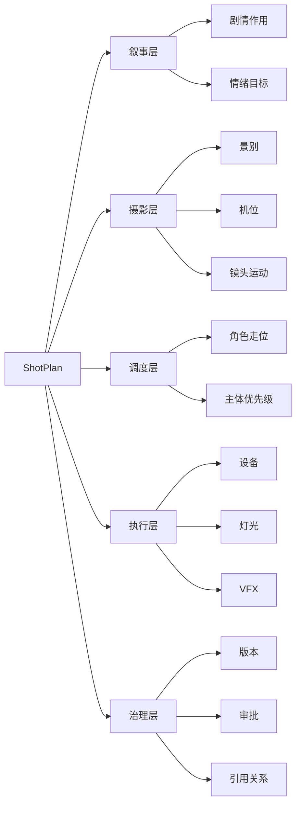

这张图强调：

- `ShotPlan` 不是单层字段集合
- 它天然跨越创作、摄影、执行、治理四个维度

---

## 13. `ShotPlan` 对象应该包含哪些核心字段

建议把 `ShotPlan` 字段拆成七组。

### 第一组：身份字段
- `shot_plan_id`
- `project_id`
- `scene_id`
- `sequence_id`
- `shot_number`

### 第二组：镜头目标字段
- `story_purpose`
- `emotion_target`
- `coverage_role`
- `priority_level`

### 第三组：摄影设计字段
- `shot_size`
- `camera_angle`
- `lens_notes`
- `movement_type`
- `frame_ratio_notes`

### 第四组：调度与空间字段
- `blocking_notes`
- `subject_entry_exit`
- `foreground_background_relation`
- `space_axis_notes`

### 第五组：执行字段
- `equipment_requirements`
- `lighting_dependency`
- `vfx_dependency`
- `stunt_flag`
- `estimated_setup_time`

### 第六组：联动字段
- `linked_storyboard_ids`
- `linked_prompt_pack_ids`
- `linked_schedule_refs`
- `linked_resource_refs`
- `continuity_anchor_refs`

### 第七组：治理字段
- `version`
- `approval_status`
- `is_current`
- `is_locked`
- `archived_at`

---

## 14. 为什么 `Storyboard` 必须是“可审核视觉对象”

分镜在平台里最大的价值，不是替摄影师替导演思考，而是让跨部门沟通有一个稳定的可审看对象。

一个合格的 `Storyboard` 至少应该支持：

- 单帧或多帧表达
- 镜头顺序与镜头 ID 绑定
- 画面批注
- 构图变体比较
- 导演 / 摄影 / 美术 / 视效联合评审
- current 版与 archived 版区分

如果没有这些能力，分镜就很容易退化成：

- 看过就算
- 改了不留痕
- 不知道当前哪版有效
- 与镜头计划断开

所以 `Storyboard` 的本质不是“图”，而是：

- 视觉审看对象
- 协作批注对象
- 镜头计划的可视化视图

---

## 15. `Storyboard` 对象应该包含哪些核心字段

建议把 `Storyboard` 字段拆成六组。

### 第一组：身份字段
- `storyboard_id`
- `project_id`
- `scene_id`
- `shot_plan_id`
- `frame_group_id`

### 第二组：构图字段
- `frame_description`
- `subject_priority`
- `composition_notes`
- `depth_notes`
- `camera_to_subject_relation`

### 第三组：动作字段
- `blocking_frame_notes`
- `movement_direction`
- `timing_notes`
- `transition_notes`

### 第四组：参考字段
- `style_reference_ids`
- `character_reference_ids`
- `location_reference_ids`
- `color_mood_tags`

### 第五组：审看字段
- `annotation_refs`
- `review_round_refs`
- `revision_summary`
- `approval_status`

### 第六组：治理字段
- `version`
- `is_current`
- `source_type`
- `render_asset_refs`
- `archived_at`

---

## 16. 一张 `Storyboard` 派生图：从镜头对象到视觉视图

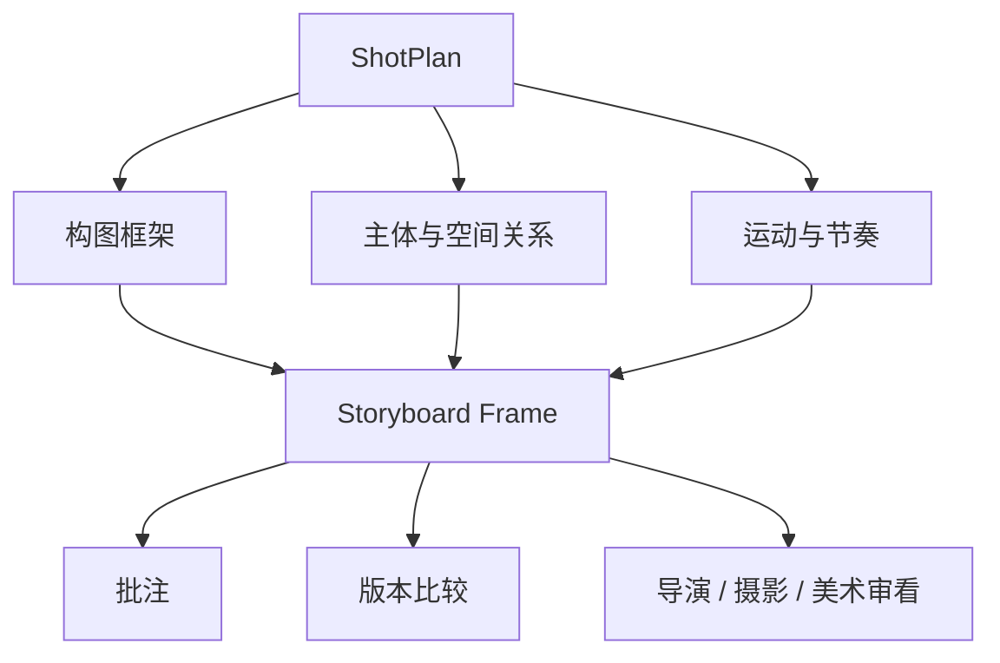

这张图说明：

- 分镜不是独立灵感物
- 它是镜头对象的视觉表达视图

---

## 17. 为什么 `PromptPack` 是生成式工作流的正式对象边界

如果不把 prompt 相关内容正式建模，系统会很快出现下面的混乱：

- 不知道哪一版提示词生成了当前参考图
- 不知道哪些参考角色图是同一角色体系
- 不知道负面约束有没有丢失
- 不知道当前是探索版、审看版还是定稿版
- 不知道换模型或换参数后为什么结果漂移

所以 `PromptPack` 必须表达的不只是提示词文本，而是：

- 目标对象
- 目标输出
- 参考绑定
- 约束规则
- 允许变化范围
- 批准边界

它更像一个：

- 可复用的生成式执行协议
- 镜头和视觉风格之间的翻译器

---

## 18. `PromptPack` 对象应该包含哪些核心字段

建议把 `PromptPack` 字段拆成七组。

### 第一组：身份字段
- `prompt_pack_id`
- `project_id`
- `scope_type`
- `scope_ref_id`
- `target_output_type`

### 第二组：生成目标字段
- `goal_summary`
- `visual_focus`
- `shot_intent`
- `variation_mode`

### 第三组：内容模板字段
- `prompt_template`
- `style_tokens`
- `subject_tokens`
- `environment_tokens`
- `negative_constraints`

### 第四组：引用绑定字段
- `character_reference_ids`
- `costume_reference_ids`
- `location_reference_ids`
- `storyboard_reference_ids`
- `style_reference_ids`

### 第五组：一致性字段
- `continuity_rules`
- `must_keep_elements`
- `allowed_variations`
- `palette_constraints`
- `lens_language_constraints`

### 第六组：执行字段
- `tool_profile`
- `aspect_ratio_rule`
- `seed_policy`
- `iteration_limit`
- `selection_rule`

### 第七组：治理字段
- `version`
- `approval_status`
- `is_current`
- `linked_outputs`
- `archived_at`

---

## 19. 一张 `PromptPack` 结构图

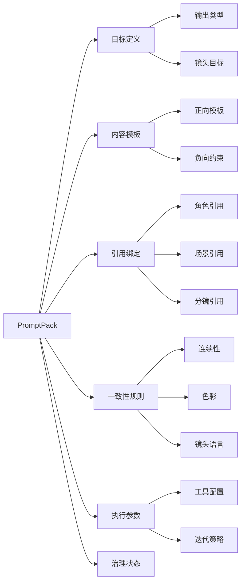

这张图说明：

- `PromptPack` 不是一段字符串
- 它天然是多段式结构对象

---

## 20. 一张类图：三类对象之间的结构关系

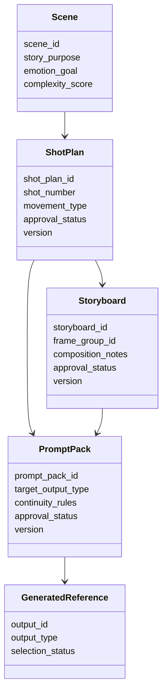

这张图说明：

- `ShotPlan` 是主干对象
- `Storyboard` 和 `PromptPack` 是不同形态的下游视图
- 二者又会共同产出最终可用参考结果

---

## 21. 为什么这三类对象必须支持双向追踪

这是平台化里非常关键的一点。

系统不只要能从上游推到下游，还要能从下游追溯回上游。

例如：

### 上游到下游
- 场景动作改变，镜头计划要重算
- 镜头计划变化，分镜要更新
- 分镜变化，prompt 约束要更新

### 下游回溯上游
- 某张参考帧不成立，要知道对应哪个 `PromptPack`
- 某个 `PromptPack` 不稳定，要知道它绑定了哪个 `Storyboard`
- 某个 `Storyboard` 被否决，要知道影响哪些 `ShotPlan`
- 某个镜头执行困难，要知道是否该回到 `Scene` 层调整

如果没有双向追踪，系统就只能“生成更多东西”，却无法“控制变化影响”。

---

## 22. 一张影响传播图：镜头变化如何向外扩散

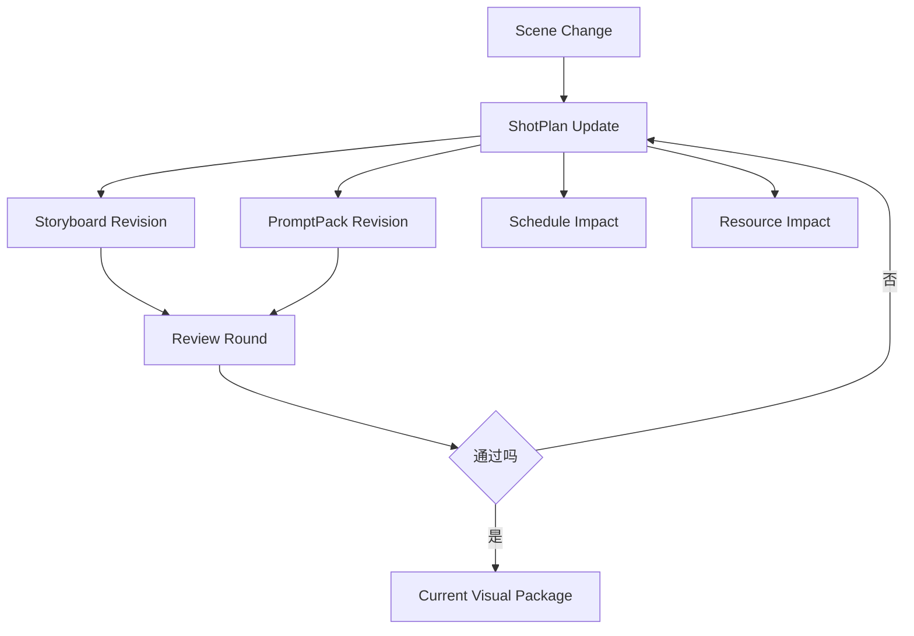

这张图说明：

- 视觉执行对象变化不是局部修改
- 它会同时影响 review、排期、资源，甚至回推创作层

---

## 23. 一张状态图：`ShotPlan` 对象生命周期

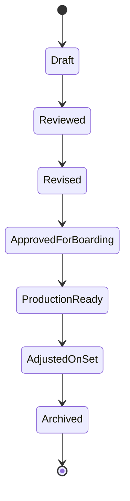

这张图说明：

- `ShotPlan` 从来不是一次性写完
- 它会经历审看、修订、拍摄前冻结、现场微调、归档

---

## 24. 一张状态图：`Storyboard` 对象生命周期

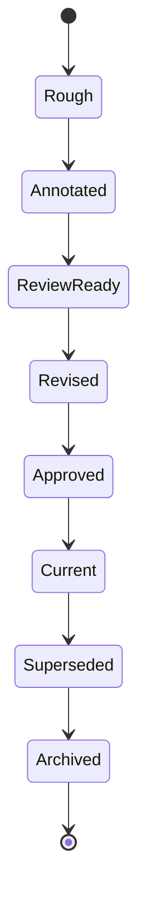

这张图说明：

- 分镜对象的关键不只是“画没画完”
- 而是它有没有进入正式 review、current、superseded 边界

---

## 25. 一张状态图：`PromptPack` 对象生命周期

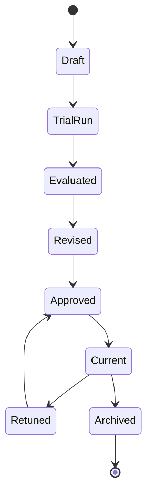

这张图说明：

- 生成式执行对象天然需要反复试跑与调优
- 但调优也必须进入正式生命周期，而不是散落在临时聊天里

---

## 26. DeerFlow 里这三类对象最自然的承接方式

如果后面进入代码实现，这三类对象最自然的承接方式会是：

- `ShotPlan / Storyboard / PromptPack` 作为视觉执行层一级核心对象
- storyboard subagent 负责初步分镜草案与关键帧结构化输出
- cinematography-language subagent 负责镜头语言规则与摄影约束注入
- 图像 / 视频 / previs 类 worker 围绕 `PromptPack` 产出参考结果
- `MovieThreadState` 保存当前活跃镜头包、当前有效分镜版、当前 prompt pack 版本摘要
- artifacts 保存导出的镜头表、分镜图、关键帧、比较报告、可交付视觉包

也就是说：

- DeerFlow 的强项不是代替分镜师或摄影指导
- DeerFlow 的强项是把镜头、分镜、生成式执行统一放进可追踪的对象系统

---

## 27. 一张 DeerFlow 映射图

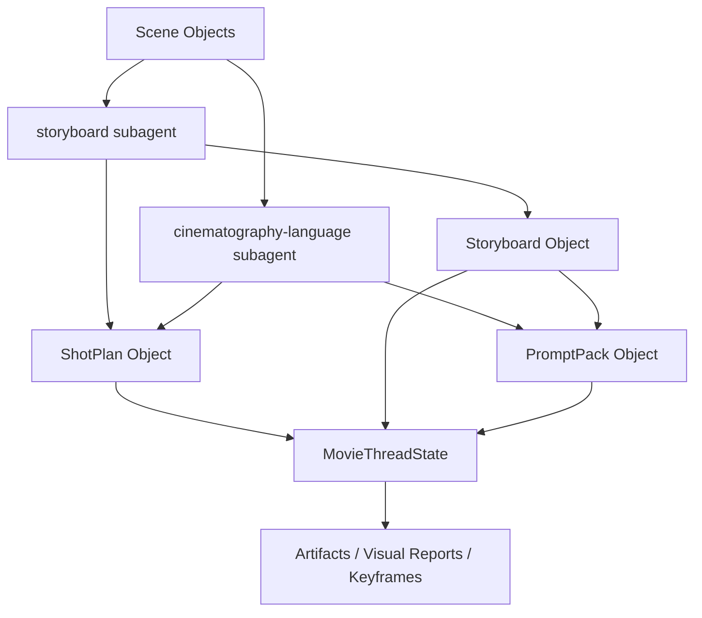

这张图说明：

- 三类对象是视觉执行层多智能体协作的共同中轴
- 它们会同时进入状态层与产物层

---

## 28. 第一版实现应该做到什么程度

为了避免一开始做得过重，建议第一版先做到下面这个粒度。

### `ShotPlan`
先支持：

- 场景级镜头拆解
- 镜头编号与镜头目标
- 基础摄影语言字段
- 基础执行依赖字段
- 与 storyboard / prompt pack 的引用关系

### `Storyboard`
先支持：

- 关键帧级分镜
- 构图与主体优先级说明
- 批注与 review 状态
- current / archived 边界

### `PromptPack`
先支持：

- 镜头级提示包
- 引用绑定
- 一致性规则
- 工具配置摘要
- 版本与审批状态

### 暂时不要一开始就做太深的部分
例如：

- 极细粒度镜头几何模拟
- 大规模自动镜头优化
- 全自动 animatic 生成与剪辑联动
- 跨模型大规模参数寻优

这些可以在后面逐步补。

---

## 29. 这一篇与后续文档的关系

这一篇回答的是：

**当电影导演智能体平台已经知道“项目拍得起、排得开”之后，镜头计划、分镜表达与生成式执行说明到底应该怎么建，才能让视觉执行层稳定协作。**

后面几篇会继续把这里往治理层与控制层推进：

- 66：Review / Approval / ReleasePackage 对象体系
- 67：工作流状态机设计
- 68：审批流与升级流设计
- 69：记忆与知识沉淀设计
- 70：产物、版本与归档体系设计

---

## 30. 这一篇最重要的结论

### 结论一
`ShotPlan / Storyboard / PromptPack` 不是三个松散附件，而是电影导演智能体平台视觉执行层的三根主骨架。

### 结论二
国内外差异的关键，不只是有没有分镜，而是对象体系是否既能支持前置视觉统一，又能承受高频变更与生成式工作流正式纳管。

### 结论三
在 DeerFlow 中，把这三类对象作为视觉执行层一级对象，再由 `MovieThreadState` 管理当前有效版本与引用关系，是让导演、摄影、分镜、生成式工具稳定协作的前提。
