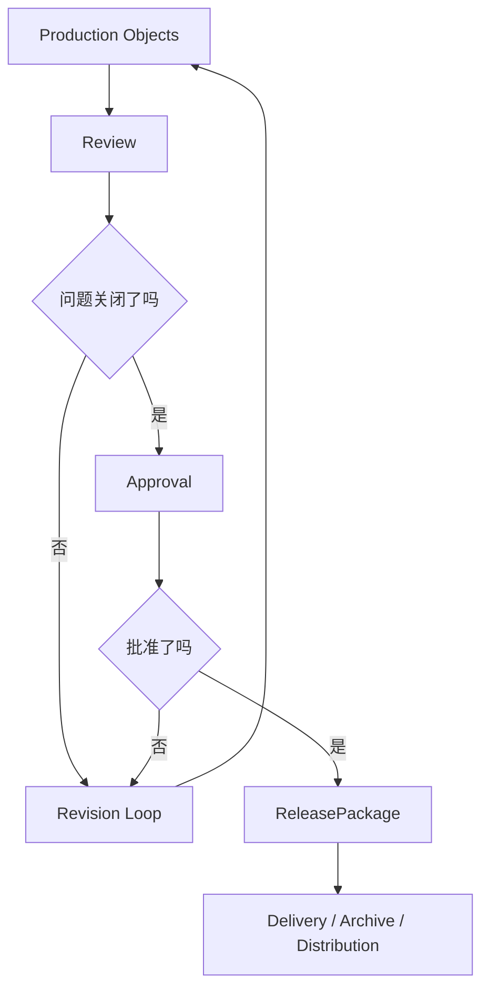
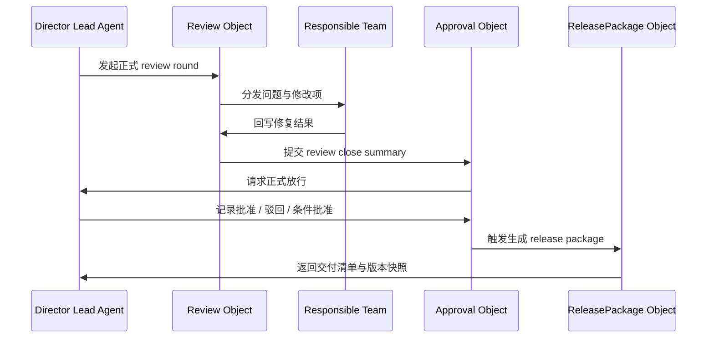
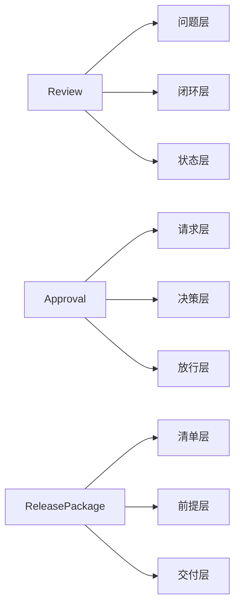
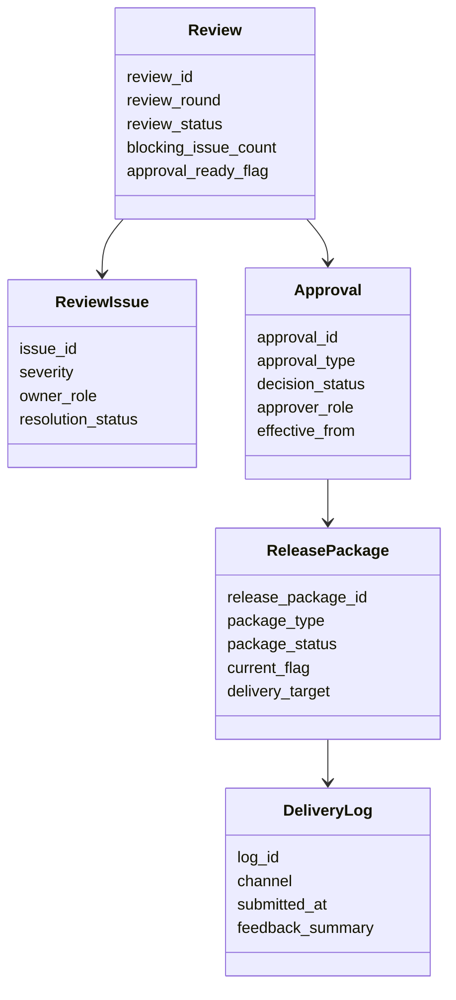
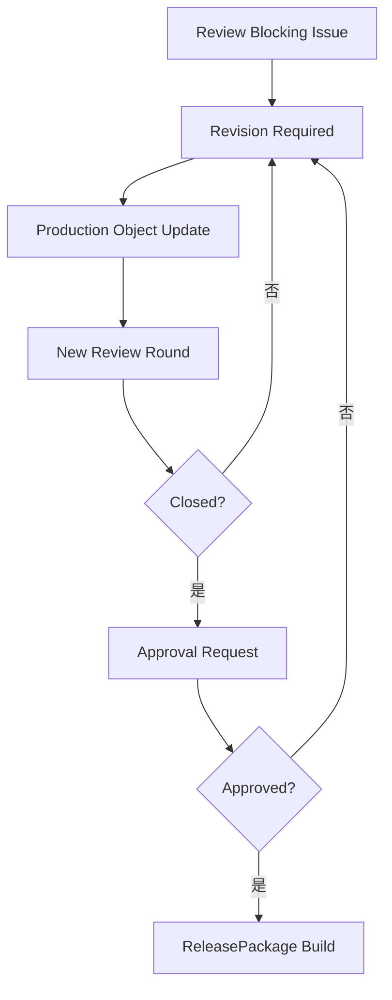
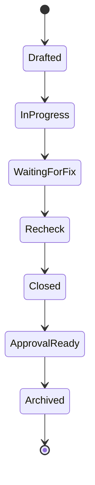
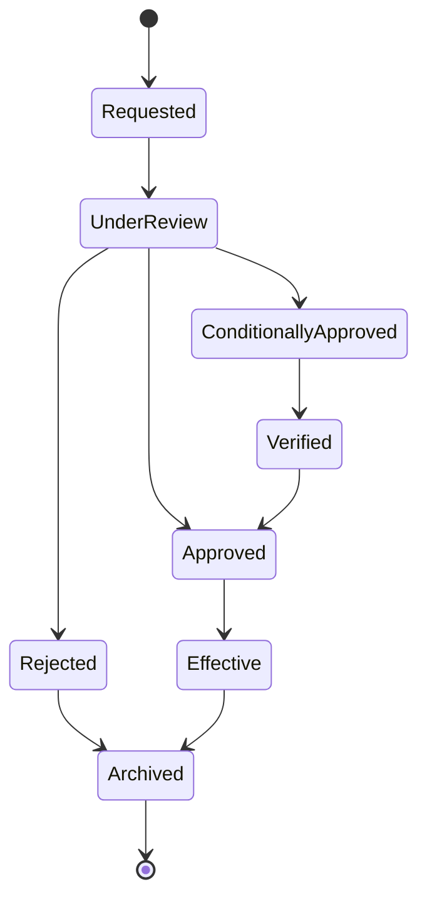
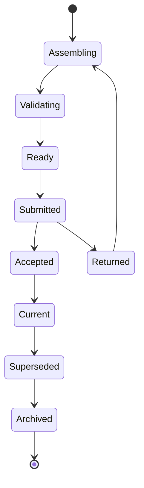
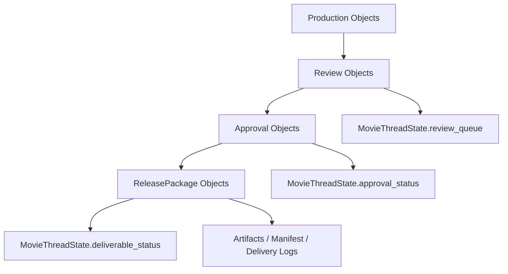

# 66. Review / Approval / ReleasePackage 对象体系

这一篇聚焦：

**为什么电影导演智能体平台在拥有镜头、分镜、预算、排期等生产对象之后，必须再建立 review、approval、release package 这组三类治理对象，才能把“做出来”真正变成“被确认、被放行、被交付”。**

---

## 1. 为什么 66 要紧接在 65 后面

65 解决的是：

- 镜头怎么拆
- 分镜怎么表达
- 生成式视觉说明怎么纳入正式对象体系

但如果只有这些对象，系统仍然会立刻遇到一个问题：

**谁来确认这些结果是可接受的，谁来决定它们可以进入下一阶段，谁来把它们装配成正式可交付的包。**

这正是 66 要解决的问题。

因为在真实电影制作里，真正决定项目能不能往下走的，往往不是有没有产出，而是：

- 产出是否经过 review
- review 后是否被批准
- 批准之后是否形成正式可交付版本

所以 65 负责回答“怎么把创作意图转成视觉执行对象”，66 负责回答：

- 这些对象怎么进入正式评审
- 评审结果如何转成批准边界
- 被批准的内容如何形成可交付包

---

## 2. 为什么 `Review / Approval / ReleasePackage` 必须一起讲

很多团队会把这三件事拆开看：

- review 是创作讨论
- approval 是管理动作
- release package 是交付物整理

但在平台里，它们从来不是三条独立线，而是一条连续治理链。

因为：

- 没有 `Review`，系统不知道问题是什么、问题有没有被修
- 没有 `Approval`，系统不知道哪版结果可以进入下一步
- 没有 `ReleasePackage`，系统不知道批准结果如何变成可交付实体

如果三者断开，平台就会退化成：

- 有批注，但没有闭环
- 有“同意”，但不知道同意的是哪版
- 有文件包，但不知道它是怎么被放行的

所以这三类对象必须形成一条治理链：

- `Review` 负责发现问题与组织反馈
- `Approval` 负责形成正式决策边界
- `ReleasePackage` 负责形成正式交付边界

---

## 3. 一张总览图：从生产对象到正式交付

这张图说明：

- 治理链不是“末端附属”
- 它直接决定生产对象能否进入下一阶段和下一边界

---

## 4. 为什么 `Review` 不是“批注列表”

很多系统会把 review 做成很浅的注释容器：

- 留言
- 评论
- 红笔标注
- 群聊反馈

这些工具可以帮助讨论，但还不是正式的 `Review` 对象。

在电影导演智能体平台里，`Review` 至少要承载：

- review 范围
- review 轮次
- reviewer 角色
- 问题分级
- 问题归属
- 是否阻塞推进
- 问题关闭状态

也就是说，`Review` 不是“有人说了什么”，而是：

- 正式评审事件对象
- 问题治理对象
- 版本比较对象
- 阶段门禁输入对象

---

## 5. 为什么 `Approval` 不是“点一下通过”

平台里很多混乱，恰恰来自审批被理解成一个非常轻的动作：

- 通过
- 驳回
- 待修改

但真实制作里，`Approval` 从来不只是一个按钮。

它至少要回答：

- 审批的是哪个对象、哪一版
- 审批范围是什么
- 审批责任人是谁
- 审批依据是什么
- 审批是否附带条件
- 审批会放行到哪个阶段
- 审批失败后应该回到哪里

所以 `Approval` 的本质不是状态值，而是：

- 决策对象
- 边界对象
- 风险承接对象
- 阶段放行对象

---

## 6. 为什么 `ReleasePackage` 不是“压缩包”

很多团队到交付阶段，最后只有：

- 一堆文件夹
- 一堆网盘链接
- 一个 zip 包

但这些都不等于平台里的 `ReleasePackage`。

正式的 `ReleasePackage` 至少需要表达：

- 交付目的是什么
- 包里包含哪些对象与产物
- 哪些是 current 版
- 哪些审批是前置条件
- 是否满足完整性检查
- 交付之后如何归档与追溯

所以 `ReleasePackage` 不是“文件打包”，而是：

- 交付边界对象
- 合规边界对象
- 版本快照对象
- 外部沟通对象

---

## 7. 为什么在这一篇里不单独展开 `Version`

20 号总规划里，这里更接近 `Review / Approval / Version`。

而在当前 61-70 这组实际文脉里，更适合把 `Version` 拆成两部分：

- 66 先讲 review、approval、release package 这条治理链
- 70 再专门把产物、版本、归档系统整体讲清楚

这样做的好处是：

- 66 更聚焦治理边界
- 70 更聚焦产物边界
- 二者合在一起，正好把原计划里的 version 问题拆深

---

## 8. 海外成熟流程给我们的启示

成熟影视流程的共识一直很明确：

- review 要留痕
- approved 和 current 要有明确边界
- delivery package 必须有清晰清单
- 交付不是文件集合，而是流程结果

这说明 review、approval、release package 三类对象并不是附属治理层，而是：

- 生产结果能否被信任的前提
- 跨部门协作能否闭环的前提
- 对外交付能否稳定的前提

---

## 9. 国内项目里的现实差异

国内项目在这条治理链上，通常会更明显遇到下面几类压力：

- review 节奏更密集，但留痕常常不足
- 创作 review 与管理 approval 的边界容易混在一起
- 审核、送审、宣发、档期窗口会反向影响后期 review
- 最终交付经常带有更强的阶段性、版本性和对外口径要求

这意味着中国语境下的这组对象体系，不能只支持“理想化流程”，还必须支持：

- 多轮 review 并行
- 条件式 approval
- 阶段性 release package
- 临时补件与回滚
- current / approved / submitted / archived 的明确区分

换句话说，海外更强调标准化治理，国内更需要标准化治理 + 高压时限下的可追踪切换能力。

---

## 10. 一张时序图：一次正式放行是如何发生的

这张图说明：

- 正式放行不是单点动作
- 它必须串起 review 关闭、approval 决策、package 生成三段流程

---

## 11. `Review` 对象至少要分成哪几层

建议把 `Review` 看成四层对象。

### 第一层：范围层
回答 review 的对象边界。

建议字段：

- `scope_type`
- `scope_ref_ids`
- `review_round`
- `review_goal`

### 第二层：问题层
回答到底发现了哪些问题。

建议字段：

- `issue_items`
- `severity`
- `blocking_flag`
- `owner_role`

### 第三层：闭环层
回答问题是否被处理。

建议字段：

- `resolution_status`
- `resolution_notes`
- `reopened_flag`
- `deadline`

### 第四层：治理层
回答这轮 review 当前所处状态。

建议字段：

- `review_status`
- `approval_ready_flag`
- `current_flag`
- `archived_at`

---

## 12. `Review` 对象应该包含哪些核心字段

建议把 `Review` 字段拆成七组。

### 第一组：身份字段
- `review_id`
- `project_id`
- `review_type`
- `review_round`
- `scope_type`

### 第二组：范围字段
- `scope_ref_ids`
- `target_version_refs`
- `review_goal`
- `reviewer_roles`

### 第三组：问题字段
- `issue_items`
- `severity_summary`
- `blocking_issue_count`
- `must_fix_items`

### 第四组：分配字段
- `owner_role_map`
- `due_date`
- `follow_up_plan`
- `escalation_flag`

### 第五组：闭环字段
- `resolution_status_map`
- `reopen_count`
- `close_summary`
- `remaining_risks`

### 第六组：联动字段
- `linked_approval_id`
- `linked_package_ids`
- `linked_artifact_refs`
- `decision_record_refs`

### 第七组：治理字段
- `review_status`
- `approval_ready_flag`
- `is_current`
- `archived_at`

---

## 13. 为什么 `Approval` 必须是正式决策对象

如果 review 是“讨论与修正的正式化”，那么 approval 就是“责任与边界的正式化”。

一个合格的 `Approval` 对象至少要表达：

- 审批请求从哪里来
- 审批权限属于谁
- 审批通过意味着什么边界变化
- 审批失败意味着要回退到哪里
- 审批是否有条件、期限、补充材料要求

这很重要，因为电影制作里的很多混乱都来自下面这种状态：

- 大家“默认已经同意”
- 但没人能说清谁同意的
- 也没人能说清同意的是哪版
- 更没人能说清这次同意能放行到哪一步

所以 `Approval` 不是意见，而是：

- 责任承接点
- 阶段边界切换点
- 版本合法化入口

---

## 14. `Approval` 对象应该包含哪些核心字段

建议把 `Approval` 字段拆成七组。

### 第一组：身份字段
- `approval_id`
- `project_id`
- `approval_type`
- `scope_type`
- `scope_ref_ids`

### 第二组：请求字段
- `requested_by`
- `requested_at`
- `request_reason`
- `requested_transition`

### 第三组：依据字段
- `review_summary_refs`
- `evidence_refs`
- `risk_summary`
- `condition_notes`

### 第四组：责任字段
- `approver_role`
- `approver_id`
- `authority_level`
- `delegate_rule`

### 第五组：决策字段
- `decision_status`
- `decision_notes`
- `decision_at`
- `effective_from`

### 第六组：联动字段
- `release_gate_refs`
- `linked_package_ids`
- `rollback_target`
- `escalation_case_refs`

### 第七组：治理字段
- `is_current`
- `is_locked`
- `expires_at`
- `archived_at`

---

## 15. 为什么 `ReleasePackage` 必须是“可交付快照对象”

正式交付最怕两件事：

- 交付内容不完整
- 交付内容说不清来自哪一版

所以 `ReleasePackage` 必须不仅能装文件，还要能装：

- 交付目的
- 交付清单
- 审批前提
- 来源版本
- 当前状态
- 对外口径

在平台里，`ReleasePackage` 的价值是把很多分散对象压缩成一个正式快照。

它必须让系统在任意时刻都能回答：

- 这个包是给谁的
- 为什么生成
- 里面有哪些内容
- 哪些内容经过了哪些批准
- 这个包之后有没有被 supersede

---

## 16. `ReleasePackage` 对象应该包含哪些核心字段

建议把 `ReleasePackage` 字段拆成七组。

### 第一组：身份字段
- `release_package_id`
- `project_id`
- `package_type`
- `package_label`
- `package_version`

### 第二组：目的字段
- `delivery_target`
- `delivery_goal`
- `distribution_scope`
- `visibility_level`

### 第三组：内容字段
- `included_artifact_refs`
- `included_object_refs`
- `manifest`
- `checksum_summary`

### 第四组：前提字段
- `required_approval_refs`
- `required_review_refs`
- `completion_checklist`
- `blocking_items`

### 第五组：状态字段
- `package_status`
- `submission_status`
- `current_flag`
- `superseded_by`

### 第六组：联动字段
- `archive_package_ref`
- `delivery_log_refs`
- `external_feedback_refs`
- `rollback_refs`

### 第七组：治理字段
- `created_by`
- `created_at`
- `archived_at`
- `retention_policy`

---

## 17. 一张分层图：治理链的三层对象

这张图说明：

- 三类对象都不是单一状态值
- 它们各自都有独立的结构化职责

---

## 18. 一张类图：`Review / Approval / ReleasePackage` 的关系

这张图说明：

- `Review` 组织问题
- `Approval` 组织决策
- `ReleasePackage` 组织正式交付

---

## 19. 为什么这三类对象必须支持“门禁语义”

如果没有 gate 语义，平台就只能记录过程，不能控制推进。

所谓门禁语义，指的是系统不仅知道：

- review 做了没有
- approval 点了没有
- package 生成了没有

还要知道：

- review 关闭是否达到进入审批的条件
- approval 通过是否真的允许状态机推进
- release package 是否满足某个交付窗口的要求

换句话说：

- `Review` 不是聊天记录，它是 gate input
- `Approval` 不是按钮，它是 gate decision
- `ReleasePackage` 不是文件夹，它是 gate output

---

## 20. 一张影响传播图：治理链如何反向推动返工

这张图说明：

- review 和 approval 不是项目尾声动作
- 它们会持续把项目推回返工循环

---

## 21. 一张状态图：`Review` 对象生命周期

这张图说明：

- review 天然是轮次化、闭环化对象
- 关闭不是结束，进入 approval ready 才是下一道边界

---

## 22. 一张状态图：`Approval` 对象生命周期

这张图说明：

- “条件批准”在真实项目里是常态，不是例外
- approval 对象必须表达正式生效边界

---

## 23. 一张状态图：`ReleasePackage` 对象生命周期

这张图说明：

- package 不是一生成就结束
- 它还会经历校验、提交、接受、退回、替换、归档

---

## 24. 为什么平台必须支持多粒度 review

电影制作里的 review 不是单一粒度。

它至少可能发生在：

- 场景级
- 镜头级
- 分镜级
- 剪辑版本级
- 声音版本级
- 宣发素材级
- 交付包级

这意味着 `Review` 对象必须天然支持：

- `scope_type`
- `scope_ref_ids`
- `review_type`

否则系统只能做“一个统一 review 模板”，最后既不适合创作 review，也不适合交付 review。

---

## 25. DeerFlow 里这三类对象最自然的承接方式

如果后面进入代码实现，这三类对象最自然的承接方式会是：

- `Review` 作为多阶段共用的正式评审对象
- `Approval` 作为阶段放行和关键版本生效对象
- `ReleasePackage` 作为产物层与对象层之间的正式交付快照对象
- `MovieThreadState` 保存当前 approval queue、当前 open review、当前 active package 摘要
- 主智能体围绕 gate 状态决定是否继续委派、回退、升级
- artifacts 保存 review report、approval memo、package manifest、delivery checklist

也就是说：

- DeerFlow 的强项不是帮人“点通过”
- DeerFlow 的强项是把 review、approval、delivery 放进统一工作流里持续推进

---

## 26. 一张 DeerFlow 映射图

这张图说明：

- 这三类治理对象会同时进入线程状态层和产物层
- 它们是阶段推进的正式控制边界

---

## 27. 第一版实现应该做到什么程度

为了避免一开始做得过重，建议第一版先做到下面这个粒度。

### `Review`
先支持：

- 正式 review round
- scope 绑定
- issue 分级
- owner 分配
- close / reopen 流转

### `Approval`
先支持：

- 正式审批请求
- 审批责任人与状态
- 条件批准
- 驳回回退
- 与状态机的基本联动

### `ReleasePackage`
先支持：

- package manifest
- 必备前提检查
- current / superseded / archived 边界
- 交付日志

### 暂时不要一开始就做太深的部分
例如：

- 极细粒度多级授权矩阵
- 复杂外部系统对接的自动回执同步
- 大规模自动合规校验引擎

这些可以后面逐步补。

---

## 28. 这一篇与后续文档的关系

这一篇回答的是：

**当电影导演智能体平台已经产出了很多生产对象之后，系统该如何组织正式 review、形成 approval 边界，并生成 release package，才能把生产结果变成可推进、可交付、可追溯的治理链。**

后面几篇会继续把这里往控制层与长期积累层推进：

- 67：工作流状态机设计
- 68：审批流与升级流设计
- 69：记忆与知识沉淀设计
- 70：产物、版本与归档体系设计

---

## 29. 这一篇最重要的结论

### 结论一
`Review / Approval / ReleasePackage` 不是末端行政动作，而是电影导演智能体平台把“生产结果”变成“正式边界”的治理主链。

### 结论二
国内外差异的关键，不只是审批层级不同，而是对象体系是否能同时承受多轮 review、条件式 approval 与高压交付窗口。

### 结论三
在 DeerFlow 中，把这三类对象纳入 `MovieThreadState`、artifacts 和主智能体的 gate 判断逻辑，是让项目真正具备可放行、可交付、可追溯能力的前提。
