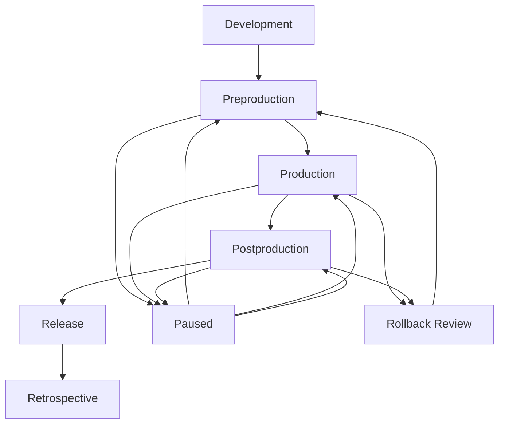
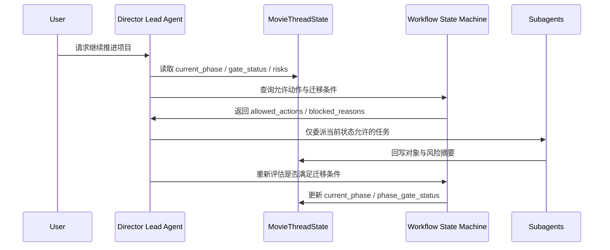
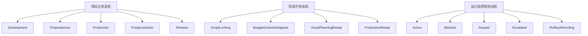
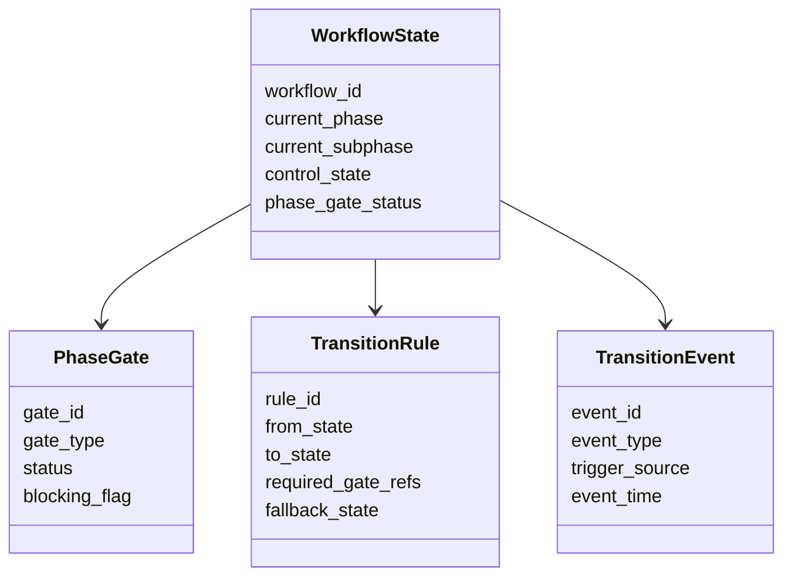
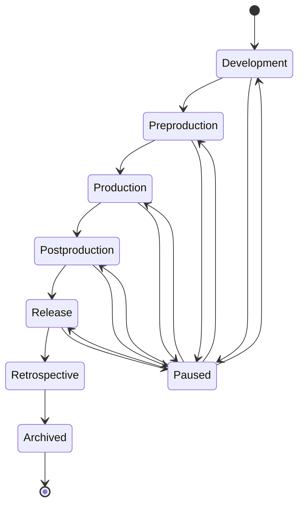
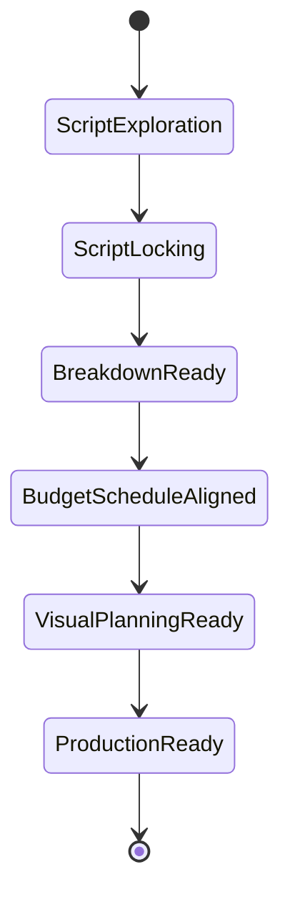
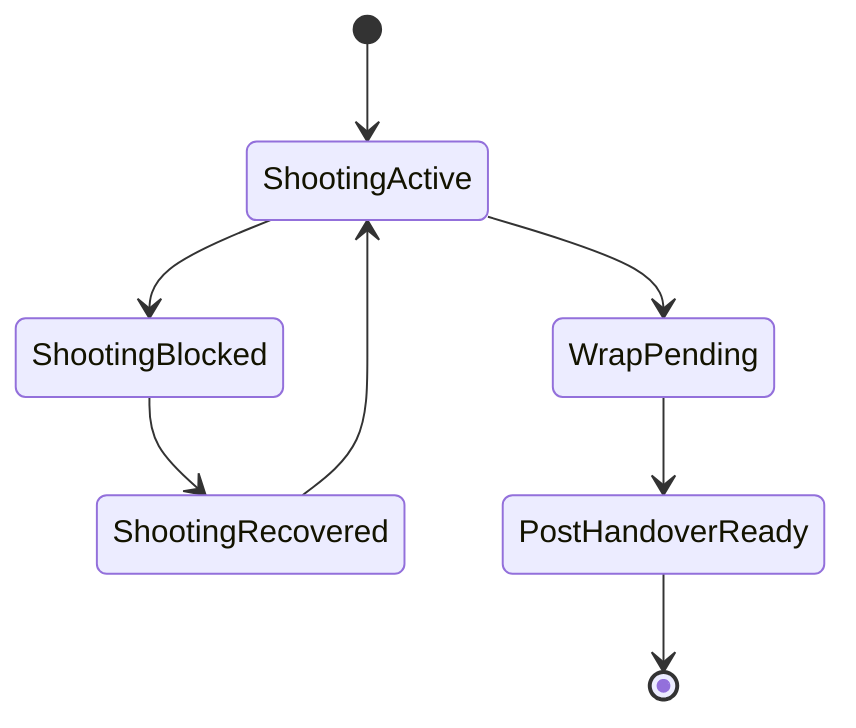
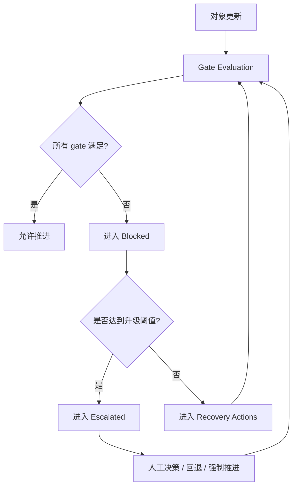
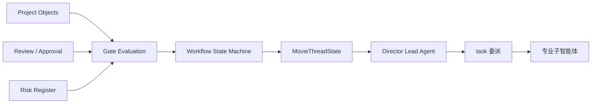

# 67. 工作流状态机设计

这一篇聚焦：

**为什么电影导演智能体平台即使已经拥有稳定的对象系统、审批对象和交付对象，仍然必须再定义一套明确的工作流状态机，才能让系统知道当前处于哪个阶段、允许做什么、不能做什么、出了问题该回退到哪里。**

---

## 1. 为什么 67 要紧接在 66 后面

61-66 已经逐步把几个关键层补出来了：

- 61：对象系统总览
- 62：`MovieThreadState`
- 63：创作层核心对象
- 64：执行层核心对象
- 65：视觉执行层对象
- 66：review、approval、release package 治理对象

但当这些对象都出现以后，系统仍然会缺一个非常关键的控制层：

**到底在什么条件下，项目能从一个阶段进入下一个阶段。**

如果没有这个控制层，平台会很快出现下面的问题：

- 剧本还没锁，排期已经按执行版在跑
- review 还没关，release package 已经在组装
- 拍摄未 wrap，后期状态却已经切到 final delivery
- 风险已经阻塞，但主智能体仍然按正常推进逻辑委派

这说明光有对象和审批还不够，系统还必须知道：

- 当前项目处于哪个工作流状态
- 这个状态允许哪些动作
- 哪些动作会触发状态迁移
- 状态迁移失败时如何暂停、回退、升级

---

## 2. 为什么对象生命周期不能替代工作流状态机

这是最容易混淆的地方。

对象生命周期解决的是：

- 单个对象从草稿到归档的变化
- 单个对象如何被 review、approval、supersede

而工作流状态机解决的是：

- 整个项目当前推进到哪一步
- 当前阶段能调用哪些智能体
- 当前阶段必须满足哪些 gate
- 当前阶段的失败会如何影响全局推进

举个例子：

- `Script` 对象可以处于 `ApprovedForPlanning`
- `Budget` 对象可以处于 `Active`
- `Storyboard` 对象可以处于 `Current`

但这些都不自动等于：

- 项目已经进入 `ProductionReady`

所以：

- 对象生命周期回答“这个对象怎么样了”
- 工作流状态机回答“整个项目现在能做什么”

---

## 3. 工作流状态机到底要解决什么问题

一个合格的电影制作工作流状态机，至少要回答下面这些问题：

### 阶段问题
- 当前处于开发、前期、拍摄、后期、发行还是复盘
- 当前阶段有没有子阶段
- 当前阶段的主要目标是什么

### 门禁问题
- 哪些对象必须达到什么状态，项目才能继续推进
- 哪些 review / approval 是强制条件
- 哪些风险会阻塞状态迁移

### 执行问题
- 当前阶段优先调用哪些子智能体
- 哪些对象是当前活跃对象
- 哪些产物应该优先产出

### 异常问题
- 当前阶段是否允许暂停
- 当前阶段能否回退
- 当前阶段失败时该进入哪个恢复路径

换句话说，工作流状态机不是“看板美化”，而是平台的推进控制内核。

---

## 4. 一张总览图：项目工作流状态机的主干

这张图说明：

- 电影项目主流程是分阶段推进的
- 但它不是一条永不回头的直线
- 暂停、回退、重新进入是正式能力，不是异常补丁

---

## 5. 为什么工作流状态机不是“项目清单”

很多团队会误以为状态机就是：

- 把项目阶段列出来
- 每个阶段写一堆待办项
- 完成了就打勾

这和真正的状态机完全不是一回事。

真正的状态机必须至少具备下面四个能力：

### 第一，互斥边界
系统必须知道当前主要处于哪个状态，而不只是“同时做很多事”。

### 第二，迁移规则
系统必须知道从 A 到 B 的条件是什么，而不只是“感觉差不多可以进下一步了”。

### 第三，阻塞规则
系统必须知道哪些风险和 gate 会阻止迁移。

### 第四，恢复规则
系统必须知道失败后回到哪里，而不只是让人重新手工判断。

所以状态机的本质是：

- 有边界
- 有规则
- 有失败语义
- 有恢复语义

---

## 6. 为什么电影平台尤其需要明确状态机

电影制作天然具备下面几个特点：

- 跨阶段依赖很强
- 前一阶段的错误会放大到后一阶段
- 时间窗口昂贵
- 审批与交付常常会反向影响当前阶段
- 返工成本极高

这意味着如果没有正式状态机，主智能体很容易表现为：

- 在不该推进的时候推进
- 在该暂停的时候继续委派
- 在该回退的时候只做局部修补
- 在该升级的时候把问题当成普通 todo

所以工作流状态机不是为了“文档好看”，而是为了让系统有组织性地承受复杂性。

---

## 7. 海外成熟流程给我们的启示

成熟影视流程之所以强调：

- phase gate
- lock points
- turnover package
- review milestones

本质上就是在建立工作流状态机。

也就是说，很多行业术语虽然看起来是管理语言，但落到平台设计里，其实都在回答三个问题：

- 当前处于什么状态
- 什么条件可以进入下一个状态
- 哪些条件触发回退或阻塞

所以工作流状态机并不是互联网产品里额外加上的技术概念，而是对电影工业“阶段推进规律”的结构化表达。

---

## 8. 国内项目里的现实差异

国内项目在工作流控制上，往往会更频繁遇到这些情况：

- 前期压缩导致阶段边界模糊
- 拍摄中发生高频临时调整
- 后期与审看、宣发、档期窗口交织更紧
- 很多推进决策以口头方式发生，正式 gate 留痕不足

这意味着中国语境下的工作流状态机，不能只支持“理想化顺序推进”，还必须支持：

- 快速暂停
- 条件推进
- 局部回退
- 强制升级
- 口头决策回写

换句话说，海外更强调 phase gate 标准化，国内更需要 phase gate 标准化 + 高压变化下的状态切换能力。

---

## 9. 一张时序图：主智能体如何依赖状态机推进项目

这张图说明：

- 主智能体不应该凭感觉推进
- 它应该围绕状态机做受约束的委派与迁移判断

---

## 10. 建议把工作流状态机分成三层

为了避免后面越做越乱，建议把状态机分成三层。

### 第一层：项目主状态机
回答整个项目处于哪个大阶段。

典型状态：

- `Development`
- `Preproduction`
- `Production`
- `Postproduction`
- `Release`
- `Retrospective`

### 第二层：阶段子状态机
回答大阶段内部推进到了哪一步。

例如在 `Preproduction` 内部，还可以再有：

- `ScriptLocking`
- `BreakdownReady`
- `BudgetScheduleAligned`
- `VisualPlanningReady`
- `ProductionReady`

### 第三层：运行态控制状态机
回答当前是否允许继续推进。

典型控制状态：

- `Active`
- `Blocked`
- `Paused`
- `Escalated`
- `RollbackPending`

这样拆分的好处是：

- 大阶段清晰
- 子阶段可细化
- 异常控制可独立表达

---

## 11. 一张分层图：三层状态机如何协同

这张图说明：

- “项目在哪个阶段”
- “阶段内部推进到哪”
- “当前能不能继续动”

是三个不同层次的问题

---

## 12. 工作流状态机至少要包含哪些核心对象

建议至少定义下面四类对象或结构。

### `WorkflowState`
用于表达当前项目所处的主状态与子状态。

### `PhaseGate`
用于表达某个阶段迁移前必须满足的条件。

### `TransitionRule`
用于表达从状态 A 迁移到状态 B 的规则。

### `TransitionEvent`
用于表达触发迁移或阻塞的关键事件。

也就是说，工作流状态机不是一个简单枚举，而是：

- 状态对象
- 门禁对象
- 规则对象
- 事件对象

---

## 13. 工作流状态机应该包含哪些核心字段

建议把主状态机字段拆成六组。

### 第一组：状态身份字段
- `workflow_id`
- `project_id`
- `current_phase`
- `current_subphase`
- `control_state`

### 第二组：门禁字段
- `phase_gate_status`
- `required_gate_refs`
- `satisfied_gate_refs`
- `blocking_gate_refs`

### 第三组：迁移字段
- `allowed_transitions`
- `last_transition`
- `pending_transition`
- `rollback_target`

### 第四组：事件字段
- `latest_transition_event`
- `event_log_refs`
- `manual_override_flag`
- `override_reason`

### 第五组：风险字段
- `blocking_risks`
- `escalation_case_refs`
- `critical_path_flags`
- `recovery_plan_summary`

### 第六组：执行字段
- `allowed_agent_roles`
- `active_object_refs`
- `required_artifacts`
- `next_actions`

---

## 14. 一张类图：状态、门禁、规则、事件的关系

这张图说明：

- 状态机不是一个字符串字段
- 它是由状态、门禁、规则、事件共同组成的控制系统

---

## 15. 一张总状态图：项目主状态机

这张图说明：

- 主状态机表达项目的大阶段
- `Paused` 不是异常补丁，而是正式控制状态

---

## 16. 一张子状态图：前期阶段子状态机

这张图说明：

- 光说“当前在前期”是不够的
- 前期内部也必须有明确推进边界

---

## 17. 一张子状态图：拍摄与后期的控制切换

这张图说明：

- 生产阶段并不是单一“进行中”
- 它内部天然会在 active、blocked、recovered、handover 之间切换

---

## 18. 什么样的事件应该触发状态迁移

建议把状态迁移事件分成五类。

### 第一类：对象事件
例如：

- 剧本锁定
- 预算批准
- 分镜 current 化
- 交付包生成

### 第二类：治理事件
例如：

- review 关闭
- approval 生效
- 关键审批被驳回

### 第三类：风险事件
例如：

- 关键资源冲突
- 阶段阻塞风险升级
- 超预算或延误达到阈值

### 第四类：人工决策事件
例如：

- 导演决定强制推进
- 制片决定暂停
- 项目负责人决定回退一个阶段

### 第五类：外部窗口事件
例如：

- 拍摄窗口关闭
- 交付窗口变更
- 审看节点提前或延后

这说明状态机不能只依赖“任务完成”，还必须依赖风险与治理事件。

---

## 19. 为什么状态机必须支持“推进、暂停、回退、升级”四种基本动作

很多团队设计状态机时，只设计“前进”。

但在真实电影制作里，至少有四种基本动作缺一不可：

### 推进
表示进入下一阶段。

### 暂停
表示当前阶段暂时不能继续，但不一定要回退。

### 回退
表示之前的前提已经失效，必须回到上一个稳定状态。

### 升级
表示问题超出当前阶段处理能力，必须进入更高优先级决策流。

如果少了后面三种，状态机就只是一条乐观路径，不是现实控制系统。

---

## 20. 一张流转图：状态机如何吸收审批与风险

这张图说明：

- 状态机的核心不是阶段命名
- 而是持续评估 gate、风险与恢复路径

---

## 21. 为什么 `MovieThreadState` 必须承接工作流状态机摘要

前面 62 已经讲过，`MovieThreadState` 是线程级控制面板。

而工作流状态机恰恰是这个控制面板里最关键的部分之一。

线程状态至少要稳定承接：

- `current_phase`
- `current_subphase`
- `control_state`
- `phase_gate_status`
- `blocked_reasons`
- `allowed_next_actions`

因为主智能体每次做决策时，最先需要知道的就是：

- 现在在哪个阶段
- 有没有阻塞
- 允许做什么
- 哪些动作暂时不允许做

---

## 22. DeerFlow 里工作流状态机最自然的承接方式

如果后面进入代码实现，这套状态机最自然的承接方式会是：

- 以 `MovieThreadState` 作为状态机摘要容器
- 以对象系统和治理对象作为 gate 输入
- 以 Lead Agent 作为状态迁移决策者
- 以 middleware 或 orchestration 层作为状态更新执行器
- 以 `task` 委派时的 allowed agent roles 约束当前可调用子智能体

也就是说：

- DeerFlow 的强项不是把状态机藏在代码里
- DeerFlow 的强项是让状态机成为主智能体可读、可判断、可回写的正式控制层

---

## 23. 一张 DeerFlow 映射图

这张图说明：

- 状态机并不是对象系统的外部装饰
- 它位于对象、治理、风险与主智能体之间的控制中轴

---

## 24. 第一版实现应该做到什么程度

为了避免一开始做得过重，建议第一版先做到下面这个粒度。

### 先支持

- 主阶段状态机
- 前期阶段子状态机
- 基础 `Active / Blocked / Paused / Escalated` 控制状态
- 基础 gate 评估
- 基础 rollback 目标定义

### 第一版就要有的关键能力

- 主智能体读取 allowed actions
- approval / risk 可以阻塞迁移
- 关键对象状态变化可触发重新评估
- 阶段切换留痕

### 暂时不要一开始就做太深的部分
例如：

- 过细粒度的多项目联动状态机
- 全自动复杂规则引擎
- 大规模跨线程并发状态协商

这些可以后面逐步补。

---

## 25. 这一篇与后续文档的关系

这一篇回答的是：

**当电影导演智能体平台已经有对象、审批和交付对象以后，整个项目工作流到底该如何被建模成正式状态机，才能让系统真正知道自己当前在哪、下一步能去哪、失败后该去哪。**

后面几篇会继续把这里往更细的治理与沉淀层推进：

- 68：审批流与升级流设计
- 69：记忆与知识沉淀设计
- 70：产物、版本与归档体系设计

---

## 26. 这一篇最重要的结论

### 结论一
工作流状态机不是对象生命周期的重复，而是电影导演智能体平台的项目推进控制内核。

### 结论二
国内外差异的关键，不只是阶段名称不同，而是状态机是否既能支持标准 phase gate，又能承受高频暂停、回退、升级与人工 override。

### 结论三
在 DeerFlow 中，把状态机摘要落到 `MovieThreadState`，并让主智能体围绕 gate 与 allowed actions 做委派，是让平台从“会生成内容”进化到“会控制项目推进”的关键一步。
