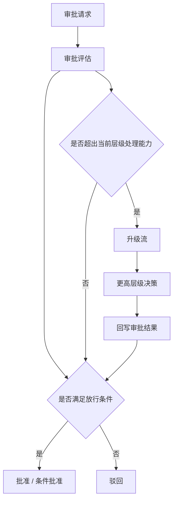
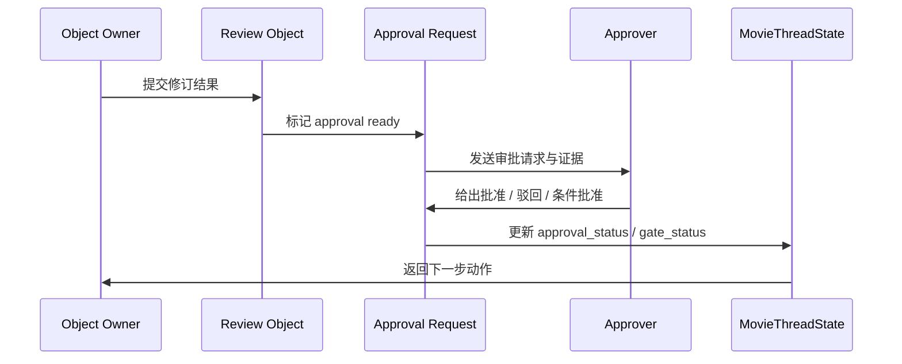
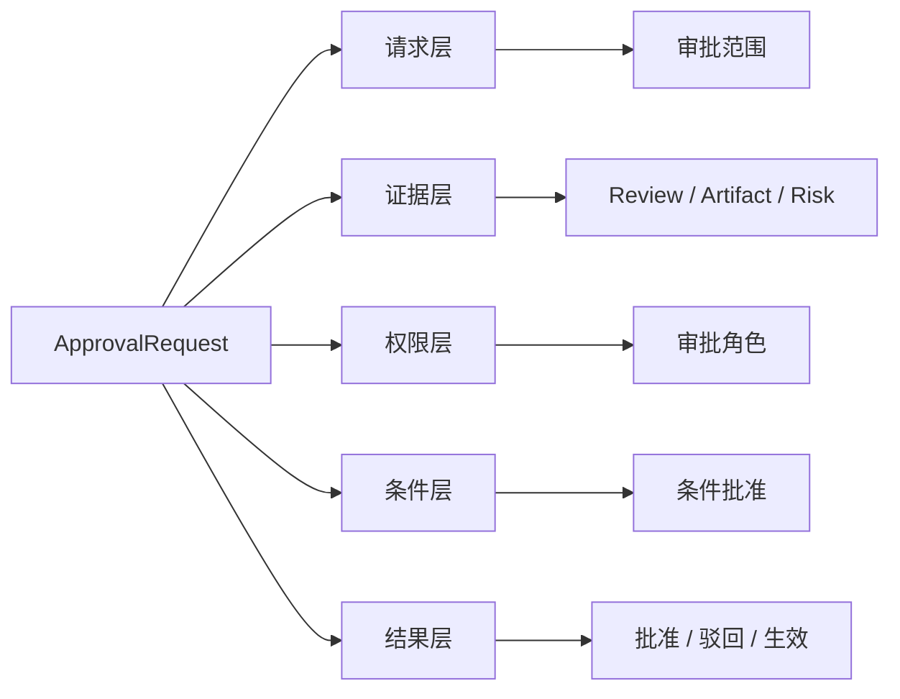
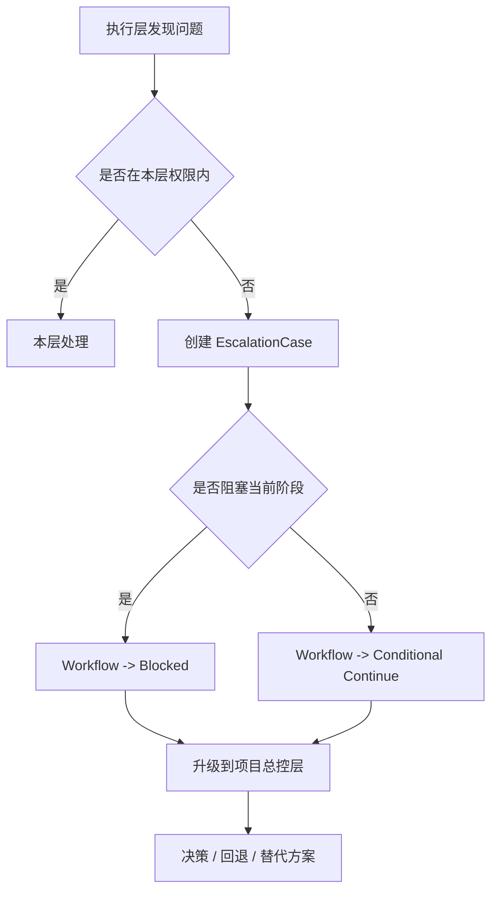
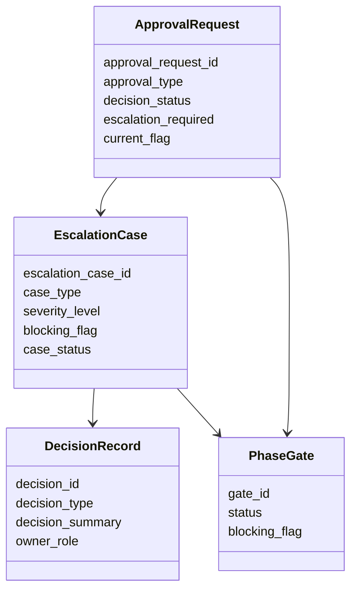
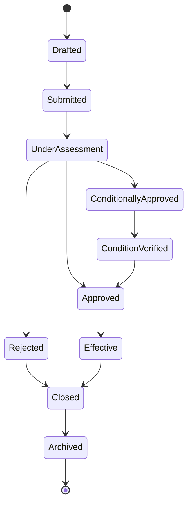
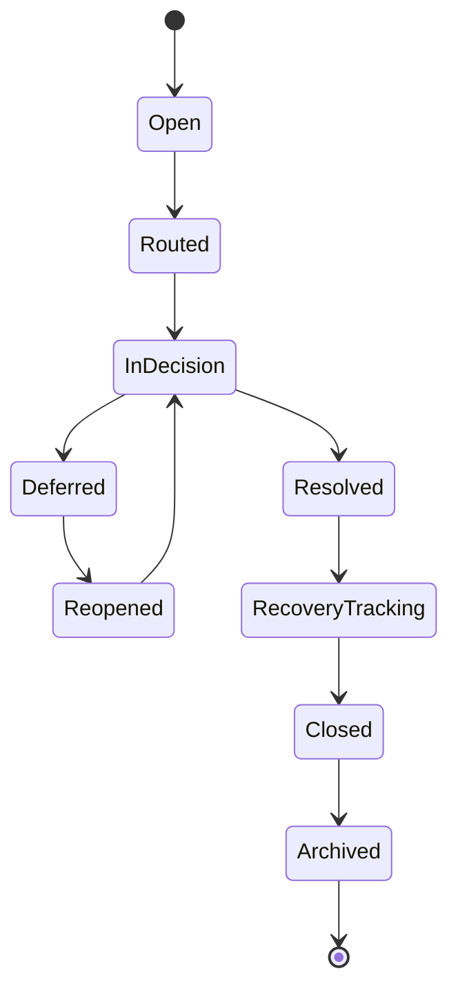
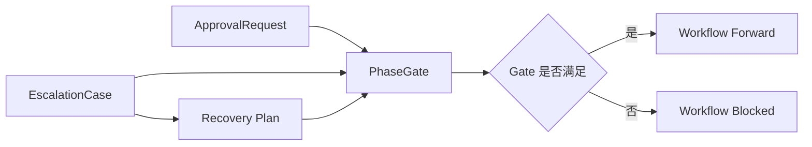
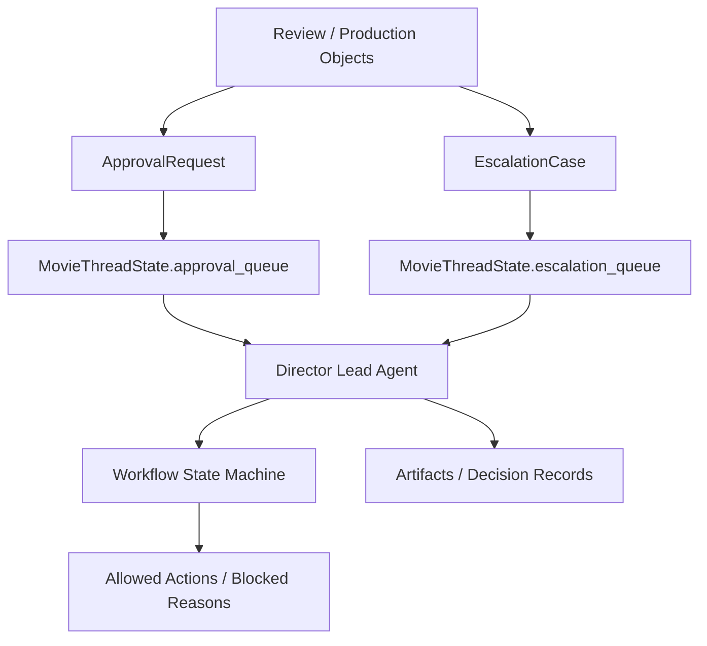

# 68. 审批流与升级流设计

这一篇聚焦：

**为什么电影导演智能体平台在定义了工作流状态机之后，还必须把审批流和升级流单独设计成正式控制系统，才能在复杂制作环境里既保证放行边界，又保证重大问题能被及时抬升到正确层级处理。**

---

## 1. 为什么 68 要紧接在 67 后面

67 已经说明，项目推进不能只靠对象状态，而必须依赖正式的工作流状态机。

但状态机一旦成立，就会立刻遇到两个更具体的问题：

- 当系统准备进入下一阶段时，谁有权批准
- 当系统发现问题超出当前角色处理能力时，谁来升级决策

也就是说，67 回答的是：

- 当前项目在哪个阶段
- 哪些 gate 决定能不能往下走

而 68 要继续回答：

- gate 的正式审批怎么走
- gate 被阻塞时升级流怎么走

如果没有这两条正式控制流，状态机就会退化成：

- 有阶段定义，但没人负责放行
- 有阻塞状态，但没人负责接住阻塞

---

## 2. 审批流与升级流分别解决什么问题

### 审批流
回答的是：

- 这项内容能不能正式放行
- 谁来承担放行责任
- 放行后会带来什么阶段边界变化

### 升级流
回答的是：

- 当前问题是否超出了当前角色权限或能力范围
- 是否需要更高优先级或更高层级的决策
- 在升级过程中，项目要暂停、局部回退，还是带条件继续推进

换句话说：

- 审批流负责“正常放行”
- 升级流负责“异常接管”

---

## 3. 为什么这两条流必须一起设计

很多系统会先做审批，后面再补升级。

这在低复杂度项目里还能勉强运行，但在电影制作里很快会出问题。

因为真实情况往往是：

- 审批时才发现问题超出当前范围，需要升级
- 升级后返回的决策，又会改变审批结果
- 某些审批本身就必须先经过升级评估，才能进入正式放行

例如：

- 预算审批发现超支，需要升级给更高层级决策
- 拍摄阶段的资源冲突导致排期审批无法继续，需要升级到导演 / 制片联合决策
- 后期交付包在对外提交前发现关键问题，需要升级后决定是否延期或替换内容

所以审批流和升级流在平台里必须共同构成：

- 放行控制链
- 异常处理链

---

## 4. 一张总览图：审批流与升级流的关系

这张图说明：

- 升级流不是审批失败后的补丁
- 它是审批评估过程中的正式分支

---

## 5. 审批流至少要回答哪些关键问题

一个合格的审批流，至少要让系统稳定回答下面这些问题：

### 边界问题
- 审批的是哪个对象、哪一版、哪一范围

### 权限问题
- 当前角色是否有审批权
- 是否允许代理、联合审批、条件审批

### 影响问题
- 审批通过后会放行到哪个阶段
- 审批驳回后会回退到哪个阶段或对象状态

### 证据问题
- 当前审批是基于哪些 review、风险摘要、产物证据做出的

### 追踪问题
- 谁在什么时间做了什么决定
- 是否附加了条件、时限和后续检查项

如果审批流不能回答这些问题，系统记录下来的就只是“有人说行”。

---

## 6. 升级流至少要回答哪些关键问题

一个合格的升级流，至少要让系统稳定回答下面这些问题：

### 触发问题
- 为什么会升级
- 是风险升级、权限不足，还是跨部门冲突

### 层级问题
- 这个问题应该升级给谁
- 是单人决策、双人联合，还是跨部门会议

### 时效问题
- 多久内必须处理
- 升级期间项目是暂停、限速推进还是允许带条件继续

### 结果问题
- 升级后的结果是什么
- 是回退、强制推进、替代方案，还是重新审批

### 留痕问题
- 升级过程中的讨论、判断依据、责任边界是否可追踪

这说明升级流不是“发个消息给领导”，而是正式的异常治理机制。

---

## 7. 建议先明确审批与升级的角色层级

为了让系统后面不混乱，建议先明确至少四层角色边界。

### 第一层：执行层
典型角色：

- 部门子智能体
- 执行负责人
- 单一对象 owner

这一层可以提出请求，但通常不负责最终放行。

### 第二层：专业负责人层
典型角色：

- 摄影负责人
- 制片负责人
- 后期负责人
- 视效负责人

这一层负责本专业范围内的 review 与初审。

### 第三层：项目总控层
典型角色：

- 导演主智能体
- 制片总控
- 项目负责人

这一层负责跨部门放行与关键冲突决策。

### 第四层：外部或特殊边界层
典型角色：

- 合规 / 法务
- 对外发行 / 平台接口人
- 需要额外授权的管理节点

这一层负责项目对外边界或特殊边界。

---

## 8. 国内项目里的现实差异

国内项目在审批与升级机制上，通常更容易出现这些现实情况：

- 口头放行比例更高
- 角色权限边界更容易模糊
- 时间压力导致“先干再补审批”情况更常见
- 风险一旦升级，常常会同时影响预算、排期、对外窗口

这意味着中国语境下的审批流与升级流，不能只支持“理想化线性流程”，还必须支持：

- 条件批准
- 临时 override
- 口头决策正式回写
- 限时升级
- 升级后强制同步状态机和线程状态

换句话说，海外更强调清晰分权，国内更需要清晰分权 + 高压变化下的快速留痕。

---

## 9. 一张时序图：一次标准审批如何发生

这张图说明：

- 审批不是孤立动作
- 它是从 review 关闭进入 gate 状态变化的正式过程

---

## 10. `ApprovalRequest` 对象应该包含哪些核心字段

建议把审批请求对象拆成七组字段。

### 第一组：身份字段
- `approval_request_id`
- `project_id`
- `scope_type`
- `scope_ref_ids`
- `approval_type`

### 第二组：请求字段
- `requested_by`
- `requested_at`
- `request_summary`
- `requested_transition`

### 第三组：证据字段
- `review_refs`
- `artifact_refs`
- `risk_summary`
- `supporting_notes`

### 第四组：权限字段
- `required_approver_roles`
- `current_assignee`
- `delegation_rule`
- `joint_approval_flag`

### 第五组：条件字段
- `condition_items`
- `deadline`
- `follow_up_checks`
- `waiver_notes`

### 第六组：结果字段
- `decision_status`
- `decision_notes`
- `effective_at`
- `rollback_target`

### 第七组：治理字段
- `escalation_required`
- `current_flag`
- `closed_at`
- `archived_at`

---

## 11. 一张审批流分层图

这张图说明：

- 审批对象绝不只是一个状态字段
- 它天然是“请求 + 证据 + 权限 + 条件 + 结果”的复合结构

---

## 12. 为什么 `EscalationCase` 不能只是 issue ticket

很多团队会把升级问题做成普通 issue：

- 写个标题
- 指派个人
- 等待回复

这在一般协作里可能够用，但在电影平台里远远不够。

因为升级问题真正要解决的是：

- 当前层级处理不了
- 当前阶段可能被阻塞
- 这个问题可能影响跨对象、跨部门、跨阶段边界

所以 `EscalationCase` 不是“有人报了个问题”，而是：

- 正式异常控制对象
- 阶段风险承接对象
- 高优先级决策入口对象

---

## 13. `EscalationCase` 对象应该包含哪些核心字段

建议把升级案例对象拆成七组字段。

### 第一组：身份字段
- `escalation_case_id`
- `project_id`
- `case_type`
- `source_scope_type`
- `source_scope_refs`

### 第二组：触发字段
- `trigger_type`
- `trigger_summary`
- `triggered_by`
- `triggered_at`

### 第三组：影响字段
- `phase_impact`
- `budget_impact`
- `schedule_impact`
- `delivery_impact`

### 第四组：严重度字段
- `severity_level`
- `blocking_flag`
- `urgency_level`
- `decision_deadline`

### 第五组：路由字段
- `escalation_target_roles`
- `current_owner`
- `meeting_required_flag`
- `fallback_owner`

### 第六组：处置字段
- `proposed_options`
- `selected_option`
- `decision_summary`
- `recovery_plan`

### 第七组：治理字段
- `case_status`
- `linked_approval_request_ids`
- `linked_transition_events`
- `closed_at`

---

## 14. 一张升级路径图：问题如何被抬升

这张图说明：

- 升级流的关键不是“通知谁”
- 而是“是否改变工作流状态”

---

## 15. 一张类图：审批请求与升级案例的关系

这张图说明：

- 审批与升级都不是孤立对象
- 它们共同作用于 phase gate 与决策记录

---

## 16. 为什么审批流必须支持“条件批准”

在真实项目里，最常见的并不是纯粹的 approve / reject，而是：

- 可以进入下一步，但要补某个件
- 可以继续拍，但要在某个时间点前修正
- 可以生成 package，但必须替换某个素材

这就是“条件批准”。

如果系统不支持条件批准，就会出现两个极端：

- 要么过度僵硬，所有不完美内容都被驳回
- 要么过度宽松，所有口头条件都丢失

所以审批流必须正式表达：

- 条件项
- 条件时限
- 条件 owner
- 条件验证点

---

## 17. 为什么升级流必须支持 SLA 和时限

升级问题最怕的不是复杂，而是悬而不决。

特别是在电影项目里，一个未处理的升级问题可能同时影响：

- 拍摄窗口
- 人员与设备占用
- 对外交付时间
- 项目预算

所以 `EscalationCase` 不应该只记录“已经升级”，还必须表达：

- 预计何时必须响应
- 超时后自动进入什么状态
- 超时后由谁接管
- 超时是否自动阻塞工作流推进

也就是说，升级流不是静态收件箱，而是带时效语义的异常控制通道。

---

## 18. 什么样的情况应该触发升级流

建议把升级触发条件至少分成五类。

### 第一类：权限不足
当前处理者没有权力做决定。

### 第二类：跨部门冲突
问题同时影响多个部门，无法单边处理。

### 第三类：阶段阻塞
问题会阻止当前阶段继续推进。

### 第四类：风险超阈值
预算、排期、合规、交付风险超过设定阈值。

### 第五类：外部窗口冲击
对外窗口、审批窗口、交付窗口发生变化。

只有明确这些触发条件，系统才能避免：

- 什么都升级
- 该升级的没升级

---

## 19. 一张状态图：`ApprovalRequest` 生命周期

这张图说明：

- 审批请求的重点不只是“有没有批”
- 而是从提交到生效的完整链条

---

## 20. 一张状态图：`EscalationCase` 生命周期

这张图说明：

- 升级问题不是做完决策就结束
- 决策之后还要进入恢复跟踪阶段

---

## 21. 一张联动图：审批流与升级流如何共同作用于状态机

这张图说明：

- 审批流负责正向放行
- 升级流负责异常恢复
- 二者共同决定工作流能否前进

---

## 22. 为什么 `MovieThreadState` 必须显式保存审批与升级摘要

前面 62 已经说明，主智能体需要一个可读的控制面板。

而审批流与升级流在控制面板里至少应该有下面这些摘要：

- `approval_queue`
- `pending_conditions`
- `escalation_queue`
- `blocking_cases`
- `latest_decision_summary`
- `gate_blocked_reasons`

因为主智能体每次推进之前最需要知道的，不是历史细节，而是：

- 当前有哪些审批未完成
- 当前有哪些升级问题在阻塞
- 当前是否允许继续委派

---

## 23. DeerFlow 里这两条流最自然的承接方式

如果后面进入代码实现，这两条流最自然的承接方式会是：

- `ApprovalRequest` 作为正式放行对象
- `EscalationCase` 作为正式异常控制对象
- Lead Agent 负责读取审批与升级摘要并决定委派策略
- `MovieThreadState` 负责保存当前 queue 与阻塞摘要
- `DecisionRecord` 负责沉淀最终判断依据
- artifacts 保存审批说明、升级纪要、恢复计划、条件清单

也就是说：

- DeerFlow 的强项不是把流程做成审批 OA
- DeerFlow 的强项是把审批、升级、决策、状态机放进同一个多智能体控制闭环

---

## 24. 一张 DeerFlow 映射图

这张图说明：

- 审批和升级不是各走各的后台流程
- 它们必须直接进入主智能体的决策回路

---

## 25. 第一版实现应该做到什么程度

为了避免一开始做得过重，建议第一版先做到下面这个粒度。

### 审批流
先支持：

- 正式审批请求
- 条件批准
- 驳回回退
- 审批证据引用
- 生效状态

### 升级流
先支持：

- 正式升级案例
- 严重度与时限
- 目标角色路由
- 恢复计划
- 对工作流 blocked 状态的联动

### 第一版就要有的关键能力

- 主智能体能看到当前 queue 摘要
- 审批与升级结果能回写状态机
- 关键决策能形成记录

### 暂时不要一开始就做太深的部分
例如：

- 复杂组织架构下的多级并行审批矩阵
- 自动化会议调度与外部日历联动
- 大规模跨项目共享升级池

这些可以后面再做。

---

## 26. 这一篇与后续文档的关系

这一篇回答的是：

**当电影导演智能体平台已经有了工作流状态机以后，正式放行与异常升级到底应该怎么设计，才能让项目既能被稳定推进，又能在高压变化里及时抬升关键问题。**

后面两篇会继续把这里往长期沉淀与归档体系推进：

- 69：记忆与知识沉淀设计
- 70：产物、版本与归档体系设计

---

## 27. 这一篇最重要的结论

### 结论一
审批流不是管理附属物，而是工作流状态机的正式 gate control；升级流不是 issue 补丁，而是异常治理主链。

### 结论二
国内外差异的关键，不只是审批层级多少，而是系统是否既能支持清晰权限边界，又能承受高压时间窗口下的条件批准、快速升级与正式留痕。

### 结论三
在 DeerFlow 中，把 `ApprovalRequest` 和 `EscalationCase` 纳入 `MovieThreadState` 与 Lead Agent 的判断逻辑，是让项目真正具备“能推进、能停下、能回退、能升级”能力的关键前提。

---

---

<!-- movie-doc-nav:start -->
## 文档导航

- 总入口：[README.md](./README.md)
- 阅读地图：[00-reading-map.md](./00-reading-map.md)
- 所在分组：61-70 对象、状态、审批与归档
- 上一篇：[67. 工作流状态机设计](./67-workflow-state-machine-design.md)
- 下一篇：[69. 记忆与知识沉淀设计](./69-memory-and-knowledge-capture-design.md)

### 同组文档
- [61. 项目对象系统总览](./61-project-object-system-overview.md)
- [62. MovieThreadState 设计](./62-movie-thread-state-design.md)
- [63. Script / Scene / Character 对象体系](./63-script-scene-character-object-system.md)
- [64. Budget / Schedule / Resource 对象体系](./64-budget-schedule-resource-object-system.md)
- [65. ShotPlan / Storyboard / PromptPack 对象体系](./65-shotplan-storyboard-promptpack-object-system.md)
- [66. Review / Approval / ReleasePackage 对象体系](./66-review-approval-release-package-object-system.md)
- [67. 工作流状态机设计](./67-workflow-state-machine-design.md)
- 68. 审批流与升级流设计（当前）
- [69. 记忆与知识沉淀设计](./69-memory-and-knowledge-capture-design.md)
- [70. 产物、版本与归档体系设计](./70-artifact-version-and-archive-system.md)
<!-- movie-doc-nav:end -->
