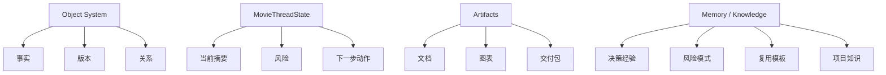
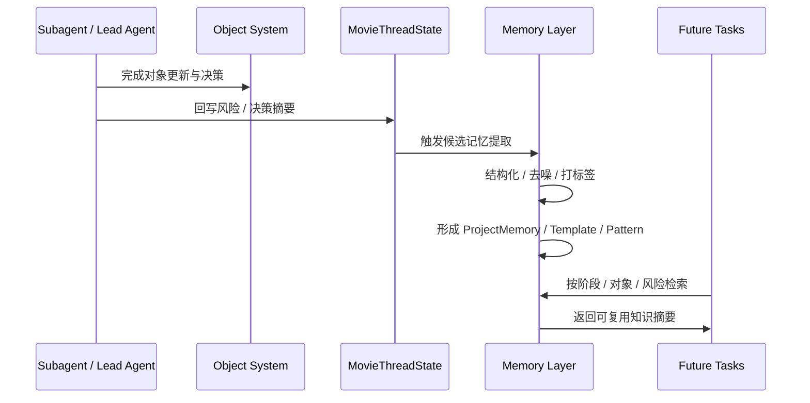
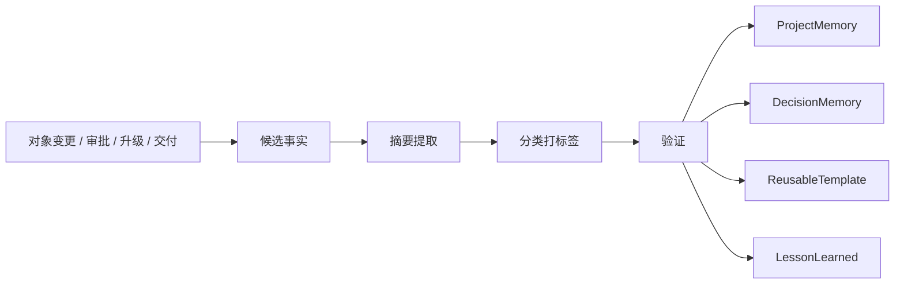
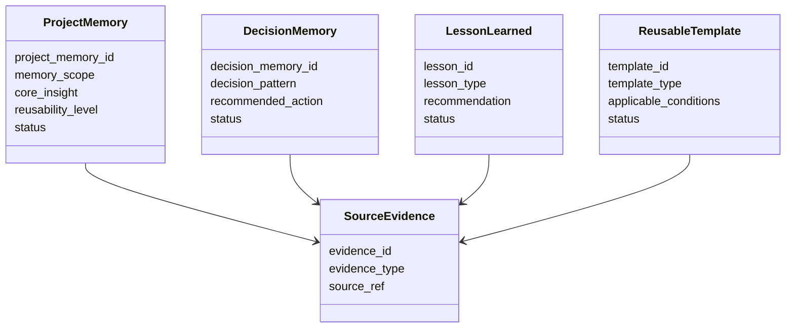
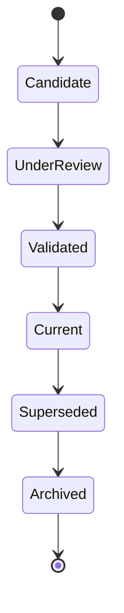
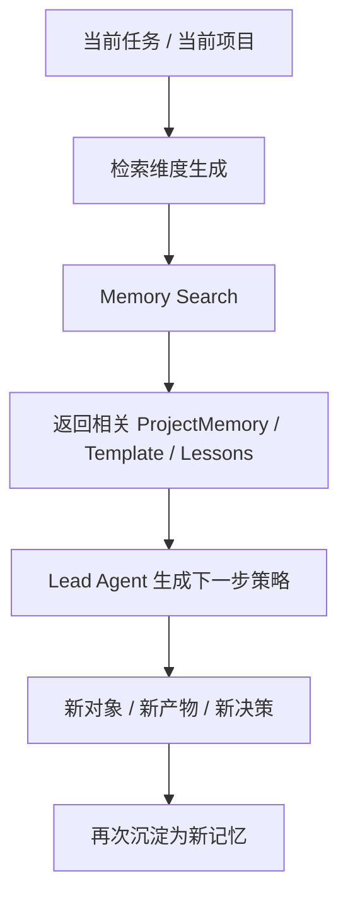
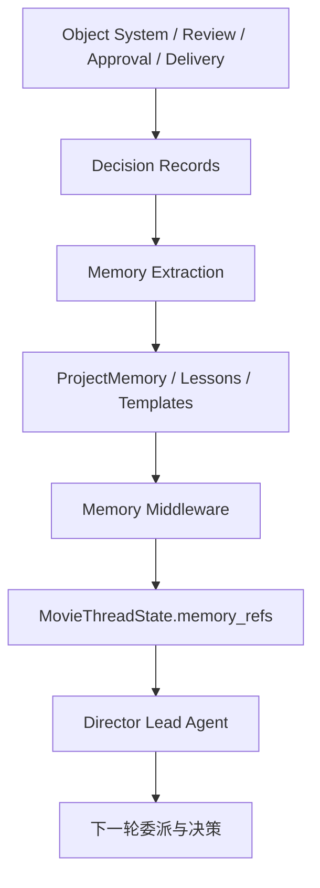
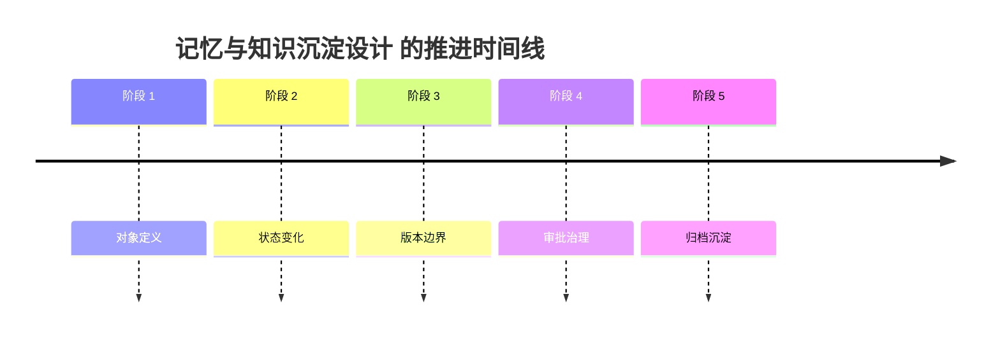

# 69. 记忆与知识沉淀设计

这一篇聚焦：

**为什么电影导演智能体平台即使已经拥有对象系统、状态机、审批流和产物体系，仍然必须再建立一套明确的记忆与知识沉淀机制，才能让系统不只是“完成当前项目”，而是真正具备跨阶段复用、跨项目学习和长期演化能力。**

---

## 1. 为什么 69 要紧接在 68 后面

61-68 已经逐步把项目运行所需的关键层补出来了：

- 对象系统
- 线程状态
- 工作流状态机
- 审批与升级流
- 产物和交付边界

到这里，平台已经能够：

- 理解当前项目
- 推进当前项目
- 控制当前项目

但它仍然缺少一个更长期的能力：

**如何把当前项目中的经验、决策、失败、模式和模板积累下来，供当前线程后续使用，以及供未来项目复用。**

如果没有这一层，平台会永远停留在：

- 每个项目从零开始
- 每次问题都重新踩坑
- 每次决策都重新解释
- 每轮复盘都停留在会议纪要

所以 69 负责回答：

- 什么应该成为项目记忆
- 什么应该成为可复用知识
- 它们如何被提取、验证、索引和检索

---

## 2. 为什么对象、状态、产物都不能替代记忆系统

这是一个很容易被误判的问题。

很多团队会想：

- 对象系统已经有事实了
- `MovieThreadState` 已经有当前摘要了
- artifacts 已经有文档和报告了

那是不是就不需要单独做记忆层？

答案是不行，因为这三层解决的是不同问题。

### 对象系统
解决的是：

- 当前事实是什么
- 对象之间如何关联

### `MovieThreadState`
解决的是：

- 当前线程最该关注什么
- 当前项目推进到哪一步

### artifacts
解决的是：

- 当前有哪些可查看、可交付、可归档的产物

### 记忆系统
解决的是：

- 为什么之前做过某个决定
- 哪些模式在过去项目里有效
- 哪些风险经常重复出现
- 哪些模板可以复用

也就是说：

- 对象层负责“事实”
- 状态层负责“当前”
- 产物层负责“输出”
- 记忆层负责“可继承经验”

---

## 3. 记忆层到底要承接什么

建议先把“记忆”分成两大类理解。

### 第一类：项目内记忆
服务当前项目后续阶段继续推进。

典型内容：

- 关键决策来龙去脉
- 已验证的风格规则
- 已踩过的资源风险
- 已确认的沟通口径
- 已复用成功的镜头策略

### 第二类：跨项目知识
服务未来项目复用与平台能力积累。

典型内容：

- 可复用预算结构
- 可复用排期策略
- 可复用分镜模板
- 高频风险模式
- 审批与交付最佳实践

所以记忆系统不是“存一堆聊天摘要”，而是要把经验组织成可服务未来决策的知识对象。

---

## 4. 一张总览图：对象、状态、产物与记忆的分层关系

这张图说明：

- 记忆层不是对象层或产物层的附属文件夹
- 它是平台长期演化所需的第四层能力

---

## 5. 为什么记忆不能等于聊天历史

很多原型系统一开始都会想偷懒：

- 既然有聊天记录，那就让模型自己去翻

这在短对话里还能勉强工作，但在电影制作平台里会迅速失效。

因为聊天历史天然存在这些问题：

- 信息密度不稳定
- 有效信息与噪声混在一起
- 很难区分临时观点和正式结论
- 很难稳定检索“过去成功模式”
- 很难表达可复用模板与适用边界

所以聊天历史最多只能作为记忆提取的原材料，而不能直接等于记忆系统。

---

## 6. 为什么知识沉淀也不能等于归档文档

另一个常见误区是：

- 把会议纪要、复盘报告、日报周报都存下来
- 然后认为这就是知识沉淀

这同样不够。

因为归档文档更适合回答：

- 当时发生了什么
- 当时有哪些原始记录

但知识对象更需要回答：

- 这里面哪些经验值得复用
- 适用条件是什么
- 在什么情境下不能盲目复用
- 未来哪个角色会用到它

换句话说：

- 归档文档偏“原始材料”
- 知识沉淀偏“提炼后的可复用模式”

---

## 7. 建议把记忆与知识至少分成五类

为了让后面设计不失控，建议至少分成五类。

### 第一类：决策记忆
记录为什么做这个决定、谁做的、影响了什么。

典型对象：

- `DecisionMemory`
- `DecisionRecord`

### 第二类：风险记忆
记录哪些风险曾出现、如何处置、哪些方案有效。

典型对象：

- `RiskPattern`
- `RecoveryPattern`

### 第三类：执行记忆
记录某类镜头、某类场景、某类资源协同在执行中的经验。

典型对象：

- `ExecutionPattern`
- `WorkflowHint`

### 第四类：模板知识
记录可复用的结构、模板、约束和样板。

典型对象：

- `ReusableTemplate`
- `PromptTemplate`
- `ChecklistTemplate`

### 第五类：项目记忆
记录与当前项目长期相关的关键背景和共识。

典型对象：

- `ProjectMemory`
- `ProjectConstraintMemory`

---

## 8. 国内项目里的现实差异

国内项目在知识沉淀上，通常会更明显遇到这些问题：

- 口头经验比例高
- 人员流动导致经验断档更明显
- 项目节奏紧，复盘常常压缩或缺失
- 模板化和标准化的沉淀不稳定
- 生成式工作流的试错经验容易散落在个人工具里

这意味着中国语境下的记忆系统，不能只支持“项目结束后做一份复盘”，还必须支持：

- 阶段内持续提取
- 关键决策实时沉淀
- 临时方案正式回写
- 快速形成可复用模板
- 高压环境下的低摩擦记录方式

换句话说，海外更强调制度化知识库，国内更需要制度化知识库 + 过程内即时沉淀。

---

## 9. 一张时序图：经验如何从事件变成可复用知识

这张图说明：

- 记忆不是手工补写的孤立动作
- 它应该是工作流中的正式产出支路

---

## 10. `ProjectMemory` 对象应该包含哪些核心字段

建议把项目记忆对象拆成六组字段。

### 第一组：身份字段
- `project_memory_id`
- `project_id`
- `memory_scope`
- `memory_type`

### 第二组：背景字段
- `context_summary`
- `related_phase`
- `related_object_refs`
- `related_role_refs`

### 第三组：结论字段
- `core_insight`
- `recommended_action`
- `avoidance_notes`
- `confidence_level`

### 第四组：来源字段
- `source_decision_refs`
- `source_review_refs`
- `source_artifact_refs`
- `source_conversation_refs`

### 第五组：复用字段
- `reusability_level`
- `applicable_conditions`
- `non_applicable_conditions`
- `template_candidate_flag`

### 第六组：治理字段
- `status`
- `verified_by`
- `verified_at`
- `archived_at`

---

## 11. 为什么决策记忆必须单独成类

虽然前面多次提到 `DecisionRecord`，但在记忆层里还需要再多走一步：

- 不是只记录“做了什么决定”
- 而是把其中真正值得复用的部分提炼出来

例如：

- 为什么某类夜戏在特定预算规模下要优先删减
- 为什么某种镜头设计在某类场景里经常导致排期失控
- 为什么某些条件批准要设更短验证窗口

这些内容在对象层只是历史记录，在记忆层则会变成：

- 可复用判断模式
- 可被主智能体调取的经验

---

## 12. `DecisionMemory / LessonLearned / ReusableTemplate` 应该如何分工

建议明确三种不同对象的边界。

### `DecisionMemory`
回答：

- 过去为什么这么决定
- 类似情况以后应怎么判断

### `LessonLearned`
回答：

- 这次项目做对了什么 / 做错了什么
- 下次要避免什么

### `ReusableTemplate`
回答：

- 哪些结构可以直接拿来用
- 哪些字段和步骤可以复用

这样拆分以后，系统才不会把所有经验都混成一团。

---

## 13. 一张沉淀管线图：从原始材料到知识对象

这张图说明：

- 记忆沉淀不应该直接从原始日志跳到知识库
- 中间必须经过提取、分类、验证

---

## 14. 为什么检索维度比存储更重要

很多知识库做失败，不是因为没有内容，而是因为找不到。

所以记忆系统在设计时，至少要支持下面几种检索维度：

### 按阶段检索
例如：

- 当前是前期还是后期
- 哪类经验只适用于前期

### 按对象检索
例如：

- 当前处理的是场景、镜头、预算还是交付包

### 按角色检索
例如：

- 导演、制片、摄影、后期各自最需要什么经验

### 按风险检索
例如：

- 资源冲突、超预算、延误、合规阻塞各有哪些已验证做法

### 按相似项目检索
例如：

- 类似体量、类似风格、类似拍摄条件的项目曾怎么处理

也就是说，记忆系统真正难的不是“存进去”，而是“拿出来时有用”。

---

## 15. 为什么记忆系统必须有反污染机制

如果没有反污染机制，知识库会很快失去价值。

常见污染来源包括：

- 把未验证观点当成知识
- 把一次性临时方案当成通用模板
- 把已经失效的经验继续标记为 current
- 把互相冲突的经验都留在同一层

所以记忆系统至少要具备下面几个机制：

- 区分候选记忆和已验证记忆
- 区分项目专属经验和跨项目模板
- 区分当前有效知识和已过时知识
- 允许知识被 supersede 和归档

---

## 16. 建议把记忆对象的治理状态分层

为了避免知识库越积越乱，建议至少有下面几种状态：

- `Candidate`
- `Validated`
- `Current`
- `Superseded`
- `Archived`

其中最关键的不是“有没有存”，而是：

- 当前哪些知识值得主智能体优先参考
- 哪些知识只是历史材料

---

## 17. 一张类图：记忆层的核心对象关系

这张图说明：

- 记忆层对象不是凭空生成
- 它们都必须回指到某类来源证据

---

## 18. 一张状态图：记忆对象生命周期

这张图说明：

- 记忆也必须有 current / superseded / archived 边界
- 否则知识库会越来越难信任

---

## 19. 一张复用流转图：知识如何服务下一个任务或项目

这张图说明：

- 记忆系统不是项目结束后的仓库
- 它会持续进入下一轮决策闭环

---

## 20. 为什么 `MovieThreadState` 只应该保存“记忆入口摘要”

前面 62 已经强调过，线程状态不应该膨胀成全量事实仓库。

同样地，线程状态也不应该塞满全量记忆内容。

更合适的做法是只保存：

- `memory_refs`
- `current_project_insights`
- `relevant_templates`
- `recent_lessons`

也就是说：

- 记忆系统保存完整知识对象
- `MovieThreadState` 保存当前最相关记忆入口

这样主智能体才能既读得快，又不丢长期积累。

---

## 21. DeerFlow 里记忆与知识沉淀最自然的承接方式

如果后面进入代码实现，这一层最自然的承接方式会是：

- 用 DeerFlow 的 memory middleware 承接长期记忆入口
- 用对象系统与决策记录提供来源证据
- 用 `MovieThreadState` 保存当前相关记忆摘要
- 用 Lead Agent 在关键节点触发提取、验证和回写
- 用 artifacts 保存复盘报告、模板清单、经验汇总文档

也就是说：

- DeerFlow 的强项不是只做临时对话记忆
- DeerFlow 的强项是把记忆接到对象、状态、审批、产物的正式闭环上

---

## 22. 一张 DeerFlow 映射图

这张图说明：

- 记忆不是离线知识库
- 它必须直接反哺主智能体下一轮动作

---

## 23. 第一版实现应该做到什么程度

为了避免一开始做得过重，建议第一版先做到下面这个粒度。

### 先支持

- `ProjectMemory`
- `DecisionMemory`
- `LessonLearned`
- `ReusableTemplate`

### 第一版就要有的关键能力

- 阶段内关键决策提取
- 风险与恢复模式提取
- 简单标签化检索
- current / archived 边界

### 暂时不要一开始就做太深的部分
例如：

- 复杂跨项目语义图谱
- 全自动高精度经验评分
- 大规模知识蒸馏与向量编排优化

这些可以后面逐步补。

---

## 24. 这一篇与后续文档的关系

这一篇回答的是：

**当电影导演智能体平台已经具备对象、状态、审批和工作流之后，系统该如何把项目过程中的经验和模式沉淀成真正可服务未来决策的长期记忆与知识资产。**

下一篇会继续把这一层和最终的产物、版本、归档体系完整收口：

- 70：产物、版本与归档体系设计

---

## 25. 这一篇最重要的结论

### 结论一
记忆层不是聊天历史缓存，也不是归档文档堆，而是电影导演智能体平台跨阶段、跨项目持续进化的知识中枢。

### 结论二
国内外差异的关键，不只是是否做复盘，而是系统是否能在高压环境下持续提取、验证、检索和复用经验。

### 结论三
在 DeerFlow 中，把记忆沉淀建立在对象系统、决策记录、`MovieThreadState` 和 memory middleware 的共同闭环上，是让平台从“会推进项目”进化到“会积累能力”的关键一步。

---

<!-- movie-visuals:start -->
## 补充图示：换一种视角看本篇

下面这张 时间线 把“记忆与知识沉淀设计”再压缩成一个可快速扫读的结构视图，便于先抓关键关系，再回到正文细节。

<!-- movie-visuals:end -->

<!-- movie-doc-nav:start -->
## 文档导航

- 总入口：[README.md](./README.md)
- 阅读地图：[00-reading-map.md](./00-reading-map.md)
- 所在分组：61-70 对象、状态、审批与归档
- 上一篇：[68. 审批流与升级流设计](./68-approval-and-escalation-flow-design.md)
- 下一篇：[70. 产物、版本与归档体系设计](./70-artifact-version-and-archive-system.md)

### 同组文档
- [61. 项目对象系统总览](./61-project-object-system-overview.md)
- [62. MovieThreadState 设计](./62-movie-thread-state-design.md)
- [63. Script / Scene / Character 对象体系](./63-script-scene-character-object-system.md)
- [64. Budget / Schedule / Resource 对象体系](./64-budget-schedule-resource-object-system.md)
- [65. ShotPlan / Storyboard / PromptPack 对象体系](./65-shotplan-storyboard-promptpack-object-system.md)
- [66. Review / Approval / ReleasePackage 对象体系](./66-review-approval-release-package-object-system.md)
- [67. 工作流状态机设计](./67-workflow-state-machine-design.md)
- [68. 审批流与升级流设计](./68-approval-and-escalation-flow-design.md)
- 69. 记忆与知识沉淀设计（当前）
- [70. 产物、版本与归档体系设计](./70-artifact-version-and-archive-system.md)
<!-- movie-doc-nav:end -->
