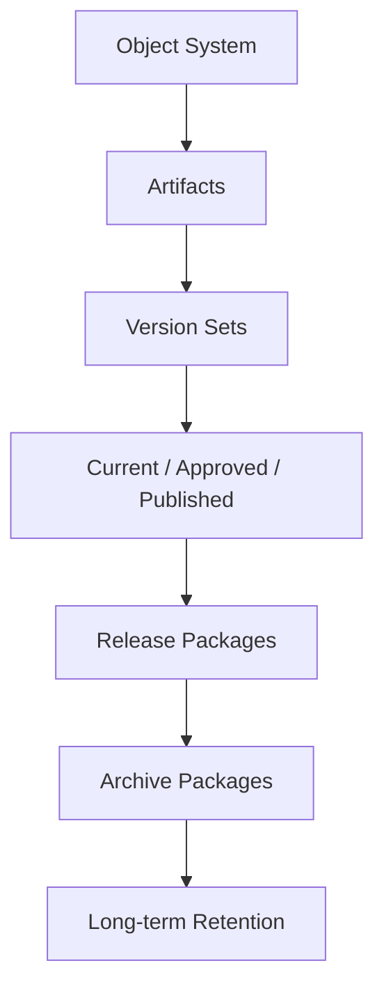
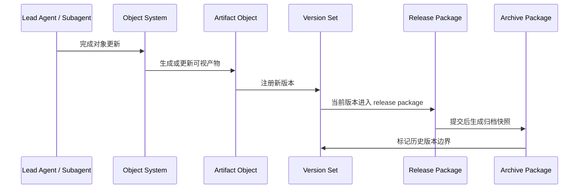
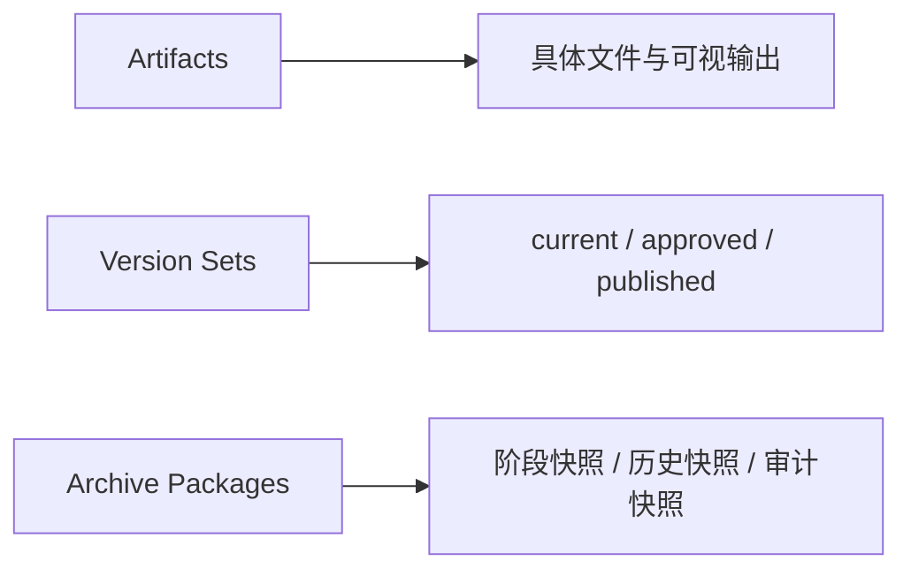
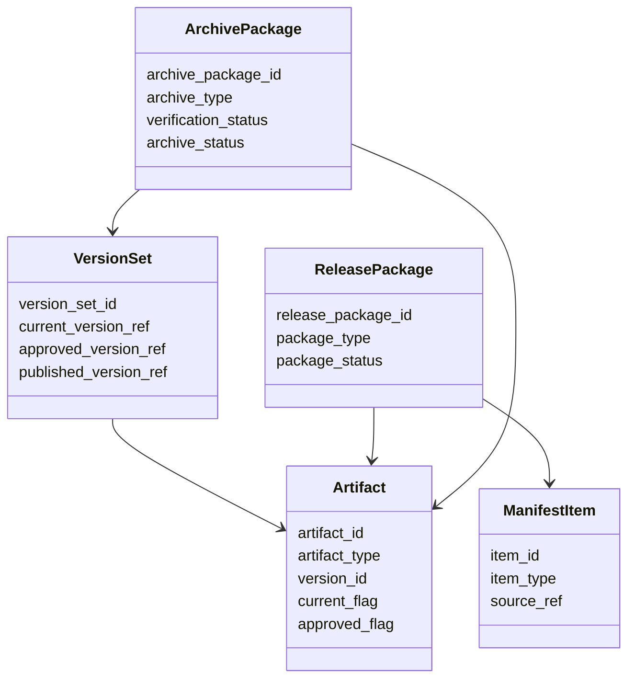
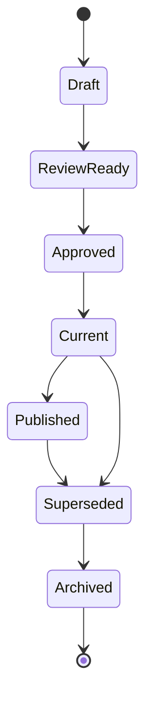
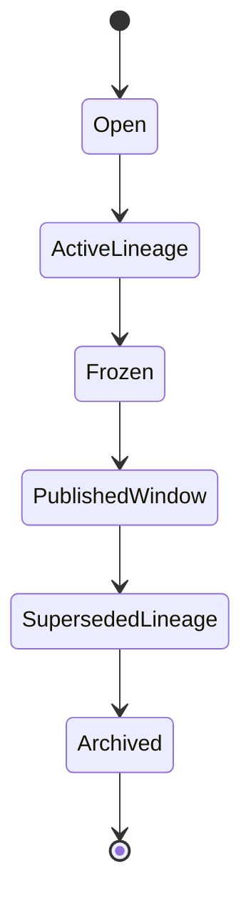
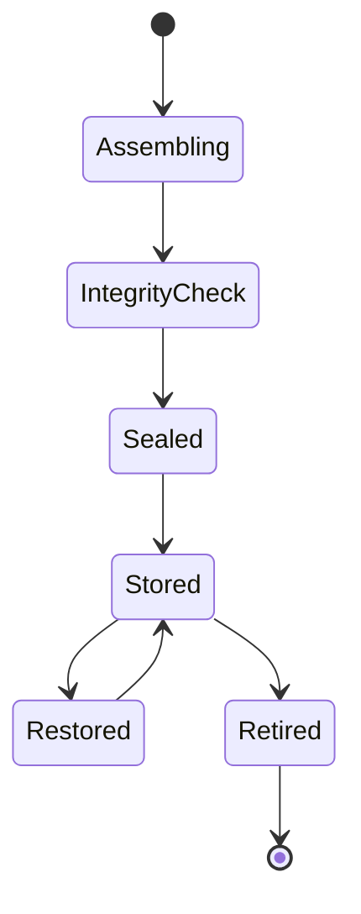
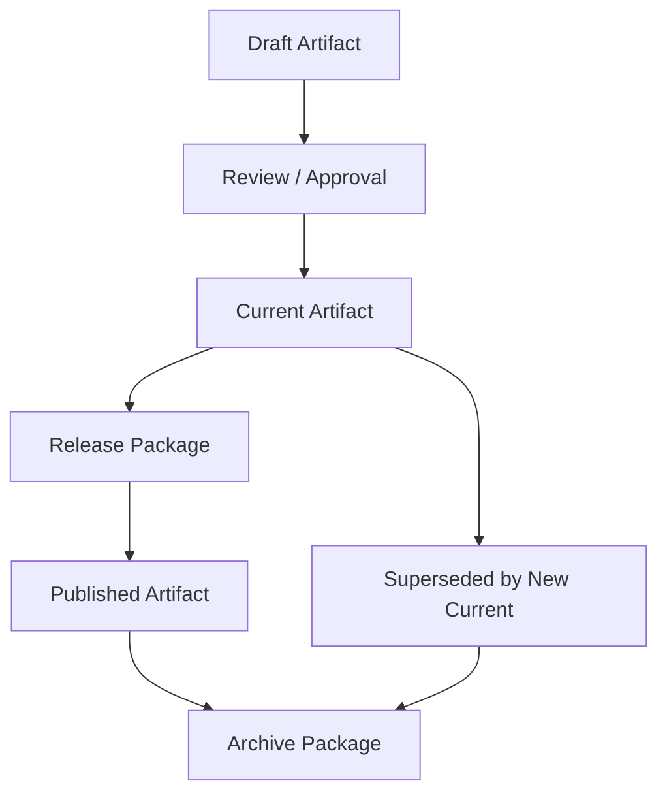
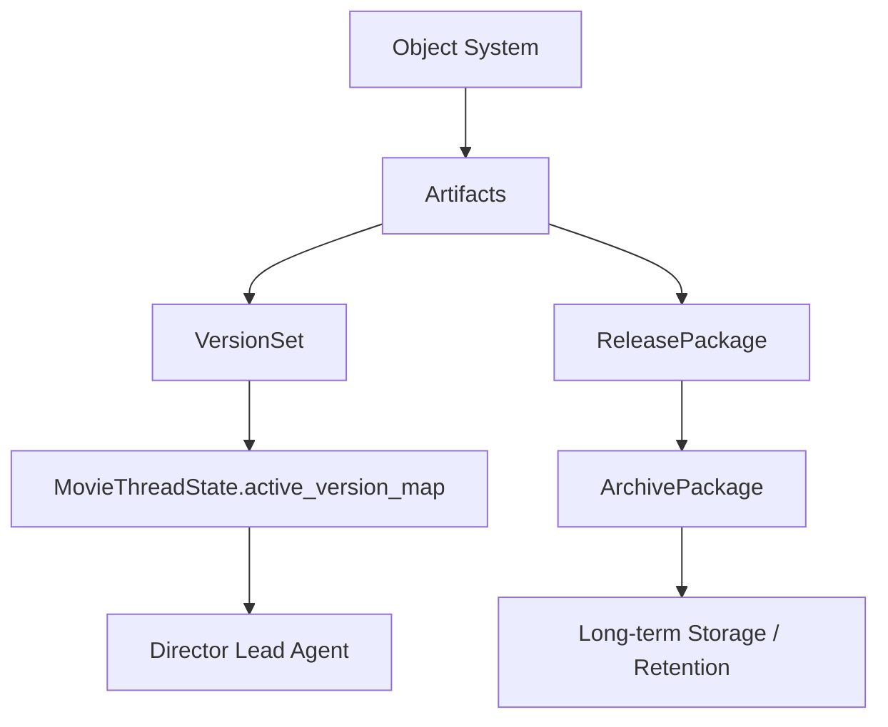

# 70. 产物、版本与归档体系设计

这一篇聚焦：

**为什么电影导演智能体平台在完成对象系统、状态机、审批流、记忆层设计之后，最后还必须把产物、版本与归档单独建成一套正式体系，才能让所有文档、图表、参考图、交付包和历史版本都具备可追踪、可切换、可交付、可回溯的边界。**

---

## 1. 为什么 70 要作为 61-70 这一组的收口

61-69 已经把平台的核心骨架基本建出来了：

- 61：对象系统总览
- 62：线程控制状态
- 63-66：核心对象体系
- 67-68：工作流与控制流
- 69：记忆与知识沉淀

但在真实落地时，用户、团队、工具和外部接口真正经常直接接触到的，往往不是抽象对象，而是：

- 文档
- 图表
- 分镜图
- 参考帧
- 报告
- 清单
- 交付包

这些内容如果没有正式的产物、版本与归档体系，平台就会出现一个经典问题：

**对象层看起来很完整，但文件层和交付层仍然一团乱。**

所以 70 的作用，就是把 61-69 的对象世界，正式收口到：

- 对人可见
- 对外可交付
- 对历史可回溯
- 对系统可追踪

的产物层体系。

---

## 2. 为什么对象系统不能替代产物体系

对象系统负责的是：

- 结构化事实
- 状态与关系
- 工作流推进

但电影制作是一个高度依赖“可查看产物”的行业。

因为很多决策并不是围绕抽象字段做的，而是围绕：

- 某版分镜 PDF
- 某组关键帧
- 某版镜头表导出
- 某份预算报告
- 某版交付清单
- 某次 release package manifest

也就是说：

- 对象是事实层
- 产物是视图层和交付层

如果没有正式的产物体系，平台就会出现下面的问题：

- 有对象，没有正式可交付文件
- 有文件，但不知道对应哪个对象版本
- 有 current 对象，但 current 文件不清楚
- 有历史文件，但没有清晰 archive 边界

---

## 3. 为什么记忆系统也不能替代归档体系

前一篇已经讲过，记忆层负责经验与知识沉淀。

但记忆层主要回答的是：

- 学到了什么
- 下次怎么做
- 哪些模式值得复用

而归档体系主要回答的是：

- 当时具体交付了什么
- 哪一版文件是正式版本
- 哪个包曾经被提交出去
- 哪些历史版本必须保留

所以：

- 记忆层偏知识
- 归档层偏证据与历史快照

这两者不能互相替代。

---

## 4. 一张总览图：对象、产物、版本、归档的关系

这张图说明：

- 产物层不是脱离对象层的孤岛
- 它是从对象到交付再到归档的正式桥梁

---

## 5. 什么应该被视为“产物”

建议不要把 artifact 理解得太窄。

在电影导演智能体平台里，artifact 至少包括下面几类。

### 第一类：文档类产物
例如：

- 项目摘要
- 剧本分析报告
- 预算报告
- 排期表
- review report

### 第二类：视觉类产物
例如：

- 分镜图
- moodboard
- 关键帧
- 视觉参考图
- look development 输出

### 第三类：结构化导出类产物
例如：

- shot list 导出
- call sheet 导出
- manifest
- checklist 导出

### 第四类：交付类产物
例如：

- release package
- 对外提交包
- 审看包
- 阶段性交付清单

换句话说，artifact 不只是“附件”，而是对象层对人和对外世界的正式出口。

---

## 6. 为什么版本体系不能靠文件名管理

很多团队习惯这样管理版本：

- final_v3
- final_v5_last
- final_v5_last_final

这在临时文件协作里很常见，但在平台里几乎一定会失控。

因为文件名无法稳定表达：

- 哪个是 current
- 哪个是 approved
- 哪个只是试验版
- 哪个已经 superseded
- 哪个曾经对外提交过

所以版本体系必须从“文件命名习惯”升级成正式对象能力。

这意味着平台至少需要表达：

- 版本 ID
- 版本来源
- 版本关系
- 当前标记
- 审批标记
- 归档标记

---

## 7. 为什么归档不能等于“丢到历史目录”

归档最容易被误解成：

- 不用了就丢进 archive 文件夹

这远远不够。

正式归档至少要回答：

- 为什么归档
- 归档的是哪个版本集合
- 归档是否完整
- 归档之后还能否被检索和复原
- 归档和当前有效版本的边界是什么

也就是说，归档不是“删掉前的暂存”，而是：

- 正式历史快照
- 合规与追溯边界
- 回滚与审计入口

---

## 8. 国内项目里的现实差异

国内项目在产物、版本与归档层，通常会更明显遇到下面这些问题：

- 文件分散在聊天工具、网盘、本地目录、临时硬盘
- current 版与送审版、宣发版、执行版边界容易混
- 高压时间窗口下，容易出现“先发后补整理”
- 历史版本保留不稳定，导致后续追责和复盘困难

这意味着中国语境下的体系设计，不能只支持“理想化统一仓库”，还必须支持：

- 快速 current 切换
- 条件式冻结
- 阶段性归档快照
- 对外交付与内部 current 的区分
- 多来源文件正式纳管

---

## 9. 一张时序图：一个正式产物如何进入版本与归档体系

这张图说明：

- 产物不是对象系统的附属副本
- 它会进入正式的版本链、交付链和归档链

---

## 10. `Artifact` 对象应该包含哪些核心字段

建议把 artifact 对象拆成七组字段。

### 第一组：身份字段
- `artifact_id`
- `project_id`
- `artifact_type`
- `artifact_label`
- `workspace_path`

### 第二组：来源字段
- `source_object_refs`
- `source_phase`
- `generated_by_role`
- `generation_context`

### 第三组：内容字段
- `format`
- `manifest_summary`
- `preview_refs`
- `checksum`

### 第四组：版本字段
- `version_id`
- `version_label`
- `previous_version_ref`
- `lineage_root_id`

### 第五组：状态字段
- `artifact_status`
- `current_flag`
- `approved_flag`
- `published_flag`

### 第六组：联动字段
- `release_package_refs`
- `archive_package_refs`
- `review_refs`
- `approval_refs`

### 第七组：治理字段
- `created_at`
- `created_by`
- `retention_policy`
- `archived_at`

---

## 11. 为什么还需要 `VersionSet`，而不只是 artifact 单体

这是一个经常被忽略但非常关键的点。

单个 artifact 可以表达：

- 一份具体产物

但很多时候系统还需要表达：

- 这一串版本彼此是什么关系
- 哪个是当前主版本
- 哪个只是分支试验
- 哪个已经对外提交

这时候就需要一个更高层的对象，例如：

- `VersionSet`
- `ArtifactLineage`

它负责承接的不是单个文件，而是整个版本家族。

---

## 12. `VersionSet` 对象应该包含哪些核心字段

建议把版本集合对象拆成六组字段。

### 第一组：身份字段
- `version_set_id`
- `project_id`
- `scope_type`
- `scope_ref_ids`

### 第二组：主链字段
- `root_version_ref`
- `current_version_ref`
- `approved_version_ref`
- `published_version_ref`

### 第三组：关系字段
- `parent_child_relations`
- `branch_refs`
- `merge_notes`
- `superseded_refs`

### 第四组：发布字段
- `release_refs`
- `submission_refs`
- `rollback_refs`
- `freeze_points`

### 第五组：检索字段
- `search_tags`
- `phase_tags`
- `artifact_type_tags`
- `milestone_tags`

### 第六组：治理字段
- `status`
- `last_updated_at`
- `owner_role`
- `archived_at`

---

## 13. `ArchivePackage` 对象应该包含哪些核心字段

建议把归档包对象拆成六组字段。

### 第一组：身份字段
- `archive_package_id`
- `project_id`
- `archive_type`
- `archive_label`

### 第二组：范围字段
- `included_artifact_refs`
- `included_version_refs`
- `included_object_refs`
- `phase_scope`

### 第三组：快照字段
- `snapshot_reason`
- `snapshot_time`
- `snapshot_owner`
- `snapshot_manifest`

### 第四组：恢复字段
- `restore_entry_points`
- `rollback_compatibility`
- `integrity_status`
- `rebuild_notes`

### 第五组：保留字段
- `retention_policy`
- `deletion_rule`
- `legal_hold_flag`
- `storage_tier`

### 第六组：治理字段
- `archive_status`
- `verification_status`
- `verified_at`
- `closed_at`

---

## 14. 一张分层图：产物层内部的三层结构

这张图说明：

- artifact、version、archive 是三个不同粒度
- 不能把它们混成一个字段或一个目录概念

---

## 15. 一张类图：产物、版本与归档的结构关系

这张图说明：

- `VersionSet` 管理版本关系
- `ReleasePackage` 管理对外交付组合
- `ArchivePackage` 管理历史快照和恢复边界

---

## 16. 为什么 provenance 和 manifest 非常关键

电影制作里，很多问题最后都会回到同一个追问：

- 这份东西从哪来的
- 用的是哪版
- 是谁生成的
- 为什么会被拿去交付

这其实就是 provenance 问题。

所以 artifact 体系必须对下面这些信息有正式表达：

- 来源对象
- 来源版本
- 生成角色
- 生成时间
- 所属 release package
- 所属 archive package

而 manifest 的价值在于：

- 让“包里到底有什么”变成可读、可校验、可追溯的正式结构

---

## 17. 为什么必须明确 `current / approved / published / archived` 四种边界

很多团队只区分：

- 当前版
- 历史版

这在电影项目里不够。

至少还要再补两层：

### `current`
当前内部正在使用的版本。

### `approved`
已经被正式批准，但不一定已经对外发布。

### `published`
已经对外提交、对外发送或正式落入交付边界的版本。

### `archived`
不再作为当前运行版本，但被保留为正式历史快照。

如果没有这四层边界，系统就会经常出现：

- 内部 current 和对外发布版本不一致，但没人说得清
- 已批准但未发布的版本和历史版混在一起

---

## 18. 一张状态图：`Artifact` 生命周期

这张图说明：

- artifact 的状态不是简单“生成完成”
- 它还会经历 review、approval、发布、替代、归档

---

## 19. 一张状态图：`VersionSet` 生命周期

这张图说明：

- 版本集合也会经历活跃、冻结、发布窗口、替代、归档
- 这不是单个 artifact 能表达清楚的

---

## 20. 一张状态图：`ArchivePackage` 生命周期

这张图说明：

- 归档包不是生成完就不管
- 它还涉及校验、封存、存储、恢复、退役

---

## 21. 一张版本传播图：current 版如何进入发布与归档

这张图说明：

- current、published、archived 不是同一个动作
- 它们有明确先后关系

---

## 22. 为什么 `MovieThreadState` 只应该保存“活跃产物摘要”

前面已经多次强调，线程状态不应该膨胀成全量仓库。

对于产物层，同样应该遵守这个原则。

更合适的做法是让 `MovieThreadState` 保存：

- `artifact_refs`
- `current_deliverables`
- `active_version_map`
- `latest_release_package_ref`
- `archive_checkpoint_refs`

而不是把所有文件元数据都塞进去。

这样主智能体才能快速回答：

- 当前有效产物有哪些
- 哪些产物已经被批准
- 哪些包已经进入归档快照

---

## 23. DeerFlow 里这套体系最自然的承接方式

如果后面进入代码实现，这套体系最自然的承接方式会是：

- 用 DeerFlow 的 artifacts 承接可见产物
- 用对象系统与 `VersionSet` 管理版本关系
- 用 `ReleasePackage` 承接对外交付边界
- 用 `ArchivePackage` 承接正式历史快照
- 用 `MovieThreadState` 保存活跃产物与当前版本摘要
- 用 workspace 文件流承接实际文件生成与组织

也就是说：

- DeerFlow 的强项不是只保存附件
- DeerFlow 的强项是把附件、对象、版本、归档和工作流统一串起来

---

## 24. 一张 DeerFlow 映射图

这张图说明：

- artifacts 不是孤立文件区
- 它们会进入版本控制、交付控制和归档控制三条正式链路

---

## 25. 第一版实现应该做到什么程度

为了避免一开始做得过重，建议第一版先做到下面这个粒度。

### 先支持

- `Artifact`
- `VersionSet`
- `ReleasePackage`
- `ArchivePackage`

### 第一版就要有的关键能力

- current / approved / archived 基础边界
- 关键 artifact 的 lineage 记录
- package manifest
- 基础 archive snapshot

### 暂时不要一开始就做太深的部分
例如：

- 极复杂的跨存储层冷热分级
- 全自动跨系统版本同步
- 超细粒度权限与加密分发体系

这些可以在后续逐步补。

---

## 26. 这一篇与后续文档的关系

这一篇回答的是：

**当电影导演智能体平台已经建立了对象、状态、审批、记忆这些核心能力之后，所有实际可见的文件、图表、报告、交付包与历史快照到底应该如何组织，才能让系统真正具备可交付、可回溯、可归档能力。**

而这也正好为后面的源码映射与工程化设计铺路：

- 71 之后会继续进入 DeerFlow 源码改造与实现层
- 79 会进一步把工作区、产物与文件流展开

---

## 27. 这一篇最重要的结论

### 结论一
产物层不是对象层的附件区，而是电影导演智能体平台对人可见、对外可交付、对历史可追溯的正式边界层。

### 结论二
国内外差异的关键，不只是文件存放方式不同，而是系统是否能清晰表达 current、approved、published、archived 四种版本边界，并在高压交付环境下稳定切换。

### 结论三
在 DeerFlow 中，把 artifacts、`VersionSet`、`ReleasePackage`、`ArchivePackage` 与 `MovieThreadState` 串成正式链路，是让平台从“有对象设计”真正走向“有可运行文件与交付系统”的关键收口。

---

---

<!-- movie-doc-nav:start -->
## 文档导航

- 总入口：[README.md](./README.md)
- 阅读地图：[00-reading-map.md](./00-reading-map.md)
- 所在分组：61-70 对象、状态、审批与归档
- 上一篇：[69. 记忆与知识沉淀设计](./69-memory-and-knowledge-capture-design.md)
- 下一篇：[71. Lead Agent 改造方案](./71-lead-agent-transformation-plan.md)

### 同组文档
- [61. 项目对象系统总览](./61-project-object-system-overview.md)
- [62. MovieThreadState 设计](./62-movie-thread-state-design.md)
- [63. Script / Scene / Character 对象体系](./63-script-scene-character-object-system.md)
- [64. Budget / Schedule / Resource 对象体系](./64-budget-schedule-resource-object-system.md)
- [65. ShotPlan / Storyboard / PromptPack 对象体系](./65-shotplan-storyboard-promptpack-object-system.md)
- [66. Review / Approval / ReleasePackage 对象体系](./66-review-approval-release-package-object-system.md)
- [67. 工作流状态机设计](./67-workflow-state-machine-design.md)
- [68. 审批流与升级流设计](./68-approval-and-escalation-flow-design.md)
- [69. 记忆与知识沉淀设计](./69-memory-and-knowledge-capture-design.md)
- 70. 产物、版本与归档体系设计（当前）
<!-- movie-doc-nav:end -->
