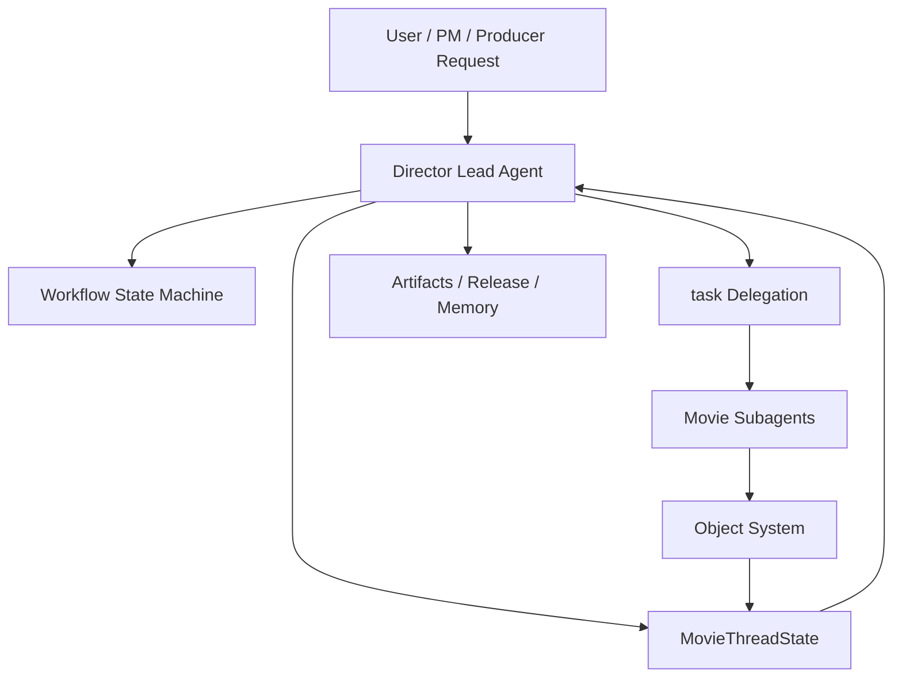
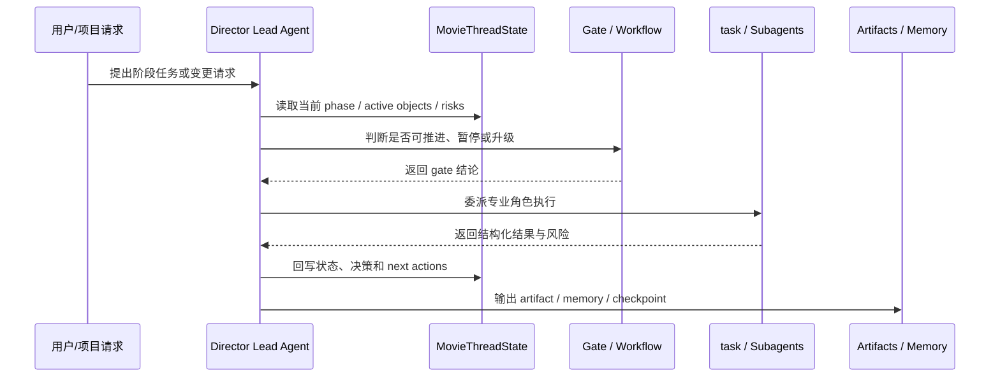
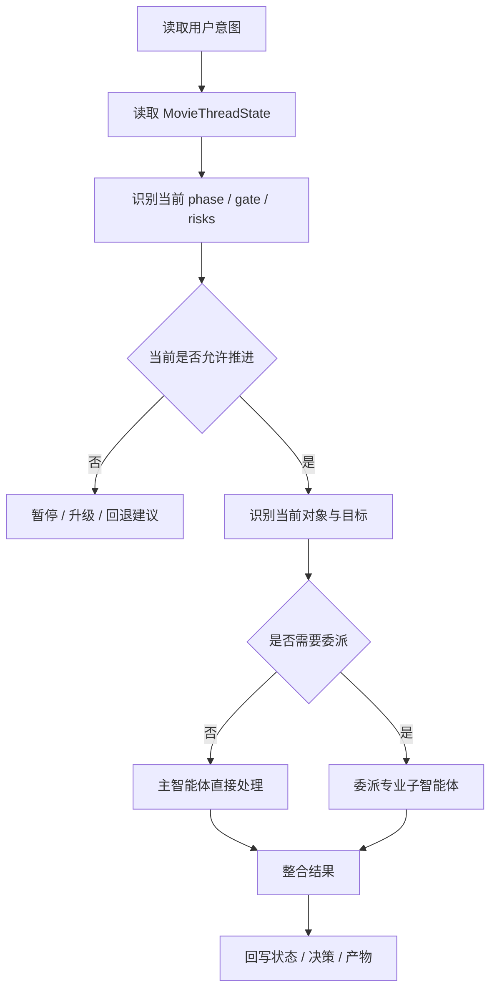
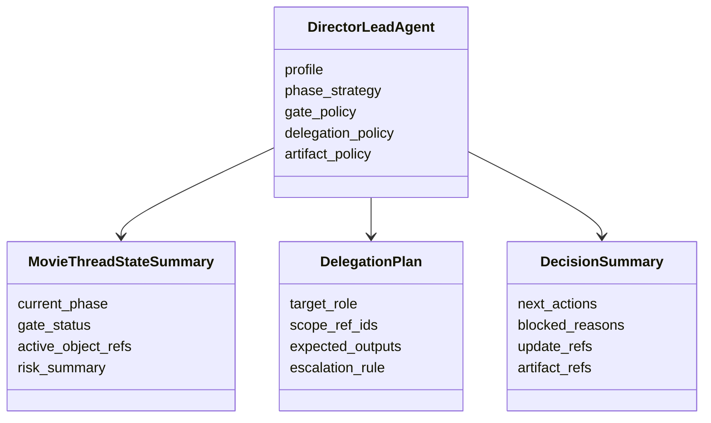
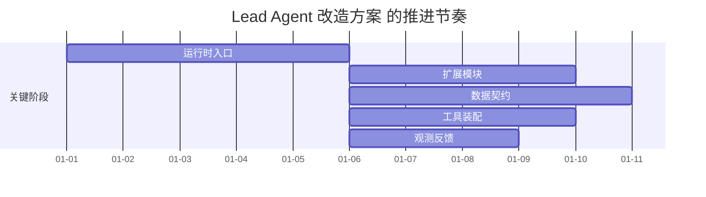

# 71. Lead Agent 改造方案

这一篇聚焦：

**为什么要把 DeerFlow 当前通用 `Lead Agent` 明确改造成“导演总控智能体”，以及这次改造在代码层、运行时层、提示词层、状态层和委派层分别应该落在哪里。**

---

## 1. 为什么 71 要紧接在 70 后面

61-70 这组文档已经把电影导演智能体平台的业务骨架讲清楚了：

- 平台围绕哪些对象协作
- 当前线程如何承接阶段、风险、版本与审批
- 工作流状态机如何推进
- 产物、版本与归档如何形成正式边界

但这些都还是“平台该长什么样”。

71 开始要回答的是另一个更实际的问题：

**在 DeerFlow 当前代码底座上，第一刀应该改哪里，才能让这套业务设计真的开始运行。**

最自然的第一刀，就是 `Lead Agent`。

因为在当前架构里，几乎所有事情最终都会汇到这里：

- 读取状态
- 决定下一步
- 调用工具
- 委派子智能体
- 汇总结果
- 回写线程状态

也就是说，如果 61-70 解决的是“平台模型”，那么 71 解决的是“谁来做总控，以及总控在代码里怎么成立”。

---

## 2. 当前 DeerFlow 里的 `Lead Agent` 是什么

从当前仓库结构看，最核心的入口包括：

- `backend/packages/harness/deerflow/agents/lead_agent/agent.py`
- `backend/packages/harness/deerflow/agents/lead_agent/prompt.py`
- `backend/packages/harness/deerflow/agents/factory.py`
- `backend/packages/harness/deerflow/config/agents_config.py`

当前 `Lead Agent` 的本质是一个通用总控代理：

- 它负责作为主入口承接用户任务
- 它挂接 middleware
- 它挂接 built-in tools
- 它决定是否进入 plan mode
- 它决定是否调用 `task` 委派子智能体

这说明：

- 我们并不需要从零发明“导演总控”的运行框架
- 真正需要做的是把当前通用总控，升级成一个“懂电影项目、懂阶段、懂对象、懂审批”的行业化总控

---

## 3. 为什么 `Lead Agent` 必须先改造

如果不先改 `Lead Agent`，后面即使把：

- movie tools
- movie skills
- movie state
- movie subagents

都补出来，系统也仍然会出现几个关键问题：

- 没有稳定的全局优先级判断
- 没有统一的阶段推进入口
- 没有跨部门冲突整合能力
- 没有正式的 gate 评估入口

换句话说：

- 子智能体只负责“局部专业动作”
- 导演主智能体负责“项目级控制与整合动作”

所以 71 不只是技术起点，它也是整个平台组织逻辑的总入口。

---

## 4. 一张总览图：导演总控智能体在平台中的位置

这张图说明：

- `Lead Agent` 不是普通聊天入口
- 它位于状态、工作流、对象系统和子智能体之间的控制中心

---

## 5. 改造成导演总控后，`Lead Agent` 的核心职责是什么

建议把职责明确收敛成六类。

### 第一类：项目理解
负责读取：

- 当前项目阶段
- 当前活跃对象
- 当前 gate 状态
- 当前风险与阻塞点

### 第二类：目标分解
负责把用户意图或项目目标，分解成：

- 当前阶段目标
- 当前轮次目标
- 当前对象级目标

### 第三类：委派决策
负责决定：

- 是否要用子智能体
- 用哪个子智能体
- 委派边界是什么

### 第四类：结果整合
负责把多个子智能体结果整合成：

- 当前结论
- 当前风险摘要
- 下一步动作

### 第五类：gate 判断
负责在关键节点判断：

- 是否允许推进
- 是否要暂停
- 是否要升级
- 是否要回退

### 第六类：正式回写
负责回写：

- `MovieThreadState`
- 关键对象摘要
- 决策记录
- artifact 索引

---

## 6. 当前代码入口与改造落点

建议把改造落点分成四层。

### 第一层：主入口
代码入口：

- `backend/packages/harness/deerflow/agents/lead_agent/agent.py`
- `backend/packages/harness/deerflow/agents/factory.py`

改造方向：

- 引入 `director` 角色模式
- 让主入口能识别 movie profile
- 允许挂接电影专用 middleware、tools、skills

### 第二层：提示词与策略层
代码入口：

- `backend/packages/harness/deerflow/agents/lead_agent/prompt.py`
- agent SOUL / config 体系

改造方向：

- 把“通用协作型总控 prompt”改成“阶段驱动 + 对象驱动 + gate 驱动”的导演 prompt

### 第三层：运行时控制层
代码入口：

- middlewares
- `thread_state.py`
- memory middleware

改造方向：

- 读取电影项目摘要
- 写回阶段状态与风险摘要
- 挂接 gate 判断与升级摘要

### 第四层：委派层
代码入口：

- `tools/builtins/task_tool.py`
- `subagents/executor.py`

改造方向：

- 从通用子任务委派，扩展成角色化、对象化、阶段感知的专业委派

### 一张导演总控循环图

这张图把导演总控从“静态角色”变成“持续控制循环”，更容易看清为什么 `Lead Agent` 必须同时管状态、gate、委派和回写。

---

## 7. 导演总控智能体和通用主智能体的关键差异

建议明确五个差异。

### 差异一：从“问题响应”变成“项目推进”
通用主智能体偏问答与通用任务处理；导演总控偏持续推进项目。

### 差异二：从“自然语言上下文”变成“状态+对象上下文”
导演总控的主要输入不再只是消息，而是：

- `MovieThreadState`
- 当前活跃对象
- 当前 gate 状态

### 差异三：从“临时调用工具”变成“工作流型调度”
工具和子智能体不再是按灵感调用，而是按阶段和状态调用。

### 差异四：从“结果回答”变成“结果落账”
导演总控必须稳定输出：

- 对象更新摘要
- 风险更新
- 决策与下一步

### 差异五：从“完成一次请求”变成“维持一个线程生命周期”
导演总控要对长期线程连续性负责。

---

## 8. 提示词层应该怎么改

导演总控的 prompt 不应该继续只强调：

- 乐于助人
- 调用工具
- 必要时委派

它还必须显式强调下面几件事：

### 第一，阶段感知
每次回答前先判断当前阶段与子阶段。

### 第二，gate 感知
在推进前判断：

- 有无待审批
- 有无阻塞风险
- 有无升级案例

### 第三，对象感知
在委派前明确：

- 当前活跃对象是什么
- 输出要写回哪个对象

### 第四，交付感知
在结束本轮前明确：

- 本轮是否产生新 artifact
- 是否需要形成正式摘要或报告

这意味着 prompt 层应从“通用协作说明”升级成“导演控制手册”。

---

## 9. 一张决策流图：导演总控如何做一轮判断

这张图说明：

- 导演总控的第一动作不应该是直接生成内容
- 而应该是先判断“当前局面”

---

## 10. middleware 层应该如何配合改造

导演总控的很多能力，不应该全部堆在 agent 主循环里。

更合适的做法是把部分职责下沉到 middleware 层。

建议至少考虑下面几类扩展。

### `movie_state_reader_middleware`
负责在每轮开始时加载：

- 当前 phase
- active versions
- pending approvals
- risk summary

### `movie_state_writer_middleware`
负责在每轮结束时更新：

- next actions
- recent decisions
- active object refs

### `movie_gate_middleware`
负责在关键动作前进行 gate 预检查。

### `movie_artifact_tracking_middleware`
负责捕捉本轮新增产物并挂接到对象与状态。

这能让 `Lead Agent` 本体保持“做判断”，而不是“做所有 plumbing”。

---

## 11. 为什么导演总控必须和 `MovieThreadState` 强绑定

如果导演总控不和线程状态强绑定，就会重新退化成：

- 每轮靠聊天历史猜项目状态
- 无法稳定识别当前有效版本
- 无法稳定识别当前阻塞点

所以建议在 `Lead Agent` 改造中明确规定：

- 主智能体的每轮启动，必须先读取 `MovieThreadState`
- 主智能体的每轮结束，必须输出可回写的状态摘要
- 关键委派必须声明引用的对象与状态边界

这就把总控的“会说话”升级成了“会控制项目”。

---

## 12. 导演总控与子智能体之间的边界

建议把边界写得非常清楚。

### 导演总控负责

- 判断优先级
- 判断阶段
- 判断 gate
- 判断是否推进 / 暂停 / 升级 / 回退
- 整合多个专业意见

### 子智能体负责

- 在被指定范围内完成专业分析或生成
- 回写结构化结果与风险
- 不越权决定全局推进

也就是说：

- 子智能体负责专业深度
- 总控负责项目级决策

---

## 13. 一张类图：导演总控改造后的结构草图

这张图说明：

- 未来的导演主智能体，不应该只是把 prompt 包一层
- 它应当有更明确的策略对象与输出结构

---

## 14. 运行时 sequence 应该怎么变化

建议运行时从当前通用流程，升级成下面这种节奏：

1. 读取线程状态摘要
2. 判断 phase / gate / risk
3. 识别当前对象与目标
4. 决定是否委派
5. 汇总结果
6. 回写状态与产物
7. 明确下一步动作

如果没有这层序列化控制，导演总控很容易变成：

- 调用很多工具
- 输出很多内容
- 但没有推进感

---

## 15. 为什么第一版不要把导演总控做得过重

虽然导演总控是平台总入口，但第一版不应该一下子承担：

- 全自动复杂状态迁移
- 全量审批策略推理
- 全量多项目资源统筹

更合适的做法是按三步推进。

### 第一步
先让它能够：

- 读 `MovieThreadState`
- 做 phase-aware 委派
- 回写 next actions

### 第二步
再让它能够：

- 做 gate-aware 判断
- 调用 approval / escalation 流
- 管理 artifact current 边界

### 第三步
最后再让它能够：

- 做更复杂的多阶段长期控制
- 做模板化项目推进

---

## 16. DeerFlow 里的建议落点

如果后面真的开始改代码，最自然的落点会是：

- `backend/packages/harness/deerflow/agents/lead_agent/agent.py`
- `backend/packages/harness/deerflow/agents/lead_agent/prompt.py`
- `backend/packages/harness/deerflow/agents/factory.py`
- `backend/packages/harness/deerflow/config/agents_config.py`
- 新增 movie-specific middlewares

并建议不要一开始就复制一套全新的 agent 运行框架，而是：

- 复用现有 `Lead Agent`
- 增加 `director` 配置模式
- 增加 movie runtime 策略层

---

## 17. 第一版实现建议

第一版建议先做到下面这些能力：

- `director` 主智能体配置
- 读取 `MovieThreadState` 摘要
- 基于 phase 做委派
- 基于 risk / approval 做简单 gate 判断
- 回写 next actions / decision summary / artifact refs

暂时不要一开始就做得太深的部分包括：

- 全自动 phase 状态迁移引擎
- 复杂跨项目调度
- 全量角色权限矩阵

---

## 18. 这一篇与后续文档的关系

这一篇回答的是：

**在 DeerFlow 当前底座上，最核心的主入口应该如何改造，才能让电影导演智能体平台拥有真正的总控。**

后面几篇会继续把总控下游的关键落点拆开：

- 72：`task` tool 与子任务委派扩展
- 73：Subagent registry 电影化扩展
- 74：ThreadState 扩展方案
- 75：movie tools 设计

---

## 19. 这一篇最重要的结论

### 结论一
`Lead Agent` 不需要推倒重来，但必须从通用任务型主控，升级成阶段驱动、对象驱动、gate 驱动的导演总控智能体。

### 结论二
这次改造的关键不只是 prompt，而是主入口、middleware、状态读取、委派策略和回写策略的整体升级。

### 结论三
在 DeerFlow 中，以现有 `lead_agent` 为骨架，增量引入 `director` profile，是把 61-70 那套平台设计真正挂到运行时里的第一步。

---

<!-- movie-visuals:start -->
## 补充图示：换一种视角看本篇

下面这张 甘特图 把“Lead Agent 改造方案”再压缩成一个可快速扫读的结构视图，便于先抓关键关系，再回到正文细节。

<!-- movie-visuals:end -->

<!-- movie-doc-nav:start -->
## 文档导航

- 总入口：[README.md](./README.md)
- 阅读地图：[00-reading-map.md](./00-reading-map.md)
- 所在分组：71-80 源码扩展与工程设计
- 上一篇：[70. 产物、版本与归档体系设计](./70-artifact-version-and-archive-system.md)
- 下一篇：[72. task tool 与子任务委派扩展](./72-task-tool-and-delegation-extension.md)

### 同组文档
- 71. Lead Agent 改造方案（当前）
- [72. task tool 与子任务委派扩展](./72-task-tool-and-delegation-extension.md)
- [73. Subagent registry 电影化扩展](./73-subagent-registry-cinema-extension.md)
- [74. ThreadState 扩展方案](./74-thread-state-extension-plan.md)
- [75. movie tools 设计](./75-movie-tools-design.md)
- [76. movie skills 设计](./76-movie-skills-design.md)
- [77. movie factory 设计](./77-movie-factory-design.md)
- [78. 自定义 agent 配置体系](./78-custom-agent-configuration-system.md)
- [79. 工作区、产物与文件流](./79-workspace-artifacts-and-file-flow.md)
- [80. 观测、日志与评估](./80-observability-logging-and-evaluation.md)
<!-- movie-doc-nav:end -->
