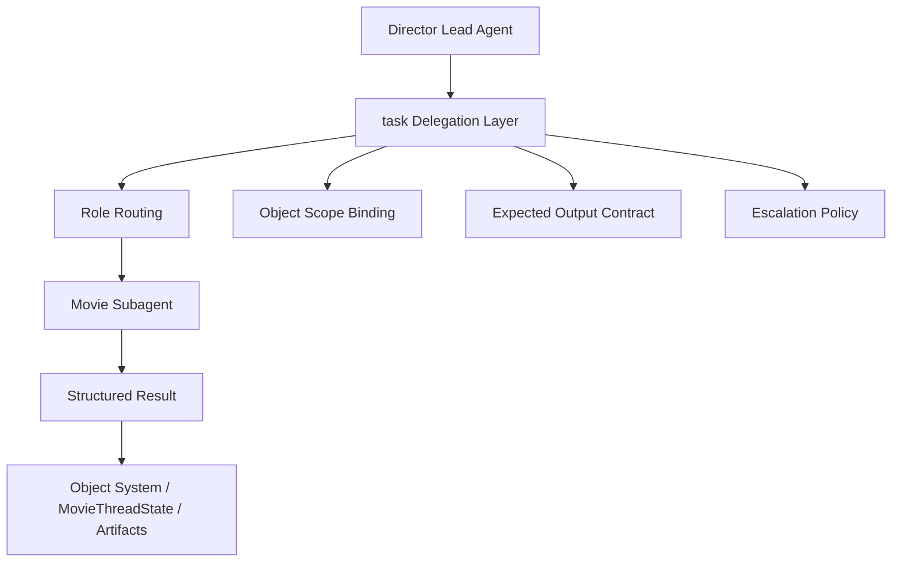
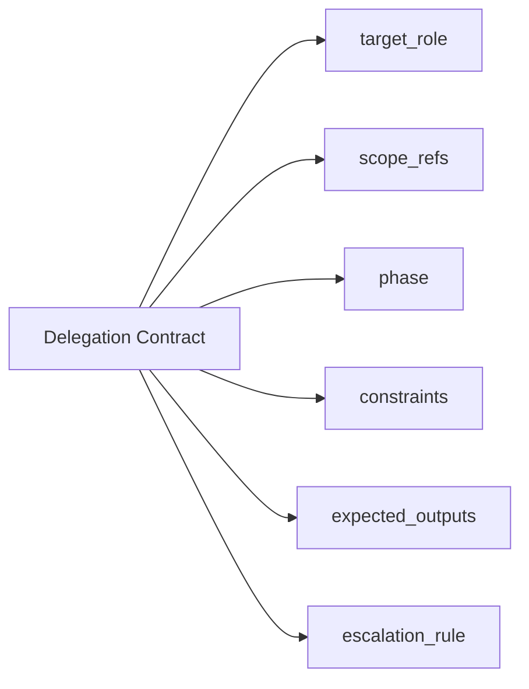
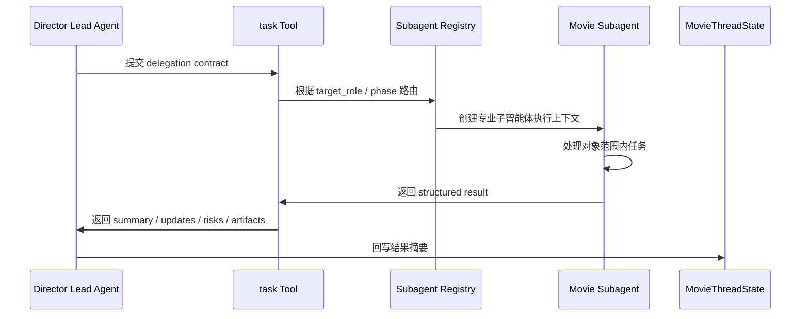
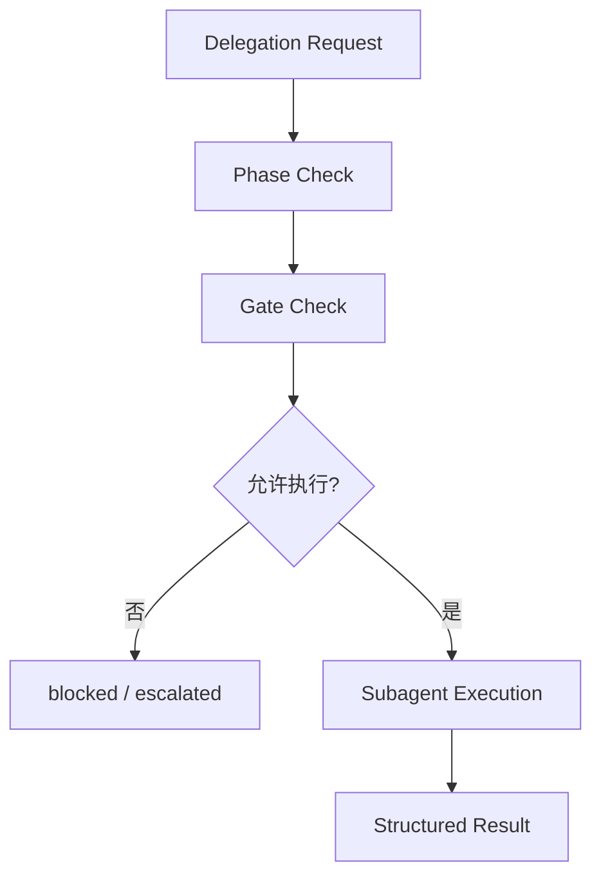
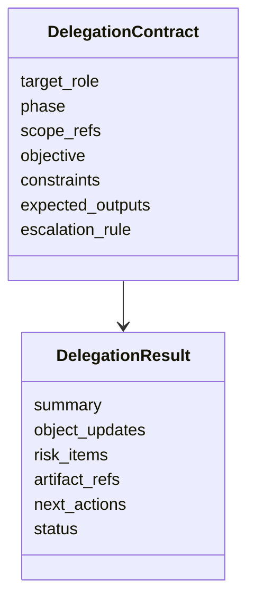

# 72. task tool 与子任务委派扩展

这一篇聚焦：

**为什么要把 DeerFlow 当前通用 `task` 工具扩展成“角色感知、对象感知、阶段感知、结果可回写”的电影化委派系统，以及这一步在代码和协议层应该怎么落地。**

---

## 1. 为什么 72 要紧接在 71 后面

71 刚刚把导演总控智能体的角色确立下来。

但导演总控一旦成立，就会马上面临一个现实问题：

**它不可能亲自完成所有专业动作。**

电影制作天然需要：

- 制片判断
- 剧本结构分析
- 排期分析
- 分镜设计
- 视觉风格整理
- 后期与交付判断

这意味着总控一旦进入真实工作流，就必须高度依赖委派。

而在 DeerFlow 当前架构里，最核心的委派入口就是：

- `backend/packages/harness/deerflow/tools/builtins/task_tool.py`

所以 72 实际上是在回答：

**通用 `task` 工具怎么升级，才能变成电影平台真正可用的专业委派总线。**

---

## 2. 当前 `task` 工具已经解决了什么

当前 `task` 工具的价值已经很高：

- 主智能体可以把任务拆给子智能体
- 子智能体可以独立执行
- 主智能体可以接收结果并继续推进

这说明 DeerFlow 当前底座已经有：

- 主从协作机制
- 子任务执行机制
- 委派运行时边界

也就是说，我们不用从零发明“多智能体协作”，而是要把这套协作从：

- 通用任务委派

升级成：

- 正式项目工作流委派

---

## 3. 为什么电影平台不能只用当前通用 `task`

如果直接用当前通用 `task` 去做电影制作，很快会出现几个问题：

- 委派目标只知道“找个 agent”，不知道是哪个专业角色
- 委派输入主要是自然语言，不是对象引用
- 委派结果主要是自然语言，不是结构化回写
- 无法表达阶段边界、审批边界、升级边界
- 无法表达结果应该写回哪些对象和哪些状态字段

所以电影平台真正需要的是：

- 角色感知委派
- 对象范围委派
- 结果契约委派
- 风险与升级感知委派

---

## 4. 一张总览图：电影化委派总线



这张图说明：

- `task` 不再只是把一句话扔给另一个 agent
- 它要成为正式的委派协议层

---

## 5. 电影化委派协议应该新增哪些能力

建议至少增加六类能力。

### 第一类：角色路由
明确这次委派是给：

- `producer`
- `script_analyst`
- `scheduler`
- `storyboard`
- `post_supervisor`

这样的专业角色，而不是模糊的通用代理。

### 第二类：对象范围
明确这次委派围绕哪些对象工作：

- 哪个 `scene_id`
- 哪个 `budget_id`
- 哪个 `shot_plan_id`

### 第三类：结果契约
明确返回时至少要给出：

- 更新建议
- 风险摘要
- 产物引用
- 是否阻塞

### 第四类：阶段边界
明确这次委派是在：

- 前期
- 拍摄
- 后期
- 发行

哪个阶段里发生的。

### 第五类：升级策略
明确如果发现：

- 权限不足
- 风险超阈值
- 跨部门冲突

应该怎么返回给主智能体。

### 第六类：回写边界
明确子智能体的结果能回写到：

- 对象系统
- `MovieThreadState`
- artifacts

中的哪些位置。

---

## 6. 建议把委派输入从“自然语言请求”升级成“委派契约”

建议为电影场景设计一个更正式的结构，例如：

- `target_role`
- `phase`
- `scope_refs`
- `objective`
- `constraints`
- `expected_outputs`
- `escalation_rule`

这意味着委派输入的核心不再是：

- “帮我看下这个”

而是：

- “以某个专业角色，在某个阶段，围绕某些对象，完成某类工作，并按固定结构返回”

---

## 7. 一张委派契约图



这张图说明：

- 电影化 `task` 的核心升级，不只是增强 prompt
- 而是把委派本身建成正式协议

---

## 8. 子智能体返回结果也应该结构化

建议让电影化 `task` 的返回结果至少支持下面这些段落：

- `summary`
- `object_updates`
- `risk_items`
- `artifact_refs`
- `recommended_next_actions`
- `escalation_required`

这样主智能体才能稳定完成两件事：

- 读懂专业结果
- 把结果回写到系统

否则主智能体每次都只能重新阅读大段自由文本，再自己猜哪些内容应该落账。

---

## 9. 为什么委派必须绑定对象引用

如果不绑定对象引用，平台很快会出现下面的混乱：

- 两个子智能体都在“看场景”，但不知道是哪个场景
- 一个子智能体在基于旧版预算工作
- 另一个子智能体在基于新版分镜工作
- 返回结果时没人知道应该挂到哪个对象上

所以电影化委派必须显式绑定：

- 对象 ID
- 版本 ID
- current / approved 边界

这样它才配得上“项目级协作”，而不是“多智能体闲聊”。

---

## 10. 一张时序图：一次电影化委派如何执行



这张图说明：

- 未来的 `task` 更像一个受约束的委派协议执行器

---

## 11. 错误处理和重试为什么要在 `task` 层正式化

电影制作里的很多子任务并不是一次成功。

常见情况包括：

- 输入对象不完整
- 阶段不允许当前动作
- 输出产物生成失败
- 发现风险超阈值，需要升级

所以电影化 `task` 至少要支持下面几种处理结果：

- `completed`
- `needs_clarification`
- `blocked`
- `escalated`
- `retryable_failure`

如果没有这些正式结果，主智能体会很难判断：

- 是重试
- 是改 scope
- 是升级
- 还是直接回退

---

## 12. 为什么 `task` 必须理解阶段和 gate

通用委派往往只关心：

- 能不能完成

但电影平台里的委派还必须关心：

- 当前阶段允不允许做这个动作
- 当前 gate 有没有阻塞

例如：

- 前期没锁稿，不应该发出正式生产级排期委派
- approval 未通过，不应该发出对外 release package 委派

所以建议 `task` 至少接收：

- `phase`
- `gate_context`
- `control_state`

让委派层本身就具备基本合法性校验。

---

## 13. 一张 gate 感知委派图



这张图说明：

- 委派不是永远先执行再说
- 需要有最小 gate 检查

---

## 14. 当前代码层的建议落点

建议重点落在：

- `backend/packages/harness/deerflow/tools/builtins/task_tool.py`
- `backend/packages/harness/deerflow/subagents/executor.py`
- `backend/packages/harness/deerflow/subagents/registry.py`
- `backend/packages/harness/deerflow/subagents/config.py`

其中：

- `task_tool.py` 负责委派契约与结果协议
- `executor.py` 负责执行流程、超时、重试、结果收集
- `registry.py` 负责角色路由
- `config.py` 负责角色级执行策略

---

## 15. 建议的委派契约数据结构

未来可以考虑引入类似下面的结构：

```text
DelegationContract
  - target_role
  - phase
  - control_state
  - scope_refs
  - objective
  - constraints
  - expected_outputs
  - escalation_rule
  - artifact_policy
```

对应返回结果：

```text
DelegationResult
  - summary
  - object_updates
  - risk_items
  - artifact_refs
  - next_actions
  - status
```

这能让后面的 73、74、75 自然接上。

---

## 16. 一张类图：委派输入与输出结构



这张图说明：

- 电影化 `task` 需要稳定输入和稳定输出

---

## 17. 为什么第一版要先做“半结构化”而不是“一步到位的全结构化”

虽然目标是正式协议，但第一版没必要一下子把所有字段都做成强校验。

更合适的路径是：

### 第一版
先做：

- 必填角色
- 必填 scope refs
- 基础 expected outputs
- 基础 status 枚举

### 第二版
再做：

- 更细粒度的 artifact policy
- 更细粒度的 escalation rule
- 更细粒度的 result schema

这样既能快速落地，也能控制复杂度。

---

## 18. 第一版实现建议

第一版建议先做到下面这些能力：

- `target_role` 委派
- `scope_refs` 委派
- `expected_outputs` 委派
- `status` 化返回
- `risk_items` 与 `artifact_refs` 回传

暂时不要一开始就做：

- 复杂并行子任务编排
- 自动图调度式委派
- 复杂跨项目资源抢占

---

## 19. 这一篇与后续文档的关系

这一篇回答的是：

**导演总控已经成立之后，DeerFlow 当前最关键的委派总线应该如何升级，才能让多专业协作真正围绕电影项目对象、阶段和 gate 运转。**

后面几篇会继续把这个委派体系往下拆：

- 73：Subagent registry 电影化扩展
- 74：ThreadState 扩展方案
- 75：movie tools 设计

---

## 20. 这一篇最重要的结论

### 结论一
电影平台里的 `task` 不能再只是“把话转交给另一个 agent”，而必须成为正式的委派契约执行层。

### 结论二
这次扩展的关键，是把角色、对象范围、阶段、期望输出、风险与升级规则显式化。

### 结论三
在 DeerFlow 中，以 `task_tool.py` 为中心扩展委派协议，是把导演总控与专业子智能体真正粘合成项目级工作流的关键一步。
