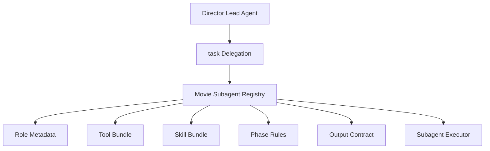
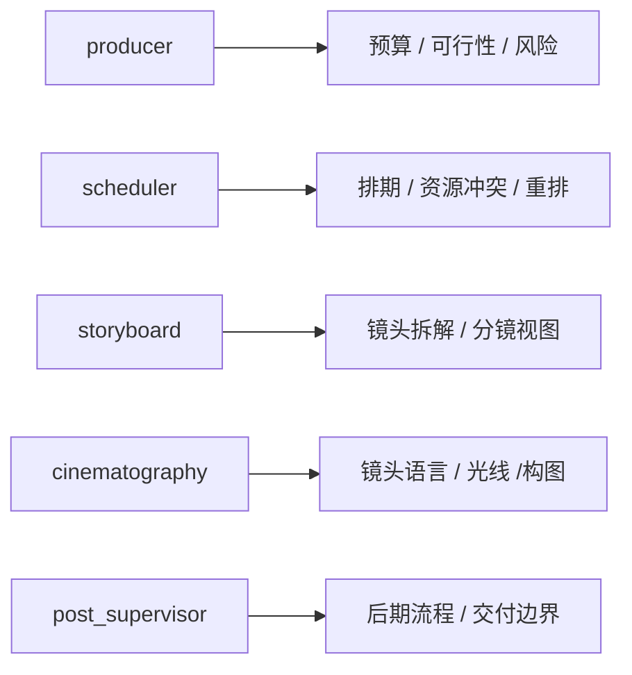
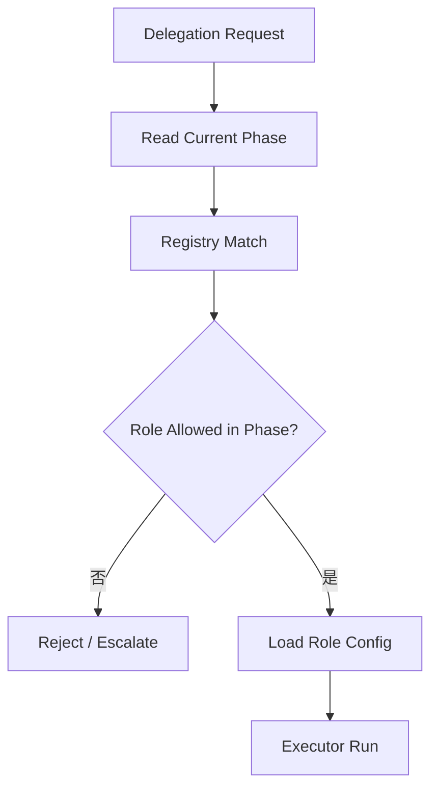
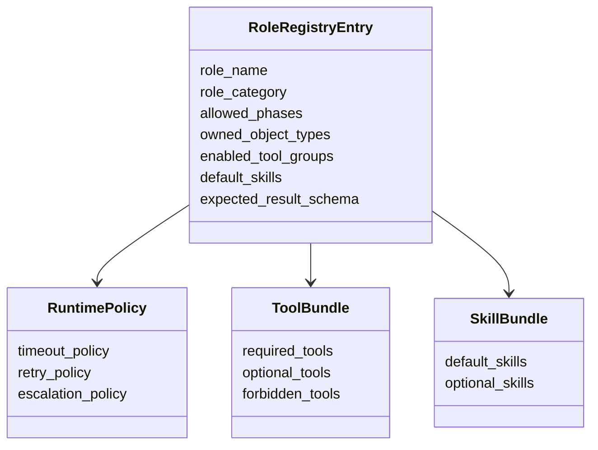
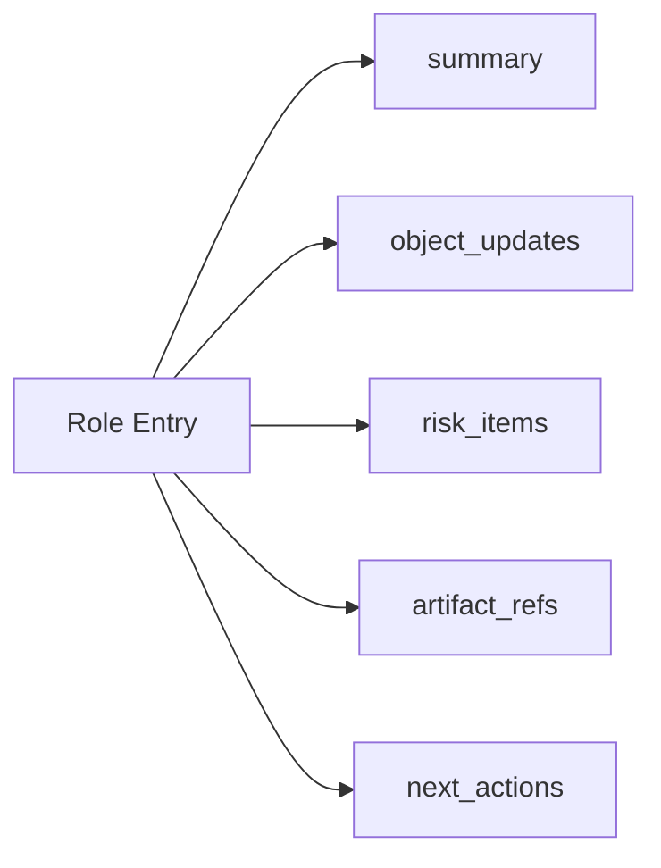

# 73. Subagent registry 电影化扩展

这一篇聚焦：

**为什么在导演总控和电影化 `task` 建立之后，还必须把 DeerFlow 当前的 subagent registry 扩展成“可声明专业角色、阶段适用性、能力边界、工具包和输出契约”的电影化注册系统。**

---

## 1. 为什么 73 要紧接在 72 后面

72 讲的是委派协议。

但委派协议成立以后，又会遇到一个现实问题：

**系统怎么知道某个专业角色到底存不存在、能做什么、在什么阶段能用、应该挂什么配置。**

这个问题的核心就落在：

- `backend/packages/harness/deerflow/subagents/registry.py`
- `backend/packages/harness/deerflow/subagents/config.py`

也就是说，72 解决的是“如何委派”，73 解决的是“可被委派的角色系统如何注册和治理”。

---

## 2. 当前 registry 已经解决了什么

当前 DeerFlow 的 subagent registry 已经解决了几个关键基础：

- 子智能体可以被定义与查找
- 子智能体可以有配置
- 执行器可以依据配置创建运行实例

这已经非常接近电影平台需要的骨架。

但电影平台需要把 registry 再往前推进一层，变成：

- 正式角色目录
- 能力目录
- 阶段适配目录
- 工具与技能装配目录

---

## 3. 为什么电影平台不能只靠通用子智能体注册

如果继续只使用通用子智能体注册，系统会很快遇到下面这些问题：

- 不知道 `producer` 和 `scheduler` 的职责边界
- 不知道某个角色是否允许在当前 phase 使用
- 不知道某个角色应该挂哪些 movie tools 和 skills
- 不知道某个角色的输出契约是什么

所以电影化 registry 必须回答：

- 这个角色是谁
- 它负责哪类对象
- 它在什么阶段可用
- 它的权限和边界是什么

---

## 4. 一张总览图：电影化 registry 的位置

这张图说明：

- registry 不只是“名字到类”的映射
- 它是角色系统的正式目录层

---

## 5. 电影化 registry 至少要保存哪些元数据

建议至少扩展下面七类元数据。

### 第一类：角色身份
- `role_name`
- `display_name`
- `role_category`

### 第二类：职责范围
- `owned_object_types`
- `primary_tasks`
- `non_responsibilities`

### 第三类：阶段适用性
- `allowed_phases`
- `preferred_subphases`
- `blocked_control_states`

### 第四类：工具装配
- `enabled_tool_groups`
- `required_tool_groups`
- `forbidden_tool_groups`

### 第五类：技能装配
- `default_skills`
- `optional_skills`
- `required_templates`

### 第六类：输出契约
- `expected_result_schema`
- `artifact_types`
- `risk_report_policy`

### 第七类：运行时策略
- `timeout_policy`
- `retry_policy`
- `escalation_policy`

---

## 6. 建议先定义哪些第一批电影角色

第一批建议聚焦在最小可运行闭环：

- `producer`
- `script_analyst`
- `scheduler`
- `storyboard`
- `cinematography`
- `casting`
- `location`
- `post_supervisor`

这些角色的共同特点是：

- 能明确映射到当前文档体系
- 能明确映射到对象系统
- 能明确映射到前期、中期、后期几个核心阶段

---

## 7. 为什么 registry 必须保存“职责边界”

电影项目里很多混乱并不是因为没人做事，而是因为：

- 多个角色都能给意见
- 但没人知道谁能做最终专业判断

所以 registry 不能只存“角色描述”，还应该存：

- 该角色负责什么
- 不负责什么

例如：

- `scheduler` 可以给重排建议，但不负责最终修改剧本
- `storyboard` 可以给视觉方案，但不负责全局预算判断
- `producer` 可以给可行性建议，但不应直接替代导演定义叙事目标

这让总控在委派时能够更稳定地做职责分离。

---

## 8. 一张角色边界图

这张图说明：

- registry 里的角色，不应该只是“多几个 agent 名字”
- 它们必须带有清晰边界

---

## 9. registry 为什么必须有 phase-aware 规则

一个角色并不是永远都适合被调用。

例如：

- `script_analyst` 在开发和前期更频繁
- `scheduler` 在前期与拍摄中更关键
- `post_supervisor` 在拍摄后期到发行期更关键

如果没有 phase-aware 规则，总控就很容易：

- 在错误阶段调用错误角色
- 让角色做超出阶段边界的事情

所以 registry 里应显式保存：

- `allowed_phases`
- `blocked_control_states`
- `activation_priority_by_phase`

---

## 10. 一张 phase-aware 路由图

这张图说明：

- registry 需要主动参与合法性判断

---

## 11. 为什么工具和技能装配应该进入 registry

如果工具和技能装配不进入 registry，后面就会出现：

- 同一个角色在不同线程中能力漂移
- 总控不清楚某个角色到底拥有哪个工具
- 角色输出质量过度依赖 prompt 偶然性

更合适的做法是把 registry 作为统一装配声明层。

例如：

- `producer` 默认挂预算、排期、风险相关 movie tools
- `storyboard` 默认挂分镜与视觉提示相关 movie tools / skills
- `post_supervisor` 默认挂 review、package、archive 相关能力

这样系统能力才真正可预测。

---

## 12. registry 和自定义 agent 配置的关系

需要明确：

- registry 负责“角色级目录与运行策略”
- agent config 负责“具体实例配置与覆盖”

也就是说：

- registry 更像“角色模板仓库”
- config 更像“实例化参数”

两者不应互相替代。

这也是为什么 78 还要专门讲自定义 agent 配置体系。

---

## 13. 一张类图：电影化 registry 的核心结构

这张图说明：

- registry 需要从简单注册表进化成复合元数据目录

---

## 14. 建议的代码落点

建议重点落在：

- `backend/packages/harness/deerflow/subagents/registry.py`
- `backend/packages/harness/deerflow/subagents/config.py`
- `backend/packages/harness/deerflow/config/subagents_config.py`

改造方向建议是：

- 保留现有通用注册能力
- 在其上增加 movie role entry
- 支持 phase-aware 过滤与工具/技能装配

不要一开始就把电影角色做成完全脱离现有 registry 的另一套系统。

---

## 15. 为什么 registry 还应该声明“输出契约”

前面 72 已经讲过，委派输出应该结构化。

而 registry 层则应该补上一层更稳定的声明：

- 这个角色通常应该返回哪些字段
- 哪些 artifact 是它常见产物
- 哪些风险项是它必须报告的

例如：

- `scheduler` 应该返回排期风险和重排建议
- `producer` 应该返回预算风险与可行性判断
- `post_supervisor` 应该返回 review / delivery blockers

这会让主智能体整合结果时更稳定。

---

## 16. 一张输出契约图

这张图说明：

- 角色系统不仅定义“能做什么”
- 也定义“应该怎么交结果”

---

## 17. 为什么第一版 registry 不要过度复杂

虽然电影化 registry 最终会很强，但第一版不应该一口气做成：

- 全量角色图谱
- 复杂动态能力协商
- 跨项目共享角色市场

更合适的路径是：

### 第一版
先有：

- 角色名
- 职责范围
- allowed phases
- tool bundle
- output contract

### 第二版
再有：

- 更细粒度权限
- 更细粒度优先级
- 更细粒度 artifact policy

---

## 18. 第一版实现建议

第一版建议先做到：

- movie role entries
- phase-aware registry lookup
- role-based tool / skill bundle
- structured output declaration

暂时不要一开始就做：

- 动态市场型角色发现
- 自适应工具分配引擎
- 复杂跨组织角色继承

---

## 19. 这一篇与后续文档的关系

这一篇回答的是：

**电影平台里可被委派的专业角色，应该如何作为一个正式注册系统被管理，才能让导演总控和 `task` 委派真正有稳定目标。**

后面几篇会继续往实现骨架推进：

- 74：ThreadState 扩展方案
- 75：movie tools 设计
- 76：movie skills 设计

---

## 20. 这一篇最重要的结论

### 结论一
电影平台里的 registry 不只是子智能体名单，而是“角色能力目录 + 阶段路由目录 + 输出契约目录”。

### 结论二
这次扩展的关键不只是多注册几个 movie agent，而是给每个角色加上 phase、对象范围、工具包、技能包和结果契约。

### 结论三
在 DeerFlow 中，以现有 `registry.py` / `config.py` 为基础扩展 movie role metadata，是让委派系统真正稳定、可治理、可扩展的关键一步。
