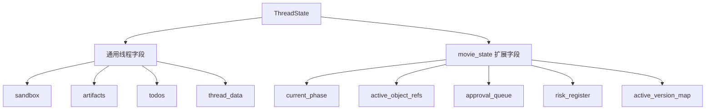
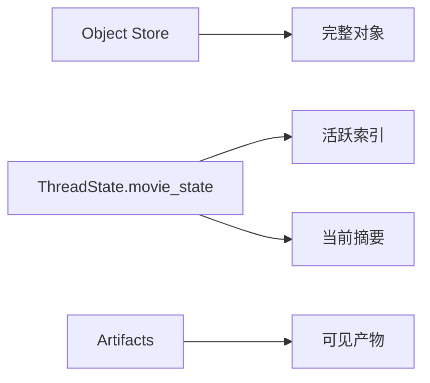
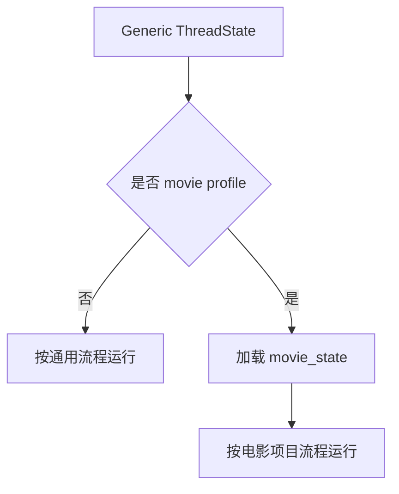
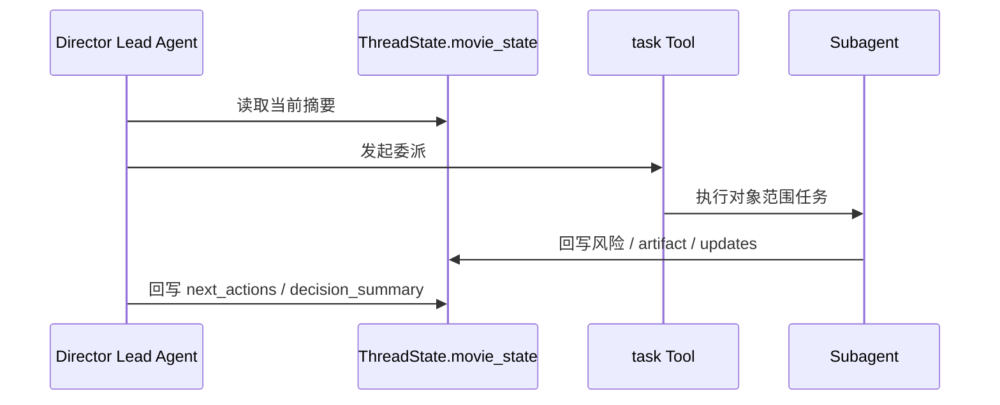
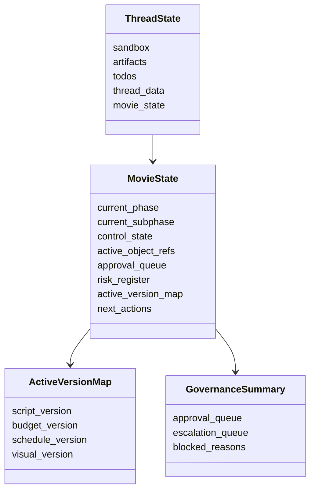

# 74. ThreadState 扩展方案

这一篇聚焦：

**为什么 62 里提出的 `MovieThreadState` 概念，到了工程实现层必须进一步落成对 DeerFlow 当前 `thread_state.py` 的正式扩展方案，以及这个扩展该怎么做到既支持电影项目语义，又不破坏现有通用线程能力。**

---

## 1. 为什么 74 要紧接在 73 后面

71-73 已经把运行时主链的三个关键点讲清楚了：

- 71：总控入口
- 72：委派协议
- 73：角色注册系统

但这三者如果没有一个稳定的共享状态容器，仍然会迅速失控。

这个容器在业务层面，我们已经在 62 里定义为：

- `MovieThreadState`

而在代码层面，它最自然的真实落点就是：

- `backend/packages/harness/deerflow/agents/thread_state.py`

所以 74 解决的是：

**如何把 62 的概念，真正变成对当前 `ThreadState` 的可实施扩展。**

---

## 2. 当前 `ThreadState` 已经有什么基础

从现有文档和代码路径看，当前线程状态已经承接了不少基础能力，例如：

- sandbox
- artifacts
- todos
- uploaded_files
- viewed_images
- thread_data
- title

这说明 DeerFlow 当前并不是“纯聊天产品”，而已经具备：

- 线程级状态
- 线程级工作区
- 线程级产物
- 线程级待办

所以电影化扩展的正确方向不是：

- 另起炉灶造一个完全独立的状态系统

而是：

- 在当前 `ThreadState` 上增量引入电影项目语义

---

## 3. 为什么业务层的 `MovieThreadState` 不能直接等于代码层的 `ThreadState`

这是一个非常关键的边界。

62 里讲的 `MovieThreadState` 更偏业务抽象，回答的是：

- 线程当前处于哪个阶段
- 当前活跃对象和风险是什么

而代码层的 `ThreadState` 更偏运行时容器，回答的是：

- 状态如何序列化
- 状态如何读写
- 哪些字段通用，哪些字段行业化

所以工程设计上，更合适的方式通常是：

- 保留通用 `ThreadState`
- 在其中增加 movie-specific state segment

而不是简单把整个 `ThreadState` 强行重命名成 `MovieThreadState`。

---

## 4. 一张总览图：通用线程状态与电影扩展层



这张图说明：

- 电影扩展最合理的方式，是在现有线程状态骨架上增加行业化层

---

## 5. 扩展 `ThreadState` 的目标到底是什么

建议把目标明确成四个层次。

### 第一层：让主智能体“知道当前局面”
包括：

- 当前 phase
- 当前 gate
- 当前 blocked reasons

### 第二层：让子智能体“知道当前范围”
包括：

- 当前活跃对象
- 当前版本映射
- 当前 artifact 引用

### 第三层：让系统“能持续回写”
包括：

- 决策摘要
- 风险摘要
- 下一步动作

### 第四层：让状态“可存、可读、可扩展”
包括：

- 可序列化
- 可演进
- 不轻易破坏现有调用方

---

## 6. 建议把电影扩展字段分成六组

建议在 `ThreadState` 中增加一个 `movie_state` 或等价结构，其内部至少分成六组字段。

### 第一组：项目识别字段
- `project_id`
- `project_title`
- `project_type`
- `workspace_profile`

### 第二组：阶段控制字段
- `current_phase`
- `current_subphase`
- `control_state`
- `phase_gate_status`

### 第三组：对象索引字段
- `active_script_id`
- `active_scene_ids`
- `active_budget_id`
- `active_schedule_id`
- `active_visual_refs`

### 第四组：治理字段
- `approval_queue`
- `escalation_queue`
- `review_queue`
- `blocked_reasons`

### 第五组：版本与产物字段
- `active_version_map`
- `artifact_refs`
- `deliverable_refs`
- `archive_checkpoint_refs`

### 第六组：执行摘要字段
- `risk_register`
- `next_actions`
- `recent_decisions`
- `memory_refs`

---

## 7. 为什么状态里要保存“索引与摘要”，而不是对象全文

前面 62 已经讲过原则，这里在工程层再强调一次。

如果在 `ThreadState` 里塞入大量对象全文，会很快造成：

- 状态膨胀
- 序列化成本上升
- 状态与事实源冲突

更合适的做法是：

- 对象系统保存完整事实
- `ThreadState` 保存活跃对象索引与摘要

这意味着：

- `scene_id` 可以在状态里
- scene 对象全文不应该常驻状态里

---

## 8. 一张状态分层图：事实、状态、产物



这张图说明：

- 状态层的正确职责是“驾驶舱”
- 不是数据库镜像

---

## 9. ThreadState 扩展要怎么避免破坏现有系统

建议遵守三个原则。

### 原则一：通用字段不动，电影字段增量加
不要破坏当前已有：

- sandbox
- artifacts
- todos

### 原则二：把电影字段集中在一个 segment
例如：

- `thread_state.movie_state`

而不是把所有字段散落在顶层。

### 原则三：允许无 movie_state 的线程继续运行
这意味着系统仍然兼容通用工作流，不强制所有线程都变成电影项目线程。

---

## 10. 一张兼容性图：通用线程与电影线程并存



这张图说明：

- 74 的目标不是把 DeerFlow 整体电影化
- 而是在通用底座上增加 movie profile

---

## 11. `thread_data` 和 `movie_state` 的关系应该怎么处理

当前系统已经有 `thread_data`。

这意味着工程实现上可以有两条路：

### 路线一：把电影状态直接落在 `thread_data`
优点：

- 改动轻
- 初期实现快

缺点：

- 语义不够清晰
- 后续容易变成大字典

### 路线二：在 `ThreadState` 上正式引入 `movie_state`
优点：

- 语义清晰
- 演进边界明确

缺点：

- 初期实现稍重

建议是：

- MVP 可以先落在 `thread_data.movie_state`
- 但文档与类型层最好明确朝正式 `movie_state` 演进

---

## 12. 为什么状态更新规则比字段本身更重要

很多系统设计阶段会过度关注：

- 字段起什么名字

但真正决定质量的是：

- 谁更新
- 什么时候更新
- 更新什么粒度

建议至少明确这些更新点：

### 更新点一：主智能体每轮决策后
更新：

- `next_actions`
- `recent_decisions`

### 更新点二：子智能体完成后
更新：

- 相关对象索引
- 风险摘要
- artifact refs

### 更新点三：gate 状态变化后
更新：

- `phase_gate_status`
- `blocked_reasons`

### 更新点四：审批或升级流变化后
更新：

- `approval_queue`
- `escalation_queue`

---

## 13. 一张 sequence 图：线程状态如何在一轮中被读取与回写



这张图说明：

- `ThreadState` 是总控与子智能体共享的运行时控制面板

---

## 14. 建议的状态结构草图

未来可以考虑下面这种结构方向：

```text
ThreadState
  - sandbox
  - artifacts
  - todos
  - uploaded_files
  - viewed_images
  - thread_data
  - movie_state
      - project
      - workflow
      - active_objects
      - governance
      - versions
      - execution_summary
```

这样的好处是：

- 语义清晰
- 易于前后端同步
- 易于在 79、80 继续扩展

---

## 15. 一张类图：`ThreadState` 扩展结构



这张图说明：

- 正式扩展后，电影状态应该是一个有内部结构的 segment

---

## 16. 为什么前端与 API 也要意识到这个扩展

线程状态不是只在后端存在。

如果后面真的进入实现，前端和 API 至少会受这些点影响：

- 线程详情展示
- 当前 phase 展示
- artifact 面板与 current version 展示
- 风险与审批摘要展示

这意味着：

- 74 虽然首先是后端状态扩展文档
- 但它天然会影响前端和 API 契约

---

## 17. 建议的代码落点

建议重点落在：

- `backend/packages/harness/deerflow/agents/thread_state.py`
- 相关 state 读写 helper
- 相关 API / stream bridge / frontend state 映射

并建议逐步引入：

- `movie_state` typed model
- state update helper
- movie state serializer / validator

---

## 18. 第一版实现建议

第一版建议先做到：

- `thread_data.movie_state` 或正式 `movie_state` segment
- current phase / control state / active refs / queues / next actions
- 主智能体与子智能体的基础回写

暂时不要一开始就做：

- 超大规模嵌套状态树
- 全量对象缓存
- 复杂多线程同步状态协议

---

## 19. 这一篇与后续文档的关系

这一篇回答的是：

**62 里定义的电影线程状态，到了 DeerFlow 工程层，应该如何增量落到当前 `ThreadState` 上，才能既支持电影项目，又不破坏现有通用底座。**

后面几篇会继续往能力装配层推进：

- 75：movie tools 设计
- 76：movie skills 设计
- 77：movie factory 设计

---

## 20. 这一篇最重要的结论

### 结论一
电影线程状态的工程化落点，不应该是另起一套状态系统，而是对当前 `ThreadState` 进行有边界的 movie segment 扩展。

### 结论二
这次扩展的关键不是塞更多字段，而是建立“索引与摘要优先、对象全文外置、更新规则明确”的状态原则。

### 结论三
在 DeerFlow 中，以 `thread_state.py` 为核心扩展 movie state，是让导演总控、委派系统、审批系统和产物系统真正共享同一运行时世界模型的关键一步。
