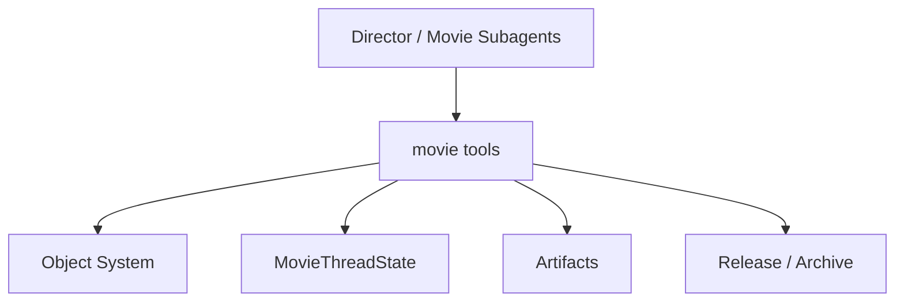
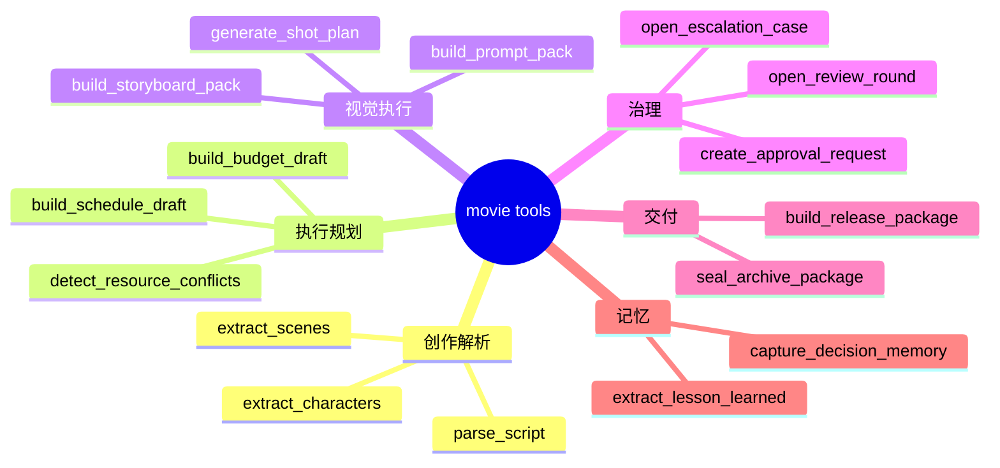
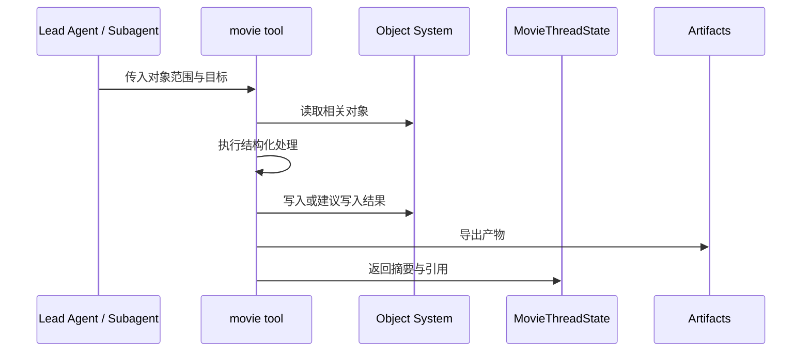
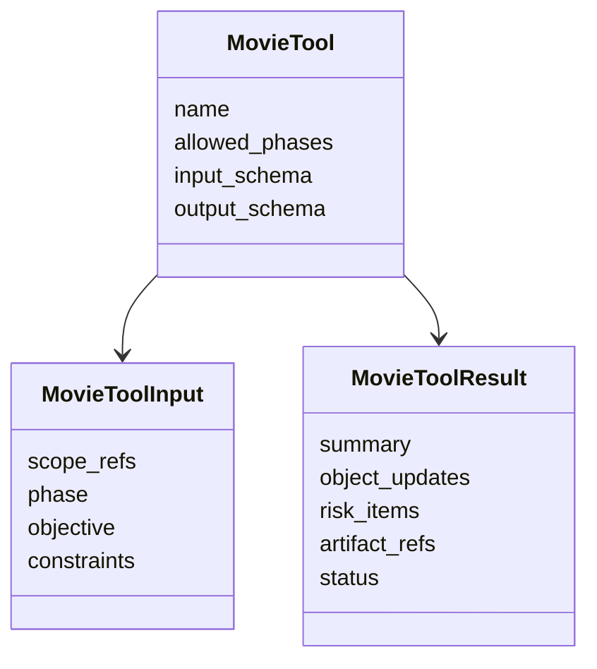
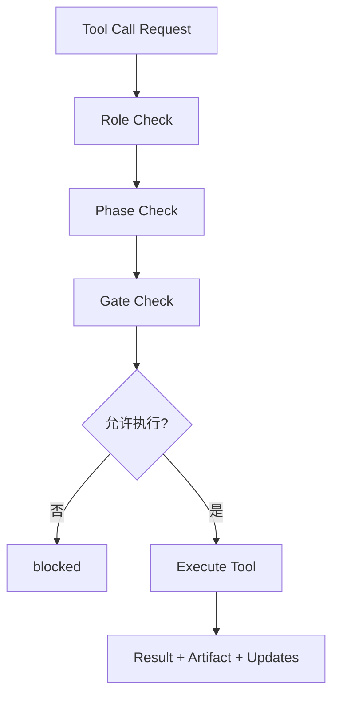

# 75. movie tools 设计

这一篇聚焦：

**为什么电影导演智能体平台不能只依赖通用 shell / web / 文件类工具，而必须在 DeerFlow 里补出一组围绕电影对象、工作流和交付边界运行的 movie tools。**

---

## 1. 为什么 75 要紧接在 74 后面

71-74 已经把主入口、委派系统、registry 和线程状态的工程骨架基本搭起来了。

但这些骨架要真正工作，还差一个关键层：

**专业动作到底由什么工具去执行。**

如果没有 movie tools，后面的运行时会很快陷入两种极端：

- 要么一切都让模型靠纯语言推理硬做
- 要么一切都退化成 shell 和手工文档操作

电影平台真正需要的是：

- 直接围绕对象系统工作的工具
- 直接围绕阶段流程工作的工具
- 直接围绕 artifact / package / archive 工作的工具

所以 75 解决的是：

**电影平台的“专业动作层”应该怎么设计。**

---

## 2. 为什么通用工具不足以支撑电影平台

通用工具当然重要，例如：

- shell
- 文件读写
- web 搜索
- 通用任务委派

但电影制作平台还有大量更高层动作，这些动作如果没有专门工具，模型就会被迫自己“模拟”：

- 解析剧本结构
- 生成场景清单
- 汇总预算草案
- 评估排期冲突
- 组装 release package manifest
- 创建 archive snapshot

这类动作的共同特点是：

- 强对象语义
- 强结构化输入输出
- 强阶段边界

所以它们更适合做成 movie tools，而不是永远依赖自由文本和临时脚本。

---

## 3. 一张总览图：movie tools 在平台中的位置

这张图说明：

- movie tools 不是独立功能堆
- 它们位于智能体和项目系统之间的执行层

---

## 4. 建议先把 movie tools 分成六大类

### 第一类：创作解析工具
例如：

- `parse_script`
- `extract_scenes`
- `extract_characters`
- `build_dialogue_units`

### 第二类：执行规划工具
例如：

- `build_budget_draft`
- `build_schedule_draft`
- `detect_resource_conflicts`

### 第三类：视觉执行工具
例如：

- `generate_shot_plan`
- `build_storyboard_pack`
- `build_prompt_pack`

### 第四类：治理工具
例如：

- `open_review_round`
- `create_approval_request`
- `open_escalation_case`

### 第五类：交付工具
例如：

- `build_release_package`
- `validate_manifest`
- `seal_archive_package`

### 第六类：记忆工具
例如：

- `capture_decision_memory`
- `extract_lesson_learned`
- `register_reusable_template`

---

## 5. 为什么 movie tools 必须围绕对象工作

建议所有 movie tools 都遵守一个共同原则：

**输入和输出都尽量围绕对象，而不是围绕自由文本。**

例如：

- `build_schedule_draft` 不应该只吃一段话
- 更应该吃 `scene_ids`、`budget_id`、`resource_refs`

输出也不应该只是：

- “这是排期建议”

而应该是：

- `schedule_id`
- 风险摘要
- artifact refs

这样工具才能真正进入可追踪工作流。

---

## 6. 一张工具分类图

这张图说明：

- movie tools 是一组与电影项目生命周期同构的工具族

---

## 7. movie tools 的核心设计原则

建议至少明确六条原则。

### 原则一：对象优先
尽量输入对象引用，输出对象结果或对象更新摘要。

### 原则二：结构优先
工具输出要尽量结构化，避免只返回长段自然语言。

### 原则三：幂等优先
同一输入多次执行时，尽量能稳定更新或产生可比较结果。

### 原则四：阶段合法性优先
工具应知道自己在哪些 phase 可调用。

### 原则五：artifact 友好
重要工具应该天然支持产物导出与 manifest 生成。

### 原则六：可回写优先
工具应便于主智能体把结果回写到状态与对象系统。

---

## 8. 为什么工具接口设计要早于模型优化

很多平台一开始容易把注意力全部放在：

- 模型够不够聪明
- 提示词写得好不好

但电影平台里更关键的是：

- 工具有没有稳定输入输出
- 结果能不能进入对象系统
- 能不能形成 artifact / package / archive 链路

因为只要接口不稳定，模型再强也会出现：

- 结果难落账
- 结果难比对
- 结果难复用

所以 75 的重要性，其实不亚于 prompt 设计。

---

## 9. 一张 sequence 图：movie tool 的理想执行路径

这张图说明：

- movie tools 不只是纯函数
- 它们天然处于对象、状态、产物三层之间

---

## 10. 建议先实现哪些第一批 movie tools

为了控制复杂度，第一批建议只做最小闭环。

### 前期最小闭环

- `parse_script`
- `extract_scenes`
- `extract_characters`
- `build_budget_draft`
- `build_schedule_draft`
- `generate_shot_plan`

### 治理最小闭环

- `open_review_round`
- `create_approval_request`
- `build_release_package`

### 记忆最小闭环

- `capture_decision_memory`

这样就已经能支撑一个“前期到治理”的 MVP 骨架。

---

## 11. 为什么工具组最好按模块组织

建议代码层不要把所有 movie tools 全堆在一个文件里。

更合理的组织方式是：

- `movie_tools/script/`
- `movie_tools/planning/`
- `movie_tools/visual/`
- `movie_tools/governance/`
- `movie_tools/delivery/`
- `movie_tools/memory/`

这样做的好处是：

- 领域边界清晰
- 测试容易分层
- 后续权限控制和装配更容易

---

## 12. 建议的代码落点

结合当前 DeerFlow 结构，较自然的落点可以是：

- 在 `backend/packages/harness/deerflow/tools/` 下新增 movie 领域工具组
- 保留 `tools/builtins/` 作为通用工具
- 由 factory / registry 根据角色挂接不同 movie tool bundles

换句话说：

- 通用工具继续服务底层能力
- movie tools 服务行业化动作

---

## 13. 一张类图：movie tool 的共通接口草图

这张图说明：

- movie tools 最好共享统一的输入输出哲学

---

## 14. 为什么工具必须能表达“只建议、不直接写入”

电影项目里并不是每个工具都适合直接写库。

例如：

- `build_budget_draft` 可以生成预算草案
- 但未必应该立即替换当前有效预算

所以建议 movie tools 支持两种结果模式：

### 建议模式
输出：

- draft object
- diff summary
- risk summary

### 提交模式
输出：

- 正式对象写入
- artifact 生成
- 状态回写建议

这能让审批和 gate 更好地接上。

---

## 15. 为什么工具层要有安全和约束设计

电影平台里的工具会处理很多敏感动作：

- 文件导出
- 清单生成
- 归档快照
- 工作区写入

所以工具层至少要考虑：

- 哪些工具只允许特定 phase 调用
- 哪些工具只允许特定角色调用
- 哪些工具只允许生成 draft，不能直接发布

也就是说，movie tools 不只是功能接口，还带有工作流与权限语义。

---

## 16. 一张 gate-aware 工具调用图

这张图说明：

- 工具调用也应有最小治理检查

---

## 17. 如何和 76、77 接上

75 讲的是工具动作层；76 会讲 skills；77 会讲 factory。

三者的关系可以理解成：

- tools 负责“能做什么动作”
- skills 负责“怎么更好地做这些动作”
- factory 负责“把这些动作和技能装到正确角色上”

所以 75 是整个能力装配链的底层执行单元。

---

## 18. 第一版实现建议

第一版建议先做到：

- 统一 `MovieToolInput` / `MovieToolResult` 风格
- 创作解析、执行规划、治理三类基础工具
- draft / submit 两种结果模式
- 基础 artifact 生成支持

暂时不要一开始就做：

- 全量复杂算法型优化工具
- 超大规模多源同步工具
- 复杂异步分布式工具编排

---

## 19. 这一篇与后续文档的关系

这一篇回答的是：

**电影导演智能体平台的专业动作层应该怎么设计，才能让主智能体和子智能体真正通过稳定工具去操作对象、状态和产物。**

后面两篇会继续补齐能力装配链：

- 76：movie skills 设计
- 77：movie factory 设计

---

## 20. 这一篇最重要的结论

### 结论一
movie tools 不是通用工具的简单别名，而是围绕电影对象、阶段和交付边界定义的专业动作层。

### 结论二
设计重点不只是功能列表，而是对象输入、结构输出、artifact 友好、gate 感知和建议 / 提交双模式。

### 结论三
在 DeerFlow 中，把 movie tools 作为独立能力组落入 `tools` 体系，是让平台真正从“能聊天”进入“能执行行业动作”的关键一步。

---

<!-- movie-visuals:start -->
## 补充图示：换一种视角看本篇

下面这张 流程图 把“movie tools 设计”再压缩成一个可快速扫读的结构视图，便于先抓关键关系，再回到正文细节。

<!-- movie-visuals:end -->

<!-- movie-doc-nav:start -->
## 文档导航

- 总入口：[README.md](./README.md)
- 阅读地图：[00-reading-map.md](./00-reading-map.md)
- 所在分组：71-80 源码扩展与工程设计
- 上一篇：[74. ThreadState 扩展方案](./74-thread-state-extension-plan.md)
- 下一篇：[76. movie skills 设计](./76-movie-skills-design.md)

### 同组文档
- [71. Lead Agent 改造方案](./71-lead-agent-transformation-plan.md)
- [72. task tool 与子任务委派扩展](./72-task-tool-and-delegation-extension.md)
- [73. Subagent registry 电影化扩展](./73-subagent-registry-cinema-extension.md)
- [74. ThreadState 扩展方案](./74-thread-state-extension-plan.md)
- 75. movie tools 设计（当前）
- [76. movie skills 设计](./76-movie-skills-design.md)
- [77. movie factory 设计](./77-movie-factory-design.md)
- [78. 自定义 agent 配置体系](./78-custom-agent-configuration-system.md)
- [79. 工作区、产物与文件流](./79-workspace-artifacts-and-file-flow.md)
- [80. 观测、日志与评估](./80-observability-logging-and-evaluation.md)
<!-- movie-doc-nav:end -->
