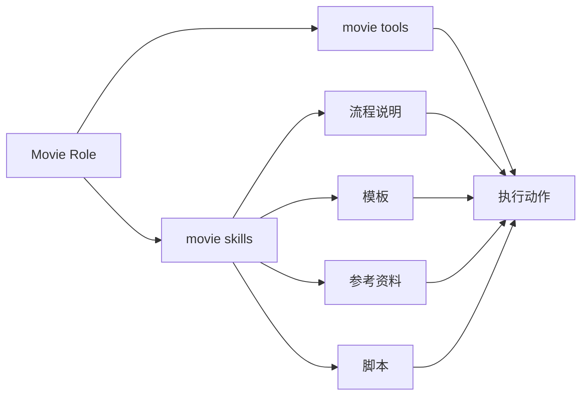
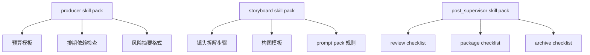
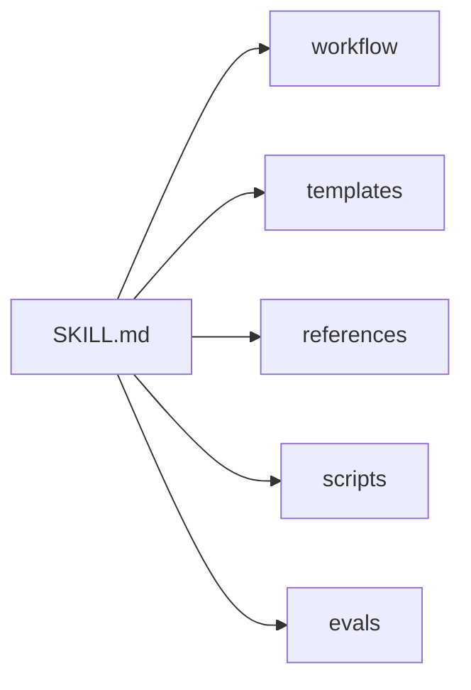
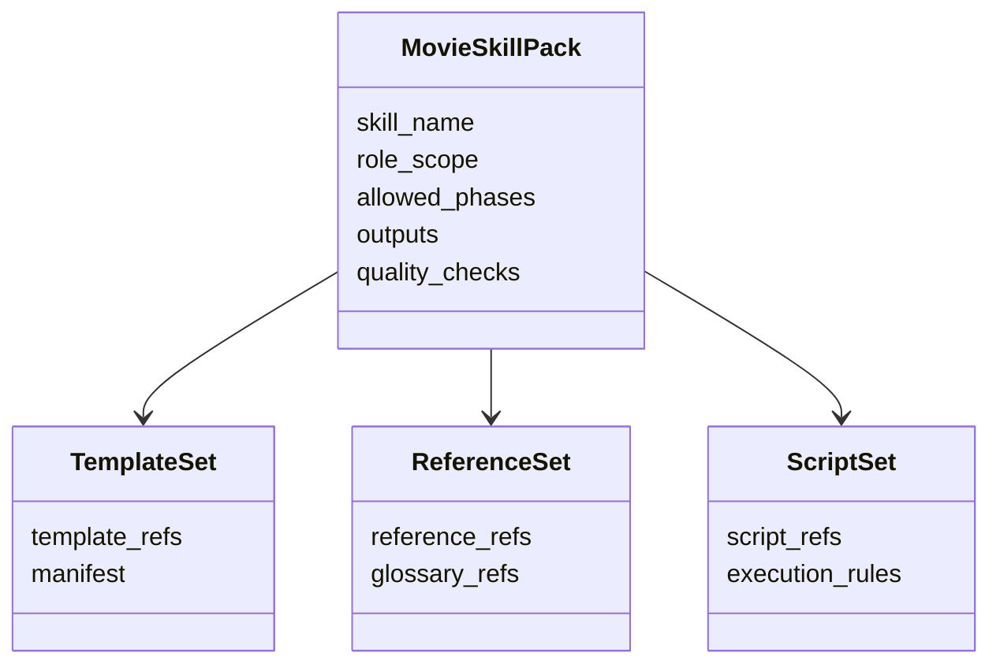
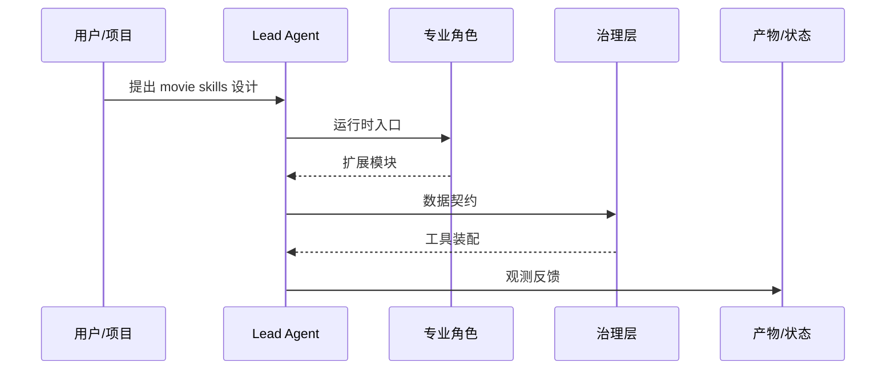

# 76. movie skills 设计

这一篇聚焦：

**为什么电影导演智能体平台除了需要 movie tools，还必须把 DeerFlow 当前的 skills 体系扩展成“角色化、阶段化、模板化、可验证”的 movie skills，才能让专业能力真正稳定、可复用、可演进。**

---

## 1. 为什么 76 要紧接在 75 后面

75 讲的是：

- 电影平台需要一组正式的专业工具

但光有工具，还不够稳定地产出高质量结果。

因为在 DeerFlow 这类多智能体系统里，真正决定某个角色“怎么使用工具、用什么模板、遵循什么流程”的，很多时候不是工具本身，而是：

- `SKILL.md`
- 模板文件
- 参考资料
- 辅助脚本

也就是说：

- tools 更像“执行动作的手”
- skills 更像“专业工作的操作手册”

所以 76 解决的是：

**电影平台的专业知识、模板、流程提示和最佳实践，应该如何进入 DeerFlow 当前 skills 体系。**

---

## 2. 当前 DeerFlow 的 skills 能力给了我们什么基础

从当前仓库结构看，skills 已经具备较完整的系统基础：

- `backend/packages/harness/deerflow/skills/loader.py`
- `backend/packages/harness/deerflow/skills/manager.py`
- `backend/packages/harness/deerflow/skills/parser.py`
- `backend/packages/harness/deerflow/config/skills_config.py`
- `skills/public/.../SKILL.md`

现有结构已经支持：

- skill 文档描述
- skill 安全校验
- 模板与 references
- scripts 辅助执行

这说明电影平台不需要重新造一套“知识插件系统”，而是可以直接在当前 skills 底座上增加 movie domain 的技能组。

---

## 3. 为什么电影平台不能只靠 prompt，而必须有 movie skills

如果只靠 prompt，会很快遇到这些问题：

- 同一角色在不同线程输出质量漂移
- 同一类工作每次都要重新解释流程
- 很难沉淀模板和最佳实践
- 很难把角色专业方法标准化

而 movie skills 的价值就在于：

- 固化专业步骤
- 固化模板结构
- 固化输出习惯
- 固化质量检查点

所以在电影平台里，skills 不是装饰层，而是专业能力稳定化的关键层。

---

## 4. 一张总览图：movie tools 与 movie skills 的关系

这张图说明：

- skills 负责告诉角色“怎么干”
- tools 负责让角色“真的干”

---

## 5. 建议先把 movie skills 分成六类

### 第一类：创作理解技能
例如：

- 剧本拆解 skill
- 角色弧线提炼 skill
- 对白节奏评估 skill

### 第二类：执行规划技能
例如：

- 预算拆解 skill
- 排期编排 skill
- 资源冲突诊断 skill

### 第三类：视觉执行技能
例如：

- 分镜组织 skill
- 镜头语言 skill
- prompt pack 生成 skill

### 第四类：治理技能
例如：

- review round 组织 skill
- approval memo 生成 skill
- escalation summary 生成 skill

### 第五类：交付技能
例如：

- manifest 编写 skill
- release package 校验 skill
- archive snapshot skill

### 第六类：沉淀技能
例如：

- lesson learned 提取 skill
- reusable template 归纳 skill
- project memory 摘要 skill

---

## 6. 为什么 movie skills 要和角色绑定，而不是和单个工具绑定

电影制作里的专业能力通常不是单工具行为，而是角色工作流。

例如：

- `producer` 的工作，不只是调一个预算工具
- 而是围绕预算、排期、风险、审批做整套判断

所以 movie skills 更适合围绕：

- `producer`
- `scheduler`
- `storyboard`
- `post_supervisor`

这样的角色来设计。

也就是说：

- skill 更像“岗位方法包”
- tool 更像“岗位动作包”

---

## 7. 一张角色化技能图

这张图说明：

- movie skills 最自然的组织方式，是角色化 skill pack

---

## 8. 一个高质量 movie skill 至少应该包含什么

建议至少包含下面几个部分。

### 说明部分
解释这个 skill 解决什么问题，适用于什么阶段。

### 操作流程部分
用清晰步骤说明角色如何推进任务。

### 输出模板部分
给出稳定的输出结构。

### 参考资料部分
给出必要的风格、规范、案例或术语。

### 脚本部分
必要时提供辅助脚本，减少重复劳动。

### 评估部分
给出简单的检查清单或 eval 规则。

---

## 9. 为什么模板和参考资料在 movie skills 里尤其重要

电影制作的大量专业工作，都非常依赖：

- 表格结构
- 清单结构
- 审核结构
- 视觉参考

如果这些内容只靠 prompt 临时生成，结果很容易漂。

而放进 movie skills 以后，可以稳定沉淀：

- budget sheet 模板
- review memo 模板
- storyboard annotation 模板
- release manifest 模板

这也是为什么 movie skills 应该尽量复用 DeerFlow 当前 skill 目录里的：

- `templates/`
- `references/`
- `scripts/`

---

## 10. 一张 skill 结构图

这张图说明：

- 一个成熟的 movie skill 不只是说明文档
- 它应该是一个带模板、参考和验证的能力包

---

## 11. 建议第一批 movie skills

第一批建议只做与 MVP 最相关的技能包。

### 创作与前期

- `movie-script-breakdown`
- `movie-budget-planning`
- `movie-schedule-planning`
- `movie-storyboard-workflow`
- `movie-style-research`

### 治理与交付

- `movie-review-round`
- `movie-release-package`
- `movie-retrospective-capture`

这样既能支撑前期闭环，也能开始沉淀治理与交付能力。

---

## 12. 为什么 movie skills 要支持阶段触发

并不是所有技能都应该在所有阶段暴露。

例如：

- `movie-script-breakdown` 更适合开发和前期
- `movie-release-package` 更适合后期与发行
- `movie-retrospective-capture` 更适合收尾与复盘

所以 skill 管理系统最好能配合 registry / factory 做：

- phase-aware skill activation

这样角色在当前阶段只加载真正相关的知识包。

---

## 13. 为什么 movie skills 也要考虑安全与质量控制

skills 不是纯静态文档，它们可能包含：

- 引导流程
- 文件模板
- 辅助脚本

这意味着它们同样可能带来：

- 输出格式失控
- 质量漂移
- 脚本风险

所以 movie skills 需要继续沿用 DeerFlow 当前技能体系已经具备的：

- 安全校验
- 解析验证
- 结构检查

并建议增加：

- 角色适用性检查
- phase 适用性检查
- 输出模板完整性检查

---

## 14. 建议的代码与目录落点

建议在两个层次上落地。

### 后端能力层

- `backend/packages/harness/deerflow/skills/*`
- `backend/packages/harness/deerflow/config/skills_config.py`

### 内容目录层

- `skills/public/movie-*/SKILL.md`
- `skills/public/movie-*/templates/*`
- `skills/public/movie-*/references/*`
- `skills/public/movie-*/scripts/*`

这样就能复用当前现有 skills 生态，不需要额外造新容器。

---

## 15. 一张类图：movie skill pack 的结构草图

这张图说明：

- movie skill pack 是一个复合能力包

---

## 16. 为什么第一版不要把 movie skills 做得太“百科全书”

虽然知识很多，但第一版不应该一下子做成超大技能库。

更合适的策略是：

### 第一版
只做：

- 高价值高复用流程
- 高价值模板
- 高价值治理技能

### 第二版
再补：

- 更细粒度风格技能
- 更细粒度后期技能
- 更细粒度企业化规范技能

否则很容易陷入：

- 写了很多 skill
- 真正被角色稳定调用的很少

---

## 17. 第一版实现建议

第一版建议先做到：

- 角色化 skill pack
- phase-aware 激活
- 模板与 references 复用
- 最小质量检查

暂时不要一开始就做：

- 超大技能市场
- 复杂动态技能推荐系统
- 全自动技能评测平台

---

## 18. 这一篇与后续文档的关系

这一篇回答的是：

**电影平台的专业知识、流程模板和最佳实践，应该如何进入 DeerFlow 当前的 skills 体系，成为角色能力稳定化的一部分。**

后面两篇会继续补齐能力装配：

- 77：movie factory 设计
- 78：自定义 agent 配置体系

---

## 19. 这一篇最重要的结论

### 结论一
movie skills 不是 prompt 的替代品，而是把专业流程、模板和最佳实践稳定装进角色能力的关键层。

### 结论二
设计重点不只是多写几个 `SKILL.md`，而是角色绑定、阶段绑定、模板绑定和质量检查绑定。

### 结论三
在 DeerFlow 中，直接沿用当前 skills 生态扩展 movie skill packs，是把电影平台专业能力做深、做稳、做可复用的最自然路径。

---

<!-- movie-visuals:start -->
## 补充图示：换一种视角看本篇

下面这张 时序图 把“movie skills 设计”再压缩成一个可快速扫读的结构视图，便于先抓关键关系，再回到正文细节。

<!-- movie-visuals:end -->

<!-- movie-doc-nav:start -->
## 文档导航

- 总入口：[README.md](./README.md)
- 阅读地图：[00-reading-map.md](./00-reading-map.md)
- 所在分组：71-80 源码扩展与工程设计
- 上一篇：[75. movie tools 设计](./75-movie-tools-design.md)
- 下一篇：[77. movie factory 设计](./77-movie-factory-design.md)

### 同组文档
- [71. Lead Agent 改造方案](./71-lead-agent-transformation-plan.md)
- [72. task tool 与子任务委派扩展](./72-task-tool-and-delegation-extension.md)
- [73. Subagent registry 电影化扩展](./73-subagent-registry-cinema-extension.md)
- [74. ThreadState 扩展方案](./74-thread-state-extension-plan.md)
- [75. movie tools 设计](./75-movie-tools-design.md)
- 76. movie skills 设计（当前）
- [77. movie factory 设计](./77-movie-factory-design.md)
- [78. 自定义 agent 配置体系](./78-custom-agent-configuration-system.md)
- [79. 工作区、产物与文件流](./79-workspace-artifacts-and-file-flow.md)
- [80. 观测、日志与评估](./80-observability-logging-and-evaluation.md)
<!-- movie-doc-nav:end -->
