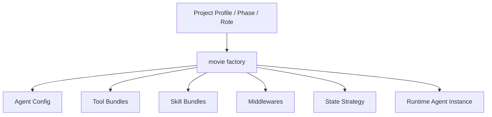
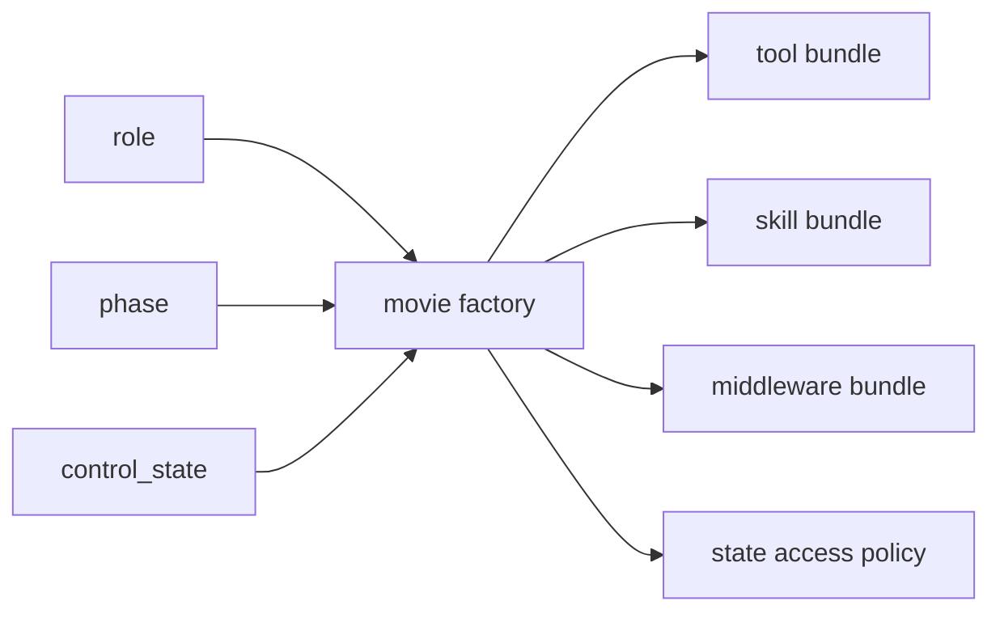
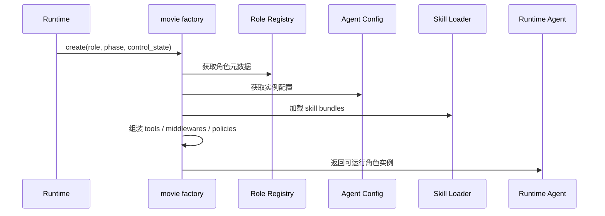
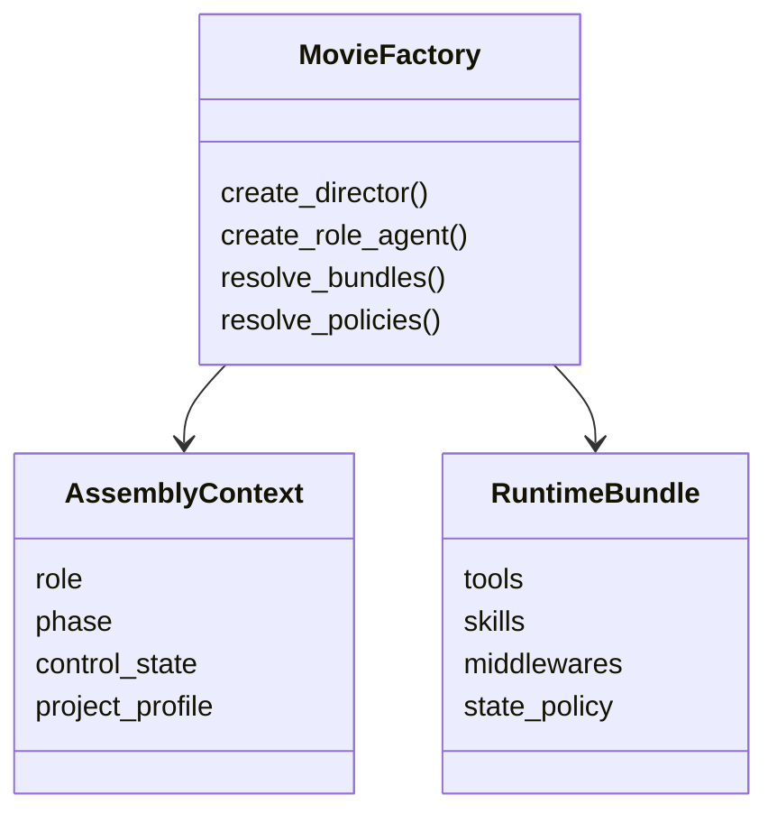

# 77. movie factory 设计

这一篇聚焦：

**为什么在导演总控、movie tools、movie skills 和 movie state 都明确之后，还必须把 DeerFlow 当前 `factory.py` 扩展成一个能够按场景组装角色、工具、技能、middleware 和状态策略的 movie factory。**

---

## 1. 为什么 77 要紧接在 76 后面

71-76 已经把几个关键构件逐步补出来了：

- 总控入口
- 委派协议
- 角色注册
- 线程状态扩展
- movie tools
- movie skills

但如果没有一个统一装配入口，后面很快会出现：

- 每个角色怎么挂工具不一致
- 每个场景怎么加载 skill 不一致
- 每种项目模式怎么挂 middleware 不一致

这意味着平台会有很多能力，但缺少一个正式的“组装车间”。

在当前 DeerFlow 里，这个组装车间最自然的入口就是：

- `backend/packages/harness/deerflow/agents/factory.py`

所以 77 解决的是：

**电影平台的运行时能力，应该如何被有组织地组装起来。**

---

## 2. 当前 factory 已经有什么价值

当前 `factory.py` 的价值在于：

- 它已经是 agent 运行时装配的核心入口
- 可以根据配置挂接工具、middleware、模型和其他能力

这意味着我们不需要另写一套平行的 agent creation framework。

更自然的做法是：

- 保留现有工厂
- 在其上增加 movie profile / movie bundles / movie assembly rules

---

## 3. 为什么电影平台需要单独的 movie factory 语义

因为电影平台运行时不只是“给 agent 多挂几个工具”。

它还需要根据不同情景组装：

- 不同角色
- 不同阶段
- 不同状态
- 不同 skill pack
- 不同 tool bundle

例如：

- `director` 线程需要总控型装配
- `scheduler` 线程需要排期型装配
- `post_supervisor` 线程需要交付治理型装配

这说明 movie factory 的本质不是：

- 创建 agent

而是：

- 创建“某类电影项目运行时角色”

---

## 4. 一张总览图：movie factory 的位置

这张图说明：

- movie factory 不是简单创建器
- 它是运行时装配编排器

---

## 5. movie factory 至少要回答哪些问题

### 角色问题
- 现在要创建的是哪个角色

### 阶段问题
- 当前 phase / subphase 是什么

### 能力问题
- 要给这个角色挂哪些 tools / skills / middlewares

### 状态问题
- 这个角色应该如何读写 movie state

### 约束问题
- 当前角色有哪些权限和边界

如果 factory 不能回答这些问题，后面就会出现大量“手工装配逻辑”散落在各处。

---

## 6. 建议先定义三类 factory profile

### 第一类：总控 profile
例如：

- `director`
- `producer_control`

特点：

- 状态读取重
- gate 判断重
- 委派能力强

### 第二类：专业执行 profile
例如：

- `scheduler`
- `storyboard`
- `casting`

特点：

- 专业 tools / skills 强
- 输出契约明确
- 状态回写范围有限

### 第三类：治理交付 profile
例如：

- `post_supervisor`
- `release_manager`

特点：

- review / package / archive 工具重
- 审批、交付、版本能力重

---

## 7. 为什么 factory 应该同时感知 phase 和 role

如果只按 role 装配，会缺少阶段语义；
如果只按 phase 装配，又会缺少角色差异。

电影平台最合理的装配方式，应该同时考虑：

- 这个角色是谁
- 当前处于哪个阶段

例如：

- 同样是 `director`，在前期更需要 script / planning skills
- 到后期和发行期，则更需要 review / release / archive 能力

这意味着 factory 应该至少基于：

- `role`
- `phase`
- `control_state`

做组合装配。

---

## 8. 一张装配决策图

这张图说明：

- factory 的输入不是单一配置项
- 而是角色与阶段共同决定的运行时上下文

---

## 9. movie factory 和 registry / config / skills 的关系

建议明确它们的分工。

### registry
负责声明：

- 角色元数据
- allowed phases
- 输出契约

### config
负责声明：

- 模型、超时、权限等具体参数

### skills
负责提供：

- 方法论
- 模板
- 流程提示

### tools
负责提供：

- 执行动作

### factory
负责把这些东西在某个运行时场景下装在一起。

所以 factory 是“装配层”，不是“能力本体”。

---

## 10. 建议的代码落点

建议重点围绕：

- `backend/packages/harness/deerflow/agents/factory.py`
- `backend/packages/harness/deerflow/config/agents_config.py`
- `backend/packages/harness/deerflow/config/subagents_config.py`

可能的实现方向包括：

- 在现有 factory 中新增 movie profile builder
- 或在现有 factory 之上新增 movie factory adapter

建议优先采用第二种思路：

- 保留通用 factory
- 叠加 movie-specific assembly layer

---

## 11. 为什么 middleware 装配最好也由 factory 决定

如果 middleware 装配分散在别处，后面会很难稳定控制：

- 哪个角色可以读写 movie state
- 哪个角色可以触发 artifact tracking
- 哪个角色需要更强的 gate middleware

更合适的做法是：

- 让 factory 成为 middleware bundle 的主要装配入口

例如：

- `director` 需要 state reader、state writer、gate、artifact tracking
- `storyboard` 可能只需要 state reader 和 artifact tracking

---

## 12. 一张装配链 sequence 图

这张图说明：

- movie factory 是把多个能力子系统拼成运行时实例的装配枢纽

---

## 13. 一张类图：movie factory 结构草图

这张图说明：

- movie factory 更像“上下文驱动装配器”

---

## 14. 为什么 factory 还要感知“项目 profile”

并不是所有电影项目都一样。

例如：

- 短片项目
- 长片项目
- 广告片 / 宣发物料项目
- 高度 VFX 驱动项目

这些项目虽然共享底座，但能力装配会不同。

所以 movie factory 最终最好还能感知：

- `project_profile`

这样未来就能做到：

- 同样的 `director`，面对不同项目类型挂不同 bundle

---

## 15. 为什么第一版不需要把 factory 做成超级动态系统

第一版的重点不是：

- 做一个复杂 DSL
- 做一个运行时自动推导所有 bundle 的动态引擎

而是：

- 先让几个核心角色能稳定装配
- 先让 phase-aware 装配成立
- 先让 state-aware middleware 装配成立

所以第一版更适合：

- 静态 profile + 少量动态开关

而不是：

- 超复杂自动装配规则引擎

---

## 16. 第一版实现建议

第一版建议先做到：

- `director` / `producer` / `scheduler` / `storyboard` / `post_supervisor` 五类角色装配
- role + phase 双维度 bundle 解析
- middleware bundle 装配
- movie state policy 装配

暂时不要一开始就做：

- 全量项目 profile 细分
- 超细粒度动态 bundle 推导
- 跨团队 marketplace 级角色装配体系

---

## 17. 这一篇与后续文档的关系

这一篇回答的是：

**当电影平台已经有了角色、状态、tools 和 skills 之后，DeerFlow 应该如何通过一个统一装配层把这些能力真正组装成可运行的角色实例。**

后面几篇会继续把装配体系补齐：

- 78：自定义 agent 配置体系
- 79：工作区、产物与文件流
- 80：观测、日志与评估

---

## 18. 这一篇最重要的结论

### 结论一
movie factory 的本质不是“多一个创建函数”，而是把角色、阶段、状态、tools、skills 和 middleware 组装成可运行上下文的装配中枢。

### 结论二
设计重点不只是 role-aware，还要 phase-aware、control-state-aware，最终还要 project-profile-aware。

### 结论三
在 DeerFlow 中，以现有 `factory.py` 为基础增加 movie assembly layer，是让电影平台真正从一堆设计概念变成运行时系统的关键收口。
