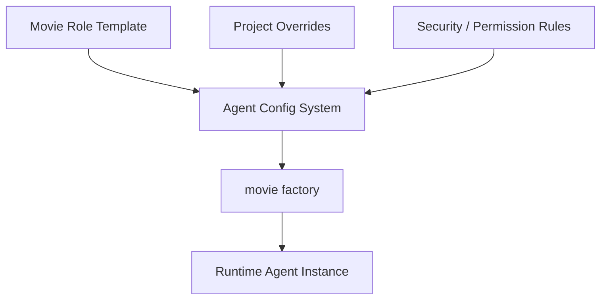
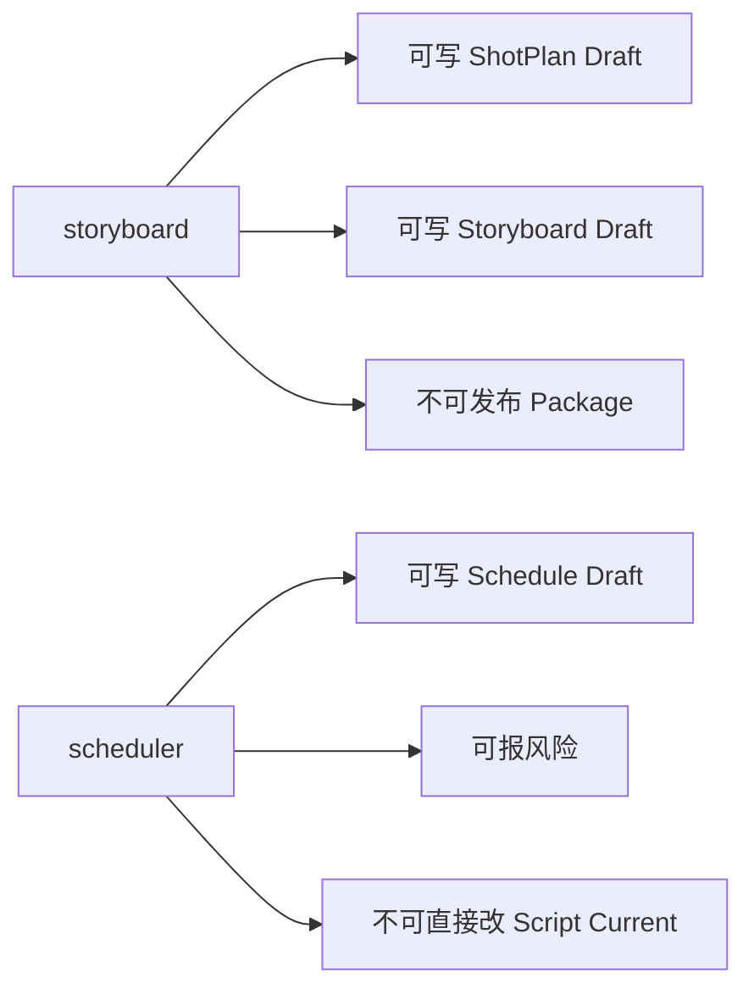
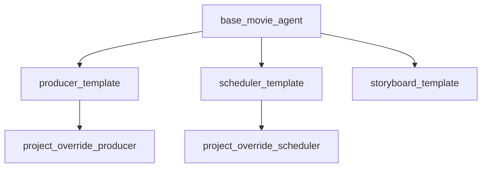
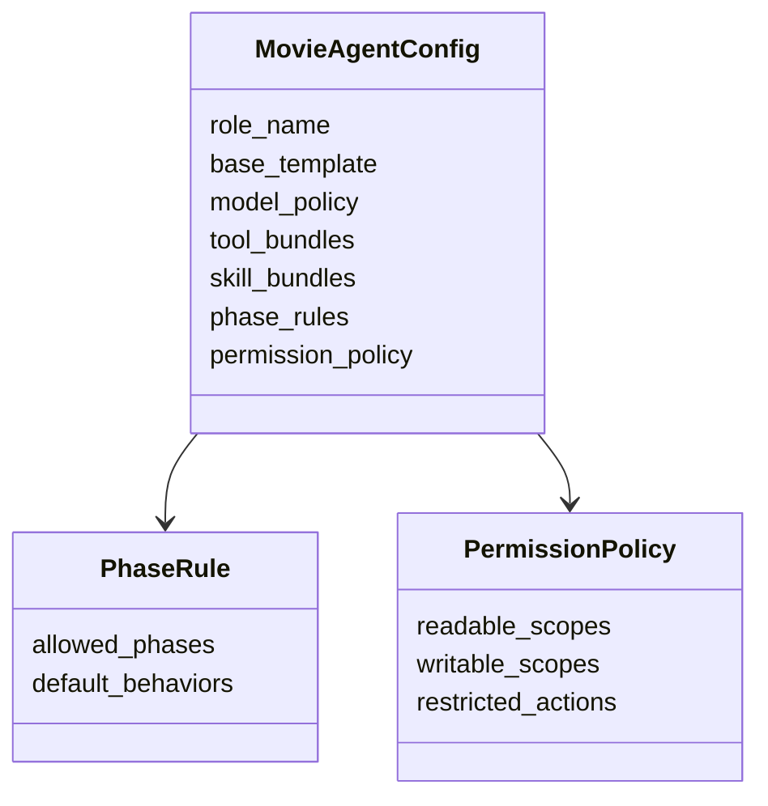

# 78. 自定义 agent 配置体系

这一篇聚焦：

**为什么电影导演智能体平台在有了 movie factory 和 movie roles 之后，还必须把 DeerFlow 当前的 agent 配置体系系统化扩展成“角色模板 + 实例覆盖 + 权限边界 + 能力装配”的正式配置系统。**

---

## 1. 为什么 78 要紧接在 77 后面

77 讲的是装配层。

但装配层如果没有稳定的配置来源，就会出现：

- 工厂逻辑越来越硬编码
- 角色能力差异散落在代码里
- 不同项目想做角色变体时成本很高

而在当前 DeerFlow 里，已经存在几个非常自然的配置落点：

- `backend/packages/harness/deerflow/config/agents_config.py`
- `backend/packages/harness/deerflow/config/subagents_config.py`
- `backend/packages/harness/deerflow/tools/builtins/setup_agent_tool.py`

所以 78 解决的是：

**电影平台里“角色怎么被声明、怎么被覆盖、怎么被安全地定制”这件事。**

---

## 2. 为什么电影平台尤其需要强配置体系

电影制作里的角色虽然有共性，但在不同项目里经常需要做变体。

例如：

- 某个项目需要更强的 `storyboard` 能力
- 某个项目需要更保守的 `producer` 风险策略
- 某个项目的 `post_supervisor` 要额外挂送审与发行约束

如果没有正式配置体系，就只能：

- 改 prompt
- 改代码
- 改临时参数

这会非常难维护。

所以强配置体系的价值在于：

- 让角色能力可声明
- 让项目变体可覆盖
- 让权限和边界可治理

---

## 3. 一张总览图：配置体系在平台中的位置



这张图说明：

- 配置体系连接模板层和运行时装配层

---

## 4. 建议先把配置问题拆成三层

### 第一层：角色模板配置
回答：

- 一个标准 `producer` 应该长什么样

### 第二层：项目级覆盖配置
回答：

- 在某个项目里，这个 `producer` 需要怎么变

### 第三层：运行时临时覆盖
回答：

- 当前线程 / 当前阶段需要做哪些临时但受控的变化

这三层如果不分开，很快就会变成：

- 什么都往一份 config 里塞

---

## 5. 一个电影角色配置至少应该包括什么

建议至少包括下面八类内容。

### 第一类：身份字段
- `role_name`
- `display_name`
- `role_category`

### 第二类：模型字段
- `model`
- `reasoning_effort`
- `temperature_policy`

### 第三类：能力字段
- `tool_bundles`
- `skill_bundles`
- `middleware_bundles`

### 第四类：阶段字段
- `allowed_phases`
- `default_phase_behaviors`

### 第五类：状态字段
- `state_access_scope`
- `allowed_write_paths`

### 第六类：产物字段
- `artifact_policy`
- `output_manifest_policy`

### 第七类：治理字段
- `approval_behavior`
- `escalation_behavior`
- `risk_reporting_policy`

### 第八类：安全字段
- `permission_level`
- `sandbox_policy`
- `sensitive_action_rules`

---

## 6. 为什么配置体系必须显式表达“权限与写入边界”

电影平台不是所有角色都应该拥有同样权限。

例如：

- `scheduler` 可能可以建议调整排期，但不能直接发布 release package
- `storyboard` 可能可以写分镜草案，但不能直接修改预算 current 版

如果没有显式配置，权限就会退化成：

- 全靠 prompt 约束

这在实际系统里是不够的。

所以配置体系应该显式表达：

- 能读什么
- 能写什么
- 能调用什么工具
- 哪些动作只能建议、不能提交

---

## 7. 一张权限边界图



这张图说明：

- 配置体系不只是模型和 prompt
- 它也是权限边界声明层

---

## 8. 为什么要支持模板继承

电影角色之间会有大量共性。

例如：

- 所有 movie subagents 都需要基础状态读取
- 所有治理类角色都需要 review / approval 能力

所以配置体系最好支持：

- 基础模板
- 角色模板
- 项目覆盖

这种继承结构。

否则后面会出现：

- 大量重复配置
- 一处改动需要同步很多角色

---

## 9. 一张配置继承图



这张图说明：

- 强配置体系最好支持模板继承与项目级覆盖

---

## 10. 为什么 `setup_agent_tool` 会成为电影平台的重要入口

当前 DeerFlow 已经有：

- `tools/builtins/setup_agent_tool.py`

这意味着系统本来就具备一定的 agent 配置动态化能力。

对电影平台来说，这个入口特别重要，因为它可以承接：

- 项目启动时的角色初始化
- 项目中途的角色策略调整
- 受控的 agent 变体生成

也就是说，电影平台不只需要静态 config，还需要受控的动态配置入口。

---

## 11. 建议的配置对象结构

未来可以考虑类似这样的配置模型：

```text
MovieAgentConfig
  - role_name
  - base_template
  - model_policy
  - tool_bundles
  - skill_bundles
  - middleware_bundles
  - phase_rules
  - state_access_scope
  - artifact_policy
  - permission_policy
```

这样的结构能很好地与 77 的 factory 对接。

---

## 12. 一张类图：配置体系结构草图



这张图说明：

- 电影角色配置应该从简单参数集合升级成正式结构对象

---

## 13. 为什么配置体系要和 skills / tools 分开管理

需要明确：

- 配置体系回答“这个角色应该装哪些能力”
- tools 和 skills 自身回答“能力是什么”

如果把这些东西混在一起，后面会非常难维护。

所以建议保持：

- tools / skills 作为能力库
- config 作为装配声明库

---

## 14. 建议的代码落点

建议重点围绕：

- `backend/packages/harness/deerflow/config/agents_config.py`
- `backend/packages/harness/deerflow/config/subagents_config.py`
- `backend/packages/harness/deerflow/tools/builtins/setup_agent_tool.py`

并建议新增：

- movie role templates
- project override schema
- permission-aware config validation

---

## 15. 为什么第一版不需要上复杂配置后台

第一版不应该一开始就做：

- 图形化超大配置中心
- 实时多租户配置服务

更合适的路径是：

- 先有明确的文件化模板
- 先有覆盖规则
- 先有最小验证器

等 85-90 那组企业化文档再去扩展配置治理层。

---

## 16. 第一版实现建议

第一版建议先做到：

- base movie agent template
- 5-8 个核心角色模板
- 项目级 overrides
- 基础 permission / phase 校验

暂时不要一开始就做：

- 复杂 UI 配置中心
- 大规模多组织配置继承树
- 超细粒度热更新机制

---

## 17. 这一篇与后续文档的关系

这一篇回答的是：

**电影平台里的角色能力和权限，应该如何通过一套正式配置体系被声明、继承、覆盖和治理。**

后面两篇会继续把运行时收口：

- 79：工作区、产物与文件流
- 80：观测、日志与评估

---

## 18. 这一篇最重要的结论

### 结论一
电影平台里的 agent config 不只是模型选择，而是角色模板、权限边界、状态写入范围和能力装配规则的正式声明层。

### 结论二
设计重点是模板继承、项目覆盖、动态 setup 入口和 permission-aware 校验。

### 结论三
在 DeerFlow 中，以现有 `agents_config.py`、`subagents_config.py` 和 `setup_agent_tool.py` 为基础扩展 movie config 体系，是让 movie factory 真正可维护、可治理的关键一步。
