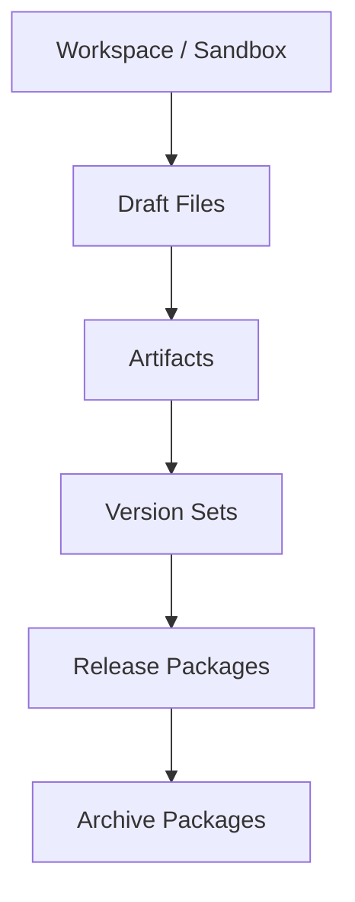
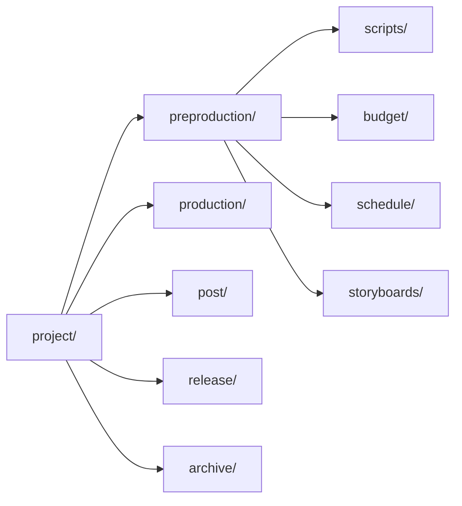
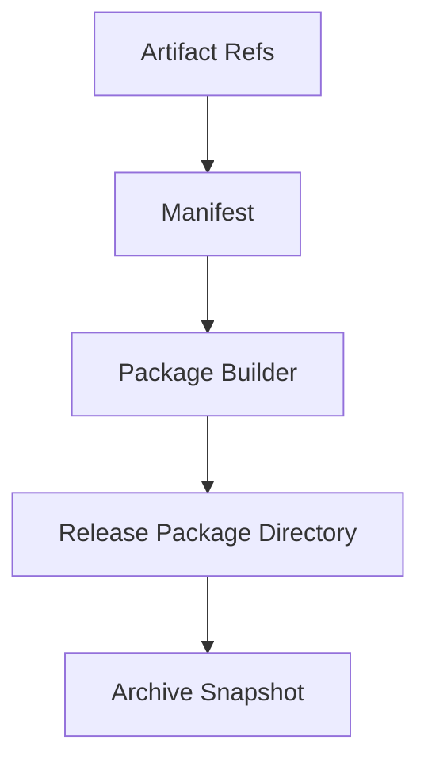

# 79. 工作区、产物与文件流

这一篇聚焦：

**为什么电影导演智能体平台在运行时层不仅需要对象和状态，还必须把工作区目录、artifact 路径、文件命名、包清单和归档快照组成一条正式文件流，才能让平台真正可执行、可交付、可审计。**

---

## 1. 为什么 79 要紧接在 78 后面

71-78 已经把运行时主链基本搭好了：

- lead agent
- task 委派
- registry
- thread state
- movie tools
- movie skills
- movie factory
- agent config

但所有这些能力最终都要落到一件很现实的事情上：

**文件和产物到底放在哪里、怎么流动、怎么被引用、怎么进入 release 和 archive。**

而在 DeerFlow 当前系统里，这条链路天然会牵涉：

- sandbox / workspace
- artifacts router
- artifact loader / hooks
- 前端 artifact 面板

所以 79 解决的是：

**电影平台的文件世界应该如何被正式建模。**

---

## 2. 为什么电影平台尤其需要强文件流

电影制作天生就是高文件密度行业。

典型文件包括：

- 剧本版本
- 分镜图
- 预算表
- 排期表
- review 报告
- manifest
- release package
- archive snapshot

如果没有正式文件流，系统很快会出现：

- 文件在工作区生成了，但没有进入 artifact 索引
- artifact 存在了，但没人知道源对象是谁
- package 组装了，但 manifest 与目录不一致
- archive 做了，但恢复入口不清楚

所以 79 的重点不是“文件放哪”，而是：

- 文件如何成为工作流的一部分

---

## 3. 一张总览图：工作区到归档的文件流

这张图说明：

- 文件流不是孤立目录结构
- 它和 artifact、version、release、archive 连成一条正式链路

---

## 4. 当前 DeerFlow 已经有哪些相关基础

从当前仓库结构可以看到几个关键入口：

- `backend/packages/harness/deerflow/sandbox/*`
- `backend/app/gateway/routers/artifacts.py`
- `frontend/src/core/artifacts/*`
- `frontend/src/components/workspace/artifacts/*`

这说明 DeerFlow 当前已经有：

- 工作区能力
- artifact API
- 前端 artifact 展示能力

这非常适合承接电影平台的文件流，只是还缺：

- 电影项目语义
- 目录规范
- manifest / package / archive 约定

---

## 5. 工作区和 artifact 的边界应该怎么区分

建议明确：

### 工作区
回答：

- 文件在运行时如何被创建、编辑、生成

### artifact
回答：

- 哪些文件已经被正式纳入项目产物体系

也就是说：

- 工作区是操作面
- artifact 是登记面

如果不区分，系统就会出现：

- 目录里有很多文件
- 但没人知道哪些是正式产物

---

## 6. 建议先定义统一目录规范

建议电影项目工作区至少有下面几层目录语义：

- `project/`
- `project/preproduction/`
- `project/production/`
- `project/post/`
- `project/release/`
- `project/archive/`

在每个阶段下，再按对象或产物类型继续分层，例如：

- `scripts/`
- `budget/`
- `schedule/`
- `storyboards/`
- `reviews/`
- `packages/`

这样做的好处是：

- 人能看懂
- 系统也容易生成 manifest

---

## 7. 一张目录分层图

这张图说明：

- 目录层级最好和阶段层级、对象层级基本对齐

---

## 8. 为什么 artifact 命名与 manifest 同样重要

只靠目录结构还不够。

因为电影项目里，真正要稳定追踪的不是“文件大致放哪”，而是：

- 某个 artifact 属于哪个对象
- 属于哪个版本
- 由谁生成
- 是否 current

所以建议 artifact 至少带有：

- `artifact_id`
- `scope_ref`
- `version_label`
- `artifact_type`
- `manifest_summary`

这样 artifact 就不会退化成普通附件。

---

## 9. 为什么 release package 应该优先使用“manifest 驱动”而不是“目录猜测”

很多项目里，交付包最后是靠人工拖文件拼出来的。

这会导致：

- 漏文件
- 版本混乱
- 历史无法追踪

更合适的做法是：

- 先有 manifest
- 再根据 manifest 组装 package

这样：

- 包里有什么是明确的
- 包从哪些 artifact 来是明确的

这会让 66 和 70 里的治理链在文件流层真正成立。

---

## 10. 一张 package 组装图

这张图说明：

- 包不是目录副产品
- 包是 manifest 驱动的正式交付构造

---

## 11. 为什么文件流必须和对象系统双向绑定

文件和对象之间必须能双向追踪。

### 从对象到文件
例如：

- 一个 `ShotPlan` 应该知道它导出了哪份 shot list
- 一个 `Review` 应该知道它对应哪份 report

### 从文件到对象
例如：

- 一份 budget report 应该知道自己对应哪个 `budget_id`
- 一个 release package 应该知道它对应哪些 approval refs

如果没有双向绑定，文件流会重新变成“独立文件世界”。

---

## 12. 为什么工作区里还要区分 draft、current、sealed、archived

电影文件不是一个统一状态。

建议至少区分：

- `draft`
- `current`
- `sealed`
- `archived`

其中：

- `draft` 还在编辑或试验
- `current` 是内部正在使用
- `sealed` 表示已进入正式 package 或 snapshot，不应再静默修改
- `archived` 表示已退出当前运行链路

如果没有这些边界，工作区和 artifact 很容易互相污染。

---

## 13. 一张文件生命周期图

这张图说明：

- 文件流也有正式生命周期

---

## 14. 建议的代码落点

这一层较自然的落点包括：

- `backend/packages/harness/deerflow/sandbox/*`
- `backend/app/gateway/routers/artifacts.py`
- `frontend/src/core/artifacts/*`
- `frontend/src/components/workspace/artifacts/*`

改造方向包括：

- movie project workspace conventions
- artifact manifest support
- release / archive package file flows
- 前端 current / archived / package 视图

---

## 15. 为什么前端 artifact 面板需要电影语义

如果前端仍然只把 artifact 当成普通文件列表，后面用户会很难看懂：

- 哪个是 current
- 哪个属于哪个 phase
- 哪个属于哪个 package
- 哪个已经 archived

所以前端层也应逐步支持：

- phase tags
- object refs
- package membership
- current / archived 标识

这样用户和主智能体看到的是同一套世界模型。

---

## 16. 为什么 archive snapshot 需要“可恢复入口”

归档不是简单复制。

正式 archive snapshot 至少还要回答：

- 从哪里恢复
- 恢复哪些内容
- 恢复后哪些对象状态要同步

也就是说，文件归档应该与 70 里的 `ArchivePackage` 概念对齐，而不是只做存储。

---

## 17. 第一版实现建议

第一版建议先做到：

- 统一项目目录规范
- artifact 与对象引用绑定
- manifest 驱动的 release package
- 基础 archive snapshot

暂时不要一开始就做：

- 复杂分布式存储编排
- 多存储层冷热迁移
- 超细粒度前端媒体管理系统

---

## 18. 这一篇与后续文档的关系

这一篇回答的是：

**电影平台的工作区、artifact、package 和 archive，应该如何连成一条正式文件流，才能让系统真正具备可执行、可交付、可恢复能力。**

后面最后一篇会继续把运行时组的质量控制收口：

- 80：观测、日志与评估

---

## 19. 这一篇最重要的结论

### 结论一
工作区是操作面，artifact 是登记面，package 是交付面，archive 是历史面，这四层必须明确分开。

### 结论二
电影平台里的文件流设计重点，不只是目录结构，而是 manifest 驱动、对象绑定、状态边界和恢复入口。

### 结论三
在 DeerFlow 中，把 sandbox、artifacts router 和前端 artifact 面板电影化，是让平台真正可运行、可交付、可审计的关键一步。
