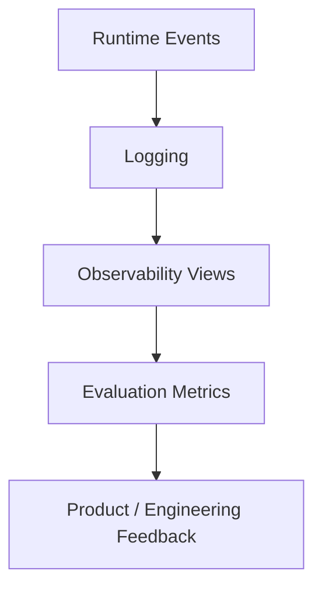
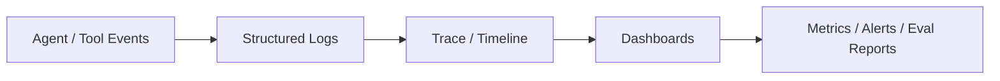
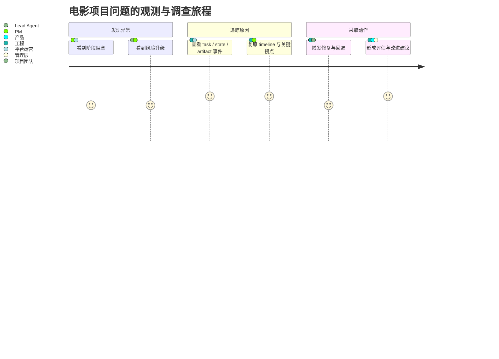
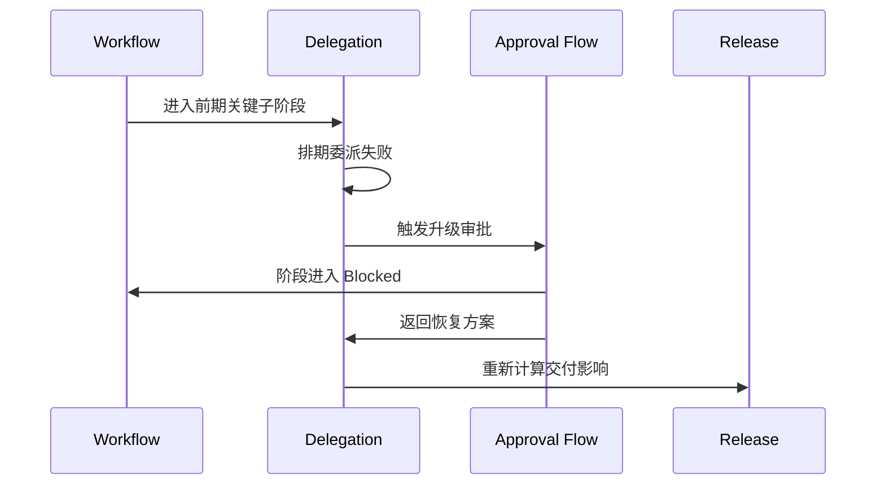
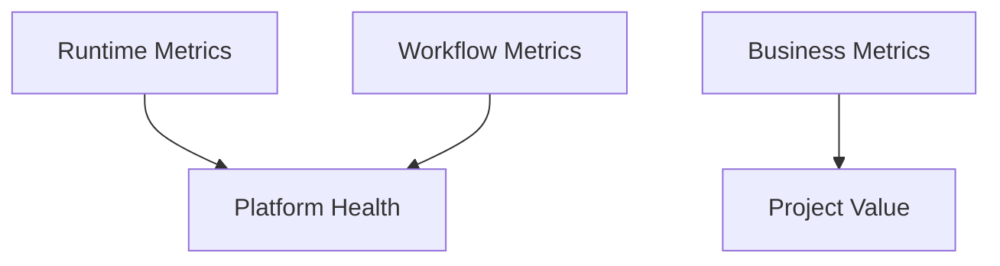
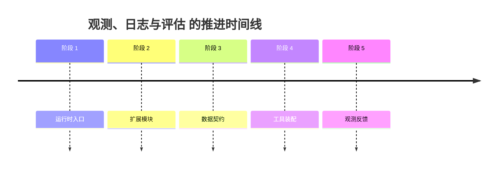

# 80. 观测、日志与评估

这一篇聚焦：

**为什么电影导演智能体平台在完成 71-79 这整组源码映射与运行时设计之后，最后还必须建立一套正式的观测、日志与评估体系，才能知道系统到底是否稳定、是否可控、是否真的带来业务价值。**

---

## 1. 为什么 80 要作为第七组的收口

71-79 已经把运行时主链基本搭完了：

- 总控入口
- 委派协议
- 角色注册
- 状态扩展
- tools
- skills
- factory
- config
- 工作区与文件流

但如果没有观测和评估，后面就会出现一个非常典型的问题：

**系统看起来什么都有，但没人知道它到底运行得对不对。**

这在电影平台里尤其危险，因为项目成本高、周期长、跨部门复杂，一旦出问题往往代价很大。

所以 80 负责回答：

- 该看哪些运行信号
- 该留哪些日志
- 该评估哪些质量指标
- 如何把这些结果反哺到研发和运营

---

## 2. 为什么电影平台不能只靠 debug 日志

普通 debug 日志只能回答很局部的问题：

- 某个函数有没有跑
- 某个错误有没有报

但电影平台真正需要回答的问题更复杂：

- 当前项目卡在哪个 phase
- 哪个角色经常给出高风险结果
- 哪类委派经常失败或升级
- 哪类 review round 经常反复 reopen
- 哪类 package 组装经常缺件

也就是说，电影平台需要的不是“开发日志”，而是：

- 运行观测
- 工作流观测
- 业务质量评估

---

## 3. 一张总览图：观测、日志与评估三层关系

这张图说明：

- 日志是原材料
- 观测是可读视图
- 评估是可判断结果

---

## 4. 当前 DeerFlow 已经有哪些相关基础

从当前仓库可以看到几个很重要的入口：

- `backend/packages/harness/deerflow/tracing/factory.py`
- 多个 `test_*` 文件
- memory / sandbox / task / skills 的测试和中间件

这说明 DeerFlow 当前已经具备：

- tracing 基础
- runtime middleware 插桩基础
- 测试基础

这非常适合作为电影平台观测体系的起点。

---

## 5. 建议先把观测分成四层

### 第一层：运行时观测
看的是：

- agent 调用
- tool 调用
- task 委派
- middleware 执行

### 第二层：工作流观测
看的是：

- 当前 phase 流转
- gate 阻塞
- approval / escalation 队列

### 第三层：产物观测
看的是：

- artifact 生成
- release package 组装
- archive snapshot 完整性

### 第四层：业务评估
看的是：

- 周期缩短了吗
- 返工减少了吗
- 预算偏差更可控了吗

---

## 6. 为什么日志必须事件化而不是只写字符串

如果日志只是长串文本，后面很难稳定回答：

- 哪类 task 最常升级
- 哪个角色最常触发 blocked
- 哪类对象更新最常导致回退

所以建议日志尽量事件化，至少能表达：

- `event_type`
- `role`
- `phase`
- `scope_refs`
- `status`
- `duration_ms`
- `artifact_refs`
- `risk_level`

这样后面才能做：

- 筛选
- 聚合
- 趋势分析

---

## 7. 一张事件流图：从运行事件到评估结果

这张图说明：

- 观测链路的关键不是多存日志
- 而是让日志能稳定变成可分析信号

---

## 8. 建议优先记录哪些关键事件

### agent 级事件

- lead agent run started / finished
- subagent invoked / completed
- task delegation failed / retried

### state 级事件

- phase changed
- gate blocked
- escalation opened
- approval effective

### artifact 级事件

- artifact generated
- package built
- archive sealed

### risk 级事件

- critical risk opened
- critical risk resolved
- rollback triggered

### 一张故障调查旅程图

这张图补的是“观测体系会被谁怎么用”，让 80 不只是技术采集说明，也更像一份实际运营与排障手册。

---

## 9. 为什么电影平台需要 timeline 视图

电影制作很多问题都不是单点故障，而是：

- 多个事件连在一起导致项目阻塞

例如：

- 剧本变更
- 预算重估
- 排期阻塞
- 升级决策
- package 推迟

如果没有 timeline，后面很难复原：

- 到底哪一个事件先发生
- 哪个事件是真正拐点

所以 timeline 视图在电影平台里非常重要。

---

## 10. 一张 timeline 图

这张图说明：

- timeline 能把跨对象、跨角色、跨阶段事件串起来看

---

## 11. 为什么评估一定要区分“运行质量”和“业务价值”

这是很多系统容易混淆的点。

### 运行质量指标
关注：

- 有没有报错
- 延迟高不高
- 重试多不多
- 成功率稳不稳

### 业务价值指标
关注：

- 前期迭代是否更快
- 风险暴露是否更早
- 返工是否减少
- 交付是否更稳

如果不区分，团队很容易出现：

- 技术指标很好看
- 业务却没有实质提升

---

## 12. 建议先定义哪些核心指标

### 运行时指标

- `lead_agent_cycle_latency`
- `task_delegation_success_rate`
- `subagent_retry_rate`
- `gate_block_frequency`
- `artifact_build_failure_rate`

### 工作流指标

- phase dwell time
- escalation resolution time
- review reopen rate
- approval turnaround time

### 业务指标

- 剧本到预算首版时间
- 排期重排次数
- 高风险问题前置发现率
- 交付缺件率

---

## 13. 一张指标分层图

这张图说明：

- 平台健康和项目价值都要看
- 不能只盯一边

---

## 14. 为什么评估集和真实项目日志要分开

建议始终区分：

### 离线评估
用于：

- 回归测试
- 版本对比
- 角色输出稳定性检查

### 在线观测
用于：

- 看真实项目运行中的问题
- 识别 bottleneck

这样做的好处是：

- 离线可控
- 在线真实

两者不能互相替代。

---

## 15. 建议的代码落点

这一层较自然的落点包括：

- `backend/packages/harness/deerflow/tracing/factory.py`
- 各类 middleware 插桩点
- task / subagent 执行点
- state 更新点
- artifact / package 构建点

如果后面继续做深，还可以逐步补：

- movie-specific event schema
- dashboard adapters
- eval report builders

---

## 16. 为什么 80 和 89 会形成上下游关系

80 更偏：

- 工程观测与系统评估

89 更偏：

- 产品指标与 ROI 评估

两者的关系是：

- 80 提供原始观测与指标能力
- 89 用这些能力去回答“值不值得投”

所以 80 是 89 的工程基础。

---

## 17. 第一版实现建议

第一版建议先做到：

- 结构化事件日志
- 基础 trace / timeline
- 关键 phase / gate / package 指标
- 简单离线 eval 用例

暂时不要一开始就做：

- 超复杂可观测性平台对接
- 大规模实时分析平台
- 细粒度企业级监控矩阵

---

## 18. 这一篇与后续文档的关系

这一篇回答的是：

**电影平台在完成运行时设计后，应该如何建立日志、观测和评估体系，才能真正知道系统是否稳定、是否可控、是否有价值。**

从这里开始，后面 81-90 会转入研发与实践落地：

- 81：MVP 范围定义
- 82：第一阶段研发计划
- 83：第二阶段研发计划
- 84：第三阶段研发计划

---

## 19. 这一篇最重要的结论

### 结论一
电影平台不能只靠 debug 日志，而必须把运行事件、工作流事件、产物事件和业务指标统一纳入观测体系。

### 结论二
设计重点不只是采集日志，而是结构化事件、timeline、分层指标和离线 / 在线双轨评估。

### 结论三
在 DeerFlow 中，以 tracing、middleware 插桩、task 执行点和 artifact 构建点为基础建立 movie observability，是让平台具备可控性和可演进性的关键收口。

---

<!-- movie-visuals:start -->
## 补充图示：换一种视角看本篇

下面这张 时间线 把“观测、日志与评估”再压缩成一个可快速扫读的结构视图，便于先抓关键关系，再回到正文细节。

<!-- movie-visuals:end -->

<!-- movie-doc-nav:start -->
## 文档导航

- 总入口：[README.md](./README.md)
- 阅读地图：[00-reading-map.md](./00-reading-map.md)
- 所在分组：71-80 源码扩展与工程设计
- 上一篇：[79. 工作区、产物与文件流](./79-workspace-artifacts-and-file-flow.md)
- 下一篇：[81. MVP 范围定义](./81-mvp-scope-definition.md)

### 同组文档
- [71. Lead Agent 改造方案](./71-lead-agent-transformation-plan.md)
- [72. task tool 与子任务委派扩展](./72-task-tool-and-delegation-extension.md)
- [73. Subagent registry 电影化扩展](./73-subagent-registry-cinema-extension.md)
- [74. ThreadState 扩展方案](./74-thread-state-extension-plan.md)
- [75. movie tools 设计](./75-movie-tools-design.md)
- [76. movie skills 设计](./76-movie-skills-design.md)
- [77. movie factory 设计](./77-movie-factory-design.md)
- [78. 自定义 agent 配置体系](./78-custom-agent-configuration-system.md)
- [79. 工作区、产物与文件流](./79-workspace-artifacts-and-file-flow.md)
- 80. 观测、日志与评估（当前）
<!-- movie-doc-nav:end -->
